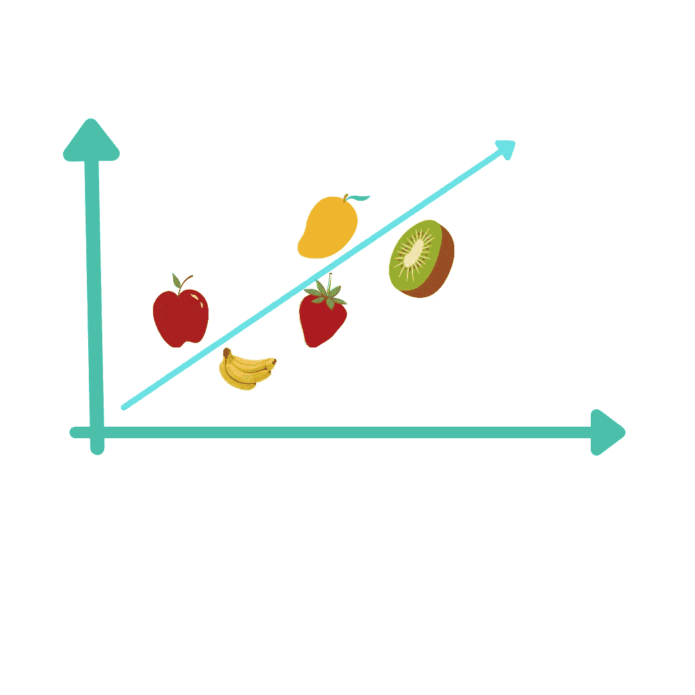
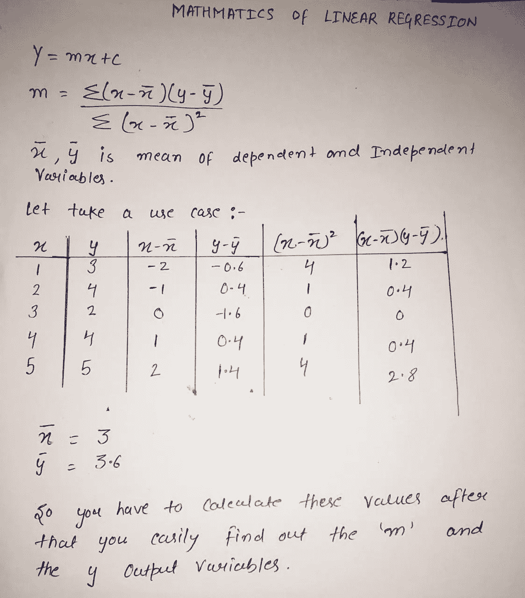

# 线性回归背后的事实

> 原文：<https://medium.com/analytics-vidhya/facts-behind-linear-regression-42b100fa2cd3?source=collection_archive---------8----------------------->

到本文结束时，你将了解什么是线性回归？线性回归背后的数学？线性回归的用例。线性回归模型的实现及其评价。

让我们从回归开始，如果我说线性关系🤔？听起来很奇怪吗？

绝对不是，所以我们可以将线性回归定义为**寻找两个或多个参数或特征之间的线性关系。**

所以这里我们试图解决的问题是:

我们来举一个用例，你想用 Avg 这样的独立特征或者变量来预测房价。人们的收入，地区人口和房子的年龄。

这样你就有了这样的想法，如果我们的自变量波动，那么房子的价格也会波动。

所以我们的主要目标是在这些特征之间画一条最佳拟合线(一条直线)。

在数据科学中，大多数事情取决于数据，我们使用的是什么类型的数据，所以对于线性回归，我们必须假设一些关于数据的事情，所以让我们来讨论一下。

*   它假设因变量和自变量之间的关系必须是线性的，这在现实世界的数据中是非常罕见的情况。
*   数据必须是独立的。
*   我们的模型假设数据中没有**多重共线性**

**现在这个算法背后的数学原理是什么(读两遍那部分，因为面试官会问，所以要准备好)**

**y=mx +c** (直线方程)

这里 **Y** 是我们想要预测的因变量和 **X** 值(自变量)将帮助我们预测我们的 **Y** 值。而 **m** 是直线的斜率，C 是我们的截距。

# 线性回归的类型

*   **简单线性回归**:使用单一特征预测输出。
*   **多元线性回归**:使用多个特征预测输出。

# 线性回归的 5 种用途

*   **预测分析**

预测分析预测未来的机会和风险是回归分析在商业中最突出的应用。例如，需求分析预测消费者可能购买的商品数量。

*   **运行效率**

回归模型也可以用来优化业务流程。在呼叫中心，我们可以分析呼叫者的等待时间和投诉数量之间的关系。数据驱动的决策制定消除了决策制定中的猜测、假设和公司政治。

*   **辅助决策**

回归不仅有助于为管理决策提供经验支持，也有助于识别判断错误。一位经理认为，通过扩大购物范围，我们的销售额将会增加，但这表明收入的增加可能不足以支撑额外的员工劳务费的增加。因此，这种分析可以为决策提供定量支持，并防止由于管理者的直觉而导致的错误。

*   **新见解**

因为没有适当的分析，数据是没有用的。因此，回归分析技术可以通过揭示以前没有注意到的模式来发现不同变量之间的关系。

# **你如何评价回归模型？**

评估回归模型的四种方法

*   **R 平方**

R2 对应于观察结果值和模型预测值之间的平方相关。R 平方越高，模型越好。

*   **均方根误差**

它是观察到的实际结果值和由模型预测的值之间的平均平方差。RMSE 越低，模型越好。

*   **剩余标准误差**

它是根据模型中预测因子的数量进行调整的 RMSE 的变体。RSE 越低，模型越好。

*   **平均绝对误差**

它是观察结果和预测结果之间的平均绝对差值。

换句话说，在模型中包含额外的变量总是会增加 R2，减少 RMSE。

# **实施**

# 关闭

我们已经介绍了线性回归的所有事实，希望你喜欢。

说说你最喜欢哪一部分，我应该改进或者补充什么？

与我联系:😉

领英:[http://linkedin.com/in/monika0104](http://linkedin.com/in/monika0104)

github:[https://github.com/monika0123](https://github.com/monika0123)

https://twitter.com/monikarajput99