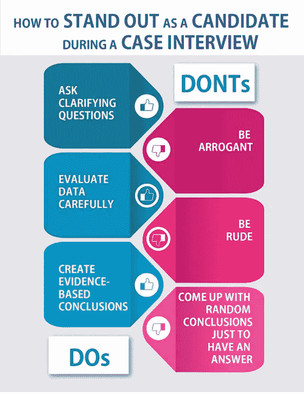
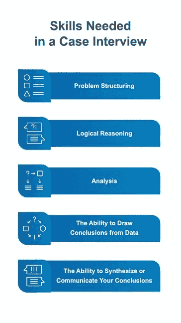

# 失败:那次我盲目地走进一个案例研究面试

> 原文：<https://medium.com/analytics-vidhya/failure-the-time-i-walked-blindly-into-a-case-study-interview-2bafb4c748c2?source=collection_archive---------10----------------------->

"失败只是更明智地重新开始的机会."—亨利·福特

每个人都失败过。我生活中最突出的例子是在我面试 Liberty Mutual 的分析实习时。我以为我已经为面试做好准备了。我研究了这家公司和实习职位，阅读了以前实习生的博客，并准备好了对常见行为面试问题的回答。

我不知道的是，面试中还有一个案例分析部分。我以前从未听说过技术案例面试，对此完全没有准备。随后，我失败了。

今天我研究了如何在案例面试中取得成功，希望我的经验可以帮助其他人在这种令人生畏的面试方式中取得成功。

在我们想出如何准备案例面试之前，我们首先要详细了解你面对的是什么。技术案例面试采取什么形式，对你有什么期望，如何评估你？

# 什么是案例面试？

案例面试是“在面试过程中提出的一种假设的商业情景，以确定候选人如何思考一个特定的问题，以及他们将如何解决这个问题。”

理解案例面试过程的关键点是，它是为了模拟业务运营/战略部门的工作生活而设计的。它在大约一个简短的面试情境中复制了一个三到六个月项目的所有阶段。

案例面试有点小众。四大咨询公司和其他大型企业都用它来测试你的分析思维。

大多数咨询案例面试问题测试你解决广泛问题的能力，并附有案例提示，如:“嘘*你能把你的业务扩展或合并到一个新的市场吗，如果可以，在哪里？*”。作为候选人，你被期望**找出你解决问题(结构)的途径，利用你的面试官收集数据并测试你的假设。**

1.  **分析思维**

通过提出相关且有见地的问题来展示求知欲，这些问题显示出批判性思维和积极主动的天性。例如，如果我们被告知一家领先的服装连锁店的收入在过去十年中一直在下降，一个成功的候选人会问:“*我们知道收入下降了。这可能是由于价格或数量。我们知道它们在同一时期是如何变化的吗？”*

你想要什么分析？您在找什么？你有什么可行的理论或假设？最终，面试官想知道你能在多大程度上证明你的案例是基于数据的推荐。

2) **结构**

问题结构化指的是将一个非常大的、不明确的问题分解成更小的部分，以便于理解、分析和解决。

案例面试框架的*焦点*主要不是达成解决方案本身，**而是如何达成。这是案例面试中最棘手的部分，也是应聘者在案例面试中失败的主要原因。**

你的结构的关键部分应该是:

*   **正确理解案件的目的。**问自己:“客户绝对需要的一条至关重要的建议是什么？”(在开始时评估这一点至关重要)
*   **识别驱动因素**:问自己:“决定结果的关键因素是什么？”(你还需要问什么信息？)

问自己一些关键问题:

1.  顾客真正想要的是什么？
2.  竞争对手今天在做什么和提供什么？
3.  我们应该做些什么呢？

3) **问题解决**

将测试你识别问题和重要因素、隔离原因和结果、展示创造力和优先处理问题的能力。特别是，面试官会寻找以下技能:

*   区分轻重缓急:你能区分相关和不相关的事实吗？
*   **将点点滴滴联系起来**:你能把新的事实和证据与大图联系起来吗？
*   **建立结论**:你能建立正确的结论而不急于得出没有证据支持的事实吗？

4) **数值能力**

在面试中，你应该快速自信地给出精确和近似的数字。这转化为:

*   **快速进行简单的计算:**快速解决案件，用快速的估计和初步的结论给面试官留下深刻印象。
*   **分析数据:**从图表中提取数据，加以阐述，得出有见地的结论。
*   **解决商业问题**:将一个真实世界的案例转化为一个数学问题，并解决它。

5) **综合+沟通**

摘要是对事实的重述。综合就是消化这些事实，并深入了解客户应该做什么以及为什么应该这样做。

在技术案例面试中想出一个解决方案是必要的，但还不够:**你必须能够把你的答案变成一个有说服力的建议**。阐明你的解决方案，并用关键事实支持它，这是你在案例面试中能做的最重要的事情。

*   简洁明了:现在不是详述一个无关紧要的想法或寻找无数可能的解决方案的最佳时机。分析师希望为他们的业务问题提供一个结构化、快速且简明的建议，以便第二天实施。
*   **基于事实的**:分析师分享首席执行官们对基于直觉而非事实的观点的厌恶。他们首先想要事实，以确保您使用数据来推动决策。总是用与*相关的*事实来支持你的结论。

记住目标:面试官正在寻找一个候选人在案例面试中需要展示的几项技能。

案例面试很奇怪。重要的是要记住，如果你展示了你的思考过程，你可能以一个不正确的答案结束，但仍然可以在面试中取得进展。

在案例面试中最受重视的候选人不仅在评估/分析问题上表现出色，而且在人际交往技巧上也很出色，因为这两者对商业成功都至关重要。