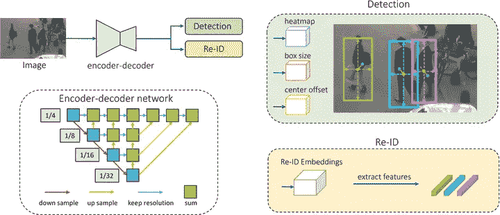
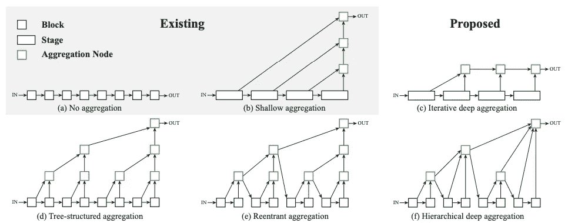
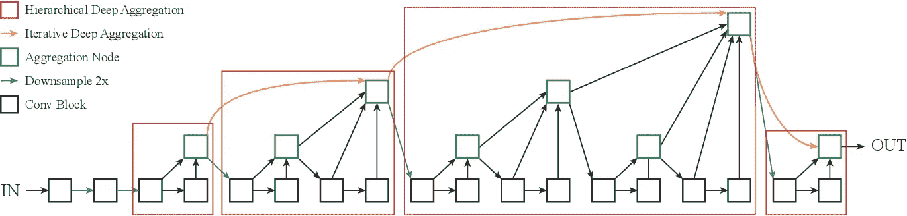
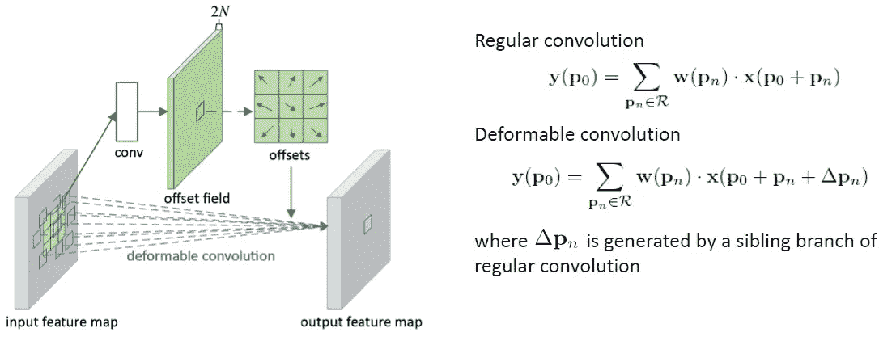

# FairMOT:多目标跟踪

> 原文：<https://medium.com/analytics-vidhya/fairmot-multi-object-tracking-386afe930b24?source=collection_archive---------1----------------------->

## **单镜头多目标跟踪**

# 介绍

多目标跟踪是计算机视觉中最受欢迎的挑战之一。它包括识别感兴趣的对象，然后在视频流中跨多个帧将这些检测关联起来。最常见的架构采用两步方法，包括使用基于 CNN 的检测器(YOLO，更快的 R-CNN)进行对象检测，并将检测到的对象传递给另一个组件以执行重新识别(Re-ID)任务。该组件负责根据对象各自随时间变化的特征来链接和关联对象。但是这种流水线速度慢，无法达到大多数实时应用所要求的推理速率。此外，在两步方法中，模型严重偏向于估计准确的对象检测提议，而不是高质量的 Re-ID 特征，后者严重依赖于前者的准确性。

FairMOT [1]是一个一次性多目标跟踪器(MOT ),它结合并共同执行目标检测和识别任务。它使用 Resnet-34 架构作为主干。在此基础上，应用深层聚合来融合来自网络不同层的特性。除此之外，所有上采样模块中的卷积层都被可变形的卷积所代替，以便它们可以动态地调整它们的感受野。

FairMOT 的主要特点是

*   它是无锚点的，并且使用位置感知特征地图。
*   它比两步法更快。
*   学习低级的重新识别特征，这改进了重新识别的整体任务。
*   它在中心提取 Re-ID 特征。
*   它对高分辨率的特征地图进行操作。
*   它可以缓解一个锚点包含多个对象和多个锚点包含一个对象的问题。
*   它使用深层聚合(DLA ),可以减轻对象比例不变性的问题，并有助于更好地提取 Re-ID 特征。使用 DLA 还可以实时减少大量 ID 切换。

图 1:费尔莫特建筑[1] [ [来源](https://arxiv.org/abs/2004.01888)

我们现在将探索 FairMOT 的每个组件。

**深层聚合**

要素金字塔网络是用于空间融合和跨不同级别均衡分辨率的主要架构系列。DLA [2]是一种增强形式，通过非线性和渐进融合进一步深化了表现。DLA 包括两种主要结构:-迭代深度聚合(IDA)和分层深度聚合(HDA)。

图 2:不同类型的聚合[2] [ [来源](https://arxiv.org/abs/1707.06484)

IDA 专注于融合分辨率和尺度。聚合从最小的规模开始，然后迭代合并更深、更大的规模。HDA 专注于合并所有频道的功能。它在树状结构中合并块和阶段，以保留和组合特征通道。如上所示，在图 2 中，聚集节点的输出作为下一个子树的输入反馈到主干。这有助于更好地保留特征。聚合节点选择重要的信息并组合输入，以在输出端保持相同的维度。

图 3:深层聚合[2] [ [来源](https://arxiv.org/abs/1707.06484)

**可变形卷积**

图 4:可变形卷积[6] [ [来源](https://arxiv.org/abs/1703.06211)

可变形卷积[6]是标准卷积运算的变体和改进。

标准卷积操作包括在输入图像上放置内核，随后，内核和激活的输入相乘并相加以形成输出特征图。在可变形卷积中，有一个附加的偏移参数应用于每个激活的输入。因此，偏移将有助于关注输入特征图的各个部分，而不是指定的核形输入图。

**可变形卷积——内存布局一览**

*【DG:可变形组，KS:内核大小，H:高度，W:宽度，IC:输入通道，OC:输出通道，O_H:输出高度，O_W:输出宽度】*

本节全面介绍了可变形卷积的内存布局，通常是在 C++实现或 BLAS 例程中。

在可变形卷积中描述的附加偏移参数本身是通过卷积运算预测的。在卷积操作期间，输出通道(DG x 3 x KS *)* 被计算并分成 3 个块，以形成高度、宽度、掩模偏移。

每个偏移量的形状为(DG x KS x KS X H X W)。

***示例*** :-如果图像为(2，10，12 *)* ，内核大小为 *(* 3，3 *)* ，可变形组为 2，则卷积偏移输出为*(*3 X 2 X 10 X 12 X 3 X 3 = 6480*)*。这被分成 3 个块(6480/3 = 2160)—2 个通道的高度、宽度和遮罩偏移。对应于每个输出点的输入点*(2×10×12)上的每个内核位置(9)的偏移高度和宽度位于每 240 个位置。第一个 120 表示内核(0，0)位置的高度偏移，下一个 120 表示宽度偏移。第二个(240–480)表示图像点的内核(0，1)偏移高度/宽度位置。经过 2160 (2 X 3 X 3 X 10 X 12)个值后，下一个通道的偏移值出现。*

*获取并添加每个输入的选定内核位置的偏移值。由于偏移量是分数值，因此要计算这些位置的值，需要进行双线性插值。*

***双线性插值***

*双线性插值[3]在图像处理中经常用于调整图像大小和拟合纹理。它用于预测给定一组相关的 4 个坐标和值的点的值。*

**[ (x1，y1)，(x1，y2)，(x2，y1)，(x2，y2) ]。**

*它包括首先在 4 个点的轴(x)上应用线性插值，并且在另一个轴(y)上插值得到的两个输出。*

*一旦对所有输入点进行双线性插值，最终输出的大小将为*(*IC x KS x KS x O _ H x O _ W*)*。*

*这里要观察的一点是，输出图像的每个点都有 *(* KS x KS x IC *)* 值。这意味着每个通道上的每个点都应用了内核，并且完成了双线性插值。然后将其乘以形状为*(*OC x IC x KS x KS*)*的内核权重，以获得形状为 *(* OC x O_H x O_W)的输出。*

***损失***

*FairMOT 中计算的损耗是热图损耗、重量和偏移损耗以及射频损耗。用所有损失的组合来联合训练该模型。在确定对象的中心，热图值最大，并且随着距中心的距离增加而缓慢衰减。损失是基于焦点损失[4]计算的，焦点损失用于平衡交叉熵损失，并确保正确分类的类别不会拖累整体损失。FairMOT 中使用的焦点损耗被修改为利用高斯分布，使得集中在中心附近的值上的损耗被赋予更大的权重。L1 损失用于计算重量和偏移的损失。地面真实偏移将是从原始中心位置减去积分中心位置(下采样)。对于宽度和高度，我们基于对象边界框的 4 个位置进行计算。每个对象的 Re-ID 特征特性通过分类器来确定对象的类别。接下来，交叉熵用于计算目标和预测类之间的损失。这里学习低级的 Re-ID 特征，提高了推理速度。*

# ***推论***

*输入图像被输入到网络中，以提取热图、权重、偏移量和重识别特征。基于热图分数应用非最大抑制。这是通过在热图分数之上执行最大池化来实现的。提取与最高分数相关联的权重、偏移，并基于此计算边界框坐标。在这些选定的中心也提取身份嵌入。边界框被转换成[x，y，纵横比，高度]的形式，并且基于此，卡尔曼滤波器被初始化。*

***卡尔曼滤波器***

*卡尔曼滤波器是一种迭代数学过程，当测量值包含不可预测或随机误差、不确定性或变化时，它使用一组方程和连续数据输入来估计被测对象的真实值、位置、速度。它主要用于减少由于错误测量引起的不确定性的影响。[5]中为感兴趣的读者提供了详细的解释。*

***跟踪***

*每次检测的卡尔曼滤波器被初始化，其中均值集作为其预测位置，方差作为预定义的不确定性度量。对于每个连续的帧，使用卡尔曼滤波器来预测新的平均位置和协方差。此外，计算新检测和旧轨迹之间的嵌入距离。这与预测的平均值和协方差相融合，以形成最终的匹配。在融合过程中，我们基于卡方分布值获得门控阈值。*

*卡方分布是一种伽玛分布，它表示新预测结果与预期结果并列时的拟合优度或可信度。这在推断统计和假设检验中被广泛使用。*

*由于测量有 4 个自由度(x，y，长宽比，高度),卡方值大约为 9.5，代表 0.05 的偏差，这是所用的标准阈值。大于该阈值的值被标记为无穷大。使用线性分配，用检测帧的值更新每个轨迹，并且基于卡尔曼增益，平均值和协方差也被更新。*

*未分配的轨道和帧被取出，并基于 IOU 距离传递到下一个关联，之后重复与上述类似的过程。此步骤中未分配的曲目被标记为丢失。*

# ***结论***

*本文到此结束，重点介绍了 FairMOT 架构的关键组件。接下来在 https://github.com/Sai-Venky/Trackjectory[继续进行代码将为这个架构的整体实现提供一个坚实的基础。如果你对这篇文章有任何疑问，请随时联系我们。](https://github.com/Sai-Venky/Trackjectory)*

*多目标跟踪仍处于起步阶段，目前有很多发展。随着多目标跟踪在各种实时应用中的应用，如自动驾驶汽车、安全监控和人机交互，未来几年肯定会有更多的进步。*

*敬请期待，学习愉快:)*

***参考文献***

1.  *[https://arxiv.org/abs/2004.01888](https://arxiv.org/abs/2004.01888)*
2.  *[https://arxiv.org/abs/1707.06484](https://arxiv.org/abs/1707.06484)*
3.  *[https://en.wikipedia.org/wiki/Bilinear_interpolation](https://en.wikipedia.org/wiki/Bilinear_interpolation)*
4.  *[https://arxiv.org/abs/1708.02002](https://arxiv.org/abs/1708.02002)*
5.  *[https://medium . com/@ jaems 33/understanding-Kalman-filters-with-python-2310 e 87 b8 f 48](/@jaems33/understanding-kalman-filters-with-python-2310e87b8f48)*
6.  *[https://arxiv.org/abs/1703.06211](https://arxiv.org/abs/1703.06211)*