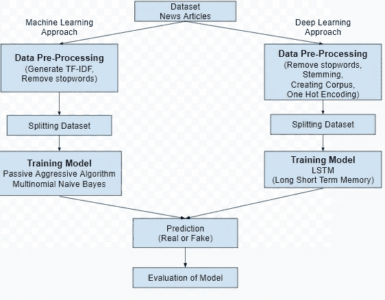
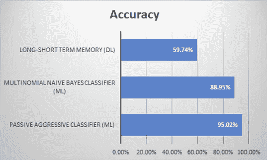

# 假新闻分类(ML Vs DL)

> 原文：<https://medium.com/analytics-vidhya/fake-news-classification-ml-vs-dl-20f770b1ee62?source=collection_archive---------13----------------------->

# 概观

我们尝试用不同的方法(ML 和 DL)建立假新闻检测模型，ML 模型的准确率高于 DL 模型。

# 问题陈述

预测给定的新闻文章是真是假，并提供一个统计表示。

# 项目简介

这些天的假新闻正在制造不同的问题，从讽刺文章到捏造的新闻，并在一些渠道策划政府宣传。假新闻和对媒体缺乏信任是我们社会中日益严重的问题。假新闻检测是一种防止来自不知名来源的误导性新闻故事传播的模型。在这个项目中，它试图创建一个模型，可以预测给定的文章是假的还是真的。

# 要求

● Python

●熊猫

● Numpy

●自然语言工具包

●sci kit-学习

● Keras

●正则表达式(Reg-Ex)

# 理论

机器学习算法

*多项式朴素贝叶斯分类器*

朴素贝叶斯分类器是用于分类任务的概率机器学习模型。多项式朴素贝叶斯分类器适用于具有离散特征的分类(例如，用于文本分类的字数)。多项式分布通常需要整数特征计数。

*被动攻击性量词*

被动攻击算法是一类用于大规模学习的算法。它们类似于感知器，因为它们不需要学习率。然而，与感知器相反，它们包括一个正则化参数。

TF-IDF 矢量器

Tf-IDF 代表术语频率-逆文档频率。将文本转换为可用作估计器输入的特征向量。词汇表是一个字典，它将每个标记(单词)转换为矩阵中的特征索引，每个唯一的标记都有一个特征索引。

深度学习算法

*长短期记忆*

LSTM(长短期记忆)单元形成递归卷积神经网络的递归部分。LSTMs 通常用于涉及序列数据的任务，例如时间序列预测和文本分类。

一键编码

一键编码是将分类变量表示为二进制向量。这首先需要将分类值映射到整数值。然后，每个整数值都被表示为一个二进制向量，除了用 1 标记的整数索引之外，其他都是零值。

# 框图

# 设计细则

在这里，我们尝试了两种不同的方法来找到最佳结果，因此我们首先使用机器学习(ML)分类方法来训练我们的数据集，第二种方法将使用深度学习(DL)来训练模型。

# ●数据预处理

○从源()收集数据后，我们需要使其适合培训。为了做到这一点(对于这两种方法),首先，我们需要从文本中删除所有用于预测目的的停用词。那么对于，

■机器学习方法我们需要使用 TF-IDF 方法对文本进行矢量化。

■深度学习方法我们需要对所有文本进行词干处理，然后用一种叫做 One Hot Encoding 的方法对它们进行编码。

# ●培训

○在训练模型时，首先我们需要在训练数据集和测试数据集之间分割它们，然后我们将应用算法

■在机器学习方法中，我们尝试了两种不同的分类算法，一种是被动主动分类器和多项式朴素贝叶斯分类器。

■在深度学习方法中，我们使用 LSTM 方法通过神经网络对我们的模型进行分类和训练。

# ●评估

训练模型后，我们使用我们的测试数据集预测标签，并将预测与测试数据集的标签进行比较，以确定我们训练模型的准确性，以下是我们使用的不同模型的准确性:

■机器学习方法:-

●被动积极分类器:95.02%

●多项式朴素贝叶斯分类器:88.95%

深度学习方法(LSTM): 59.74%

# 观察

在对模型进行评估后，我们可以得出结论，通过机器学习方法训练的模型比通过深度学习方法训练的模型更好。

这是因为我们在训练中使用的数据集非常小。因此，为了获得更高的准确性，我们需要用更大的数据集再次训练我们的模型。