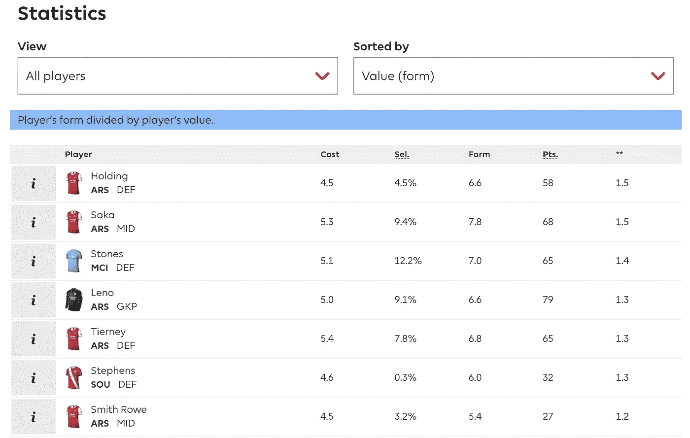
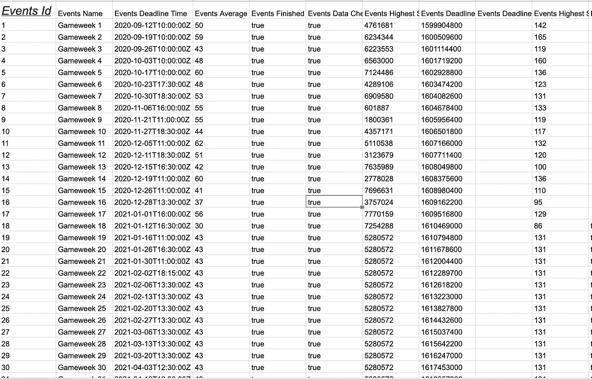
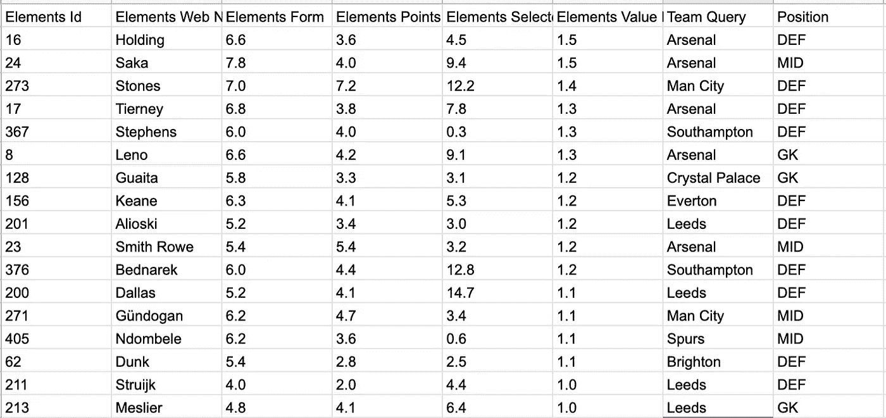
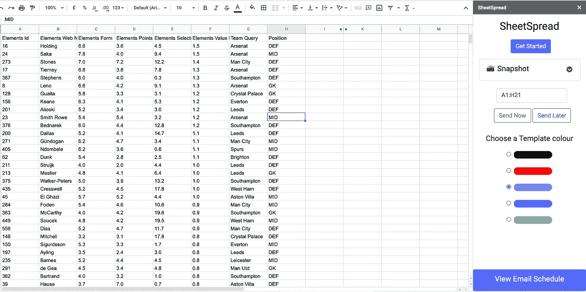
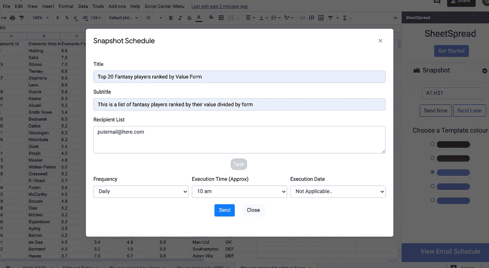
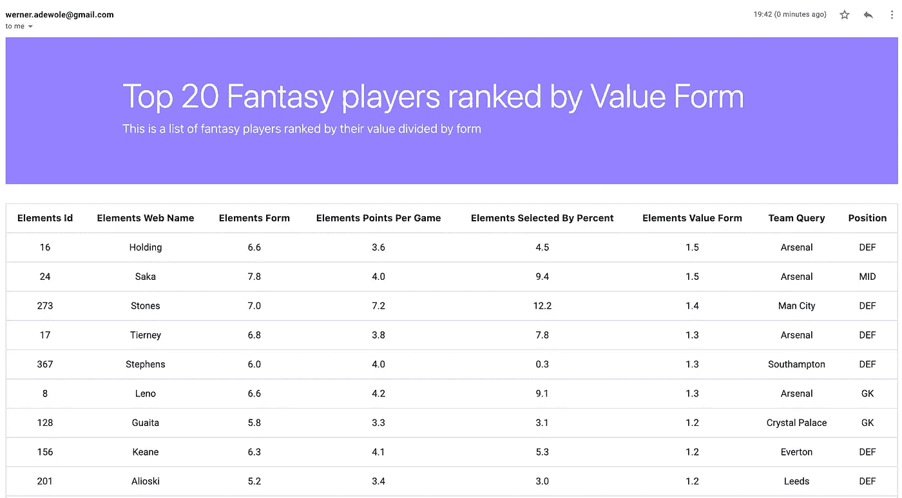

# 梦幻英超 API:如何在 5 分钟内制作一份梦幻统计的每日简讯

> 原文：<https://medium.com/analytics-vidhya/fantasy-premier-league-api-how-to-make-a-daily-newsletter-of-fantasy-stats-in-5mins-4f5b84d2f134?source=collection_archive---------19----------------------->

让数据来到你身边，让你在幻想中获得额外的优势。

在 fantasy 中获取最新数据可能会非常令人沮丧。如果你正在寻找这种优势，只需点击几次就能获得一些基本的见解。

在下面的截图中查看按价值排名的球员，你不能通过过滤来玩它，它只是一个静态表。更糟糕的是，每次我想检查数据时，我都必须回到网站并重新过滤，这对于我和朋友一起玩的简单游戏来说又是相当费力的。

如果我们可以用一点数据科学来改变这种情况会怎么样？如果我们不用每天去网站查看最新的更新信息，而是按照我们设定的时间表每天通过电子邮件接收信息，会怎么样？

好吧，我已经找到了一种方法来做到这一点，详情请阅读:

**第一步:将梦幻足球 API 整合到谷歌表单中**

使用 fantasy football API，我成功地将数据直接放入谷歌表单。这是一个相当大的文件(大约 159 列+ 600 行),所以有点磕磕绊绊，但还是可以管理的。说实话，这需要一点技术知识，但我会在本文结尾提供我的模板，这样你就不用做那些难做的事情了。

**第二步:清理数据，建立模板**

这一部分相当简单，使用 google sheets 中的一些函数，我能够创建一个新的数据表，其中包含我真正想要的信息(按价值形式排序的玩家)。我还添加了一些列，比如团队名称和职位，以便于选择。

**第三步:电子表格调度器**

接下来，我使用一个名为 [SheetSpread](https://gsuite.google.com/marketplace/app/sheetspread/257074946633) 的谷歌插件作为我的电子邮件调度程序。设置起来非常简单:

*   D [从谷歌市场下载应用](https://gsuite.google.com/marketplace/app/sheetspread/257074946633)
*   在谷歌工作表中打开它
*   选择您的数据范围和模板颜色(默认为黑色)
*   点击“稍后发送”

这是通过插件下拉菜单选择的应用程序的实时视图

然后..

*   添加标题、副标题和电子邮件地址以发送到
*   添加要发送的电子邮件计划(每小时、每天、每月)
*   发送

这是电子邮件调度屏幕

你应该会在你选择的时间看到一封电子邮件，它应该看起来像下面的图像。此外，您还可以点击“立即发送”,按照上述相同的步骤向自己发送一封预览邮件。

就是这样！

正如我前面提到的，如果你想使用我的数据来为自己设置，请在下面给我你的电子邮件，我会与你分享我的谷歌文档。它每 15 分钟刷新一次，所以它总是最新的。此外，我将添加更多的标签来查看其他指标，并接受建议，请在 Twitter[@ gbadewole](https://twitter.com/gbadeadewole)或电子邮件 gbade.adewole@gmail.com 联系我

注册即可访问屏幕中的谷歌数据

有一点需要注意的是，我也是 SheetSpread 的创始人，我为自己建立它是为了解决这样的问题:)