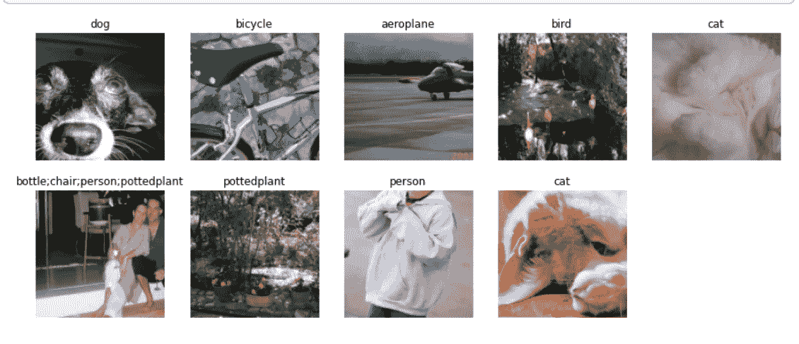

# FASTAI:多标签分类[第 6 章]

> 原文：<https://medium.com/analytics-vidhya/fastai-multi-label-classification-chapter-6-d28f3c9ed4f5?source=collection_archive---------12----------------------->

PyTorch 和 fastai 有两个主要的类来表示和访问训练集或验证集:

*   `Dataset`::返回单个项目的自变量和因变量元组的集合
*   一个迭代器，提供了一个小批量流，其中每个小批量是一组独立变量和一组…