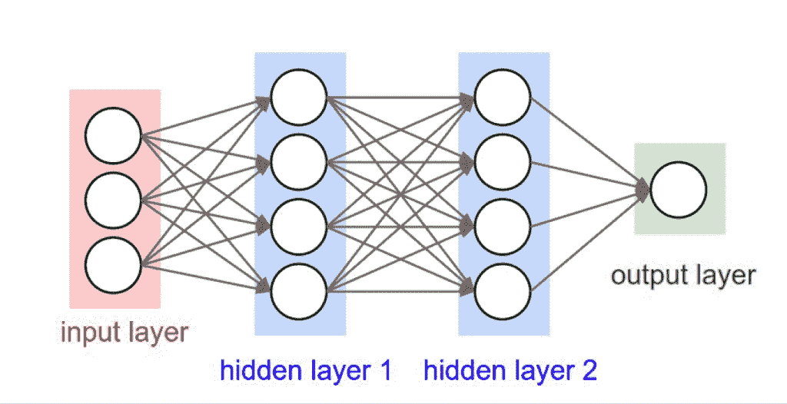

# FASTAI:训练一个数字分类器—[第四章] —第二部分

> 原文：<https://medium.com/analytics-vidhya/fastai-training-a-digit-classifier-chapter-4-part-ii-a804562e3bae?source=collection_archive---------13----------------------->

图片来自[**http://www . cs . utoronto . ca/~ FID ler/teaching/2015/slides/CSC 411/10 _ nn1 . pdf**](http://www.cs.utoronto.ca/~fidler/teaching/2015/slides/CSC411/10_nn1.pdf)

度量是驱动人类理解，损失是驱动自动化学习。

# 随机梯度下降–

正如亚瑟·塞缪尔提到的机器学习的描述

> *假设我们在*中安排一些自动手段来测试任何当前权重分配的有效性…