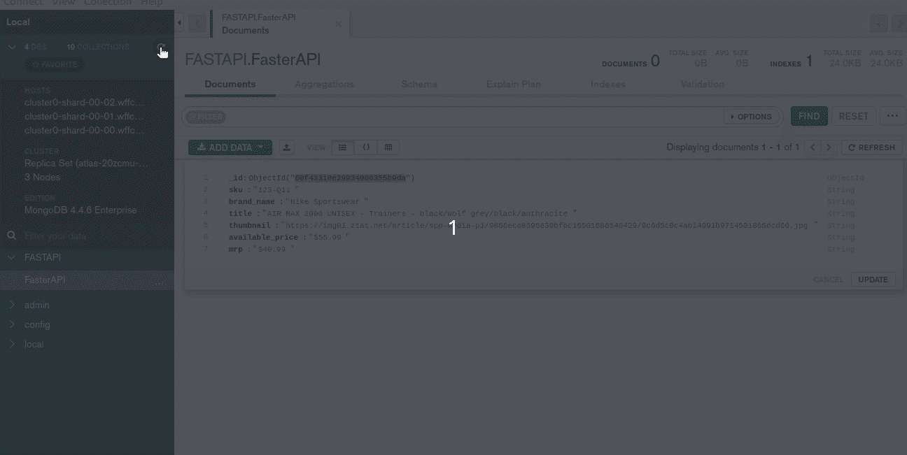

# FastAPI:python ista 的现代 API 框架

> 原文：<https://medium.com/analytics-vidhya/fastapi-the-modern-age-api-framework-for-pythonista-4b2cd1e6652?source=collection_archive---------0----------------------->

## 用 Python 构建和托管一个生产就绪的 API


《闪电侠》作者 [DCcomic](https://www.dccomics.com/)

Web APIs 对于现代企业的运营已经变得越来越重要。随着公司越来越依赖数据，数据通信的重要性也在不断增长。随着数据技术的不断涌现，我们需要一个快速、高性能、健壮的框架来构建我们的 API。

# 为什么是 **FastAPI？**


【https://fastapi.tiangolo.com/ 

**FastAPI，**一个现代的，快速的(高性能的)，用 Python 3.6+构建 API 的 web 框架。它的性能可以与 NodeJS 和 Go 相提并论，被认为是目前最快的 Python 框架之一。像微软、网飞、优步等科技巨头已经开始用 FastAPI 库构建他们的 API。该框架旨在优化体验，以便我们可以编写简单的代码来构建默认情况下具有最佳实践的生产就绪型 API。事不宜迟，让我们学习如何使用 FastAPI 构建一个健壮的 API 解决方案。

# 文章摘要

1.  问题陈述
2.  安装和设置
3.  “你好，世界”呼叫 FastAPI
4.  整合数据库
5.  构建真实世界的 API
6.  FastAPI Swagger UI
7.  在云上托管它
8.  结论

# 问题陈述

今天我们将为**零售业构建和部署一个 API，**拥有零售产品的数据。API 将能够，

1.  向数据库添加数据
2.  更新现有数据(这将包括将数据标记为已更新以及数据更新的时间)
3.  从数据库中删除数据
4.  通过调用唯一 id 来查看数据

我们今天要用的数据库是 MongoDB。我们将探索 MongoDB Atlas 来将数据库连接到我们的 API。

# 安装和设置

从创建虚拟环境开始总是好的。使用 pip3 创建虚拟环境并安装 FastAPI。

```
**$ pip3 install fastapi**
```

我们还需要一个 ASGI 服务器用于生产，比如[uvicon](https://www.uvicorn.org/)。

```
**$ pip3 install uvicorn**
```

稍后，我们需要一个 MongoDB 驱动程序来连接我们的 API 和数据库。为此，我们就用 [**电机**](https://motor.readthedocs.io/en/stable/index.html) 驱动。Motor 为 MongoDB 提供了一个基于协程的 API，它支持 [asyncio](https://docs.python.org/3/library/asyncio.html) 。

```
**$ pip install motor**
```

我们需要一个 Python 的 DNS 工具包，它可以支持几乎所有的记录类型。

```
**$ pip install dnspython**
```

这些都是我们使用 python3 创建完整的高性能 API 所需的依赖项。

# 你好，世界呼叫 FastAPI

首先，我们将使用 *FastAPI* 创建一个“hello world”应用程序，并使用*uvicon 服务器*运行它。这将让你很快了解一切是如何工作的。

使用以下内容创建文件`app.py`:

```
from fastapi import FastAPI

app = FastAPI()

@app.get("/")
async def root():
    return {"message": "Hello World"}
```

使用以下命令运行服务器:

```
**$ uvicorn app:app -- reload**
```

在[打开您的浏览器 http://127.0.0.1:8000/](http://127.0.0.1:8000/)

您将看到 JSON 响应如下:`{"message": "Hello World"}`


JSON 响应是从 FastAPI 应用程序中的函数返回的同一字典。

您也可以在[http://localhost:8000/docs](http://localhost:8000/docs)查看交互式 API 文档:


[http://localhost:8000/docs](http://localhost:8000/docs)

# 将应用程序集成到数据库中

到目前为止很清楚，我们使用 MongoDB 作为我们的数据库，让我告诉你我们将使用市场上最先进的云数据库服务，[**MongoDB Atlas**](https://www.mongodb.com/cloud/atlas/efficiency?utm_source=google&utm_campaign=gs_apac_india_search_core_brand_atlas_desktop&utm_term=%2Bmongo%20%2Bdb%20%2Batlas&utm_medium=cpc_paid_search&utm_ad=b&utm_ad_campaign_id=12212624347&gclid=CjwKCAjwos-HBhB3EiwAe4xM9wC3-xjOERrId6ylD-TBAJcnoWc4eNmjd_o3WMs-StnuFS-INn3zOxoCBNgQAvD_BwE)**。**

1.  让我们用默认的 512MB 配置在 MongoDB Atlas 中创建一个集群。并将其命名为“ *FasterAPI* ”。


2.为了将数据库连接到我们的应用程序，我们将借助 MongoDB Compass。让我们使用在创建集群期间设置的配置来连接它。


3.用 MongoDB 指南针连接。


# 构建真实世界 API

为了构建一个真实的零售 API，我们将使用一些基本的 HTTP 功能，这些功能被称为 **CRUD** 操作。CRUD 代表创建、读取、更新和删除，这是四种基本的数据库操作。

使用 FastAPI，我们可以使用 4 种预定义的方法创建、读取、更新和删除数据库中的数据。

*   `@app.get()`
*   `@app.post()`
*   `@app.put()`
*   `@app.delete()`

这个 HTTP 功能应该在 **app** 实例下执行，它是类`FastAPI`的一个实例。这将是创建我们的 API 的主要交互点。

```
app = FastAPI()
```

这是同一个*应用*，它在我们使用`uvicorn app:app --reload`运行时启动 API

定义一个抽象的[模式](https://pydantic-docs.helpmanual.io/usage/schema/)来表示数据应该如何存储在数据库中，这是一个很好的实践。在 Pydantic 中，让我们定义一个模式来将我们的数据存储到 MongoDB。

在上面的代码中，我们定义了一个名为`Items`的 Pydantic Schema，它定义了与类型相关的所有字段。 *schema_helper* 函数将帮助 **CRUD** 操作数据映射为一个字典，其中包含零售参数，即 SKU、品牌名称、标题、缩略图、可用价格和 MRP。

耶！下面的脚本是我们构建 API 所需要的全部，我们已经定义了 CRUD 功能和模式。

# FastAPI Swagger UI

FastAPI 提供 web 用户界面。由于该框架是基于 OpenAPI 的，因此还有许多选项有待探索，但是让我们来看看该框架最常见和最重要的特性。

切换到[http://localhost:8000/docs](http://localhost:8000/docs)与 FastAPI swagger 交互。

## 发布方法:

我们将使用 POST 方法创建一个数据输出集合，

```
{“sku”: “NI114D0EY-Q11”,
 “brand_name”: “Nike Sportswear”,
 “title”: “AIR MAX 2090 UNISEX — Trainers — black/wolf grey/black/anthracite”},
 “thumbnail”: “[https://img01.ztat.net/article/spp-media-p1/9866ece8595630bfbc16501686540429/9c6d5c0c4ab14091b9714501865dcd66.jpg](https://img01.ztat.net/article/spp-media-p1/9866ece8595630bfbc16501686540429/9c6d5c0c4ab14091b9714501865dcd66.jpg)",
 “available_price”: “£55.99”,
 “mrp”: “£59.99”
}
```


## 获取方法:

通过将 id 作为输入来获取更新的数据。


## PUT 方法:

更新数据。这里，如果我们使用 Post 方法更新数据，2 个字段将被添加到数据字段中，

```
1\. “update”: True2\. “updated_time”: <Time when the data was updated>
```

## 删除方法:

使用 Id 字段从集合中删除记录。



# 在云上托管 API:

最后，让我们将 API 部署到 Heroku 中。

[**Heroku**](https://www.heroku.com/) 是一个平台即服务(PaaS)，使开发者能够完全在云中构建、运行和操作应用。

要在生产环境中部署它，将您的所有需求收集到一个 requirements.txt 文件中。

```
**$ pip freeze > requirements.txt**
```

请确保 *uvloop* 和 *httptools* 是您的需求文件的一部分。

API 网址:[https://retail-fastapi.herokuapp.com/](https://retail-fastapi.herokuapp.com/)


太好了！

请随意在[这个库](https://github.com/ishritam/FastAPI)中使用我用来创建这个 API 的代码。

# 结论:

恭喜您，您的第一个带有 FastAPI 的生产就绪 API 已经上线。我希望它是容易的和有帮助的。请随意将这篇 FastAPI 文章作为参考，尝试并构建一些令人惊叹的 web APIs。

我希望这篇文章能激发您在生产中构建和托管 API。

下次我会在另一个很酷的话题上看到你。在那之前，

保持安全..！不断学习..！

# 感谢您的阅读！

[通过 Medium](/@shritam) 关注我的最新动态。😃