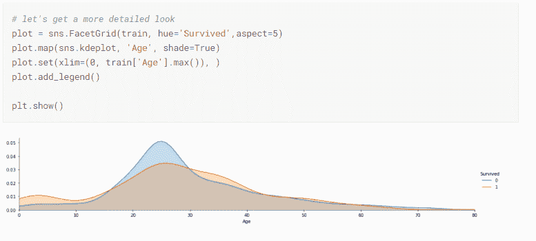

# 机器学习的特征工程:为什么和如何

> 原文：<https://medium.com/analytics-vidhya/feature-engineering-for-machine-learning-stem-to-shtem-submission-76903112e437?source=collection_archive---------18----------------------->

作为一个娱乐爱好者，我在机器学习过程中最喜欢的话题之一是特征工程。生成、更改和删减数据的过程融合了增加模型可预测性的实际目的和令人兴奋的调查感觉。虽然在库的帮助下，模型的实现通常在本质上是相似的，但是特征工程总是迭代的。这是对数据深度的一次激动人心的探索，在那里模式和重要的关系正等待着被发现。简单来说，特征工程很重要，也很有趣！

那么到底什么是特征工程呢？我们如何用它来进行机器学习？要回答这些问题，我们需要自己成为探索者。我们将从揭示机器学习的基础开始。接下来，我们将研究特征工程的基础。最后，我们将发现将我们的模型带到下一个级别的实际实现。我喜欢特征工程，希望你也喜欢！

# **机器学习基础知识**

要理解什么是特征工程，必须从理解机器学习的本质开始。本质上，机器学习模型接受一组**数据点**，每个数据点都有它们各自的**特征**(数据列)，并且或者返回**目标值**的**预测**，或者在没有目标值的情况下找到变量之间的关系(例如聚类)。前者被称为**有监督的机器学习**，后者被称为**无监督的机器学习**(不要因为缺乏监督而与 AI 机器人接管世界相混淆)。出于我们的目的，我们将使用特征工程来最大化预测能力，从而将重点放在监督学习上。如果这种描述感觉抽象，让我们更具体地看看一个涉及监督学习的实际数据集。

最常见的有监督的机器学习任务之一是在给定大多数乘客的数据(性别、年龄、阶级等)的情况下，预测不幸的泰坦尼克号灾难中个人的存活率。泰坦尼克号数据集比赛也是最受欢迎的新手 Kaggle 比赛之一，对学习如何实现特征工程特别有帮助。

用熊猫。head()函数，我们可以检查前五个数据点并更好地理解数据:

我们可以考虑每一列数据(“PassengerId”、“Pclass”等)。)成为一个**特征**。我们的目标是创建一个机器学习模型，当呈现给模型在使用个人特征之前没有见过的个人时，该模型可以预测“幸存”值。这些潜在的机器学习模型(逻辑回归、决策树、神经网络等。)不胜枚举。**然而，他们都受益于特征工程。**

# **那么什么是特征工程呢？**

特征工程是从我们的当前数据中提取额外数据或简单地改变我们的当前数据的过程，以使我们的模型更容易找到有助于预测目标值的关系(如泰坦尼克号例子中的“幸存”)。不是每个模型都能够立即找到这些关系，因此特征工程使它们显式化。

这里有一个简单的类比:一个名叫 Timmy 的学生，类似于一个受监督的机器学习模型，在过去的几周时间里，他一直在为数学考试而学习，以便能够正确地回答问题。在这种情况下，特征工程可能包括改变他的学习环境，以便他能更有效地学习材料。这可能包括将他的学习材料翻译成他的母语，替换任何丢失的笔记，或者让他只关注重要的定理。

在泰坦尼克号数据集的情况下，我们可以通过对我们的初始数据进行大量修改来使我们的模型更容易学习。在本帖中，我们将涉及语言处理、数据组合、宁滨、插补和降维。

# **特征工程的常见类型**

**语言处理/字符串提取**

作为一名演讲家、辩论家和青年倡导者，我最喜欢的特征工程类型之一是利用单词、句子或任何文本字符串。文字是有力量的，那么让我们把这种力量延伸到机器学习上。语言处理包括提取文本字符串中的细节，这些细节为我们的模型提供了非常有用的信息。

如果你回头看看泰坦尼克号的数据集，你会立即注意到的一件事是，每个名字都有某种标题，每个船舱信息字符串的开头都有一个船舱字母。这些都是我们可以输入到模型中的细节。

例如，我们可以通过将 Python 的正则表达式提取应用到我们的训练和测试数据集来找到每个人的头衔。注意:训练和测试之间的唯一区别是测试数据集中的实例缺少“幸存”列，因为目标是在测试数据集上进行预测。

在检查了可能的标题类型后，我们可以将每种类型的标题组合在一起，并将其映射到一个数字。另外，将类别映射到数字的行为被称为标签编码——我们这样做是因为大多数模型只能处理数字。

正如您所看到的，我们现在有了一个新的“标题”特性，它是从“名称”特性中提取出来的。

**合并数据**

执行特征工程的另一种方式是组合特征。这不仅为我们的模型提供了一个更集中的观点来看待以前不同的特性，而且还有助于减少需要关注的特性的数量(我们将在后面讨论这一点的重要性)。

例如，我们可以添加“SibSp”(兄弟姐妹+配偶计数)和“Parch”(父母和子女计数)来创建一个新的“family_size”特性。

**宁滨数据**

提取数据的一种更流行的方法是将数字数据点放入箱中。例如，如果我们知道有人高于 6 英尺，我们可以将他们放入“高”箱。虽然一些算法可能已经能够得出类似的区别，但明确这些区别将提高模型性能。

例如，在泰坦尼克号的数据集上，我们可以寻找与存活率相关的重要年龄范围。为了实现，我们可以图形化地定位存在哪些范围，使得死亡或存活的数量不会相互交叉。

例如，在从 0 到 16 的范围内，我们现在知道通常存活的人比死亡的人多。给定绘制条柱的范围，我们可以创建另一个用数字表示各自条柱的特征。

**插补**

不要与截断混淆，插补是替换缺失值的过程。缺失数据是数据集中最常见的问题之一，有数百万种方法来估算数据。

一种方法是从共享相似特征值的其他数据点中找到平均值或中值。使用 Pandas 的 groupby 函数，我们可以执行以下操作来替换缺失的年龄值:

另一种方法是在现有数据上训练一个全新的模型，并将目标值设置为缺失的数据。这方面的实现有点超出了本博客的范围，但你可以在线阅读更多关于 KNN 插补或随机森林插补的内容。

**降维:**

现在，我们刚刚讨论了许多创建要素以生成更多信息的方法。然而，并非所有信息都是有用的——通常，特征是多余的，或者不能为模型做出决策提供任何依据。此外，拥有太多的特性会导致问题(维数灾难)，所以我们经常想要去掉不必要的特性。

这可能涉及一些简单的步骤，比如查看属于不同类的数据点之间的分布(如果分布是相同的，那么该特性可能不会引入太多新信息)。其他简单的步骤包括查看目标值和每个相应特征之间的相关性，如皮尔逊相关系数。在训练实际模型时，手动尝试删除一些特征来查看它们是否对模型的可预测性产生影响也是一个好主意。

另一种流行的、自动化程度更高的降维方法是执行**主成分分析**。虽然计算特征向量和主成分的过程需要一点数学背景，但奇异值分解 PCA 用 sci kit-learn([https://sci kit-learn . org/stable/modules/generated/sk learn . decomposition . PCA . html](https://scikit-learn.org/stable/modules/generated/sklearn.decomposition.PCA.html))实现起来相对简单。

# **下一步是什么？**

既然我们已经执行了特征工程，我们将准备开始训练我们的模型。模型训练本身是另一个话题，每个模型都有自己的缺点和优点。从广义上来说，如果不能立即确定选择哪种模式，可以尝试多种模式，看看哪种效果最好。此外，尝试用额外的功能工程进行更多的实验，这可能会提高特定模型的性能。这包括寻找处理分类数据的新方法，创建额外的箱，或者简单地去除某些特征。

# **关键要点**

本质上，特征工程是监督机器学习的一个有趣的、研究性的和重要的部分。特征工程的常见实现包括语言处理、数据组合、宁滨、插补和降维。

仅仅创建几个特征就可以极大地提高模型的可预测性。例如，我在 Titanic 数据集上训练的 LightGBM 梯度增强决策树模型通过使用上面讨论的一些技术，甚至在没有任何超参数调整的情况下，将精确度从大约 75%提高到 78%(在测试集上)。然而，还有数不清的方法来进行特征工程。这是一个反复的、调查性的、不断扩展的过程。