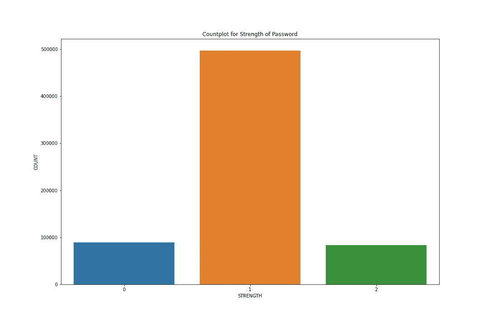
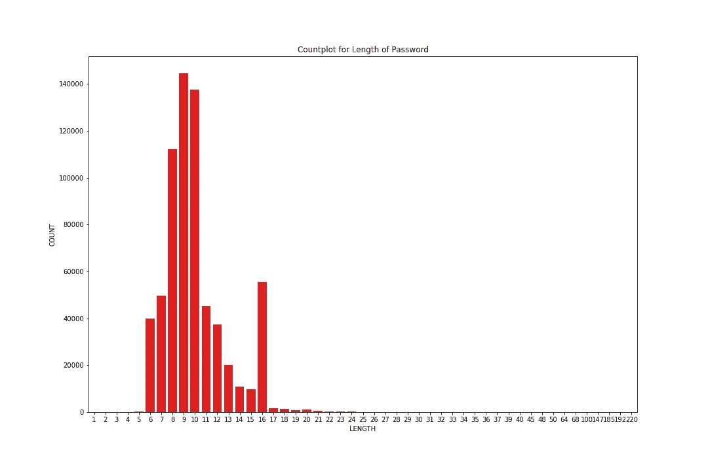
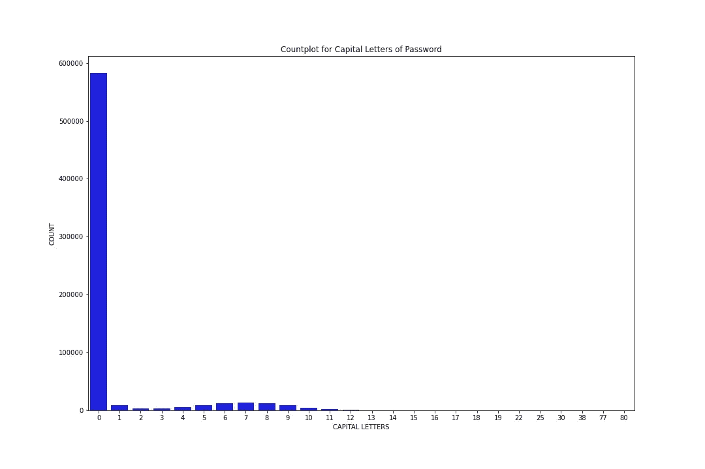
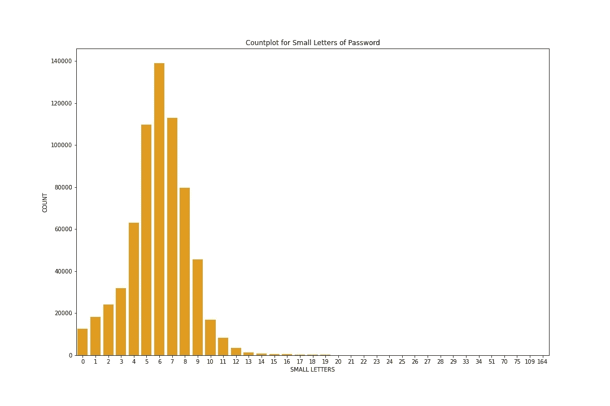
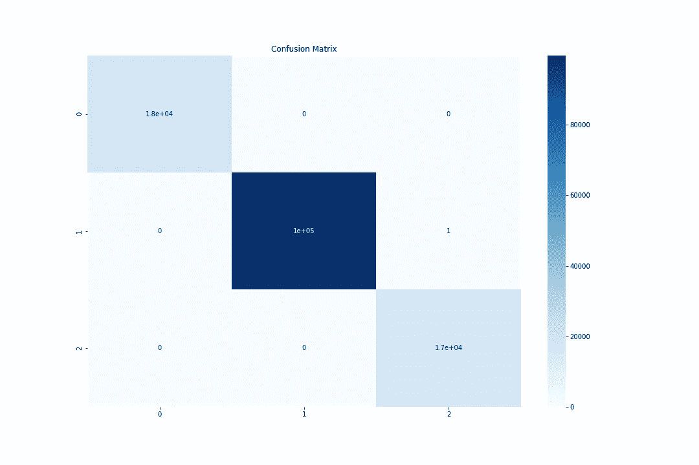

# 特征工程很重要！⚙️

> 原文：<https://medium.com/analytics-vidhya/feature-engineering-is-important-%EF%B8%8F-b2e13956002b?source=collection_archive---------19----------------------->

一个简单的教程，介绍了特征工程如何简化你的机器学习模型。


照片由 [Pixabay](https://www.pexels.com/@pixabay) 拍摄

# **密码强度分类器**🔑

> 预测密码是否强的机器学习模型。

数据集链接:[https://www . ka ggle . com/bhavikbb/password-strength-classifier-dataset](https://www.kaggle.com/bhavikbb/password-strength-classifier-dataset)

在我们的分析中使用的密码是从网上可获得的 000 网站主机泄漏。我们如何确定哪些密码更强，哪些密码更弱？乔治亚理工大学有一个叫 PARS 的工具，里面集成了所有的商业密码计量器。我所做的就是给那个工具所有的密码，它给我每个商业密码强度计的新文件。文件包含多一列的密码，即基于商业密码强度计的密码强度。

我使用的商业密码强度算法是 Twitter、微软和 battle 的。这个算法和这些测力计有什么不同？首先，它完全基于机器学习而不是基于规则。其次，我只保留了那些被所有三个强度计标记为弱、中、强的密码。这意味着所有的密码都是弱、中或强的。

## **关于此文件**

密码—在线收集的密码的 67 万个唯一值。强度—三个值(0，1，2)，即 0 代表弱，1 代表中，2 代表强。基于规则(如包含数字、特殊符号等)的密码强度。)

# 数据分布📊

```
**import** **numpy** **as** **np**
**import** **pandas** **as** **pd**
**import** **matplotlib.pyplot** **as** **plt**
**import** **seaborn** **as** **sns**
**import** **re**data=pd.read_csv('data.csv',error_bad_lines=**False**)
*# figure for strength*
plt.figure(figsize=(15,10))
sns.countplot(x=data['strength'])
plt.title('Countplot for Strength of Password')
plt.xlabel('STRENGTH')
plt.ylabel('COUNT')
plt.savefig('strength.jpg')
plt.show()
```



通过查看密码的计数图，我们可以得出数据集高度不平衡的结论。与弱密码和强密码的数据点数相比，属于中等强度的密码具有最高的数据点数。

# 🧰特征工程

## 为什么？

数据集仅由两列组成，即密码和强度的类别标签，需要进行预处理并应用一些特征工程。

## 解决办法

这是我用来做简单特征工程的代码，它给了我的模型更多的输入来更好地训练和分类密码。这些都是决定密码强弱的重要因素。

```
**def** cal_len(x):
    *'''*
 *Calculates the length of a given password.*
 *'''*
    x=str(x)
    **return** len(x)**def** cal_capL(x):
    *'''*
 *Calculates the number of capital letters in the password.*
 *'''*
    x=str(x)
    cnt=0
    **for** i **in** x:
        **if**(i.isupper()):
            cnt+=1
    **return** cnt

**def** cal_smL(x):
    *'''*
 *Calculates the number of small letters in the password.*
 *'''*
    x=str(x)
    cnt=0
    **for** i **in** x:
        **if**(i.islower()):
            cnt+=1
    **return** cnt

**def** cal_spc(x):
    *'''*
 *Calculates the number of special characters in the password.*
 *'''*
    x=str(x)
    **return** (len(x)-len(re.findall('[\w]',x)))**def** cal_num(x):
    *'''*
 *Calculates the number of numeric values in the password.*
 *'''*
    x=str(x)
    cnt=0
    **for** i **in** x:
        **if**(i.isnumeric()):
            cnt+=1
    **return** cnt

length=**lambda** x:cal_len(x)
capital=**lambda** x:cal_capL(x)
small=**lambda** x:cal_smL(x)
special=**lambda** x:cal_spc(x)
numeric=**lambda** x:cal_num(x)data['length']=pd.DataFrame(data.password.apply(length))
data['capital']=pd.DataFrame(data.password.apply(capital))
data['small']=pd.DataFrame(data.password.apply(small))
data['special']=pd.DataFrame(data.password.apply(special))
data['numeric']=pd.DataFrame(data.password.apply(cal_num))
```

# 为了更好地理解而绘制的图📊

这些图将帮助你理解数据点的分布。看一看！！！😃

## 密码的长度📏

```
plt.figure(figsize=(15,10))
sns.countplot(x=data['length'],color='red')
plt.title('Countplot for Length of Password')
plt.xlabel('LENGTH')
plt.ylabel('COUNT')
plt.savefig('length.jpg')
plt.show()
```



## 密码中的大写字母🔠

```
plt.figure(figsize=(15,10))
sns.countplot(x=data['capital'],color='blue')
plt.title('Countplot for Capital Letters of Password')
plt.xlabel('CAPITAL LETTERS')
plt.ylabel('COUNT')
plt.savefig('capital.jpg')
plt.show()
```



## 密码中的小写字母🔡

```
plt.figure(figsize=(15,10))
sns.countplot(x=data['small'],color='orange')
plt.title('Countplot for Small Letters of Password')
plt.xlabel('SMALL LETTERS')
plt.ylabel('COUNT')
plt.savefig('small.jpg')
plt.show()
```



## 密码中的数值🔢

```
plt.figure(figsize=(15,10))
sns.countplot(x=data['numeric'],color='teal')
plt.title('Countplot for Numerics of Password')
plt.xlabel('NUMERICS')
plt.ylabel('COUNT')
plt.savefig('numerics.jpg')
plt.show()
```


## 密码中的特殊字符🔣

```
plt.figure(figsize=(15,10))
sns.countplot(x=data['special'],color='violet')
plt.title('Countplot for Special Characters of Password')
plt.xlabel('SPECIAL CHARACTERS')
plt.ylabel('COUNT')
plt.savefig('special.jpg')
plt.show()
```


# 模型架构🤖

在这里，我使用了来自 sklearn 的`MLP Classifier`和`2 hidden layers each having 16 nodes with ReLU activation.`，模型的输入只是使用标准缩放器缩放的特征工程值。

```
**from** **sklearn.preprocessing** **import** StandardScaler
**from** **sklearn.neural_network** **import** MLPClassifier
**from** **sklearn.model_selection** **import** train_test_split **as** tts
**from** **sklearn.metrics** **import** accuracy_score
**from** **sklearn.metrics** **import** classification_report
**from** **sklearn.metrics** **import** confusion_matrixy=data['strength'].values
x=data[['length','capital','small','special','numeric']].valuesxtrain,xtest,ytrain,ytest=tts(x,y,test_size=0.2,random_state=42)
print(xtrain.shape,ytrain.shape)
print(xtest.shape,ytest.shape)sc=StandardScaler()
xtrain=sc.fit_transform(xtrain)
xtest=sc.transform(xtest)model=MLPClassifier(hidden_layer_sizes=(16,16),max_iter=300)
model.fit(xtrain,ytrain)
```

# 模特表演🥇

模型的精确度达到了`99.99%`，因为模型只做了一次错误分类。

```
ypred=model.predict(xtest)
print("The accuracy of the model is: ",accuracy_score(ytest,ypred)*100," % !!!")

print(classification_report(ytest,ypred))print("The confusion matrix is: ") 
cf=confusion_matrix(ytest,ypred) 
print(cf) plt.figure(figsize=(15,10)) 
sns.heatmap(cf,annot=**True**,cmap='Blues') 
plt.title('Confusion Matrix') 
plt.savefig('confusion.jpg') 
plt.show()
```

为了更好地理解，下面是混淆矩阵:



> 特征工程有助于表示数据的底层结构。

你可以点击下面的链接访问我的 Github repo。如果你真的喜欢它，给它一颗星。

[](https://github.com/Ankit152/Password-Strength-Classifier) [## ankit 152/密码强度分类器

### 在我们的分析中使用的密码是从网上可获得的 000 网站主机泄漏。我们是如何发现哪个…

github.com](https://github.com/Ankit152/Password-Strength-Classifier) 

领英:[https://www.linkedin.com/in/ankitk152/](https://www.linkedin.com/in/ankitk152/)

GitHub:[https://github.com/Ankit152](https://github.com/Ankit152)

推特:[安基特·库尔米](https://twitter.com/theankitkurmi)