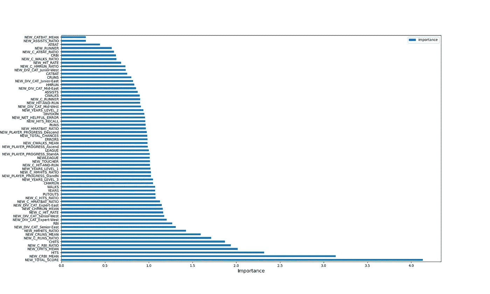

# Hitters 数据集的特征工程

> 原文：<https://medium.com/analytics-vidhya/feature-engineering-with-hitters-dataset-1a992daf13fa?source=collection_archive---------3----------------------->

***端到端的机器学习项目。***

你好，
在本文中，我将展示我在 Hitters 数据集上进行的特征工程步骤。我将讨论我们在创建功能时考虑哪些信息，以及我们更喜欢哪些应用程序。由于我做的一些决定可能会因项目而异，所以我没有分享每个阶段的相关代码。我将分享与特性工程相关的代码，这是我们的主要关注点。这个项目的主要目标是做一个端到端的机器学习项目，经过特征工程和预处理，可以预测球员的工资。

击球手数据集包括在 1986-1987 赛季打球的球员的各种统计数据。数据集由 20 个变量和 322 个观察值组成，只有工资变量有缺失的观察值。数据集变量的定义如下:

球棒:在 1986-1987 赛季中用球棒击球的次数

点击率:1986-1987 赛季的点击率

HmRun:1986-1987 赛季最有价值的热门歌曲

得分:他在 1986-1987 赛季为他的球队赢得的分数

打点:击球手在赛季中击球时慢跑的人数

保送:对方球员的失误次数

年数:球员在大联盟的上场时间(以年为单位)

棒球棍:职业生涯中用棒球棍击球的次数

CHits:职业生涯中的点击次数

CHmRun:职业生涯中最有价值的安打

克伦斯:他在职业生涯中为他的球队赢得的积分

CRBI:击球手职业生涯中击球时慢跑的人数

CWalks:对方球员在职业生涯中犯的错误数

联赛:有 A 级和 N 级的因素，显示球员在赛季结束前所参加的联赛

分区:一个 E 级和 W 级的系数，表示球员在 1986 年底的位置

输出:在游戏中帮助你的队友

助攻数:球员在 1986-1987 赛季中的助攻数

失误:球员在 1986-1987 赛季的失误

薪水:球员在 1986-1987 赛季的薪水(以千计)

新联盟:在 1987 赛季开始时显示球员联盟的 A 级和 N 级因子

首先，我将谈论我通过相互比较数值变量而获得的特征。在此过程中需要考虑的一点是，通过在最小值为 0 的数值变量上加 1 来防止出现 na 或 inf 值。在这个过程之后，我们可以将数值变量相互划分。

数字变量的分位数

第一组功能是计算相关赛季占整个职业生涯的比例。我们通过对上面定义的变量进行比例分配来获得它。我们试图创造新类型的球员。跑步者类型的球员通过准确的投篮完成跑步，让他在场上的朋友得分。另一方面,“打了就跑”代表的是那些在准确命中后可以进入下一阶段的运动员。

运动员必须通过所有的垒来完成比赛

第二组特征由按年划分的职业统计数据组成。我们期望年平均收入高的球员能拿到高薪。

第三组特征是基于玩家的游戏年限来对他们进行分级。我们将玩了 2 年或更短时间的玩家命名为初级玩家，2 到 5 年的玩家命名为中级玩家，玩了 5 到 10 年的玩家命名为高级玩家，玩了 10 年以上的玩家命名为专家玩家。

我们根据第四个功能组所在的部门和年份为其命名。e 分区代表东，W 分区代表西。

第五个特征组是关于球员在下一个赛季打哪个联赛。以 A 为代表的美国联赛，通常被称为少年巡回赛。以 N 为代表的全国联赛，被称为高级巡回赛。两个联赛的冠军正在进行决赛。在这个小组中，我们代表了那些在第一个赛季参加了甲 A 联赛，并在接下来的赛季中与 Ascend 一起参加了 N 联赛的人。我们叫了相反血统的选手。

在最后一组特征中，有各种相互关联的多个变量的比率。这组特征来自相关季节的变量。

在预处理阶段，我们抑制了异常值。在此过程中，我们的首选范围是将值保持在数据的 1%到 99%之间，并根据这些值抑制异常值。我们保持较低的间隔，因为我们的数据集中的观察数量很少。我们为分类变量执行了标签、序号和一个热编码转换。为了填充缺失值，我们用 knnImputer 填充缺失值，并用 robust-scaler 缩放数据。我们没有调整我们的目标变量——薪水，因为我们想根据 RMSE 来比较价值。最后，我们建立了多元线性回归模型。我们找到了测试数据集的 RMSE 和 R 平方值(R 平方:0.6506，RMSE:268.4507)。

最后，我们设法拥有了比原始变量更重要的变量。下面你可以找到重要性图表。

特征重要性图。

参考资料:

[1]:[https://boot camp . veribilimokulu . com/egi Tim/veri-bili MCI-yetistirme-programi/](https://bootcamp.veribilimiokulu.com/egitim/veri-bilimci-yetistirme-programi/)

[2]:[https://www.mlb.com/glossary](https://www.mlb.com/glossary)

【3】:【https://en.wikipedia.org/wiki/Baseball_statistics 