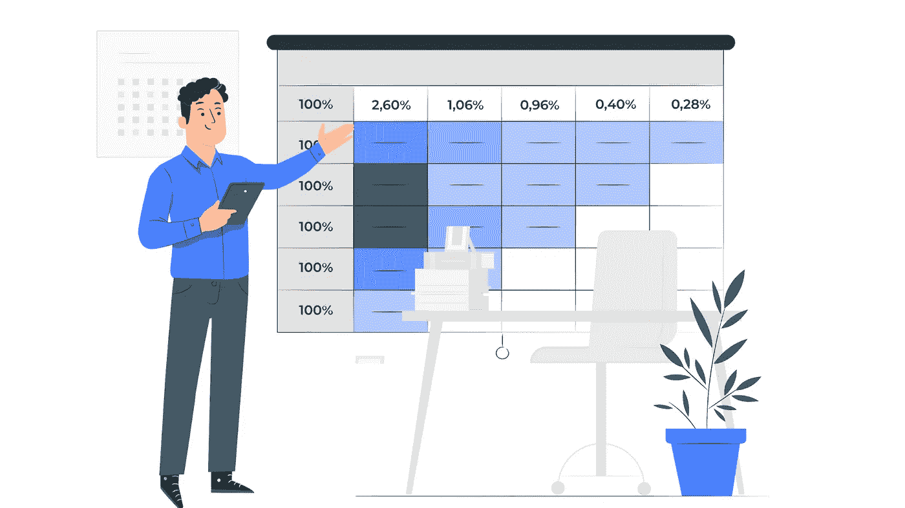

# 特征提取应用和工具

> 原文：<https://medium.com/analytics-vidhya/feature-extraction-application-and-tools-2e8f0717afbf?source=collection_archive---------1----------------------->

**特征提取**是机器学习和模式识别中使用的过程，用于创建准有效。此外，这可以用来提高人类的理解。

当有太多的数据需要处理时，人们认为这些数据是多余的。这一步可以用来减少信息的特征。

使用特征选择技术确定初始特征的子集。这种方法降低了初始数据的复杂性，并允许用户在不依赖整个初始数据集的情况下完成所需的工作。

**特征提取**是一个减少解释数据所需资源数量的过程，因此简化了其复杂性。它可以防止产生错误，并提高模型的准确性。

一般来说，对大量数据进行**数据分析需要相当大的计算能力和内存。**

使用特征工程技术来改善不同设计方案的结果。

例如，BytesView 可以用来分析大量的文本数据，并找到特征以及相关的见解。比较不同的产品，看看它们有多相似。

# 特征提取的应用

*   您可以从大量文本数据中自动识别和提取要素，并使用文本提取解决方案创建所有独特要素或要素组合的摘要。
*   品牌和营销人员需要了解他们的目标受众的需求。使用文本提取获得有价值的见解，并创建具有一组引人注目的功能的产品。
*   推荐系统可以通过自动识别产品规格中的实体来检测包含类似实体的其他产品。
*   您可以通过聚类相似或相关的要素来创建不同的要素组。
*   识别新产品特征或新的客户群，开发更个性化和更有吸引力的产品。
*   通过简化相关资料的查找、组织和访问，你可以学到新的东西。

# **文本提取工具**

## 1.[字节视图](https://www.bytesview.com/text-extraction)

BytesView 的高级特征提取解决方案可以分析大量文本数据，并检测特征以及相关见解。预定义标签以识别热门内容、商业智能、客户意见和重复票据。

## 2. [IBM 沃森](https://www.ibm.com/in-en/watson)

IBM Watson 是该公司的人工智能平台选择。沃森的自然语言理解 API 为开发者提供了创建深度学习文本分析模型的高级工具和功能。

沃森自然语言分类器(用于文本分类)、沃森声调分析器(用于情感分析)和沃森个性洞察都是在沃森环境中使用 API(用于客户细分)。

## 3.[猴子学](https://monkeylearn.com/)

MonkeyLearn 是一个以适应性著称的文本分析程序。只需创建标签，然后手动突出显示文本的不同部分，以显示哪些内容属于哪个标签。

随着时间的推移，该软件可以自行学习，并可以同时处理多个文件。它包含一组预先训练好的模型，可用于情感分析、关键词提取、紧急情况检测等任务

## 4.[谷歌云的自然语言 API](https://cloud.google.com/natural-language)

使用谷歌的机器学习，谷歌云自然语言 API 可以帮助企业理解和推进文本中的信息。它本质上提供了两种类型的选项:一套用于分析情感、定位实体和分类内容的预训练模型，以及一套用于创建定制机器学习模型的 Cloud Auto ML。

创建自己的模型很简单，有许多指南可以帮助您浏览 API。

## 5.[词汇分析](https://www.lexalytics.com/)

Lexalytics 是一个文本分析解决方案，分析各种类型的文本。Lexalytics 可以分析社交媒体评论、调查和评论，以及任何其他类型的文本文档。除了情感分析，该工具还执行分类、主题提取和意图检测，允许用户看到完整的上下文。