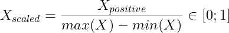

# 功能缩放解释清楚！标准化和规范化

> 原文：<https://medium.com/analytics-vidhya/feature-scaling-clearly-explained-standardisation-normalization-6bc1a200a166?source=collection_archive---------15----------------------->

*为什么您应该扩展您的功能，以及如何做到这一点！*

这就是为什么您应该扩展您的数据！

**特征缩放**是**数据预处理**的重要步骤。大多数机器学习算法**在处理缩放数据**时工作得更好，因为它们使用*距离概念或梯度下降*进行计算。事实上，如果您*不缩放*您的数据，*具有较高值的要素将对基于距离的算法(如 KNN SVM 的线性回归)产生更多影响*...而使用梯度下降的算法会比较慢。

有几种方法可以缩放数据。在本文中，我们将解释两个最常见的方法，**标准化和规范化**是如何工作的，并且我们将用 python 实现它们。

# 正常化

**归一化**通常称为**最小-最大缩放**是缩放特征的最简单方法。标准化的目的是**将每个值限制在 0 和 1 之间。**

如何**归一化**一个特征？首先，**将特性的最小值**减去其值，迫使值为正。

然后你**用**的正值除以**的数值范围**来约束它们在[0；1]

> 正常化可以这样恢复

正常化

# 标准化

**标准化**通常称为 **Z-Score** 不会强制特性处于像*标准化*那样的范围内，但是，所有特性都将遵循**简化的居中正态分布。**

μ=0，σ=1

对于不熟悉这个的人来说，它的意思是我们的值**的**均值μ** 为 0** ，它的**标准差σ为 1。**正态分布有很多有用的性质，如果你不知道它们，[这个](https://www.statisticshowto.com/probability-and-statistics/normal-distributions/#:~:text=Properties%20of%20a%20normal%20distribution,under%20the%20curve%20is%201.)绝对值得一读。

为了标准化您的数据，首先从**移除特性值的平均值**开始。

然后**减少标准偏差。**

std 代表标准偏差

> 可以这样恢复

标准化

其中 *μ是* *的意思是*和 *σ的标准偏差。*

标准偏差

# 使用 Sklearn 实现

让我们*实现我们刚刚在来自 sklearn 库的波士顿数据集上看到的两个缩放方法*。

我们从导入包开始，加载数据集

让我们用 *sklearn 的 [MinMaxScaler](https://scikit-learn.org/stable/modules/generated/sklearn.preprocessing.MinMaxScaler.html) 来**归一化**这个数据集。*

看看所有的值都在 0 和 1 之间！

我们可以使用 *sklearn* 的[标准定标器](https://scikit-learn.org/stable/modules/generated/sklearn.preprocessing.StandardScaler.html)用完全相同的方法来**标准化**数据。

我们可以使用*熊猫库*中的*[*describe()*](https://pandas.pydata.org/pandas-docs/stable/reference/api/pandas.DataFrame.describe.html)函数来检查均值和标准差。*

**

*很好！这就是我们想要的，我们的数据很好地集中和减少。*

# *我们来对比一下数据！*

*如果你不知道哪种缩放方法最适合你的模型，你应该同时运行这两种方法并可视化结果，一个很好的方法是做箱线图。*

**

*经典数据集*

**

*标准化数据集*

**

*标准化数据集*

*我们可以看到，**在特征归一化**之前，*税*变量太大，使得分析其他变量的分布变得困难。一旦**规格化**，每个变量都有一个 1 的**范围，使得它们的比较容易得多。当数据为**归一化**时，变量**的**均值**为** **0** ，它们的**标准差为 1** ，但数值并不局限于【0，1】。
如果你还不确定选择哪一个，规范化是一个很好的默认选择。***

*缩放您的要素可以帮助您进一步可视化，例如，如果您想要拟合套索回归并绘制 [**正则化路径**](/@nicolasmaurer/regularization-path-using-lasso-regression-c450eea9321e) ，您将获得以下内容。*

## *特征缩放前*

**

*无特征缩放的正则化路径*

*看*税*系数怎么远**太影响**！它压倒了所有其他的变量，让我们很难解释这一点。让我们看看标准化后是否一样。*

## *标准化后*

**

*具有特征缩放的正则化路径*

*好多了，对吧？我们现在可以清楚这是怎么回事了。*

# *结论*

*特征缩放是基于距离的算法的必要步骤，它导致更好的结果和可解释的图形。规范化和标准化是最常用的两种技术，但是如果您需要特定的缩放，还有其他的技术。*

# *感谢您的阅读！喜欢这个故事吗？*

*如果要感谢我，喜欢和分享真的很感谢！你可以在 [LinkedIn](https://www.linkedin.com/in/nicolas-maurer-8526a1199/) 上找到我。回头见！*