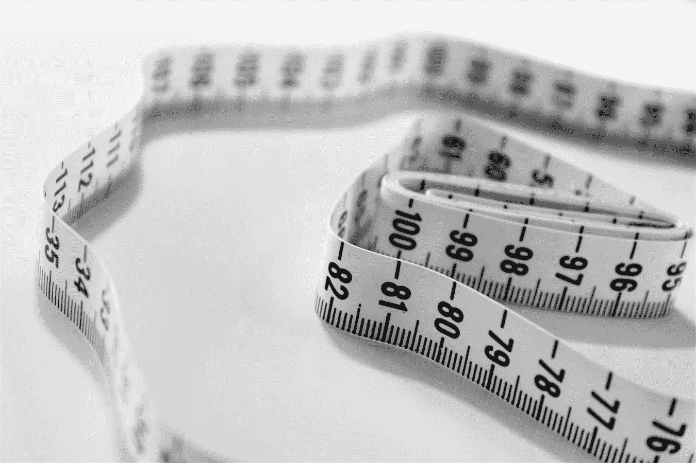

# 无监督学习的特征缩放:为什么？

> 原文：<https://medium.com/analytics-vidhya/feature-scaling-for-unsupervised-learning-why-98ac885a0d51?source=collection_archive---------15----------------------->

## 通过清晰的示例了解为什么特征缩放是构建无监督学习模型的基础部分！

来自 [Unsplash](https://unsplash.com/photos/cixohzDpNIo) 的封面图像。

当处理几乎任何 ***无监督学习*** 问题(任何我们希望聚类或分割我们的数据点的问题)时，**特征缩放是基本步骤**以确保我们得到…