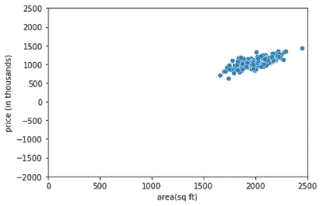
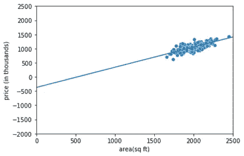
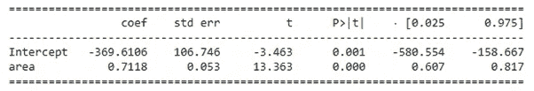
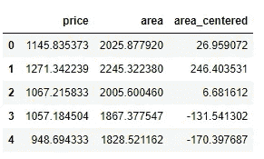
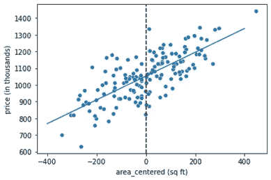
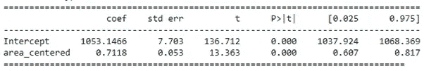

# 机器学习中的特征缩放

> 原文：<https://medium.com/analytics-vidhya/feature-scaling-in-machine-learning-488ca2f10b01?source=collection_archive---------2----------------------->

来自 [Pexels](https://www.pexels.com/photo/crop-dressmaker-with-sewing-pattern-and-ruler-on-paper-7147576/?utm_content=attributionCopyText&utm_medium=referral&utm_source=pexels) 的迈克尔·布伦斯的照片

假设您遇到了一个您所在地区的房价数据集，以及相应的平方英尺面积。作为一名数据爱好者，您希望了解面积和价格之间的关系。

你可能要做的第一件事是创建一个散点图。这是它的样子。

面积和价格散点图

受到您所看到的情况的激励，您现在想要对此数据拟合一条回归线。这是它的样子。

回归线

回归系数

虽然表面上看起来很好，但是稍微仔细观察一下，你会问下面的问题。

1.  -369.6 的截距值真正传达的是什么？

虽然这是不切实际的房子零平方英尺的面积，截距是告诉这样的房子去负 36.9 万美元。那没有任何意义。

2.为什么截距的置信区间如此之大，即-580 到-158，并且标准误差非常高？

从散点图中可以看出，解释变量“面积”上的数据点离零非常远。面积的最小值约为 1700-1800 平方英尺。

根据定义，截距是面积为零时的价格值(一种假设情况)。由于实际上没有 0-1700 平方英尺的数据点可供模型训练，截距变得不稳定。这意味着，如果我们在数据集中增加一些房屋，截距会受到更多波动的影响。因此，从预测的角度来看，使得模型不稳定。

解决这个问题的一种方法是 ***缩放*** 解释变量，即“面积”，在这种情况下，数据点不会远离零聚集。

最简单的方法是从平均面积中减去“面积”的值，从而得出相对于平均值的“面积”值。这里的平均面积约为 2000 平方英尺，所以这就是你的数据看起来的样子。

具有区域中心变量的数据(示例)

“area_centered”的正值表示房子大于 2000 平方英尺，反之亦然。

这是你的散点图，回归线和模型方程现在的样子。

面积居中的回归线和散点图

新模型系数

观察

*   虽然面积系数保持不变，但截距的置信区间现在更窄，标准误差更低
*   截距也是可以解释的，即平均面积的房屋定价为 105.3 万美元

这是一个简单的示例，展示了要素缩放在使您的模型更健壮和更易理解方面的价值。

学分:代码学院

***你在哪里用过特征缩放？***