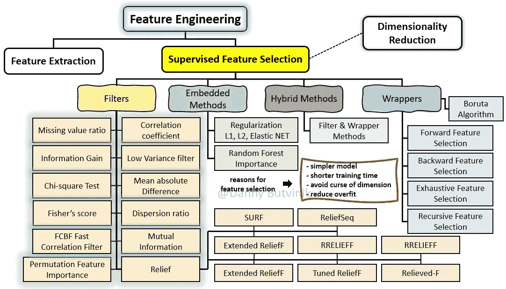

# 功能选择—全面概述

> 原文：<https://medium.com/analytics-vidhya/feature-selection-extended-overview-b58f1d524c1c?source=collection_archive---------0----------------------->

照片由[张秀坤镰刀](https://unsplash.com/@drscythe)在 [Unsplash](https://unsplash.com?utm_source=medium&utm_medium=referral) 上拍摄

# 内容

1.  介绍
2.  什么是特征选择
3.  是什么让某些功能比其他功能更好
4.  通过标签信息进行特征选择
5.  监督特征选择
6.  无监督特征选择
7.  特征选择—数据视角
8.  特征选择算法的特点
9.  特征稳定性
10.  金融犯罪中的特征表征
11.  参考

# 介绍

作为一种降维技术，特征选择旨在通过去除不相关、冗余或有噪声的特征，从原始特征中选择相关特征的一个小子集。特征选择通常可以导致更好的学习性能、更高的学习精度、更低的计算成本和更好的模型可解释性。本文主要关注特性选择过程，并从数据和算法的角度提供了特性选择类型、方法和技术的全面和结构化的概述。

图 1:特性选择的高级分类法

本文主要关注特性选择过程。这个问题很重要，因为数据集中的大量要素(相当于或高于样本数)会导致模型过度拟合，进而导致验证数据集的结果不佳。此外，从包含许多要素的数据集构建模型对计算要求更高。

特征选择基于与目标相关的特征相关性和冗余性的术语。在特征选择中，基于特征冗余和相关性从原始特征集中选择特征子集。基于相关性和冗余特征，特征子集按四种类型分类:

1.  嘈杂且不相关
2.  冗余和弱相关
3.  弱相关和非冗余
4.  非常相关

弱相关特征对于最优子集可能不总是必要的，这可能取决于某些条件。不相关的特性根本没必要包含。

预测精度不需要的特征被称为不相关特征。特征的相关性是基于数据的特征而不是其值来衡量的。统计学是一种显示特征及其重要性之间关系的技术。

冗余特征是那些弱相关的特征，但是可以被一组其他特征完全替换，使得目标分布不受干扰。因此，在多变量情况下(当检查特征子集时)总是检查冗余，而相关性是为单个特征建立的。

不相关和冗余特征的失真不是由于无用信息的存在；这是因为这些特征与其他特征没有统计关系。单独来看，任何功能都可能是不相关的，但当与其他功能结合时，它就是相关的。

对于最佳特征子集，强相关特征总是必要的；它不能在不影响原始条件目标分布的情况下被移除。

> **特征选择的目的是最大化相关性和最小化冗余**

可以在数据预处理中使用特征选择方法来实现有效的数据缩减。这有助于找到准确的数据模型。由于穷举搜索最优特征子集在大多数情况下是不可行的，因此文献中提出了许多搜索策略。特征选择的通常应用是在分类、聚类和回归任务中。

一般来说，特征选择过程可以基于搜索策略和标签信息来分类。

图 2:功能选择类别

# 什么是特征选择

所有机器学习工作流都依赖于特征工程，特征工程包括特征提取和特征选择，这些是现代机器学习管道的基本构建模块。尽管特征提取和特征选择过程有一些重叠，但这些术语经常被错误地等同起来。特征提取是使用领域知识从原始数据中提取新变量的过程，这些变量使机器学习算法能够工作。特征选择过程基于选择最一致、相关和非冗余的特征。

特征选择作为一种数据预处理策略，在为机器学习和模式识别问题准备高维数据方面已经被证明是有效和高效的。

特征选择过程基于从特征向量中选择最一致、最相关和非冗余的特征子集。这不仅减少了训练时间和模型复杂性，而且最终有助于防止过度拟合。

特征选择技术的目标包括:

*   简化模型，使其更容易被研究人员/用户解释
*   更短的培训时间
*   避免维数灾难
*   通过减少过度拟合来增强泛化能力

当代数据集中的大量数据要求开发智能算法来发现重要信息。数据模型的构建取决于数据挖掘任务，但通常是在分类、回归和聚类领域。通常，对数据集进行预处理有两个主要原因:

*   减少数据集的大小，以实现更高效的分析
*   调整数据集，使其最适合所选的分析方法。

如今，数据集规模的缩减变得更加重要，因为研究人员可以随意使用大量开发的分析方法，而平均数据集的规模在特征和样本数量方面都在不断增长。

数据集规模缩减可以通过两种方式之一实现:特征选择或样本集缩减。

图 3:表格数据中特征选择和数据大小缩减的图示

# 是什么使某些要素制图表达优于其他要素制图表达？

不管特征表示的技术方法如何，在大多数机器学习工作流中，有一个常见的问题困扰着数据科学家:是什么使一些特征表示优于其他特征表示？

考虑到现代机器学习问题正在使用领域专家不可能解释的成千上万甚至数百万个特征，这可能看起来是一个疯狂的问题。

虽然我们的目标问题没有简单的答案，但我们可以遵循一些一般原则。通常，要素制图表达中有三个关键的所需属性:

*   解开因果因素
*   易于建模
*   与正规化策略配合良好

基本上，实体表示包括与观察到的数据的潜在原因相对应的特征。更具体地说，本文将表示的质量与结构联系起来，在结构中，不同的特征和方向对应于基础数据集中的不同原因，因此表示可以将一个原因与另一个原因分开。

良好表示的另一个主要指标是建模的简单性。对于给定的机器学习问题/数据集，我们可以找到许多分离潜在因果因素的表示，但它们可能非常难以建模。

固体知识表示的最终质量与正则化策略的结构有关。这是非常重要的，因为机器学习公理，如“没有免费的午餐定理”表明，经常需要正则化来实现知识泛化。从这个角度来看，可用于正则化策略的表示结构不太可能导致泛化。一般来说，特征表示的一些属性，如平滑度、线性度或因果因子，是正则化方法有效性的良好指标。

> 所选要素的结构化和表示方式对于数据质量和利用该数据通过机器学习进行自动决策的能力至关重要。

# 通过标签信息进行特征选择

就标签信息的可用性而言，特征选择技术可以大致分为三类:

监督方法、半监督方法和非监督方法。

标签信息的可用性允许监督特征选择算法有效地选择区别性和相关性特征，以区分来自不同类别的样本。有一些监督特征选择算法可以识别相关特征，以最好地实现监督模型的目标(例如分类或回归问题)，它们依赖于标记数据的可用性。

无监督的特征选择技术忽略目标变量，例如使用相关性移除冗余变量的方法。监督特征选择技术使用目标变量，例如移除不相关变量的方法。

当一小部分数据被标记时，我们可以利用半监督特征选择，它可以利用标记数据和未标记数据。大多数现有的半监督特征选择算法依赖于相似矩阵的构造，并选择那些最适合相似矩阵的特征。由于缺少用于引导鉴别特征搜索的标签，无监督的特征选择被认为是一个非常困难的问题。

# 监督特征选择方法

基于与学习模型的交互，监督特征选择方法被分为四种类型，如过滤器、包装器、混合和嵌入方法。

图 4:监督特征选择方法和技术的扩展分类

过滤方法

在过滤器中，基于统计测量来选择方法特征。它独立于学习算法，需要较少的计算时间。信息增益、卡方检验、Fisher 评分、相关系数和方差阈值是用于理解特征重要性的一些统计度量。

过滤方法使用选定的指标来识别不相关的属性，并从模型中过滤掉冗余的列。它提供了隔离丰富模型的选定度量的选项。在计算特征分数之后，对列进行排序。

通过选择和实现正确的特征，可以潜在地提高分类模型的准确性和效率。

**缺失值比率**

缺失值比率等于缺失值的数量除以观察总数，再乘以每列 100；需要根据阈值做出决策，并丢弃缺失值比率大于该阈值的所有要素。

**信息增益**

从变换中计算熵的减少。它在目标变量的上下文中评估每个变量的信息增益。

**卡方检验**

应用于分类特征；它在每个特征之间进行计算，并选择具有最佳卡方得分的特征。有三个条件:(1)特征必须是分类的(2)独立采样(3)特征的预期频率高于 5。

**费舍尔的得分**

选择特征，使得在由所选特征跨越的数据空间中，不同类别中的样本之间的距离尽可能大，而同一类别中的样本之间的距离尽可能小；高质量的特征应该为同一类中的实例分配相似的值，而为不同类中的实例分配不同的值。

**相关系数**

特征应该与目标相关，但它们之间应该不相关。

**低方差滤波器**

默认情况下，低方差过滤器移除所有零方差(在所有样本中具有相同值)特征。假设方差较高的要素可能包含更多有用的信息。没有考虑特征或特征和目标变量之间的关系，这是这种过滤方法的缺点之一。

**平均绝对差值(MAD)**

MAD 越高，区分力越高。

**色散比**

离差比是算术平均值和几何平均值 AM/GM 之间的比值。更高的色散意味着更高的 AM/GM 值，因此是更相关的特征。

**排列特征重要性**

排列特征重要性是一种模型检验技术，当数据是表格形式时，它可用于任何拟合的估计量。这对于非线性或不透明的估计器尤其有用。置换特征重要性被定义为当单个特征值被随机打乱时模型得分的减少。该过程打破了特征和目标之间的关系，因此模型分数的下降指示了模型对特征的依赖程度。这种技术受益于模型不可知，并且可以用特征的不同排列进行多次计算。

**释放**

Relief 的过滤方法对特征交互非常敏感。它最初是为应用于具有离散或数字特征的二元分类问题而设计的。Relief 为每个特征计算一个特征分数，然后可以应用该分数来对特征选择中得分最高的特征进行排序和选择。

或者，这些分数可以用作特征权重来指导下游建模。地貌特征评分基于最近邻实例对之间特征值差异的识别。如果在具有相同类别的相邻实例对中观察到特征值差异(“命中”)，则特征分数降低。

或者，如果在具有不同类值的相邻实例对中观察到特征值差异(“未命中”)，则特征分数增加。最初的 Relief 算法启发了一系列基于 Relief 的特征选择算法(RBAs)。

阿拉伯国家区域局已经适应

1.  在噪音问题中表现更可靠
2.  推广到多类问题
3.  推广到数值结果(即回归)问题
4.  使它们对不完整的(即缺失的)数据具有鲁棒性

以下是基于起伏的特征选择算法的一些扩展:迭代起伏、I-起伏、调整起伏、VLSReliefF、SURF 和起伏请求。

**迭代卸压**

实现这种方法是为了解决针对非单调特征的偏差。邻居由半径阈值唯一确定，实例根据它们与目标实例的距离进行加权。

**I-RELIEF**

起伏的迭代方法根据与目标实例的距离注入 s 形权重。所有实例对(不仅仅是定义的邻居子集)都对分数更新有贡献。该方法在迭代之间引入局部学习更新以改善收敛性，并被提议作为在线学习变体。

**调谐浮雕**

ReliefF 的调整版本专门用于通过递归消除特征和迭代应用 ReliefF 来处理大特征空间中的噪声。

**超大规模减压装置**

通过对随机特征子集而不是整个特征空间进行评分，显著提高了在非常大的特征空间中检测双向特征交互的效率。

**冲浪**

SURF 基于由训练数据中所有实例对之间的平均距离定义的距目标实例的距离阈值来识别最近邻居(命中和未命中)。结果表明，在 ReliefF 上检测双向上位相互作用的能力有所提高。

**减压量**

ReliefSeq 提出了一个基于特征的自适应 *k* 参数，用于更灵活地检测单变量效应和交互效应。

**基于快速相关的滤波器(FCBF)**

基于快速相关的滤波(FCBF)算法是一种使用“主要相关”思想的滤波方法。它选择与目标变量高度相关的特征，但与其他特征相关性很小。

值得注意的是，这里使用的相关性不是通常使用的典型的 Pearson、Kendall 或 Spearman。它被称为对称不确定性(SU)，它基于信息论，借鉴了香农熵和信息增益的概念。

该算法首先选择由 SU 与类变量相关的高于给定阈值的特征。在这个初始过滤之后，它检测特征与类的主要相关性。该定义是，对于一个主要特征，例如特征 X，没有其他特征比 X 与 y 更相关

方法学

1.  根据不同的标准创建特征组
2.  为每个组创建一个基准
3.  与预定的组基准相比，测试组内特征的相关性
4.  仅保留与组基准相关性较低的特性

# 包装方法

包装器方法将特征集的选择视为一个搜索问题，其中不同的组合被准备、评估并与其他组合进行比较。预测模型用于评估特征的组合并分配模型性能分数。

包装方法的性能取决于分类器。基于分类器的结果选择特征的最佳子集。

由于重复的学习步骤和交叉验证，包装器方法在计算上比过滤器方法更昂贵。但是，这些方法比过滤方法更精确。一些例子是递归特征消除、顺序特征选择算法和遗传算法。

**博鲁塔算法**

对于这个演示，我选择实现 Boruta 算法，用 XGBoost 作为我们的包装器分类器。通过这样做，我们发现它在性能和效率方面更好。分类器试图捕捉可能隐藏在与结果变量相关的数据集中的所有重要和有趣的特征。

方法论(博鲁塔)

1.  创建重复的要素，并在每列中调整它们的值。这些特征被称为阴影特征
2.  在数据集上多次训练分类器(XGBoost ),并在所有迭代中计算所有特征的重要性
3.  对于所有阴影特征，我们基于平均重要性和算法配置参数创建基准。
4.  然后，算法检查你的每一个真实特征，如果它们有更高的重要性。也就是说，该特性的重要性是否大于基准。只保留更大的。

图 Boruta 算法的示意流程

**前进特征选择**

针对目标反复选择性能最佳的特性。接下来，选择另一个与第一个选择的功能相结合可提供最佳性能的功能。构建模型，直到达到预设标准。

**落后特征消除**

选择所有特征，并在每次迭代中移除最不重要的特征，从而提高模型的性能。它用剩余的特征构造下一个模型，直到所有的特征都用完。

**详尽的功能选择**

对每个特征子集的强力评估。这意味着它会尝试所有可能的功能组合，并返回性能最佳的子集。

**递归特征消除**

给定特征的权重估计量(线性模型的系数)，目标是通过递归地考虑较小的特征集来选择特征；训练估计器并获得每个特征的重要性，然后从特征集中删除最不重要的特征。这个过程在修剪集上递归重复，直到达到期望的特征数量。

# 混合方法论

创建混合特征选择方法的过程取决于您选择组合的内容。最重要的是选择你将要使用的方法，然后遵循它们的过程。这里的想法是在第一步中使用这些排名方法来生成一个特性排名列表，然后使用该列表中的前 k 个特性来执行包装器方法。这样，我们可以使用这些基于过滤器的游侠来减少数据集的特征空间，以提高包装器方法的时间复杂度。

# 嵌入式方法

在嵌入式方法中，有集成学习和混合学习方法用于特征选择。由于它有一个集体决策，所以它的性能优于其他两个模型。随机森林就是这样一个例子。它的计算量比包装方法要少。然而，这种方法有一个学习模型特有的缺点。

在嵌入式技术中，特征选择算法被集成为学习算法的一部分。最典型的嵌入式技术是决策树算法。决策树算法在树生长过程的每个递归步骤中选择一个特征，并将样本集分成更小的子集。

**拉索正规化 L1**

将一些系数缩小到零。因此，可以从模型中删除该特征。

**随机森林重要性**

随机森林本质上是根据它们提高节点纯度的程度来排序的，降低了所有树的杂质(基尼杂质)。杂质减少最多的节点出现在树的开始，而杂质减少最少的节点出现在树的结束。因此，通过修剪特定节点下的树，我们可以创建最重要特征的子集。

# 无监督特征选择方法

由于容易获得的标签的稀缺，无监督特征选择方法在高维数据分析中被广泛采用。然而，现有的大多数 UFS 方法主要关注特征在维护数据结构中的重要性，而忽略了特征之间的冗余性。此外，确定特征的适当数量是另一个挑战。

在开发用于未标记数据的自动特征子集选择算法中涉及两个问题:

*   需要结合特征选择找到聚类的数量，以及
*   需要规范关于尺寸的特征选择标准的偏差

基于与学习模型的交互，无监督特征选择方法被分为四种类型，如过滤器、包装器和混合方法。

图 6:无监督特征选择方法和技术的扩展分类

# 过滤方法

基于过滤方法的无监督特征选择方法可以分为单变量和多变量。单变量方法，也称为基于排名的无监督特征选择方法，使用某些标准来评估每个特征，以获得有序的特征排名列表，其中根据该顺序选择最终的特征子集。这种方法可以有效地识别和移除不相关的特征，但是它们不能移除冗余的特征，因为它们没有考虑特征之间可能的依赖性。另一方面，多元过滤方法联合地而不是单独地评估特征的相关性。多元方法可以处理冗余和不相关的特征；因此，在许多情况下，使用由多变量方法选择的特征子集的学习算法所达到的准确度优于使用单变量方法所达到的准确度。

**单变量过滤方法**

在单变量过滤方法中，可以突出两个主要组:

1.  基于信息评估每个特征的相关性的方法
2.  使用对象之间的相似性基于光谱分析来评估特征的方法。

在基于信息的方法中，想法是通过诸如熵、散度、互信息等度量来评估数据的分散程度，以识别数据中的聚类结构。

另一方面，基于光谱分析-相似性的方法，也称为光谱特征选择方法，遵循使用从对象相似性矩阵导出的拉普拉斯或归一化拉普拉斯矩阵的特征系统来建模或识别局部或全局数据结构的思想。

**信息化手段**

无监督数据的顺序反向选择方法

SUD 是一种过滤方法，它使用基于距离的相似性熵的度量来对特征进行加权，相似性熵被定义为从相似性矩阵导出的总熵，其中该矩阵的元素包含数据集中对象对之间的相似性。这个想法是基于这样一个事实来测量数据的熵，即当每对对象都非常接近或非常远时，熵很低，如果每对对象之间的大部分距离接近平均距离，熵就很高。因此，如果数据具有低熵，则存在定义良好的聚类结构，而当熵高时则不存在。每个特征的相关性使用留一顺序向后策略结合上述熵度量来量化。最终结果是从最相关到最不相关的特征排序的特征排名。

奇异值分解熵

中心思想是选择那些最能代表数据的特征，通过奇异值测量原始数据矩阵的熵。该熵在 0 和 1 之间变化，以这样的方式，当熵低(接近于 0)时，生成结构良好的聚类，因为数据矩阵的频谱不是均匀分布的；

熵高时，光谱分布均匀，团簇结构不分明。通过留一比较，评估每个特征对熵(CE)的贡献，并根据它们各自的 CE 值对特征进行排序。

表征熵

该方法使用信息论对特征进行排序。目的是使用表示熵的概念来衡量每个特征。表示熵是对数据集中信息压缩的一种度量，它是通过数据协方差矩阵的特征值的熵来计算的。表示熵的范围从 0 到 1，其中 1 表示最大压缩，0 表示最小压缩。

**基于光谱相似性的方法**

拉普拉斯得分

在基于光谱特征选择的无监督特征选择方法中，最常用和最相关的单变量滤波器之一是拉普拉斯得分。在拉普拉斯得分中，特征的重要性通过其方差和其局部保持能力来评估。该方法将高权重分配给最能保持由拉普拉斯矩阵表示的预定义图结构的那些特征。这个想法来自于这样的观察:如果两个物体彼此靠近，那么它们很可能与同一个集群相关；以这种方式，那些对近处物体取相似值而对远处物体取不同值的特征是最相关的。

**频谱分解**

***SPEC*** 通过一个特征与由对象间的相似性导出的图的结构的一致性来评估该特征的相关性。该方法包括三个步骤:(1)建立目标相似矩阵及其图形表示；(2)通过测量每个特征和拉普拉斯矩阵的那些非平凡特征向量之间的一致性，使用图的特征系统来评估特征。以及(3)根据特征的相关性和一致性以降序对特征进行排序。实际上，SPEC 是拉普拉斯得分的推广。

**无监督光谱特征选择** n

应用于混合数据的无监督光谱特征选择方法。它通过分析归一化拉普拉斯矩阵的第一个非平凡特征值的频谱分布(频谱间隙)的变化来评估特征，当每个特征分别从整个特征集中排除时。要素根据其各自的光谱间隙值按降序排序。

**多元滤波方法**

多元滤波方法可分为以下三大类:统计/信息、生物启发和基于光谱/稀疏学习的方法。

统计/信息组包括无监督的特征选择方法，这些方法使用统计和/或信息理论测量(例如方差-协方差、线性相关、熵、互信息等)来执行选择。

生物启发组包括无监督的特征选择方法，该方法使用基于群体智能范例的随机搜索策略来寻找满足某种质量标准的良好特征子集。

光谱/稀疏学习组包括基于光谱分析或光谱分析和稀疏学习的组合的无监督特征选择方法。这组方法有时被认为是嵌入式方法，因为特征选择是作为学习过程的一部分来实现的，通常通过约束回归模型的优化来实现。但是嵌入式方法也可以被认为是过滤器、包装器和混合方法的一个子类。

统计/信息小组

使用特征相似度的特征选择

*方法引入了依赖/相似度的统计度量来减少特征冗余；这种被称为最大信息压缩指数(MICI)的度量是基于特征之间的方差-协方差。这种方法的思想是将原始特征集合划分成簇，使得同一簇中的特征高度相似，而不同簇中的特征不相似。特征聚类是基于 kNN 原理迭代完成的，如下所示:在每次迭代中，FSFS 计算每个特征的 k-最近特征(使用 MICI)。然后，选择具有 k 个最近特征的最紧凑子集的特征(由 k 个最近特征中到其最远特征的距离确定)，并丢弃其 k 个最近特征。对剩余的特征重复该过程，直到它们全部被拾取或丢弃。*

*相关冗余特征选择*

**是一种有监督/无监督的特征选择方法，分两步选择特征。首先，根据相关性度量(无监督版本的方差和有监督版本的 Fisher 比率或互信息)对特征进行分类。然后，在第二步中，按照前一步中生成的顺序，使用特征相似性度量来评估特征，以量化它们之间的冗余。之后，选择具有最低冗余度的前 p 个特征。**

**最大投影和最小冗余**

*****MPMR*** 是一种基于最大投影和最小冗余准则的无监督特征选择方法。核心思想是选择一个特征子集，使得所有原始特征以最小重建误差投影到特征子空间(应用线性变换),同时旨在保持低冗余度，这是一个用于量化特征间冗余度的术语，通过添加皮尔逊相关系数来估计冗余率。**

****基于信息****

**在基于信息的方法中，基本思想是使用基于距离的相似性熵来选择特征。**

****最小依赖度****

**最小相关性是一种基于多元统计的过滤方法，其目的是使用最小化特征相关性的概念来移除冗余特征。想法是通过选择一组系数来找到独立特征(相关的),使得特征的线性相关性(由误差向量 E 表示)可以接近于零。在每次迭代中，具有最大绝对系数的特征被移除，并且其移除的效果被更新。重复这个过程，直到所有剩余的误差向量 E 都小于用户固定的阈值。**

**生物启发的方法**

**基于蚁群优化的无监督特征选择**

***UFSACO 的主要目标是选择特征间相似度低(冗余度低)的特征子集。在这种情况下，搜索空间被表示为完全无向图，其中节点表示特征，边的权重表示特征之间的相似性。使用余弦相似度函数来计算该相似度。其思想是，如果两个特征相似，那么这些特征就是多余的。图中的每个节点都有一个称为信息素的期望值，信息素由代理(蚂蚁)根据其当前值、预先指定的衰减率和代理选择给定特征的次数来更新。代理迭代地遍历图，优先选择高信息素值和低相似度，直到达到预先指定的停止标准(迭代次数)。最后，选择具有最高信息素值的那些特征。因此，期望挑选具有低冗余的特征子集。***

***基于蚁群优化的微阵列基因选择和基于蚁群优化的关联冗余特征选择***

***在 ***MGSACO*** 和 ***RR-FSACO*** 中，除了像 UFSACO 方法中那样量化特征冗余度之外，它们还通过其方差来度量每个特征的相关性。因此，所有这些方法的主要目标是选择最小化冗余同时最大化相关性的特征。***

**光谱/稀疏学习方法**

**一些基于光谱分析的多元方法源自 ***规格*** 和拉普拉斯得分。**

**最小冗余光谱特征选择**

**在 ***中，mR-SP*** 结合了规范排序和最小冗余最优性标准。该方法的基本思想是在 SPEC 中增加一种控制特征冗余的方法，通过引入一个评价指标，用一个修正的余弦相似度函数来量化每对特征的相似度。**

**基于拉普拉斯线性判别分析的递归特征消除**

*****LLDA-RFE*** 方法利用物体间的相似性，将线性判别分析(LDA)扩展到无监督的情况；这个延伸被称为 LLDA。其思想是递归地移除具有 LLDA 鉴别矢量的最小绝对值的特征，以识别潜在地揭示样本中的聚类的特征。LLDA-RFE 与拉普拉斯得分密切相关；主要区别在于 LLDA-RFE 是一种多变量方法，它允许选择组合起来有助于区分的特征。**

**多聚类特征选择**

***由三个步骤组成:(1)谱分析，(2)稀疏系数学习，(3)特征选择。第一步，对数据集进行光谱分析，以检测数据的聚类结构。然后，在第二步中，由于数据的嵌入聚类结构是已知的，通过拉普拉斯矩阵的前 k 个特征向量，MCFS 通过具有 L1 范数正则化的回归模型来测量特征的重要性。在第三步中，在解决回归问题之后，MCFS 基于通过回归问题获得的系数的最高绝对值来选择 d 个特征。***

***最小化光谱特征选择的特征冗余***

*****对所有特征一起进行评估，以消除冗余特征。其思想是将特征选择问题公式化为多输出回归问题，并且通过应用范数 L2 而不是 L1 范数来加强稀疏性来执行选择。*****

***无监督鉴别特征选择算法***

******UDFS*** 通过同时利用包含在散布矩阵和特征相关性中的区别信息来执行特征选择。该方法提出解决特征选择问题，考虑回归问题中的轨迹标准。此外，UDFS 增加了一些额外的限制回归问题，并提出了一个有效的算法来优化它。UDFS 根据相应的权重值以降序对每个特征进行排序，并选择排序最高的特征。***

**联合嵌入学习和稀疏回归**

****非负鉴别特征选择****

*******NDFS*** 像 ***UDFS*** 和 ***MRFS*** ，在一个统一的框架内利用鉴别信息和特征相关性进行特征选择。首先，NDFS 使用频谱分析来学习伪类标签(定义为非负实值)。然后，回归模型正则化是制定和优化通过一个特殊的解决方案也提出了这项工作。NDFS 和 UDFS 的主要区别在于 NDFS 给回归问题增加了一个非负约束，因为去掉这个约束 NDFS 就变成了 UDFS。****

****稀疏低冗余特征子集****

*****FSLR 采用谱分析在较低的维度上表示数据，并在具有非负约束的目标函数中引入新的正则化项。*****

*****结构化最优图特征选择*****

********SOGFS*** 同时进行特征选择和局部结构学习，这是提出来的。通过在基于损失函数和正则化的最小化的稀疏优化模型中引入相似矩阵，SOGFS 自适应地学习局部流形结构。一旦所提出的模型被优化，就根据相应的权重来选择特征。*****

****聚类引导的稀疏结构学习****

*******CGSSL*** 是一种通用的特征选择方法，联合利用了非负谱分析和具有稀疏性的结构学习。其思想是在线性模型中使用聚类指示符(通过非负谱聚类学习)来为结构学习提供标签信息。****

****鲁棒的无监督特征选择****

*******RUFS*** 的目标是实现健壮的聚类和健壮的特征选择。不同于上面提到的无监督特征选择方法，例如 MCFS、UDFS 和 NDFS，RUFS 通过局部学习正则化鲁棒非负矩阵分解来学习伪聚类标签。****

****基于矩阵分解的鲁棒无监督特征选择****

*******RUFSM*** 通过同时执行区别特征选择和鲁棒聚类来选择特征。RUFS 和 RUFSM 的主要区别在于，后者使用聚类中心作为客观概念，而不是数据的伪标签。****

****用于无监督特征选择的正则化自表示模型****

*******RSR*** 反映了这样一种思想，如果一个特征很重要，那么它将参与其他大多数特征的表征。通过最小化残差表征的自表示误差来完成特征选择，并且选择最有代表性的特征(具有高特征权重的那些)。****

****保持结构的非负特征自我表征****

*******SPNFSR*** 方法通过优化模型，兼顾了特征的自我表示和结构保持能力。这种方法的总体思想是优化一个模型(目标函数)时考虑三个方面:(1)自我表征的特征；(2)使用基于图的范数正则化项的原始数据的局部流形几何结构；3)反映每个特征重要性的正则项 W。优化问题通过高效的迭代算法求解。在最后阶段，根据对应的 W 值以降序对每个特征进行排序，并选择排名前 p 的特征。****

****局部线性嵌入****

*****是稀疏学习模型中的一组非凸稀疏正则化函数。其思想是通过基于 LLE 图而不是典型的两两相似矩阵和结构正则化项来表征内在的局部几何特征。对于每个特征，定义基于 LLE 图的特征级重建分数，并根据该分数选择最终的特征子集。*****

# *****包装方法*****

*****基于包装器方法的无监督特征选择方法可以分为三大类*****

*****根据特征搜索策略:顺序、生物启发和迭代。在顺序方法中，按顺序添加或删除功能。基于顺序搜索的方法易于实现且速度快。*****

*****另一方面，生物启发方法试图将随机性纳入搜索过程，旨在摆脱局部最优。*****

*****迭代方法通过将无监督的特征选择问题转换为估计问题来解决，从而避免了组合搜索。*****

*****包装器方法使用特定聚类算法的结果来评估特征子集。在这种方法下开发的方法的特征在于找到有助于提高用于选择的聚类算法的结果质量的特征子集。然而，包装器方法的主要缺点是它们通常具有高计算成本，并且它们被限制为与特定的聚类算法结合使用。*****

*******顺序方法*******

*****最大概似法*****

*****评估了两个特征选择准则:最大似然准则和分散可分性准则。该方法搜索特征子集的空间，如下评估每个候选子集:首先，对每个候选子集描述的数据应用期望最大化(EM)或 KMeans 聚类算法。然后，使用 ML 或 T 可分性标准评估获得的聚类。该方法使用前向选择搜索来生成将如上所述被评估的特征子集。当所用标准值的变化小于给定阈值时，该方法结束。*****

*****蛛网分类效用*****

*****这种方法基于一种称为类别效用的度量，用于度量由 ***蛛网*** 层次聚类算法发现的聚类的质量。该方法使用两种搜索策略生成特征子集:前向选择和后向排除。通过使用由搜索策略生成的特征子集运行蛛网算法并评估该特征子集的类别效用来执行特征选择。当在向后或向前选择中不能获得更高的类别效用分数时，该过程结束。*****

****简化的轮廓顺序向前选择****

*******SS-SFS*** 方法根据简化的轮廓标准选择提供最佳质量的特征子集。****

****在这种方法中，前向选择搜索用于生成特征子集。每个特征子集用于使用 k-means 聚类算法对数据进行聚类，并且通过用简化的轮廓标准测量的聚类质量来评估特征子集的质量。在前向选择中产生该标准的最佳值的特征子集被选择。****

******仿生方法******

****进化局部选择算法****

*******ELSA*** 方法基于 KMeans 和高斯混合聚类算法搜索特征子集和聚类数。聚类算法提供的每个解决方案都与一个向量相关联，该向量的元素表示评估标准的质量，该评估标准基于聚类的内聚性、类间分离和最大似然性。选择在评估阶段优化目标函数的那些特征。****

****多目标遗传算法****

*******MOGA*** 方法提出一种多目标适应度函数，使类内距离(均匀性)最小化，类间距离(分离性)最大化。每个染色体代表一个解，它由一组由特征子集描述的 k 个聚类质心(连续特征的聚类中心和分类特征的聚类模式)组成。用于每个染色体中每个质心的特征的数量是随机生成的，并且初始种群中染色体的聚类中心和聚类模式分别通过生成随机数和来自相同特征域的特征值来创建。然后，为了重新分配聚类质心，MOGA 使用 k-prototypes 聚类算法，该算法从上一步生成的初始种群中获取输入。之后，应用交叉、变异和替换操作符，并重复该过程，直到满足预先指定的停止标准。在最后阶段，该方法返回与它们产生的聚类一起优化适应度函数的特征子集。****

******迭代方法******

****特征显著性****

****其思想是估计一组称为特征显著性(每个特征一个)的权重([ 0-1]中的实际值),以量化每个特征的相关性。这种估计是通过为该任务导出的修改的 EM 算法来执行的。该方法返回对组件(聚类)建模的密度函数的参数，以及特征显著性值的集合。然后，用户可以考虑那些最能区分不同组件的特征显著性(具有最高值的那些)。****

****基于局部学习的聚类****

*******LLC*** 框架制定了最终的岭回归模型。通过将二元特征选择向量τ引入模型的局部判别函数来完成特征选择。最终，在收敛之后，输出是向量τ以及离散化的聚类指示符矩阵。****

****嵌入式无监督特征选择****

*******EUFS*** 方法通过稀疏学习将特征选择直接嵌入到聚类算法中。在该方法中，非凸稀疏回归模型使用基于 L2 范数的损失函数，并通过交替方向乘子法(ADMM)进行优化。EUFS 使用 KMeans 聚类算法来初始化最终模型中的伪聚类指示矩阵 U 和潜在特征矩阵 V(用于指示特征权重)。一旦模型收敛，输出是根据潜在特征矩阵的最终值以及伪聚类指示符排序的特征排名。****

****依赖引导的无监督特征选择****

*******DGUFS*** 方法使用约束模型同时执行特征选择和聚类。使用基于迭代交替方向乘子法(ADMM)的改进算法来优化该模型。****

****高斯混合模型****

****在 GMM 的想法是应用特征选择和聚类同时进行，使用高斯混合模型。目标是通过期望最大化聚类算法优化高斯混合模型，其中该算法的最大化步骤被重新表述为 L1 约束套索问题。该方法返回聚类以及模型的系数；系数表示每个特征的相关性。****

# ****混合方法论****

****混合方法试图利用过滤器和包装器这两种方法的质量，试图在效率(计算工作量)和有效性(使用所选特征时相关目标任务的质量)之间取得良好的折衷。****

****为了利用过滤器和包装器方法，混合方法，在过滤器阶段，应用基于数据的内在属性的测量来对特征进行排序或选择。而在包装阶段，通过特定的聚类算法，评估某些特征子集以找到最佳特征子集。我们可以区分两种类型的混合方法:基于排序的方法和不基于特征排序的方法。****

****值得注意的是，在文献中，一些混合无监督特征选择方法像(Jashki et al . 2009 胡等 2009；杨等；Yu 2011)提出了专门用于处理特定领域的数据。****

****模糊评价指数****

****在*方法中，指数熵测度结合模糊评价指标分别用于特征排序和特征子集选择。该方法采用顺序搜索，基于生成的排名考虑特征子集，并使用模糊评价指数作为质量度量。在包装阶段，为了选择甚至更小的特征子集，使用模糊 c 均值算法和分散可分性准则来选择特征的紧凑子集。*****

*****卡林斯基-哈拉巴斯指数*****

*****在该方法中，光谱特征选择与 Calinski-Harabasz 指数相结合，用于选择相关的特征子集。特征选择分为两个阶段:(1)特征排序和(2)特征子集选择。在第一阶段，想法是识别那些保持数据结构的特征，为每个特征计算拉普拉斯得分。这产生了特征排名。之后，在第二阶段中，利用前一阶段中生成的排序并使用前向或后向选择搜索，通过被称为加权归一化卡林斯基-哈拉巴斯指数(WNCH)的经修改的内部评估指数来评估特征子集。选择具有最高 WNCH 值的特征子集。*****

*****贝叶斯过滤方法*****

******BFK 是一种结合了 KMeans 和贝叶斯过滤器的无偏差排序方法。与上面提到的所有混合方法不同，这种方法从包装器阶段开始，通过对具有用户指定的聚类范围的数据集运行 KMeans 聚类算法。使用简化的轮廓标准评估聚类，并选择具有最高值的聚类。随后，在过滤阶段，使用马尔可夫毯的概念，通过贝叶斯网络选择特征子集，其中每个聚类代表一个类，节点代表特征，边代表特征之间的关系。******

*****使用顺序前向选择的最小二乘估计*****

*****LSE-SFS 是一种非基于排序的方法，它去除了不相关的和冗余的特征。该方法分两步进行特征选择:在第一步中，通过应用基于最小二乘估计 LSE 的评估来建立特征子集。第二步只对第一步中识别的那些特征起作用，并且通过使用顺序正向选择搜索使聚类性能最大化的最佳特征子集(使用 EM 聚类算法的修改版本)。*****

*****熵度量*****

*****该方法是基于熵测量的第一等级无监督混合特征选择方法之一，其中过滤器阶段与内部散射可分离性标准(包装阶段)结合。在过滤阶段，从整个特征集中逐个去除每个特征，并计算去除特征后在数据集中产生的熵。这将根据每个要素从整个要素集中移除时产生的无序程度生成一个要素排序列表。一旦所有的特征都被分类，在包装阶段，前向选择搜索与 k-means 聚类算法被联合应用以构建使用分散可分性标准评估的聚类。该方法选择达到可分性标准的最高值的特征子集。*****

# *****特征选择—数据视角*****

**********

*****图 7:特征选择——数据透视图*****

*****大数据对传统的特征选择任务提出了挑战。*****

*******流数据和功能*******

*****流数据和特征在现实世界的应用中已经变得更加普遍。这对传统的特征选择算法提出了重大挑战，传统的特征选择算法假设静态数据集具有固定的特征。当新数据或新特征到达时，应用传统的批处理模式特征选择算法在每一轮寻找相关特征是不切实际的。此外，体积数据有时可能太大而不能通过单次数据扫描直接加载到存储器中。当第二通行证不可用或非常昂贵时，这尤其是个问题。因此，以流的方式应用要素选择来动态维护到该点为止看到的所有要素和数据中的最佳要素集更有吸引力。*****

*****基于特征流的特征选择算法*****

1.  *****监督嫁接算法(帕金斯和蒂勒，2003 年)*****
2.  *****监督阿尔法投资算法(周等。艾尔。, 2005)*****
3.  *****有监督的在线流特征选择算法(Wu et .艾尔。, 2010, 2013)*****
4.  *****具有组结构的监督流特征选择(Wang et .艾尔。，2013，李等。艾尔。, 2013)*****
5.  *****社交媒体中的无监督流特征选择(李等。艾尔。, 2015)*****

*****数据流的特征选择算法*****

1.  *****监督在线特征选择(王等。艾尔。, 2014)*****
2.  *****数据流上的无监督特征选择(黄等。艾尔。, 2015)*****

*******异构数据*******

*****大多数现有的特征选择算法是为处理单一数据源的任务而设计的，并且总是假设数据是独立同分布的。然而，多源数据在许多领域非常普遍。例如，在社交媒体或金融犯罪领域，数据来自不同的来源，如表格数据、文本、图像、标签。*****

**********

*****图 8:多源数据与多视图数据特征选择*****

*****多视图数据中的特征选择算法*****

1.  *****自适应多视图无监督特征选择(冯等，2013)*****
2.  *****多视图数据的无监督特征选择(Tang et .艾尔。, 2013)*****
3.  *****通过结构化稀疏进行多视图聚类和特征学习(Wang et .艾尔。, 2013)*****

*****此外，关联数据无处不在，并以各种形式出现，如用户-帖子关系和用户-用户关系。多个数据源的可用性带来了前所未有的机会，因为我们可以利用共享的内在特征和相关性来找到更多相关的特征。然而，额外的数据源也无疑带来了挑战。例如，随着链接信息的存在，在大多数机器学习算法中广泛采用的 i.i.d .假设不成立。如何恰当地利用链接信息进行特征选择仍然是一个具有挑战性的问题。*****

*******特征间的结构*******

*****有时，在许多实际应用中，特征可以表现出某些类型的结构。特征中一些众所周知的结构是组结构、树结构、图结构等。当执行特征选择时，如果不考虑特征结构，则可能无法捕获内在依赖性，并且所选择的特征可能不适合数据。结合特征结构的先验知识有助于选择相关特征，从而大大提高学习性能。*****

**********

*****图 9:传统特征选择方法的分类*****

# *****特征选择算法的特点*****

*****特征选择算法的目的是根据相关性的定义来识别相关的特征。然而，机器学习中的相关性的概念还没有在一个共同的协议上被严格定义。相关性的主要定义是与目标相关的概念。*****

*****在描述特征选择算法的文献中有几个考虑因素。因为它们，可以将这种表征描述为假设空间中的搜索问题，如下所示:*****

*   *****搜索组织:探索假设空间的一般策略*****
*   *****后继者的生成:提出当前假设的可能变体(后继者候选)的机制*****
*   *****评估标准:评估继任候选人的功能，允许比较不同的假设以指导搜索过程。*****

**********

*****图 10:特征选择算法的特征*****

*******搜索组织*******

*****这个策略是关于他们的总数的那部分假设。搜索过程只检查搜索空间的一部分。当一个特定的状态必须被访问时，该算法使用先前访问过的状态的信息，并最终使用关于未被访问的状态的启发式知识。*****

*****一代接班人*****

*****可以考虑多达五种不同的运算符来生成每个状态的后继:前进、后退、复合、加权和随机。*****

*****向前*****

*****该运算符将尚未选择的功能添加到当前解决方案中。在每一步中，使评估度量更大的特征被添加到解决方案中。*****

*****向后的*****

*****该运算符从当前解决方案中移除尚未移除的要素。*****

*****在每一步中，使评估度量更大的特征被从解决方案中移除。*****

*****复合的*****

*****这个策略的想法很简单:应用 N 个连续的前进步骤和 K 个连续的后退步骤。
如果 N > K，则净结果是向前运算符，否则是向后运算符。一种有趣的方法是执行向前或向后的步骤，这取决于评估度量的相应值。这允许在特性之间发现新的交互。*****

*****额外的*****

*****在加权算子中，搜索空间是连续的，并且所有特征在一定程度上都存在于解中。继承状态是具有不同权重的状态。这通常是通过对可用的实例集进行迭代采样来完成的。*****

*****随意*****

*****这一组包括那些可能在一个步骤中生成任何其他状态的操作符。其余的操作符也可以具有随机成分，但是它们被限制于在特征的数量上或在每一步改进测量评估测量的一些“进步”标准。*****

*******评估措施*******

*****有几种方法可以评估一个特征子集的优劣。可以清楚地观察到，特征的相关性仅仅是该度量的函数，而不是特征本身的特性。另一个重要的考虑因素是，评价措施的范围和规模并不重要。重要的是分配给不同子集的相对值反映了它们与目标函数的或大或小的相关性。在审查的措施，概率和类间距离，连同一致性，是类可分性的措施。此外，类间距离、一致性、熵和误差概率的估计可能不需要概率分布的显式建模。*****

*****误差概率*****

*****假设最终目标是构建一个分类器，能够正确标记由*****

*****同样的概率分布，最小化分类器的(贝叶斯)概率误差似乎是最多的*****

*****自然选择。因此，它也是评估措施的明确选择。*****

*****发散度*****

*****这些度量计算类别条件概率密度之间的概率距离或散度(Chernoff，Bhattacharyya，Kullback-Leibler，Kolmogorov-Smirnov，Matusita，Patrick-Fisher)*****

*****依赖*****

*****这些度量量化了两个特征彼此关联的程度，也就是说，知道一个特征的值就有可能预测另一个特征的值。在特征选择的上下文中，特征预测类越好，对该特征的评估就越好。相关系数是一种经典的测量方法，至今仍有应用。*****

*****一个稍微不同的方法是估计类条件密度和无条件密度之间的差异。任何未加权的概率距离度量都服务于这个目的。*****

*****组间距离*****

*****这些度量是基于这样的假设，即不同类的实例在实例空间中相距很远。最常见的距离属于欧几里得距离。这些测量不需要任何密度函数的建模，但是它们与误差概率的关系可以非常松散。*****

*****信息还是不确定性*****

*****类似于概率相关性，我们可以观察一个实例，并计算后验概率，以确定对于其先验概率，已经获得了关于该类实例的多少信息。如果所有类别的概率大致相等，那么信息增益最小，不确定性(熵)最大。从 Shannon 熵推广为 Rényi 熵和α度熵导出的测度。熵也可以在不知道密度的情况下使用，如在决策树的归纳中所做的那样，其中信息增益通常是为归纳过程中的每个特征独立计算的。*****

*****一致性*****

*****X 和 Y 中的不一致被定义为当仅考虑 X 中的特征时 Y 中的两个实例相等并且属于不同的类。因此，目标是找到导致零不一致性的最小特征子集。*****

# *****特征稳定性*****

*****稳定性措施*****

*****特征稳定性表示特征选择方法的再现能力。我们可以说，如果多个特征选择过程*同意*该特征重要，则该特征具有高稳定性，而当多个特征选择过程*不同意*该特征重要时，该特征具有低稳定性。*****

********

****图 11:特征选择算法的稳定性度量****

****指数稳定性****

****所选择的特征子集被表示为大小为 m 的二进制向量，其中 0 表示该特征不存在，1 表示该特征存在。稳定性通过所选要素的整个子集之间的重叠量来计算。****

****等级稳定性****

****评估特征之间的相关性以量化使用特征排序的特征选择方法的稳定性。这些方法的主要缺点是它们不能处理具有不同基数的要素子集。****

****重量稳定性****

****这些度量在计算特征选择算法的鲁棒性时考虑了特征集 *f* 的权重。它采用数据集内完整特征集的两组权重 Wi 和 Wj，并返回它们之间的相关性作为稳定性。这些方法的主要缺点是它们不能处理不同大小的特征子集。****

******不稳定的解决方案******

****特征信息策略****

****特征信息策略基于一些评估标准来测量每个特征的重要性，如类变量的精确测量。然后从这些非常重要的特征中选择稳定的特征。****

****特征相关性****

****特征相关度计算特征之间的连接。协方差-lasso (C-LASSO)在要素协方差矩阵的帮助下计算要素之间的相似性。它解决了 L1 规范的不稳定性。****

****样本加权****

****该技术背后的主要思想是基于样本对特征相关性的影响，给每个样本分配不同的权重。特征相关性的局部轮廓用于测量每个样本的影响。然后特征选择算法在加权训练集上进行训练。****

****参数最优化****

****为了解决不稳定问题，在参数优化过程中使用了特征选择方法。其思想是选择一组有效的参数来优化当前的优化过程。用平方误差函数研究的非线性回归模型和用交叉熵误差函数研究的 logistic 回归模型。****

****密集搜索方法****

****密集搜索方法包括并行搜索策略和遗传算法(GA)。大多数搜索过程都卡在可能不同的局部最大值，因此，不同的搜索技术通过在每个决策点考虑大多数候选掩码来增加搜索范围，从而提高稳定性。在 GA 中，初始元素是长度为 *N* 的二进制向量，包含 0 或 1。通过复制最高性能的变量产生一组强有力的特征。这个过程一直持续到获得搜索问题的最佳特征集。****

****群组特征选择****

****这种技术背后的核心原理是对高维数据集中存在的高度相关的特征进行分组，这些特征对训练样本的变化具有抵抗力。如果将这一群体视为一个单一的实体，可以提高选择过程的稳定性。****

****组特征选择中有两个关键特征:****

*   ****特征组生成-识别相关特征组。这可以通过知识驱动的方法或数据驱动的方法来完成。知识驱动的方法需要深入的领域知识来形成组，而数据驱动的方法使用包含在输入数据中的信息来形成组。****
*   ****特征组转换:生成特征组的透明图片****

****数据驱动的组生成****

****数据驱动的组生成使用聚类分析或密度估计来识别一组要素。他们不依赖生物学领域的知识，而是根据输入数据中包含的信息来分组。****

****集成特征选择****

****集成学习技术基于集体智慧的概念，其中大量的信息来源(人、数据库、字典等)。)集体把知识结合起来。集成学习范式有效地产生了一个鲁棒和准确的学习解决方案。基于 bootstrap 聚合的集成学习技术从原始数据集的随机子样本中构建，该聚合取若干学习技术的平均值。不稳定性的整体解决方案有助于稳定过程。它将稳定性考虑纳入算法的设计阶段。****

****数据扰动****

****递归特征消除方法通过迭代地消除影响最小的特征来对样本进行分类。性能基准测试是通过精度、召回率和 F 值来完成的。交叉验证通常用于误差估计，但当应用于小规模数据时，它会显示较大的方差，因此，它会在结果中产生歧义。****

****函数扰动****

****在函数扰动中，对同一输入数据集中不同要素选择器的结果进行平均会得到最终结果。不同的特征选择技术、实例级扰动、特征级扰动、特征选择器中的随机性等。在特性选择器中加入变化。加权投票可用于聚合不同的选择技术。****

****没有明显的赢家****

****这场竞赛没有明显的赢家，这并不奇怪。此外，如果您试图计算几个稳定性度量，您可能会发现结果不稳定。这意味着您可能会得到不同的稳定性分值，这实际上可能会让您感到困惑，而不是帮助您决定最终选择的最佳特性集。因此，像任何其他机器学习问题一样，它需要一些经验、判断和常识。****

****增加过程稳定性****

****正确选择功能本身并不容易。在此基础上增加特性稳定性的维度并不会使它变得更容易。然而，值得注意的不仅是提供最佳模型得分的不同类型的特征选择策略，还有具有强稳定性得分的特征。我见过不止一个项目对后预测过程进行监控，以评估被选中的特性在很长一段时间内的表现。随着时间的推移添加过程稳定性度量可能会揭示更多的细节，并给出一个更好的反馈循环，以便在您的下一次迭代中执行更好的特性选择。****

# ****金融犯罪领域的特征表征****

****数据科学和机器学习中的一些很好的活跃研究是在特征选择和特征表示中。这些步骤对于任何机器学习系统的实现都是至关重要的，尤其是在金融犯罪领域。在欺诈检测等应用领域，多样化、高维、稀疏和混合型数据使得这些任务变得更加复杂。****

****在不依赖领域知识的情况下，从高维数据中选择正确的特征集来诱导精确的分类模型是一个艰巨的计算挑战。这几乎是一个 NP-hard 问题，因为随着特征数量的增加，特征的组合呈指数级增加。****

****不幸的是，在数据挖掘和金融犯罪领域，一些数据是由一长串特征描述的。过去已经提出了许多特征子集选择算法，但是并不是所有的算法都是有效的。因为似乎永远都要使用蛮力来穷尽地尝试每一种可能的特性组合，所以随机优化可能是一种解决方案。****

****因此，财务数据的特定于时间和上下文的性质需要领域专业知识来正确地设计功能，同时最大限度地减少任何潜在的信息丢失。此外，在金融犯罪领域没有行业标准。这使得开发特征提取和特征选择的过程极其困难。尤其是在为机器学习模型定义目标函数时。****

****各种领域中最常见的度量标准都包含欧几里德距离，这对空间几何数据很有意义。这在图像处理、计算机视觉、农业、医疗保健、信号处理等领域有着广泛的应用。****

****金融犯罪特征空间向量不能被投影到几何平面中，因为它们不包含任何底层逻辑。问题是，应该如何定义两个金融交易之间的距离(两个高维、混合类型的向量)****

****有必要在设计和学习特性时应用领域知识:****

1.  ****除了简单的、原始的、具有绝对值的自我代表特征之外，提取复杂的指示特征。在更复杂的情况下，当分类值包含有关金融业务本质的潜在信息时，距离度量必须定义为反映交易真实环境的方式。人类的大脑可以对生活中的许多事情做出假设，例如评估时间、距离、比较本体。是因为人类的智能可以理解上下文。机器还不能。这就是为什么如果没有业务或产品分析师与数据科学家和机器学习工程师协同工作，金融犯罪中的特征工程过程是不可能的。****
2.  ****一旦设计复杂指示性特征的过程结束，就需要减少和细化特征空间，以仅得出最具代表性的特征来馈入模型。特征选择的自动化过程可能会获得非常好的结果，但情况并非总是如此。特征选择过程可以找到绝对意义上的最优特征子集，但是不能保证来自(1)的弱工程特征不是初始特征集的一部分。结论是不可避免的——特定的特性可能会对模型产生很大的影响，但是它们可能很难反映领域的底层逻辑。****

****NICE Actimize 的数据科学家研究困难的问题，因为金融犯罪领域是一个独特的领域，它带来了大范围的困难挑战。这意味着，我们的数据科学家敢于解决日常生活中的复杂问题，这使得我们的工作极具挑战性和趣味性。这也是值得的，因为知道自己是打击犯罪的“好人”的一员，这种道德上的满足感。****

****我邀请你接受这个挑战，思考一下****

****I .如何定义两个具有不同基数的稀疏异构特征向量(或张量)之间的适当度量？****

****二。什么机制将保证有效特征的验证。有效特征是既重要又能很好地代表领域逻辑的特征。****

# ****参考****

****A.Jovic 等人(2015)对特征选择方法及其应用的回顾****

****B.达达内赫等人。艾尔。，(2016)使用蚁群优化的无监督概率特征选择。****

****B.McKinney，(2013)一种用于寻找基因-基因相互作用的基因自适应 KNN 特征选择工具****

****C.Mohana (2016)对特征选择稳定性测量的调查****

****G.Chandrashekar (2014)对特征选择方法的调查****

****G.Forman(2003)对文本分类的特征选择度量的广泛实证研究****

****H.刘等。艾尔。(2013)一种用于混合属性数据的混合特征选择方案****

****H.彭(2005)基于互信息的模糊推理:最大依赖、最大相关和最小冗余准则。****

****汪华等人。艾尔。，(2013)通过结构化稀疏度进行多视图聚类和特征学习。****

****I .卡姆卡尔等人。艾尔。(2015)利用特征关系实现稳定的特征选择。****

****I .卡姆卡尔等人。艾尔。，(2015)用于临床预测的稳定特征选择****

****宾斯等人。艾尔。，(2001)从庞大的特征集中选择特征****

****J.郭(2018)依赖引导的无监督特征选择。****

****J.Moore，(2007)全基因组遗传分析的调节缓解。****

****J.唐与。(2012)社交媒体中关联数据的特征选择。****

****J.周等。艾尔。，(2015)一种稳定的特征选择算法。****

****J.周等。艾尔。，(2005)使用阿尔法投资的流式特征选择。****

****长度 Molina 等，(2002)特征选择算法调查和实验评估****

****长度王新，(2014)特征选择的全局和局部结构保存。****

****长度于(2004)基于相关度和冗余度的特征选择****

****米（meter 的缩写））Bennasar 等人。艾尔。，(2015)使用联合互信息最大化的特征选择。****

****米（meter 的缩写））加拿大等。艾尔。，(2002)使用特征相似性的无监督特征选择****

****米（meter 的缩写））爱泼斯坦等人。艾尔。，(2008)全基因组关联分析的超大规模缓解****

****米（meter 的缩写））钱(2013)鲁棒无监督特征选择****

****R.潘通。(2015)基于集成学习算法进行降维的包装器 FS 子集。****

****R.Urbanowicz 等人。艾尔。，(2017)生物信息学数据挖掘的基准化基于浮雕的特征选择方法****

****南 Alelyani (2013)聚类的特征选择:综述****

****南 Fernandez 等人(2020 年)对无监督特征选择方法的回顾****

****南 Tabakhi (2014)基于蚁群优化的无监督特征选择算法。****

****T.Jirapech-Umpai，(2005)用于微阵列数据分析的特征选择和分类****

****动词 （verb 的缩写）Roth (2004)聚类问题中的特征选择。****

****X.吴等。艾尔。，(2013)具有流特征的在线特征选择。****

****Y.陈等。艾尔。，(2006)入侵检测系统中特征选择算法的综述和分类。****

****Y.韩等。艾尔。、(2012)稳定特征选择的方差减少框架****

****Y.李等。艾尔。，(2017)特征选择及其应用的最新进展****

****Y.孙等人。艾尔。，2010)用于高维数据分析的基于局部学习的特征选择****

****Z.李(2014)骗局:同时聚类和模型选择。****

****Z.李(2015)通过非负谱分析和冗余控制的无监督特征选择。****

****Z.李等。艾尔。，(2012)使用非负谱分析的无监督特征选择。****

****Z.赵与。(2007)监督和非监督学习的光谱特征选择****