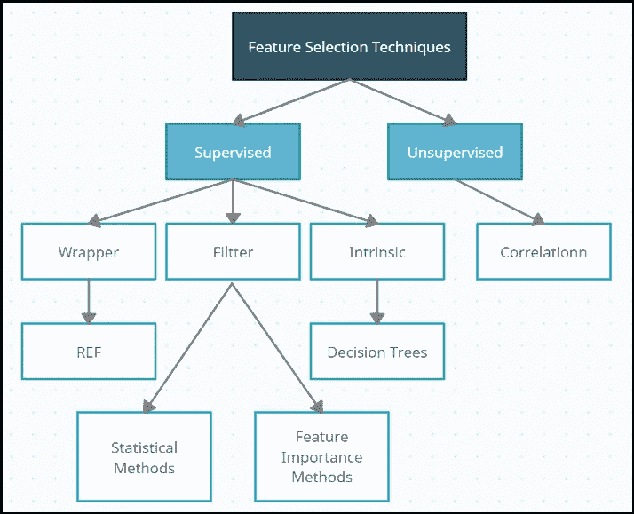
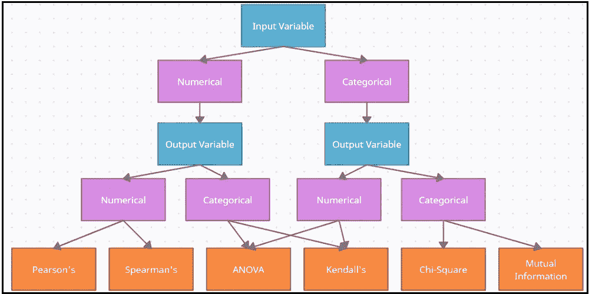

# 特征选择—机器学习

> 原文：<https://medium.com/analytics-vidhya/feature-selection-in-machine-learning-ec1f5d053007?source=collection_archive---------8----------------------->

在本文中，我们将讨论**特征选择过程**、**为什么需要**和**特征选择**的不同类型。

那么，让我们开始吧…

**什么是特征选择过程？**

*   这是一个选择对输出变量有更大影响的所需特征的过程。
*   这意味着我们只需要选择那些与输出变量高度相关的特征(独立变量)。
*   这是创建机器学习模型的最重要的过程。

**为什么特性选择很重要？**

考虑一下，我们有一个包含数千个要素的数据集。当我们用大量特征训练我们的模型时，模型的准确性会下降。我们称这个问题为**维度诅咒**。

因此，为了解决这个问题，我们只需要使用那些对因变量(输出变量)有更大影响的特征。有许多技术可以用来衡量自变量对因变量的影响。

**有哪些不同类型的特征选择？**

下图显示了不同类型的特征选择。

**特征选择技术。图 1.1**

**我们将首先讨论过滤方法。**

1.  皮尔逊相关(线性)。
2.  斯皮尔曼的军衔。(单调)
3.  ANOVA 相关系数(线性)。
4.  肯德尔秩系数(非线性)。
5.  卡方检验(列联表)。
6.  相互信息。

下图给出了何时使用哪种方法的想法:

**如何选择过滤方法。图 1.2**

从上图中，你会对何时使用哪种方法有更好的了解。

*   **输入变量数值，输出变量数值:**这是一个回归问题。

1.  **皮尔逊相关**为线性关系。
2.  **斯皮尔曼相关**为单调关系。

*   **输入变量数值，输出变量分类:**这是一个分类问题。

1.  **ANOVA** 为线性关系。
2.  **肯德尔的**为非线性关系。

*   **输入变量分类，输出变量数值:**这是一个回归问题。我们很少遇到这种问题。

1.  **ANOVA** 为线性关系。
2.  **肯德尔的**为非线性关系。

*   **输入变量分类，输出变量分类:**这是一个分类问题。

1.  Chie-Square 检验。
2.  **相互信息。**

Sklearn 实现了以下方法。

*   皮尔逊相关系数: [f_regression()](https://scikit-learn.org/stable/modules/generated/sklearn.feature_selection.f_regression.html)
*   方差分析: [f_classif()](https://scikit-learn.org/stable/modules/generated/sklearn.feature_selection.f_classif.html)
*   卡方: [chi2()](https://scikit-learn.org/stable/modules/generated/sklearn.feature_selection.chi2.html)
*   互信息: [mutual_info_classif()](https://scikit-learn.org/stable/modules/generated/sklearn.feature_selection.mutual_info_classif.html) 和[mutual _ info _ regression()](https://scikit-learn.org/stable/modules/generated/sklearn.feature_selection.mutual_info_regression.html)

**SciPy 实现了以下方法。**

*   肯德尔的 tau: [肯德尔 tau()](https://docs.scipy.org/doc/scipy/reference/generated/scipy.stats.kendalltau.html)
*   斯皮尔曼等级相关性:[斯皮尔曼()](https://docs.scipy.org/doc/scipy/reference/generated/scipy.stats.spearmanr.html)

**总结:**

在这篇博客中，我们讨论了**特征选择过程**的重要性、**为什么需要**以及**特征选择的不同类型**。

我们主要关注基于**滤波器的特征选择** **方法**及其类型。

在接下来的文章中，我将向您展示如何实际实现这些方法，以及其他类型的特性选择过程。