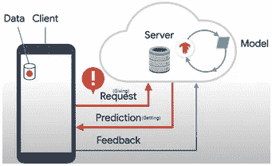
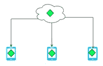
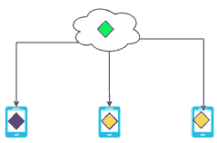
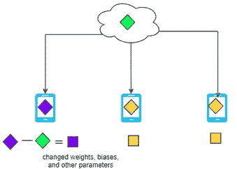
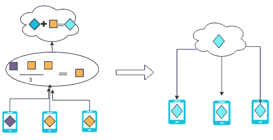

# 傻瓜的联合学习。

> 原文：<https://medium.com/analytics-vidhya/federated-learning-for-dummies-a8ec2ce78b5d?source=collection_archive---------5----------------------->

[Hanson Lu](https://unsplash.com/@hansonluu?utm_source=unsplash&utm_medium=referral&utm_content=creditCopyText) 在 [Unsplash](/s/photos/multiple-device?utm_source=unsplash&utm_medium=referral&utm_content=creditCopyText) 上的照片

**简介**

在我看来，知道为什么某种技术或算法会被开发出来是很有用的。因此，每当我想研究新技术或算法时，我经常问自己这些问题:以前的算法或技术面临哪些限制，导致了这种算法或技术的发展？它是如何工作的？有没有什么问题没有解决或者出现了新问题？

我们将采用相同的方法，并快速了解为什么开发联合学习。

> 导致这种算法或技术发展的现有算法或技术面临哪些限制？

标准机器学习将所有必要的数据和模型收集在一个地方进行训练。这里标准机器学习实践面临两个主要问题:

1.  来自各个设备的私人信息被发送到训练模型的服务器。
2.  向服务器传输原始数据和从服务器传输原始数据会损害用户体验，原因包括:糟糕的互联网连接、网络延迟等等。

为了缓解以上两个问题，Google 开发了**联合学习**，它基于**分散学习的核心思想。**

**工作原理**

联邦学习的主要概念可以通过以下六个步骤来解释:

**1。**每个移动设备从服务器下载共享模型

**2。**利用您自己设备中的数据改进模型

**3。**总结模型发生的变化(权重、偏差和模型的其他参数)。

**4。**将汇总的变更(加密的)发送回我们下载初始模型的服务器

**5。**平均(技术称为**联合平均**)与其他用户的汇总更改为更新共享模型。

**6。**重复步骤 1-5，继续改进共享模型。

在您开始使用联合学习之前，您必须考虑两件重要的事情:

1.  **模型未分发给所有用户**

*   必须检查用户的设备是否:空闲(不活动)、接通电源、在 wifi 上。如果满足这三个条件，则用户的设备**可用。**
*   但是并不是所有可用的设备都有足够大的数据量适合用于训练，这意味着没有足够的数据来更新模型。
*   可用且合适的用户设备被称为**合适可用。**
*   仅向**合适的可用**用户部署/分发/下载模型

2.**安全聚合协议**

*   为了额外的安全，如果超过 100 或 1000 个设备已经给出了它们的汇总的改变(即，超过 100，1000 个方块)，google 使服务器汇总汇总的改变。
*   这确保没有个别设备的汇总更新被检查(根据 2017 年 4 月 6 日 GoogleAI 博客，这仍在生产阶段的开发中)

**有哪些挑战**

1.  上传速度慢

*   上传速度通常比下载速度慢。然而，谷歌已经想出了使用**随机旋转**和**量化来压缩概括模型变化的方法。**

2.通信成本

*   联合网络由大量比本地计算更慢的设备组成。
*   必须减少通信回合数和传输消息的大小。即较少发送小尺寸模型更新。

3.系统异质性

*   联合网络中的设备在许多方面(CPU、内存、网络连接等)都不同，这导致只有一小部分设备适合使用，并在整个培训过程中保持这种状态，而不是退出。
*   因此，联合学习必须预测低参与量，容忍不同的硬件，并对设备退出具有鲁棒性。

4.在自己的设备中计算

*   联合学习需要设备来训练模型，因此缺乏计算能力的移动设备可能是不可能的。

**结论**

总之，这只是对联邦学习的高级概念的一个简单介绍，而联邦学习正在获得很多关注，并且是一个活跃的研究领域。由于这是相对较新的机器学习领域，因此有很多机会参与开发。希望这是联邦学习的一个好的敲门砖，对于那些想要更深入的直觉的人来说，有许多好的资源。不管怎样，感谢你阅读我的博客，如果有任何错误的信息或其他你想分享的资源，请评论！:)

**参考文献:**

*   [https://www.youtube.com/watch?v=X8YYWunttOY&t = 102s&ab _ channel = Google cloud tech](https://www.youtube.com/watch?v=X8YYWunttOY&t=102s&ab_channel=GoogleCloudTech)
*   https://www.youtube.com/watch?v=MOcTGM_UteM&ab _ channel =约旦哈洛德
*   [https://ai . Google blog . com/2017/04/federated-learning-collaborative . html](https://ai.googleblog.com/2017/04/federated-learning-collaborative.html)
*   [https://ai . Google blog . com/2020/05/federated-analytics-collaborative-data . html](https://ai.googleblog.com/2020/05/federated-analytics-collaborative-data.html)
*   [延迟与吞吐量定义](https://community.cadence.com/cadence_blogs_8/b/sd/posts/understanding-latency-vs-throughput#:~:text=Latency%20is%20the%20time%20required,produced%20per%20unit%20of%20time.)
*   [https://www . ground ai . com/project/federated-learning-challenges-methods-and-future-directions/1](https://www.groundai.com/project/federated-learning-challenges-methods-and-future-directions/1)