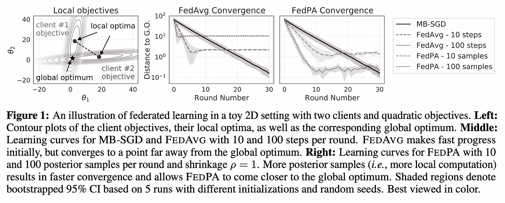
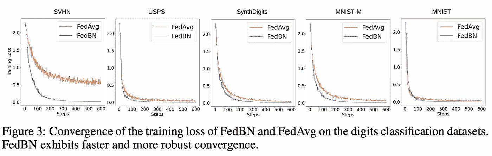
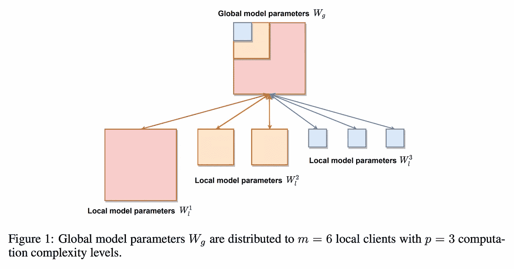

# ICLR 2021 联合学习

> 原文：<https://medium.com/analytics-vidhya/federated-learning-iclr-2021-fa6f41ad350?source=collection_archive---------21----------------------->

出现在 2021 年国际学习代表会议上的联合学习论文摘要

由 [Lukasz Szmigiel](https://unsplash.com/@szmigieldesign?utm_source=medium&utm_medium=referral) 在 [Unsplash](https://unsplash.com?utm_source=medium&utm_medium=referral) 拍摄的照片

# 介绍

我们都是忙碌的人，很难找到时间在会议上仔细阅读论文，以跟上你所选择领域的最新研究。别担心，如果你喜欢联邦学习(FL)，我已经帮你做到了。就这一次会议。希望这能为你节省一些时间，这样你就可以快速地放弃那些你不感兴趣的论文，并专注于你感兴趣的论文，同时保持对该领域更广泛的研究的总体认识。我在所有的口头、聚光灯和海报展示中加入了论文。你可以在这里找到所有 ICLR 论文。如果你需要 FL 的介绍，看看我之前的博文[这里](https://amin-nejad.github.io/2020/06/07/introduction-to-federated-learning/)和[这里](https://amin-nejad.github.io/2020/08/10/federated-learning-continued/)。

事不宜迟，排名不分先后，以下是 10 篇关于 2021 年 ICLR 奥运会的论文(恰好是一个很好的整数):

## [**1。基于动态正则化的联邦学习**](https://openreview.net/forum?id=B7v4QMR6Z9w)

Durmus Alp Emre Acar、赵月、Ramon Matas、Matthew Mattina、Paul Whatmough、Venkatesh Saligrama

## 机构

波士顿大学 ARM

## 新算法

`FedDyn`

## 密码

未提供

## 作者的一句话总结

我们提出了一种新的用于联邦学习的动态正则化方法，其中每个设备的风险目标被动态更新，以确保设备最优值与全局损失的稳定点渐近一致。

## 我的总结

本文最适用于跨设备 FL，因为它解决了 FL 的通信开销。动态正则化在每一步修改每个设备的局部神经网络中的正则化项(线性和二次惩罚项),以确保它与全局损失最小值保持一致。这意味着在需要共享更新和下载参数等之前，可以在设备上进行更多的计算。作者证明了实证结果，并在这一领域(支架)以前的 SOTA 改进。他们的算法还具有在凸和非凸设置中工作的有用属性，完全不知道设备异构性，并且对大量设备、部分参与和不平衡数据具有鲁棒性。

## [2。**通过后验平均的联邦学习:一种新的观点和实用算法**](https://openreview.net/forum?id=GFsU8a0sGB)

Maruan Al-Shedivat、Jennifer Gillenwater、Eric Xing、Afshin Rostamizadeh

## 机构

谷歌，CMU

## 新算法

`FedPA`

## 密码

[https://github.com/alshedivat/fedpa](https://github.com/alshedivat/fedpa)

## 作者的一句话总结

一种新的联邦学习方法，推广了联邦优化，将基于局部 MCMC 的采样与基于全局优化的后验推理相结合，并在具有挑战性的基准测试中取得了有竞争力的结果。

## 我的总结

本文将 FL 从一个全局优化问题重新定义为一个后验推理问题。但这实际上意味着什么呢？好吧，如果你回忆一下你的贝叶斯统计，后验概率是参数θ的概率，给定证据 X:P(θ| X)，即在考虑相关背景(先验)和证据(可能性)后某事的概率。在这种情况下，我们所指的参数是实际的模型参数。在客户端上运行局部后验推断，以改进后验模式的全局估计。随机梯度马尔可夫链蒙特卡罗方法用于从客户端的局部后验概率近似抽样。这种联合局部采样防止局部模型权重偏离全局最优值太远。与 FedAvg(如下图所示)相比，FedPA 不仅能实现更好的模型收敛(更快、更优),还能从增加的本地计算中获益，使其在跨设备设置中特别有吸引力。最后，作者表明 FedAvg 本质上是 FedPA 的次优特例，并报告了一些基准的 SOTA 结果。

## [3。自适应联邦优化](https://openreview.net/forum?id=LkFG3lB13U5)

萨尚克·雷迪、扎卡里·查尔斯、曼齐尔·扎希尔、扎卡里·加勒特、基思·拉什、雅各布·科内纳、桑基夫·库马尔、休·布伦丹·麦克马汉

## 机构

谷歌

## 新算法

`FedOpt`

## 密码

[https://github . com/Google-research/federated/tree/master/optimization](https://github.com/google-research/federated/tree/master/optimization)

## 作者的一句话总结

我们提出了自适应联邦优化技术，并强调了它们相对于流行方法(如 FedAvg)的改进性能。

## 我的总结

作者采用优化器 Adam、Adagrad 和 Yogi 在联邦设置中工作，并表明在各种不同的数据集上，与带有 SGD 的常规 FedAvg 算法相比，它改善了结果。优化的自适应部分是在服务器上完成的，客户端只运行常规 SGD。这确保了该方法具有与 FedAvg 相同的通信成本，并且因此可以在跨设备设置中可行地工作。他们的优化算法的一般版本被称为 FedOpt，并表明平均模型差异的负值确实可以用作一般服务器优化器更新中的伪梯度。

## [**4。通过部分员工参与非 IID 联合学习**](https://openreview.net/forum?id=jDdzh5ul-d) 实现线性加速

杨海波、方明红、刘佳

## 机构

俄亥俄州

## 密码

未提供

## 作者的一句话总结

未提供

## 我的总结

FL 具有良好的特性，因为它在收敛和工作者数量之间具有线性关系，即收敛性能相对于工作者数量线性增加。然而，这仅在 IID 数据集和/或全员参与的情况下得到证明。作者基本上回答了以前一个公开的问题，并表明这一属性仍然适用于非 IID 设置和/或部分工人参与。

## [**5。具有客户端间一致性的联合半监督学习&不相交学习**](https://openreview.net/forum?id=ce6CFXBh30h)

郑元勇，尹在宏，杨恩浩，黄成柱

## 机构

韩国高等科学技术学院

## 新算法

`FedMatch`

## 密码

[https://github.com/wyjeong/FedMatch](https://github.com/wyjeong/FedMatch)

## 作者的一句话总结

我们介绍了一个新的缺乏监督的联邦学习的实际问题，并研究了两个现实的场景和一个新的方法来解决这些问题，包括客户端之间的一致性和分离学习

## 我的总结

介绍了一种新的半监督学习算法 FedMatch。他们关注两种联合范例，一种是每个客户端都有标记和未标记的数据，另一种是客户端只有未标记的数据，而服务器有标记的数据。该算法的两个核心部分是(1)客户端间一致性损失，其调整在多个客户端学习的模型以输出相同的预测，以及(2)参数分解，使得该模型具有用于无监督学习的一组权重和用于监督学习的另一组权重。他们表明，在 IID 和非 IID 设置的几个不同的数据集上，他们的算法优于局部半监督学习和其他朴素基线。

## [6**。FedBN:通过局部批量标准化对非 IID 特征进行联合学习**](https://openreview.net/forum?id=6YEQUn0QICG)

李晓晓、梅瑞江、、坎普、齐斗

## 机构

普林斯顿，CUHK，爱荷华州，莫纳什

## 新算法

`FedBN`

## 密码

[https://github.com/med-air/FedBN](https://github.com/med-air/FedBN)

## 作者的一句话总结

我们提出了一种新的有效的联邦学习聚集方法，表示为 FedBN，它使用局部批量归一化来有效地处理异构特征分布或特征转移的未充分探索的非 iid 问题。

## 我的总结

批处理规范化(BN)是神经网络架构中一个重要且普遍存在的组件，它可以提高收敛性和模型稳定性。然而，几乎没有做什么工作来使 BN 层适应联邦设置，相反，它们要么通常被移除，要么就像普通层一样被天真地对待。本文提出了一个非常简单而有效的解决方案，即在模型中包含 BN 层，但不与全局模型同步，这样每个局部模型都有自己的个性化 BN 层。与标准 FedAvg 相比，这提高了性能，特别是对于非 IID 数据，这有助于减轻特征变化。然而，需要注意的是，所有的实验都是用两层神经网络完成的。

## [**7。FedBE:使贝叶斯模型集成适用于联邦学习**](https://openreview.net/forum?id=dgtpE6gKjHn)

陈洪友、赵伟伦

## 机构

俄亥俄州

## 新算法

`FedBE`

## 密码

未提供

## 作者的一句话总结

未提供

## 我的总结

本文从贝叶斯推理的角度研究了 FL 的模型聚集部分。作者的算法 FedBE 可以简单地添加到常规的 FedAvg(或任何其他算法)中。唯一的区别是聚合步骤，它使用贝叶斯集合来获得最佳平均值，而不是简单的算术平均值。当 FedBE 与随机加权平均相结合时，他们的结果最有说服力，我们在基线上看到了显著的改善。至关重要的是，这些改进也体现在非 IID 数据上的 ResNets 等更深层次的架构中。然而，有一点需要注意的是，他们的算法依赖于服务器对一小部分未标记数据进行的一些计算。对于许多情况来说，这很可能是一个不可行的假设。

## [**8。FedMix:均值增广联邦学习**下的混合近似](https://openreview.net/forum?id=Ogga20D2HO-)

尹德琳，申素敏，黄成柱，杨恩浩

## 机构

KAIST

## 新算法

`FedMix`

## 密码

未提供

## 作者的一句话总结

我们引入了一种新的联邦框架——平均增强联邦学习(MAFL ),并提出了一种有效的算法——联邦混合学习(FedMix ),该算法在困难的非 iid 情况下表现出良好的性能。

## 我的总结

本文介绍了一个新的框架和算法，再次解决了非 IID 数据问题，这一次是数据扩充。他们的工作建立在 MixUp 算法的基础上，这是一种简单的数据扩充技术，使用两个输入标签对之间的线性插值。他们的通用框架 Mean Augmented Federated Learning(MAFL)建立在 FedAvg 的基础上，但有一点不同——除了共享模型参数，客户还共享平均(或作者称之为*massed*)数据。然后，每个客户端基本上*每轮都取消*其他客户端的数据，并用它和自己的本地数据一起训练。当然，这里的问题是这对于 FL 框架来说不是很联合，并且需要进行隐私折衷。FedMix 是建立在这个框架上的算法，它通过以更系统的方式近似全局混合来提高朴素 MAFL 的性能。在 CIFAR 和 FEMNIST 数据集上的非 IID 场景中，FedMix 和 naive 实现都优于 FedAvg 和 FedProx。这项研究中缺少的一个关键部分是隐私风险，作者称这超出了本研究的范围。

## [**9。HeteroFL:异构客户端的计算和通信高效联邦学习**](https://openreview.net/forum?id=TNkPBBYFkXg)

恩茂·迪奥、丁洁、瓦希德·塔洛克

## 机构

明尼苏达州杜克

## 新算法

`HeteroFL`

## 密码

[https://github . com/DEM 123456789/HeteroFL-Computation-and-Communication-Efficient-Learning-for-Heterogeneous-Clients](https://github.com/dem123456789/HeteroFL-Computation-and-Communication-Efficient-Federated-Learning-for-Heterogeneous-Clients)

## 作者的一句话总结

在这篇论文中，我们提出了一个新的联邦学习框架 HeteroFL 来训练具有不同计算复杂度的异构局部模型。

## 我的总结

FL 的核心要求或假设之一是所有模型共享相同的神经网络架构。HeteroFL 挑战了这一假设，并表明有可能使 FL 适应不同客户端具有不同架构的场景。然而，就我们所知，这并不是对 FL 的彻底改革。所有客户端具有全局模型的权重的各种子集，并且目标仍然是联合训练该全局模型。模型深度在所有模型中保持相同，这意味着每一层中的神经元数量是被修改的。作者使用 CNN、PreResNet18 和 Transformer 架构展示了结果。

## [**10。具有一阶模型优化的个性化联邦学习**](https://openreview.net/forum?id=ehJqJQk9cw)

迈克尔·张、卡兰·萨普拉、桑佳·菲德勒、塞丽娜·杨、何塞·阿尔瓦雷斯

## 机构

斯坦福，英伟达

## 新算法

`FedFomo`

## 密码

未提供

## 作者的一句话总结

我们提出了一种新的联合学习框架，它可以有效地为每个客户端计算可用模型的个性化加权组合，优于现有的个性化联合学习工作。

## 我的总结

FedFomo 建议通过局部模型个性化来解决非 IID 数据问题，而不是修改 FL 以使全球模型更加稳健。没有全球模式。相反，在每一步，每个客户端都从其他客户端的子集接收更新，这取决于该客户端从这些参数中受益的程度。这由每个客户端上的验证集的性能来确定。理想情况下，每个客户端都会将他们的模型发送给其他每个客户端，但是通信成本可能会非常高，即使在小型的跨竖井环境中也是如此。取而代之的是，模型的数量受到限制，并且根据不同模型在前几轮中的帮助程度，使用一种抽样方案对不同的模型进行抽样。他们的方法优于其他现有的解决方案。

虽然不是直接聚焦于 FL，但下列论文与该领域相关，因此我将它们包括在下面:

## [**1。CaPC 学习:保密和私人协作学习**](https://openreview.net/forum?id=h2EbJ4_wMVq)

Christopher A. Choquette-Choo、Natalie Dullerud、Adam Dziedzic、张云翔、Somesh Jha、Nicolas Papernot、小王

## 机构

多伦多，媒介研究所

## 新算法

`CapC`

## 密码

[https://github.com/cleverhans-lab/capc-iclr](https://github.com/cleverhans-lab/capc-iclr)

## 作者的一句话总结

一种使各方能够在协作环境中改进他们自己的本地异构机器学习模型的方法，在协作环境中，机密性和隐私都需要得到保护，以防止私有数据的显式和隐式共享。

## 我的总结

为改进基于私有数据的本地模型而提出的 FL 替代方案。允许在不共享数据或模型参数的情况下进行协作，并且不同的客户端可以有完全不同的模型。取而代之的是，他们将通过相互查询他们不确定的输入标签来进行合作。在主动学习范式中，一方以数据样本的形式提出查询，所有其他方一起以预测标签的形式提供答案。每个模型都可以在查询阶段和回答阶段使用，查询方在协议的不同参与者之间交替。这项工作建立在 PATE(教师集合的私有集合)的基础上，并依靠 HE、MPC 和 DP 来进行必要的隐私保证。作者通过大量实验证明了他们模型的有效性。然而，在实验中没有与 FL 进行比较。

## [2。**差异化的私人学习需要更好的特性(或者更多的数据**](https://openreview.net/forum?id=YTWGvpFOQD-)

丹·博内·弗洛里安·特拉梅尔

## 机构

斯坦福

## 密码

[https://github.com/ftramer/Handcrafted-DP](https://github.com/ftramer/Handcrafted-DP)

## 作者的一句话总结

具有手工制作特征的线性模型在差分私人学习方面优于端到端 CNN

## 我的总结

解决了 DP 添加了太多噪声，使 CNN 模型不可用且比线性模型更差的问题。他们表明，用散射网手工制作的特征大大提高了 CNN 的性能，但它们仍然比手工制作的特征的线性模型差。基本上，在这方面还有很长的路要走。

# 摘要

那么，我们学到了什么？嗯，关注点似乎主要是为了提高非 IID 数据的性能，从批处理和正则化到优化器和模型聚合，有很多非常有趣的想法来处理不同的角度。即使这不是重点，大多数论文还是报道了非 IID 数据的结果，这很好。哦，我们还有一大堆新算法，它们的名字我们必须记住:FedMix、FedMatch、FedFomo、FedBE、FedBN、FedOpt、FedDyn、FedPA 和 HeteroFL。一定要努力跟上。

*原载于 2021 年 5 月 17 日*[*https://Amin-nejad . github . io*](https://amin-nejad.github.io/2021/05/17/federated-learning-iclr/)*。*