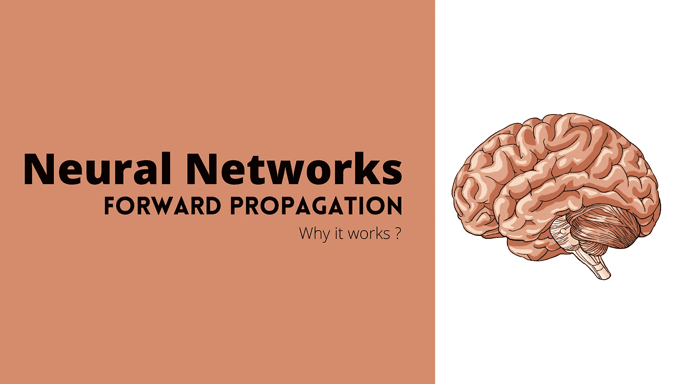
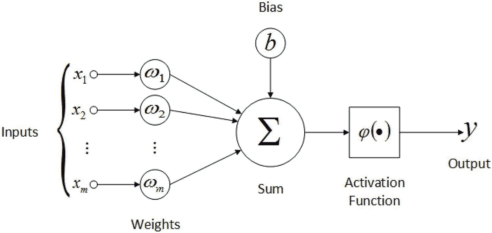
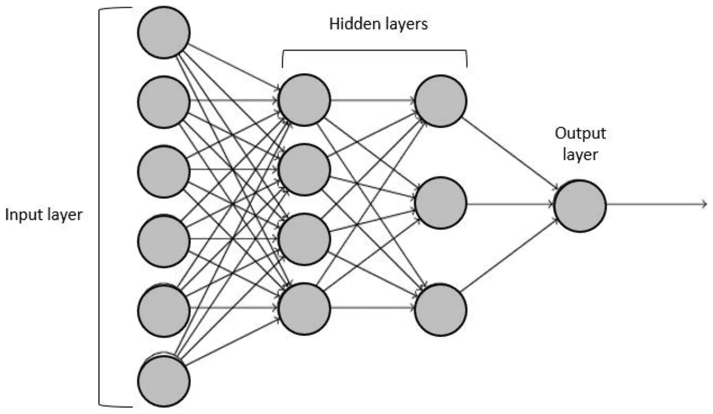
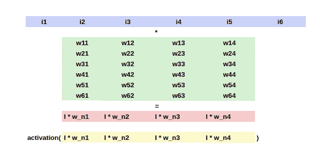
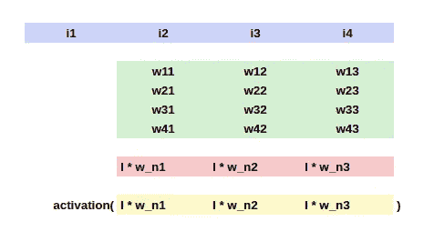
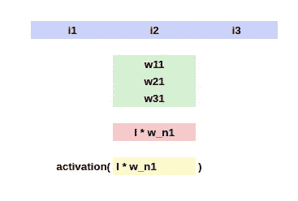

# 前馈神经网络|对正向传播的直觉

> 原文：<https://medium.com/analytics-vidhya/feed-forward-neural-networks-intuition-on-forward-propagation-f77468fad625?source=collection_archive---------4----------------------->

## 为什么是神经网络？神经网络是如何做到这些的？正向传播是如何工作的？

神经网络可以被认为是一种可以在输入和输出之间进行映射的功能。理论上，无论这个函数有多复杂，神经网络都应该能够逼近这个函数。然而，大多数监督学习(如果不是全部的话)都是关于学习一个映射给定的 **X** 和 **Y** 、**的函数，然后使用该函数为一个**新 X 找到合适的**Y**。**如果是这样，传统的机器学习算法和神经网络之间有什么区别？答案是所谓的*感应偏置。这个术语可能看起来很新。但是，它只不过是我们在将机器学习模型拟合到 X 和 Y 之间的关系之前所做的假设。***

例如，如果我们认为 X 和 Y 之间的关系是线性的，我们可以使用线性回归。线性回归的归纳偏差是 X 和 Y 的关系是线性的。因此，它用一条线或一个超平面来拟合数据。
但是，当 X 和 Y 之间存在非线性和复杂的关系时，线性回归算法可能无法很好地预测 Y。在这种情况下，我们可能需要曲线或多维曲线来近似这种关系。神经网络的主要优势是它的归纳偏差非常弱，因此，无论这种关系或功能有多复杂，网络都能够以某种方式逼近它。

而且，基于函数的复杂性，我们可能不得不手动设置每层中神经元的数量以及网络的层数。这通常是通过反复试验和经验来完成的。因此，这些参数被称为超参数。

> 神经网络不过是复杂的曲线拟合机器。— [乔希·斯塔默](https://medium.com/u/6648478c1752?source=post_page-----f77468fad625--------------------------------)

# 神经网络的结构和工作

在我们了解神经网络工作的原因之前，先展示一下神经网络的功能是合适的。在理解神经网络的架构之前，我们需要先看看神经元是做什么的。

图 1.1:人工神经元

人工神经元的每个输入都有一个与之相关的权重。输入首先与它们各自的权重相乘，并向结果添加偏差。我们可以称之为加权和。然后，加权和通过一个激活函数，这基本上是一个非线性函数。

因此，人工神经元可以被认为是一个简单的或多元的线性回归模型，在末端有一个激活函数。说到这里，让我们继续讨论神经网络架构

图 1.2:神经网络

神经网络通常具有多层，每层具有多个神经元，其中一层中的所有神经元都连接到下一层中的所有神经元，依此类推。

在图 1.2 中，我们有 4 层。第一层是输入层，看起来它包含 6 个神经元，但实际上，它只是作为神经网络*输入的数据(有 6 个神经元，因为输入数据可能有 6 列)*。最后一层是输出层。最终层和第一层的神经元数量由数据集和问题类型*(输出类的数量等)*预先确定。隐藏层中神经元的数量和隐藏层的数量将通过反复试验来选择。

来自层 ***i*** 的神经元将来自层 ***i-1*** 的所有神经元的输出作为输入，并计算加权和，向其添加偏置，然后最终通过激活函数发送，正如我们在上面看到的人工神经元的情况。第一个隐藏层的第一个神经元将连接到前一层的所有输入(*输入层*)。同样，第一个隐藏层的第二个神经元也将连接到前一层的所有输入，第一个隐藏层的所有神经元也是如此。对于第二个隐藏层中的神经元，前一个隐藏层的输出被认为是输入，同样，这些神经元中的每一个都连接到所有前一个神经元。

具有 m 个神经元的层，在具有 n 个神经元的层之前，将具有 n*m + m 个*(包括偏差)*连接或链接，其中每个链接携带权重。这些权重是随机初始化的，但是在训练时，它们达到它们的最优值，以便减少我们选择的损失函数。我们将在接下来的博客中看到关于学习这些重量的细节。

# 正向传播示例

让我们考虑一下图 1.2 中的神经网络，然后为了更好的理解，展示前向传播是如何与这个网络一起工作的。我们可以看到，在输入层有 6 个神经元，这意味着有 6 个输入。
*注意:为了计算的目的，我没有包括偏差。但是，如果要包含偏差，那么将会有一个额外的输入 I0，其值将始终为 1，并且在权重矩阵 w01、w02…w04 的开头将会有一个额外的行*

设输入为 I = [ I1，I2，I3，I4，I5，I6 ]。我们可以看到第一个隐藏层有 4 个神经元。因此，在输入层和第一个隐藏层之间将有 **6*4** 个连接(无偏置)。这些连接在下面的权重矩阵中用绿色表示，其值 w_ij 表示来自输入层的第 *i* 个神经元和来自第一隐藏层的第 *j* 个神经元之间的连接的权重。如果我们将*(矩阵乘法)**1 * 6*输入矩阵与 *6*4* 权重矩阵相乘，我们将得到第一个隐藏层的输出，即 *1*4* 。这是有意义的，因为在第一个隐藏层中实际上有 4 个神经元。

图 2.1

这 4 个输出在图 2.1 中用红色表示。一旦获得这些值，我们通过激活函数发送它们，以便引入非线性，然后，这些值将是第一个隐藏层的精确输出。
现在，我们用不同的权重矩阵对第二个隐藏层继续同样的步骤。

图 2.2

i1、i2 等。不过是前一层的输出。为了便于理解，我使用了相同的变量 I。类似于我们之前看到的，输入的 1*4 矩阵要乘以 4*3 的权重矩阵*(因为第二个隐层有 3 个神经元)*，输出一个 1*3 的矩阵。该矩阵中各个元素的激活将成为下一层的输入。

> 猜猜最后一层的权重矩阵的形状

图 2.3

由于最后一层只有 1 个神经元，前一层有 3 个输出，权重矩阵的大小将为 **3*1，**，这标志着简单前馈神经网络中正向传播的结束。

# 为什么这种方法有效？

我们已经看到网络中每个神经元的行为与线性回归没有太大区别。此外，神经元在末端增加了一个激活函数，每个神经元有一个不同的权重向量。但是，为什么会这样呢？

现在我们已经看到了计算是如何工作的。但是，我写这篇博客的主要目的是阐明为什么这种方法有效。理论上，神经网络应该能够逼近任何连续函数，无论它是多么复杂和非线性。我将尽力说服你和我自己，使用正确的参数*(权重和偏差)*，网络应该能够用我们上面看到的方法学习任何东西。

## 非线性是关键

在我们进一步探讨之前，我们需要了解非线性的力量。当我们添加两个或更多的线性对象，如直线、平面或超平面时，结果也是线性对象:分别是直线、平面或超平面。不，不管我们以什么比例添加这些线性对象，我们仍然会得到一个线性对象。

但是，对于非线性对象之间的加法，情况并非如此。当我们添加两条不同的曲线时，我们可能会得到一条更复杂的曲线。这显示在下面的要点。如果我们能够以不同的比例添加这些非线性曲线的不同部分，我们应该能够以某种方式影响最终曲线的形状。

除了添加非线性对象或像“超平面”这样的“超曲线”，我们还通过这些激活函数在每一层引入非线性。这基本上意味着，我们正在对一个已经非线性的对象应用一个非线性函数。通过调整这些偏差和权重，我们能够改变合成曲线或函数的形状。

这就是为什么更复杂的问题需要更多的隐藏层和更多的隐藏神经元，而不太复杂的问题或关系可以用更少的层和神经元来近似。每个神经元都充当一个问题解决者。它们都解决了自己的小问题，结合起来，它们解决了一个更大的问题，通常是降低成本函数。这里用的确切词是**分而治之。**

# 如果神经网络不使用激活函数会怎样？

如果神经网络不使用激活函数，它只是一个大的线性单元，可以很容易地被一个单一的线性回归模型所取代。

y = m * x+c
z = k * y+t =>k *(m * x+c)+t =>k * m * x+k * c+t =>(k * m)* x+(k * c+t)

这里，Z 也线性依赖于 x，因为 k*m 可以用另一个变量代替，k*c+t 可以用另一个变量代替，因此，如果没有激活函数，无论有多少层和多少个神经元，所有这些都是多余的。

# 结论

我们看到了神经网络如何计算它们的输出，以及这种方法为什么有效。简而言之，神经网络能够学习复杂关系的主要原因是因为在每一层，我们都会引入非线性，并添加不同比例的输出曲线，以获得所需的结果，并且该结果还会经过激活函数，重复相同的过程以进一步定制结果。网络中的所有权重和偏差都很重要，它们可以通过某些方式进行调整以逼近关系。尽管分配给每个神经元的权重最初是随机的，但它们将通过一种叫做**反向传播**的特殊算法来学习，我们将在下一篇博客中看到。