# 胎儿弧线:使用机器学习预测胎儿健康和出生体重

> 原文：<https://medium.com/analytics-vidhya/fetal-arc-predicting-fetal-health-and-birth-weight-of-the-fetus-using-machine-learning-5d6726323904?source=collection_archive---------1----------------------->

读者们好。你好吗真的希望你做的牛逼！如果很棒，看看这篇文章探索一个有趣的应用程序，如果不太棒，让我告诉你一些我做的让我一天都很开心的东西，也许它也能让你一天都开心。

你喜欢婴儿吗？他们超级可爱，天真无邪，有可爱的特征，你不能不爱他们。你可能是一个不喜欢孩子的人，但是对于一个母亲来说，怀孕是女人一生中最美丽的阶段。

> 孩子出生的那一刻，母亲也出生了。她以前从未存在过。**女人存在过，但母亲**，从来没有。母亲是一种全新的事物。"

对于一个母亲来说，这完全是一种新的体验，她感受到了从未有过的感受，母亲的身份是惊人的。但你有没有想过，如果这种美好的经历变成了一场噩梦，会发生什么？等等，什么？变成噩梦！怎么无论如何都是噩梦？这就指向了我在机器学习项目中创造的东西。

**动机和问题陈述**

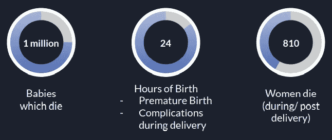

图 1:与怀孕、分娩

我说的是噩梦，上面显示的事实呈现了它们。据世卫组织称，由于早产和分娩期间的并发症，100 万婴儿在出生后 24 小时内死亡。此外，每天约有 810 名妇女在分娩期间或分娩后不久死亡。这真的导致了以最高优先级照顾胎儿的需要。你美好的经历不应该变成逆境。因此，我创建了一个名为胎儿 arc 的应用程序，Arc 指的是从好消息开始到分娩的全部时间，它照顾你的宝宝。需要解决的两个最常见的问题是:

> 1)将胎儿健康分类为“正常”、“可疑”或“病理性”
> 
> 2)预测胎儿的出生体重

如果我们有针对这两个问题的措施，那么它可能会有很大的帮助，即使它挽救了一条生命，我也会更高兴。相反，它应该拯救每个母亲及其婴儿的生命。

首先，让我展示最终的网站，然后我会告诉你后面运行的模型，他们的评估指标，以及如何足够。事实上，我总是觉得首先要给人们展示结果，然后如果他们感兴趣，他们肯定会想去看看发生了什么。

**网站和服务**

网站的链接是:[https://fetalhealth-simran.herokuapp.com/](https://fetalhealth-simran.herokuapp.com/)

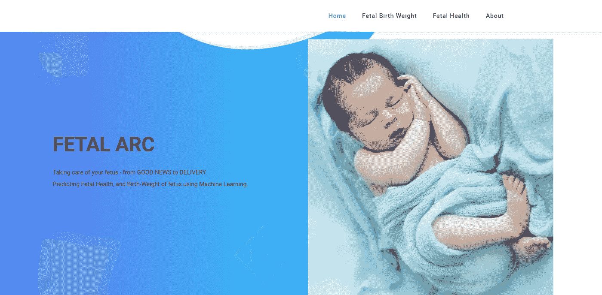

图 2:网站主页

然后有两个服务，你可以向下滚动，你也可以从上面显示的“主页”菜单中选择服务。

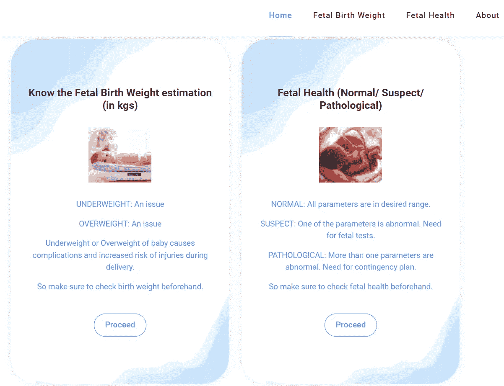

图 3:胎儿弧形服务

最后，在主页上，有“关于我们”，新用户可以在这里了解项目和愿景。

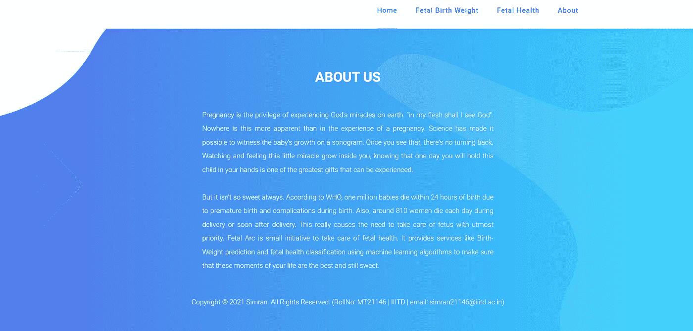

图 4:关于我们

比方说，你想先检查胎儿出生体重，并利用这项服务。为此，你必须填写下面的表格，该表格要求简单的细节，以天为单位的孕周，然后以年为单位的母亲年龄，以英寸为单位的母亲身高，以千克为单位的母亲体重，母亲的吸烟习惯和胎次，即这是否是你的第一个孩子。(注意:尽管异常处理已经完成，但是要确保输入真实的值以获得准确的结果！)

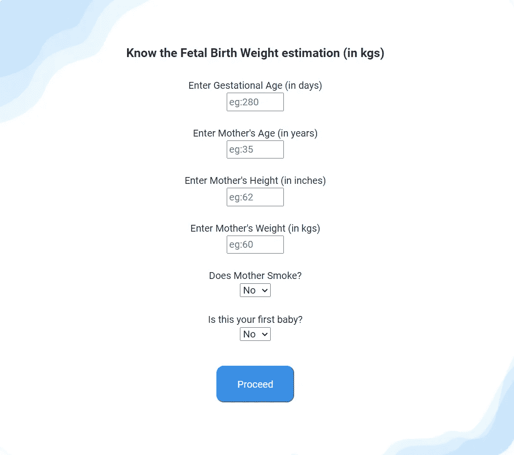

图 5:预测所需的参数

假设我按照要求的顺序为参数填充了值:250、35、65、60、No 和 No。然后在点击 Proceed 之后，我得到如下所示的输出。

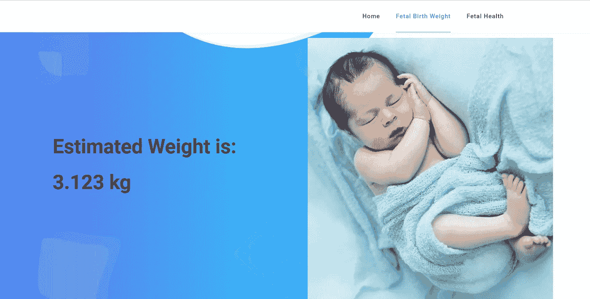

图 6:预测出生体重

让我们转到另一个模块，即胎儿健康分类，其中输出标签为“正常”、“可疑”或“病理”。

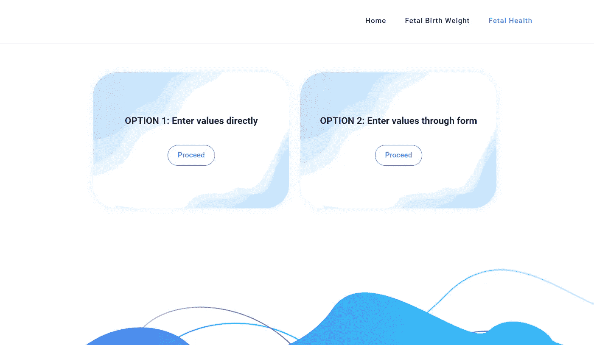

图 7:胎儿健康分类服务

您可以选择任何选项，对于选项 1 和选项 2，输出如下图所示。如果您已经知道参数和必须输入的顺序，选项 1 允许您直接输入用逗号分隔的值，否则请选择选项 2。

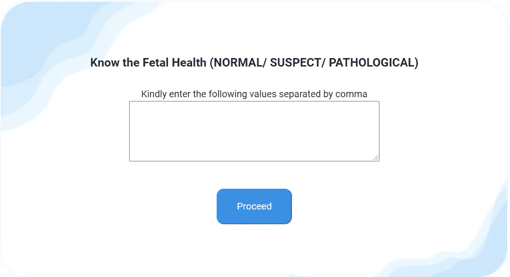

图 8:选择选项 1 时的输出

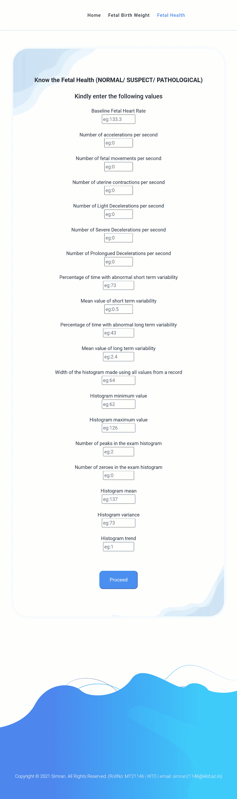

图 9:选择选项 2 时的输出。

你可以选择这两种方式中的任何一种。假设我填充了值，150.0，0.0，0.0，0.005，0.0，0.0，0.0，57.0，0.5，19.0，7.7，20.0，147.0，167.0，3.0，0.0，157.0，7.0，0。0，则输出显示为“可疑”。见下图。

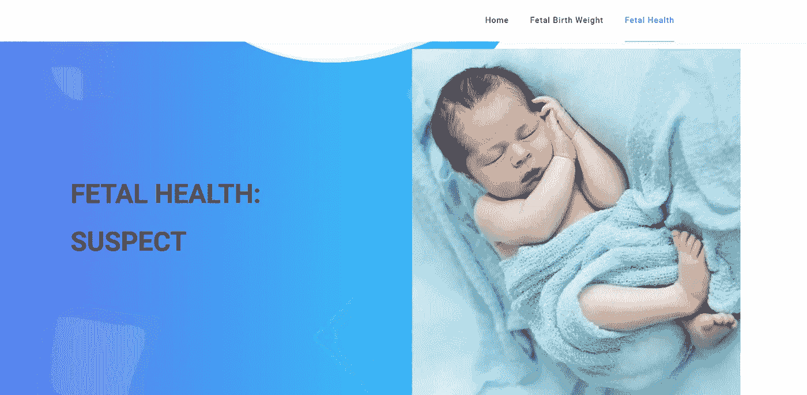

图 10:对于输入的参数，输出为“可疑”

对于数值，131.0，0.008，0.004，0.004，0.001，0.0，0.0，55.0，2.3，0.0，0.0，56.0，109.0，165.0，3.0，0.0，138.0，25.0，0.0，显示“正常”。

> 这就是演示部分，让我们看看里面发生了什么。

但是等等，在那之前什么是数据集？

预测胎儿健康的数据集取自 Kaggle。到数据集的链接是[https://www . ka ggle . com/andrewmvd/胎儿健康分类](https://www.kaggle.com/andrewmvd/fetal-health-classification)数据集有 2126 个训练实例，有 21 个属性。输出标签是胎儿健康:1 —正常，2 —可疑，3 —病理。

对于出生体重预测，有 6 个属性和 1174 个实例。数据集可以从 http://people.reed.edu/~jones/141/Bwt.dat[找到](http://people.reed.edu/~jones/141/Bwt.dat)

现在让我们来看看如果你喜欢机器学习，你们可能正在等待的那一部分。

对于胎儿健康分类为“正常”、“可疑”或“病理”，我尝试了各种机器学习算法，得出了如图 11 所示的结果。使用了 4 种模型，然后使用多数投票来获得最终结果。这些型号的规格如图 11 所示。

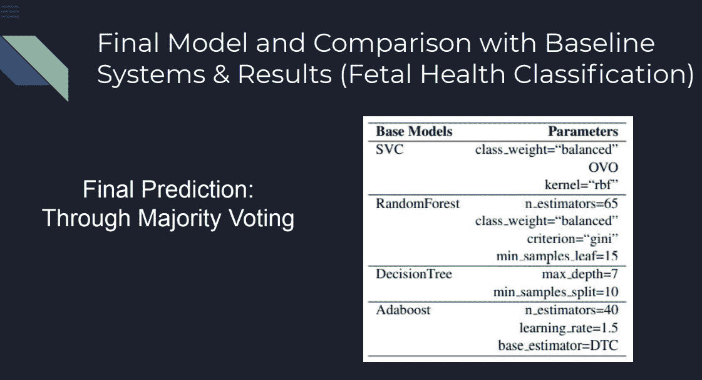

图 11:胎儿健康分类的最终模型

那是为了模型，但是够了吗？嗯，评估指标是必须的。我使用“回忆”作为评估标准，因为我不希望“可疑”或“病理”被忽略！如果模型显示胎儿健康“正常”，但实际上是“可疑的”或“病态的”,它应该受到惩罚。因此，我的最终模型的宏观召回分数为 0.951539，而分类召回分数如图 12 和 13 所示。

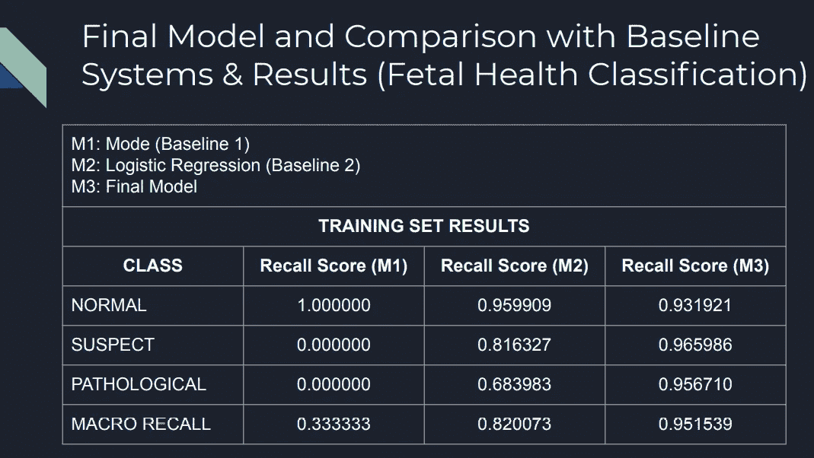

图 12:最终模型结果以及与基线的比较(在训练集上)

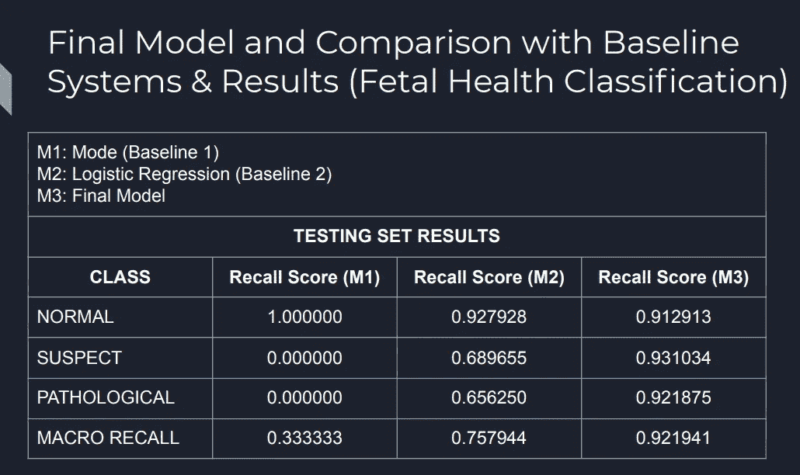

图 13:最终的模型结果以及与基线的比较(在测试集上)

对于出生体重预测，出生体重以千克为单位进行预测，其中最终体重= 5/6 *(由 Adaboost 回归器预测的体重)+ (1/6) *(由 RandomForest 回归器预测的体重)。该模型能够在训练集上实现 0.421 rmse，在测试集上实现 0.441 rmse。详情参见图 14。

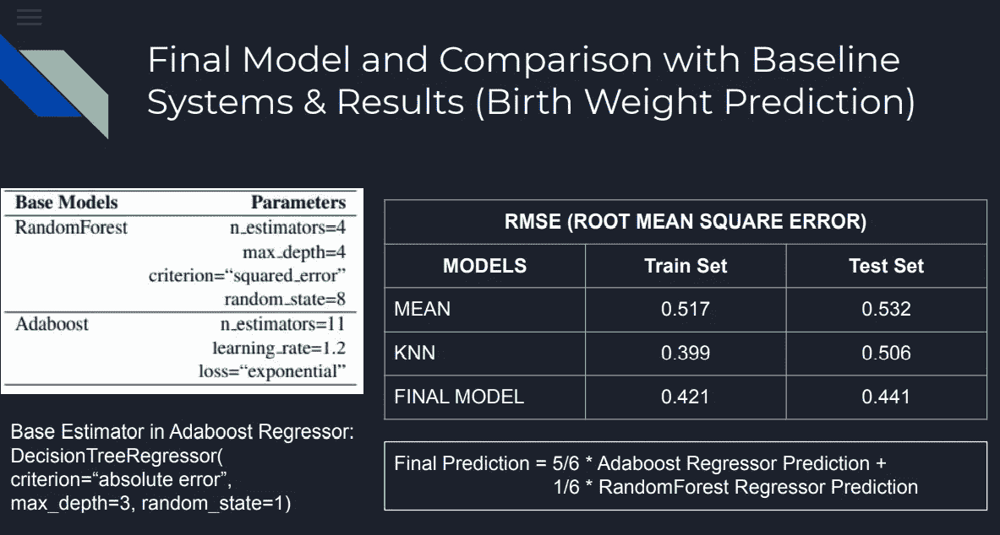

图 14:出生体重预测和评估指标结果的最终模型

所以，我真的希望现在你知道这个项目，我觉得这将有助于人们。请提供反馈，积极和消极的反馈都是受欢迎的。感谢阅读:)

链接到 GitHub 代码:[https://github.com/simranenggprojects/Fetal-Arc](https://github.com/simranenggprojects/Fetal-Arc)