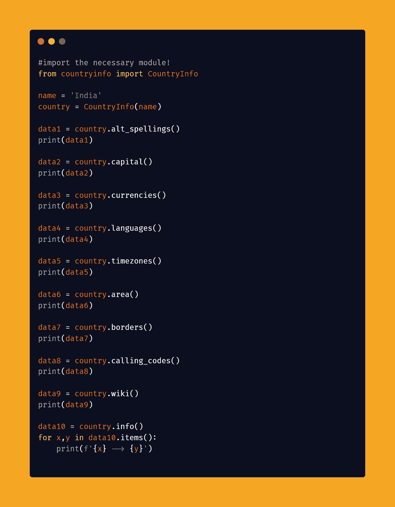

# 使用 Python 获取任何国家的所有信息

> 原文：<https://medium.com/analytics-vidhya/fetch-all-information-of-any-country-using-python-baa72a669d68?source=collection_archive---------3----------------------->

你好，世界！


在这篇博客文章中，我们将学习如何获取任何国家的数据。我们将看到 Python 中的实现。

[查看 python 中的终极资源库](https://github.com/ayushi7rawat/Ultimate-Python-Resource-Hub)。发现有用就掉颗星！有什么要补充的吗？开个 PR 就一样了！

你可以参考我的 YouTube 视频教程，看一个工作教程来更好的理解和一步一步的指导。

# 这个博客将会涵盖什么

```
1\. Countryinfo Introduction
2\. Fetching data of any Country
```

*我们开始吧！*

# 什么是 Countryinfo？

是一个 python 模块，用于返回关于国家、ISO 信息和州/省的数据。要访问一个可用的国家属性，您需要使用一个 API 方法。

如果你想了解更多，可以参考 [Countryinfo 文档](https://pypi.org/project/countryinfo/#api-usage)。使用此链接导航到文档。

现在，您已经熟悉了*我们的议程*并掌握了 *Countryinfo 模块的基本知识，*我们可以前进到*编码部分。*

# 该编码了！

你可以在我的 [GitHub 库](https://github.com/ayushi7rawat/Youtube-Projects/tree/master/Fetch%20data%20of%20any%20country)中找到所有代码。发现有用就掉颗星。



为了访问 Python 库，您需要首先安装它。

```
pip install countryinfo
```

安装完成后，让我们将它导入到您的 python 环境中，使用以下命令将`countryinfo`导入到您的 Python 脚本中。

```
from countryinfo import CountryInfo
```

现在让我们存储我们想要获取信息的国家名称。我希望获取我的国家`India`的详细信息，所以我会将这些信息存储在`name`中。

```
name = 'India'
```

现在，让我们创建一个实例。这里我们将使用`CountryInfo`并传递`name`作为参数。

```
country = CountryInfo(name)
```

一旦完成，我们就来逐一看看其中的一些方法。

# 1.alt _ 拼写()

返回指定国家名称的可选拼写

```
data1 = country.alt_spellings()
print(data1)#Output:
['IN', 'Bhārat', 'Republic of India', 'Bharat Ganrajya']
```

# 2.资本()

返回指定国家的首都

```
data2 = country.capital()
print(data2)#Output:
New Delhi
```

# 3.货币()

返回指定国家的官方货币

```
data3 = country.currencies()
print(data3)#Output:
['INR']
```

# 4.语言()

返回指定国家的官方语言

```
data4 = country.languages()
print(data4)#Output:
['hi', 'en']
```

# 5.时区()

返回指定国家的所有时区

```
data5 = country.timezones()
print(data5)#Output:
['UTC+05:30']
```

# 6 .面积()

返回指定国家的面积(公里)

```
data6 = country.area()
print(data6)#Output:
3287590
```

# 7 .边框()

返回字符串数组，即与给定国家接壤的国家的 ISO3 代码。

```
data7 = country.borders()
print(data7)#Output:
['AFG', 'BGD', 'BTN', 'MMR', 'CHN', 'NPL', 'PAK', 'LKA']
```

# 8.calling_codes()

返回指定国家的国际呼叫代码

```
data8 = country.calling_codes()
print(data8)#Output:
['91']
```

# 9 .维基()

返回指向指定国家的维基百科页面的链接

```
data9 = country.wiki()
print(data9)#Output:
http://en.wikipedia.org/wiki/india
```

如果您希望提取所有方法的摘要，在这种情况下，我们可以使用`info`方法。它获取关于给定国家的所有数据。让我们试一试。

# 10.信息()

返回指定国家的所有可用信息。

```
data10 = country.info()for x,y in data10.items():
    print(f{x} --> {y}')#Output:
name --> India
altSpellings --> ['IN', 'Bhārat', 'Republic of India', 'Bharat Ganrajya']
area --> 3287590
borders --> ['AFG', 'BGD', 'BTN', 'MMR', 'CHN', 'NPL', 'PAK', 'LKA']
callingCodes --> ['91']
capital --> New Delhi
capital_latlng --> [28.614179, 77.202266]
currencies --> ['INR']
demonym --> Indian
flag -->
geoJSON --> {'type': 'FeatureCollection', 'features': [{'type': 'Feature', 'id': 'IND', 'properties': {'name': 
'India'}, 'geometry': {'type': 'Polygon', 'coordinates': [[[77.837451, 35.49401], [78.912269, 34.321936], [78.811086, 33.506198], [79.208892, 32.994395], [79.176129, 32.48378], [78.458446, 32.618164], [78.738894, 31.515906], [79.721367, 30.882715], [81.111256, 30.183481], [80.476721, 29.729865], [80.088425, 28.79447], [81.057203, 28.416095], [81.999987, 27.925479], [83.304249, 27.364506], [84.675018, 27.234901], [85.251779, 26.726198], [86.024393, 26.630985], [87.227472, 26.397898], [88.060238, 26.414615], [88.174804, 26.810405], [88.043133, 27.445819], [88.120441, 27.876542], [88.730326, 28.086865], [88.814248, 27.299316], [88.835643, 27.098966], [89.744528, 26.719403], [90.373275, 26.875724], [91.217513, 26.808648], [92.033484, 26.83831], [92.103712, 27.452614], [91.696657, 27.771742], [92.503119, 27.896876], [93.413348, 28.640629], [94.56599, 29.277438], [95.404802, 29.031717], [96.117679, 29.452802], [96.586591, 28.83098], [96.248833, 28.411031], [97.327114, 28.261583], [97.402561, 27.882536], [97.051989, 27.699059], [97.133999, 27.083774], [96.419366, 27.264589], [95.124768, 26.573572], [95.155153, 26.001307], [94.603249, 25.162495], [94.552658, 24.675238], [94.106742, 23.850741], [93.325188, 24.078556], [93.286327, 23.043658], [93.060294, 22.703111], [93.166128, 22.27846], [92.672721, 22.041239], [92.146035, 23.627499], [91.869928, 23.624346], [91.706475, 22.985264], [91.158963, 23.503527], [91.46773, 24.072639], 
[91.915093, 24.130414], [92.376202, 24.976693], [91.799596, 25.147432], [90.872211, 25.132601], [89.920693, 25.26975], [89.832481, 25.965082], [89.355094, 26.014407], [88.563049, 26.446526], [88.209789, 25.768066], [88.931554, 25.238692], [88.306373, 24.866079], [88.084422, 24.501657], [88.69994, 24.233715], [88.52977, 23.631142], 
[88.876312, 22.879146], [89.031961, 22.055708], [88.888766, 21.690588], [88.208497, 21.703172], [86.975704, 21.495562], [87.033169, 20.743308], [86.499351, 20.151638], [85.060266, 19.478579], [83.941006, 18.30201], [83.189217, 17.671221], [82.192792, 17.016636], [82.191242, 16.556664], [81.692719, 16.310219], [80.791999, 15.951972], [80.324896, 15.899185], [80.025069, 15.136415], [80.233274, 13.835771], [80.286294, 13.006261], [79.862547, 12.056215], [79.857999, 10.357275], [79.340512, 10.308854], [78.885345, 9.546136], [79.18972, 9.216544], [78.277941, 8.933047], [77.941165, 8.252959], [77.539898, 7.965535], [76.592979, 8.899276], [76.130061, 10.29963], [75.746467, 11.308251], [75.396101, 11.781245], [74.864816, 12.741936], [74.616717, 13.992583], [74.443859, 14.617222], [73.534199, 15.990652], [73.119909, 17.92857], [72.820909, 19.208234], [72.824475, 20.419503], [72.630533, 21.356009], [71.175273, 20.757441], [70.470459, 20.877331], [69.16413, 22.089298], [69.644928, 22.450775], [69.349597, 22.84318], [68.176645, 23.691965], [68.842599, 24.359134], [71.04324, 24.356524], [70.844699, 25.215102], [70.282873, 25.722229], [70.168927, 26.491872], [69.514393, 26.940966], [70.616496, 27.989196], [71.777666, 27.91318], [72.823752, 28.961592], [73.450638, 29.976413], [74.42138, 30.979815], [74.405929, 31.692639], [75.258642, 32.271105], [74.451559, 32.7649], [74.104294, 33.441473], [73.749948, 34.317699], [74.240203, 34.748887], [75.757061, 34.504923], [76.871722, 34.653544], [77.837451, 35.49401]]]}}]}
ISO --> {'alpha2': 'IN', 'alpha3': 'IND'}
languages --> ['hi', 'en']
latlng --> [20, 77]
nativeName --> भारत
population --> 1263930000
provinces --> ['Andaman and Nicobar Islands', 'Andhra Pradesh', 'Arunachal Pradesh', 'Assam', 'Bihar', 'Chandigarh', 'Chhattisgarh', 'Dadra and Nagar Haveli', 'Daman and Diu', 'Delhi', 'Goa', 'Gujarat', 'Haryana', 'Himachal Pradesh', 'Jammu and Kashmir', 'Jharkhand', 'Karnataka', 'Kerala', 'Lakshadweep', 'Madhya Pradesh', 'Maharashtra', 'Manipur', 'Meghalaya', 'Mizoram', 'Nagaland', 'Odisha', 'Puducherry', 'Punjab', 'Rajasthan', 'Sikkim', 'Tamil Nadu', 'Telangana', 'Tripura', 'Uttar Pradesh', 'Uttarakhand', 'West Bengal']
region --> Asia
subregion --> Southern Asia
timezones --> ['UTC+05:30']
tld --> ['.in']
translations --> {'de': 'Indien', 'es': 'India', 'fr': 'Inde', 'ja': 'インド', 'it': 'India'}
wiki --> [http://en.wikipedia.org/wiki/india](http://en.wikipedia.org/wiki/india)
```

就是这样。我们完了。您可以根据需要进一步定制您的代码。你可以为你选择的任何国家做同样的事情。

通过这些步骤，我们成功地检索到了一个国家的数据。就是这样！您可以使用`countryinfo`库，甚至探索更多的特性。

很简单，不是吗？希望这篇教程有所帮助。我强烈推荐你去看看 T2 的 YouTube 视频，别忘了订阅我的频道。

你可以在我的 [GitHub 库](https://github.com/ayushi7rawat/Youtube-Projects/tree/master/Fetch%20data%20of%20any%20country)找到所有代码。发现有用就掉颗星。

感谢您的阅读，我很乐意通过 [Twitter](https://twitter.com/ayushi7rawat) | [LinkedIn](https://www.linkedin.com/in/ayushi7rawat/) 与您联系。

请分享您的宝贵建议，感谢您的真诚反馈！

你绝对应该看看我的其他博客:

*   [Python 3.9:你需要知道的一切](https://ayushirawat.com/python-39-all-you-need-to-know)
*   [终极 Python 资源中心](https://ayushirawat.com/the-ultimate-python-resource-hub)
*   [GitHub CLI 1.0:你需要知道的一切](https://ayushirawat.com/github-cli-10-all-you-need-to-know)
*   [成为更好的程序员](https://ayushirawat.com/become-a-better-programmer)
*   [如何制作自己的谷歌 Chrome 扩展](https://ayushirawat.com/how-to-make-your-own-google-chrome-extension-1)
*   [用 Python 从任何 pdf 创建你自己的有声读物](https://ayushirawat.com/create-your-own-audiobook-from-any-pdf-with-python)
*   你很重要，你的心理健康也很重要！

# 资源:

*   [pypi.org/project/countryinfo](https://pypi.org/project/countryinfo/)
*   [github.com/porimol/countryinfo](https://github.com/porimol/countryinfo)

在我的下一篇博客文章中再见，保重！！