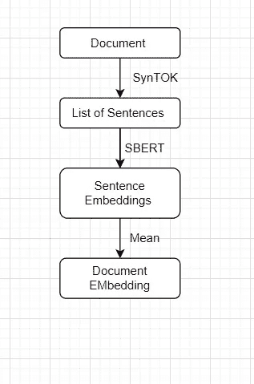

# 使用 SBERT 的少量镜头学习

> 原文：<https://medium.com/analytics-vidhya/few-shot-learning-using-sbert-95f8b08248bf?source=collection_archive---------1----------------------->

**简介**

*“如果数据集真的很小，下面的两种技术(Bert 和 SBERT)可能不会给出很好的结果，这纯粹取决于文档的上下文。如果文档已经彼此相似，则很难识别它们之间的差异。想象一个任务，我们需要建立一个每类只有一两个样本的分类，每个样本都超级难找。”*

在本文中，我们将借助数量非常少的文档来实现文档分类。

基本上，根据标记数据的可用性，文档分类主要分为 3 类:

1.**简单的分类，**丰富的数据，我们有大量的数据用于训练和测试我们的模型

2.**少量分类**，每个类别的数据量非常少，例如每个类别 10-40 个数据点

3 **一次/单次拍摄分类，**当每个类别只有一个数据点时

在本文中，我们将讨论第二种情况，在这种情况下，每个类别可用的标记数据点非常少

**少量拍摄学习:**

同样，上一篇关于伯特的文章，我们也将使用句子的嵌入来得到预测。

[](https://deepaksaini121993.medium.com/bert-embedding-for-classification-7c51aead26d9) [## 用于分类的 BERT 嵌入

### 机器学习的最新进展和越来越多的可用数据已经对……领域产生了巨大的影响

deepaksaini121993.medium.com](https://deepaksaini121993.medium.com/bert-embedding-for-classification-7c51aead26d9) 

但是在之前的实现和这个实现之间有一个细微的区别，那就是嵌入创建的方式。在 Bert 中，我们创建了标记嵌入，但是在 SBERT 中，我们在句子嵌入的帮助下创建了文档嵌入。

**SBERT**

Sentence-Transformers 是一个 Python 库，用于最先进的句子、文本和图像嵌入。然后，这些嵌入可以用于分类或聚类。例如，借助于嵌入之间的余弦相似性，我们可以找到具有相似含义的句子。这对于语义文本相似性、语义搜索或释义挖掘非常有用。

[**https://www.sbert.net/**](https://www.sbert.net/)

```
pip install -U sentence-transformers
```

**少投学习的实现**

现在假设我们有 3 个不同的类 A、B 和 c，每个类只有 10 个标记数据点。现在，我们需要借助这些最少的数据创建一个健壮的分类器。

我们将创建已标记数据集的嵌入，并在推理时，使用每个类别的已保存嵌入来测量新文档的距离，用最接近的类别对其进行分类。

在 SBERT 的帮助下为文档创建嵌入时，我们需要将文档分成多个句子。因为 SBERT 在句子层面维护上下文，并据此进行比较。

为了将文档分成多个句子，我们使用了 SynTOK 库。这个库使用多个正则表达式和规则将文档分解成一系列句子。



创建文档嵌入的流程

[](https://github.com/fnl/syntok) [## 民族解放力量/syntok

### syntok 包提供了两个模块，syntok.segmenter 和 syntok.tokenizer

github.com](https://github.com/fnl/syntok) 

```
import syntok.segmenter as segmenter

document = open('README.txt').read()

# choose the segmentation function you need/prefer

for paragraph in segmenter.process(document):
    for sentence in paragraph:
        for token in sentence:
            # roughly reproduce the input,
            # except for hyphenated word-breaks
            # and replacing "n't" contractions with "not",
            # separating tokens by single spaces
            print(token.value, end=' ')
        print()  # print one sentence per line
    print()  # separate paragraphs with newlines

for paragraph in segmenter.analyze(document):
    for sentence in paragraph:
        for token in sentence:
            # exactly reproduce the input
            # and do not remove "imperfections"
            print(token.spacing, token.value, sep='', end='')
    print("\n")  # reinsert paragraph separators###### Two diffrent types of segmentator are available, we could use any one of them as per our convenience. #####
```

现在我们有了文档的句子列表，我们将在 SBERT 的帮助下提取嵌入内容。

在这里，我们使用预训练模型' **stsb-bert-base** '进行句子相似度任务

```
**from** **sentence_transformers** **import** SentenceTransformer ,  util
import torchmodel = SentenceTransformer('stsb-bert-base')*#Our sentences we like to encode*
sentences = ['This framework generates embeddings for each input sentence',
    'Sentences are passed as a list of string.',
    'The quick brown fox jumps over the lazy dog.']

*#Sentences are encoded by calling model.encode()*
embedding_list = model.encode(sentences)
```

在上面的代码片段中，我们有句子级别的嵌入，因为我们将文档分成了 3 个不同的句子，所以要获得文档嵌入，我们需要取文档中所有句子嵌入的平均值。

**" Document _ embed = torch . mean(torch . stack(embedding _ list)，dim=0)"**

这就是我们如何计算文档嵌入。

现在，我们可以对每个类别的每个文档重复相同的过程。因此，我们为每个类提供了 10 种不同的文档嵌入。所以为了得到单个的类嵌入，我们取了所有文档嵌入的平均值。

**推理**

对于新文档的分类，我们可以提取它的嵌入，就像我们提取标记数据一样。

然后，计算每一类嵌入与新文档嵌入的余弦距离。并将其分配给最近的一个。

**" distance = util . py torch _ cos _ sim(doc _ 1，doc_2)"**

在这项技术的帮助下，我们可以生成更多的标签数据，并且具有相当的准确性。

感谢阅读！！

贡献者:

1 Nikhil([https://nkhandelwal204.medium.com/](https://nkhandelwal204.medium.com/))

2 迪帕克·塞尼

**参考文献**:

 [## 句子变压器文件-句子-变压器文件

### 你可以使用 pip 安装它:我们推荐 Python 3.6 或更高版本，至少 PyTorch 1.6.0。请参见安装…

www.sbert.net](https://www.sbert.net/) 

[https://github.com/fnl/segtok](https://github.com/fnl/segtok)