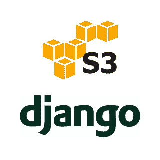
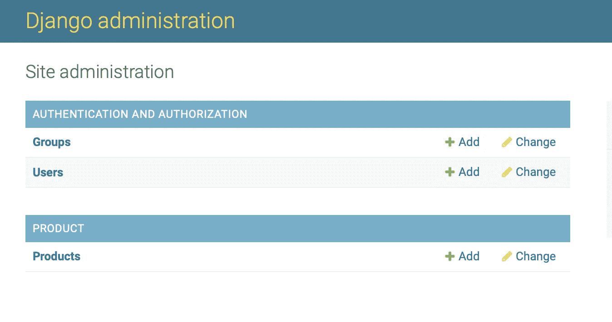
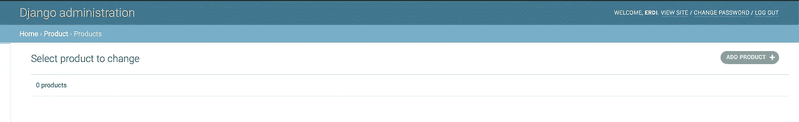
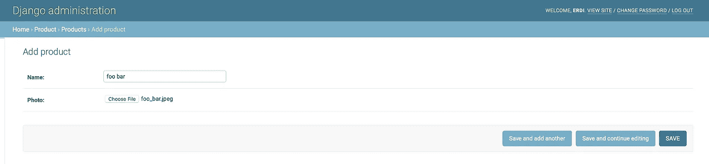
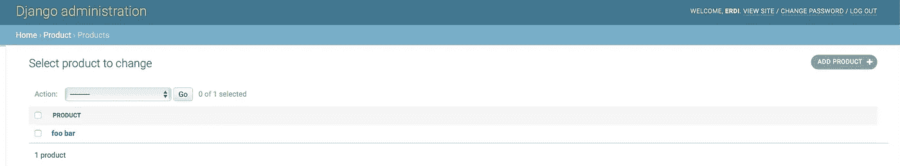
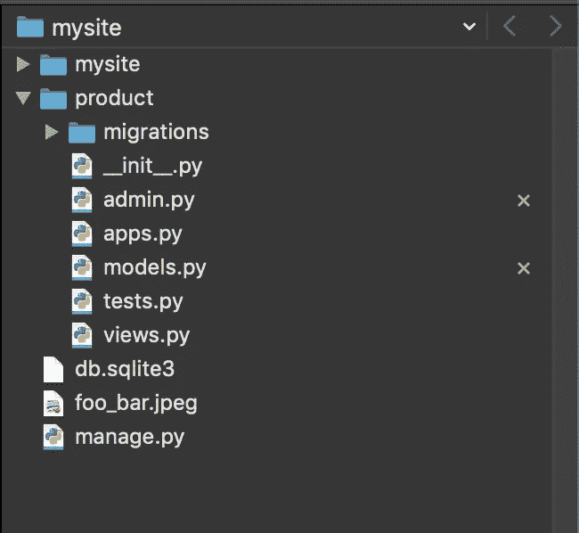
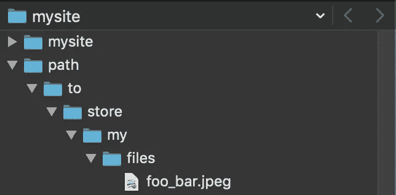

# 在 Django 项目中使用亚马逊 S3 上传文件

> 原文：<https://medium.com/analytics-vidhya/file-uploads-with-amazon-s3-in-a-django-project-54fb989e992d?source=collection_archive---------3----------------------->



在一个 Django 项目中，我们将展示一个示例，它允许您安全可靠地将文件上传到作为外部存储的 **AWS S3** 。不幸的是，没有免费的解决方案，我的 [**亚马逊免费层**](https://aws.amazon.com/free/?all-free-tier.sort-by=item.additionalFields.SortRank&all-free-tier.sort-order=asc) 已经过期。此外，如果您想要一个生产就绪的系统，您可以使用 [**MinIO**](https://min.io/?utm_source=lyapustin) 。

# 开始吧！

如果想快速设置 Django 项目，可以访问 Django [**doc**](https://docs.djangoproject.com/en/2.2/intro/tutorial01/) 。首先，我们在您的`models.py`文件中创建一个**产品**模型，并确保将其保存在您的 **admin.py** 文件中。因此，您可以从 Django 管理页面访问**产品**型号。

这是一个简单的 Django 模型，可以用来存储**产品照片**。Django admin 允许使用模型上的文件字段上传文件。现在，我们将使用 UI 到 Django 管理页面。



Django 管理页面



产品列表页面



产品添加页面



添加产品后的产品列表页面

# 文件上传到哪里了？



*如你所见，文件被上传到 app 的根目录。*

我们可以在您的应用程序的**设置文件**中更改 **MEDIA_ROOT** 属性。在 **MEDIA_ROOT** 中给定的路径将存储媒体文件。

```
MEDIA_ROOT = os.path.join(BASE_DIR, 'path/to/store/my/files/') 
```

现在，如果我们再次上传文件，就会为上传的照片创建一个新的文件路径。



# 计划

亚马逊 S3 提供了一个安全、可靠和可扩展的存储系统。我们可以从**设置文件中删除 **MEDIA_ROOT** 属性。**现在，请按照以下步骤登录您的 AWS 帐户，轻松创建 S3 存储桶:

*   登录 AWS 帐户。
*   从 AWS 控制台的 S3 部分创建存储桶。
*   从 IAM 控制台创建具有编程访问权限的用户，并授予对 S3 的完全访问权限。如果创建了用户，则生成访问密钥和秘密访问密钥。然后你应该在你的 **settings.py** 文件中设置它们，如下所示:

```
AWS_ACCESS_KEY_ID = 'YOUR_ACCESS_KEY_HERE'
AWS_SECRET_ACCESS_KEY = 'YOUR_SECRET_ACCESS_KEY_HERE'
```

此外，您还可以访问[**AWS****doc**](https://docs.aws.amazon.com/AmazonS3/latest/userguide/walkthrough1.html#walkthrough1-add-users)**来创建 IAM 用户和组。**

# **助手库**

**我们需要安装 2 个 python 库:**

*   **[**boto 3**](https://boto3.amazonaws.com/v1/documentation/api/latest/index.html)**:**我们可以从您的代码内部管理 AWS 服务。**
*   **[**django-storages**](https://django-storages.readthedocs.io/en/latest/backends/amazon-S3.html)**:**我们通过 **django-storages 使用亚马逊 S3 功能。**你还需要在设置文件的 **INSTALLED_APPS** 中添加“存储”。**

**现在，我们可以在您的终端中运行以下命令。**

```
$ pip install boto3
$ pip install django-storages
```

**以下是您应该提供的设置:**

**我们用一个非常简单的工具快速轻松地进行设置。您应该能够轻松地将它添加到您的 Django 项目中。**

**您也可以访问下面的文档获取更多信息。**

*   **[使用水桶。](https://docs.aws.amazon.com/AmazonS3/latest/userguide/UsingBucket.html)**
*   **[签约实例](https://docs.aws.amazon.com/general/latest/gr/sigv4-signed-request-examples.html)。**