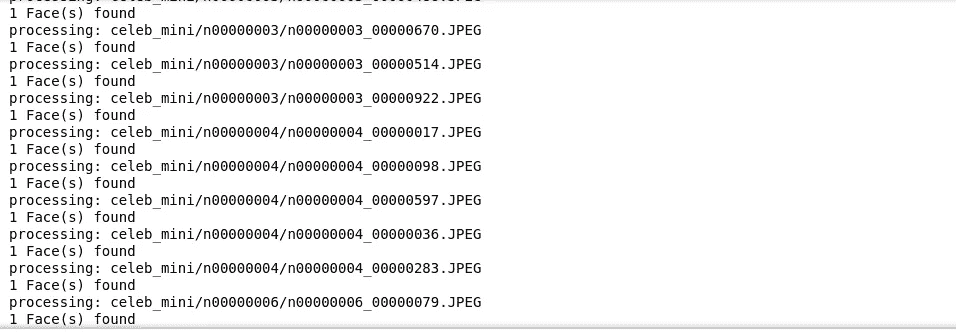

# 使用 Dlib 查找名人重身幽灵

> 原文：<https://medium.com/analytics-vidhya/find-a-celebrity-doppelganger-using-dlib-fad59bab6431?source=collection_archive---------18----------------------->


在这个项目中，我们将研究一种识别名人二重身的方法。如果你是一个受欢迎的博客作者，并且你想为你的最新博客列出一个喜欢其他名人的名人列表，那么在谷歌中搜索每一张图片来填满一个列表可能会非常乏味。在这个应用程序的帮助下，你不仅可以快速列出名人的名单，还可以评估每个人与另一个人的匹配度。

**基本概念:**

在这个项目中，我们不会训练一个新的模型，而是使用 Dlib 的基于 RESNET 的人脸识别模型来注册新的名人图像。该模型将把新图像转换成 128*1 的向量。然后，我们将对测试图像进行类似的处理，并将其转换为 128*1 矢量。最后，我们将计算登记图像和测试图像的向量之间的欧几里德范数。当测试和注册图像之间的距离小于预设阈值时，我们将认为它是匹配的！

**映射文件中的地图标签与文件夹中的对应图像:**

由于已经提供了一个 celeb_mapping.npy 文件，我们只需浏览该文件，并将名人姓名与训练数据集中的相应文件夹进行映射。



从标签到文件夹名称的映射

该操作的代码片段如下

```
# In this step we create list of sub folders and store a dictionary with labels and respective
# image folders mapped to itsubfolders = []
imagePaths = []
labels = []
nameLabelMap = {}for item in labelMap: # For each subfolder in labelMap
    celeb_folder_path = os.path.join(faceDatasetFolder, item)     if os.path.isdir(celeb_folder_path): # allow for valid folder for img in os.listdir(celeb_folder_path): 
           if (img.endswith('JPEG') or img.endswith('jpg')):
                img_path = os.path.join(celeb_folder_path,img) imagePaths.append(img_path) # attaching image paths labels.append(labelMap[item]) # inserting labels nameLabelMap[img_path] = labelMap[item] 
```

**注册图像:**

在这一步中，我们将名人图像注册到 dlib 人脸识别模型中。我们必须遍历包含 5 张图像的每个文件夹，并执行地标检测，然后进行人脸识别。

```
# facial landmarks detection
shape = shapePredictor(cv2.cvtColor(temp_img, cv2.COLOR_BGR2RGB), face)# convert Dlib's format to list of (x, y) points
landmark_points = [(p.x, p.y) for p in shape.parts()]# NN based face descriptor from Dlib
faceDescriptorPts = faceRecognizer.compute_face_descriptor(temp_img, shape)
```

之后，我们从 Dlib 格式转换为 list，然后转换为大小为 128*1 的 numpy 数组。对所有图像都这样做。

```
# Convert to a NumPy array
faceDescriptorList = [x for x in faceDescriptorPts]faceDescriptorNdarray = np.asarray(faceDescriptorList, dtype=np.float64)faceDescriptorNdarray = faceDescriptorNdarray[np.newaxis, :]# 1x128D Vectors 
if faceDescriptorsArray is None:
   faceDescriptorsArray = faceDescriptorNdarray
else:
   faceDescriptorsArray = np.concatenate((faceDescriptorsArray, faceDescriptorNdarray), axis=0)
```

然后，我们必须将每个图像的标签及其相应的索引保存在一个单独的列表中，该列表将在测试阶段使用

```
index[i] = valueLabelMap[imagePath]
i += 1
```

**保存面部描述符和索引内容**

我们使用 numpy 保存和 pickle 函数保存 faceDescriptor 列表和索引列表，供以后重用。

```
np.save('descriptors.npy', faceDescriptors)
with open('index.pkl', 'wb') as f:
  cPickle.dump(index, f)
```

**测试模型:**

接下来，我们重新加载索引和描述符列表，并设置阈值。

```
THRESHOLD = 0.57# load descriptors and indices file 
index = np.load('index.pkl', allow_pickle=True)
faceDescriptorsEnrolled = np.load('descriptors.npy')
```

我们将阈值设置为 0.57，这是通过实验确定的最佳结果。

接下来，我们加载测试图像，并执行面部标志检测和后续面部识别的类似操作。

```
for face in faces:
  shape = shapePredictor(cv2.cvtColor(im, cv2.COLOR_BGR2RGB), face) faceDescriptor = faceRecognizer.compute_face_descriptor(im, shape) faceDescriptorList = [m for m in faceDescriptor] faceDescriptorNdarray = np.asarray(faceDescriptorList, dtype=np.float64) faceDescriptorNdarray = faceDescriptorNdarray[np.newaxis, :]
```

之后，我们计算所有注册图像的面部描述符列表和测试图像之间的欧几里德范数，并找到最小距离。

```
distances = np.linalg.norm(faceDescriptorsEnrolled - faceDescriptorNdarray, axis=1)argmin = np.argmin(distances)  # index
minDistance = distances[argmin]  # minimum distance
```

然后我们检查最小图像是否低于阈值。如果通过，我们从索引列表中读取相应的索引，并将其分配给名人图像。

```
if minDistance <= THRESHOLD:
  label = index[argmin]
  print("Identified label :{} ".format(label))
else:
  label = 'unknown'
```

**结果:**

使用该算法获得了以下结果。


阿米特巴·巴强长相酷似


安吉丽娜·朱莉长相酷似


赛琳娜·戈麦斯长相酷似


鲍勃·萨吉特长相酷似