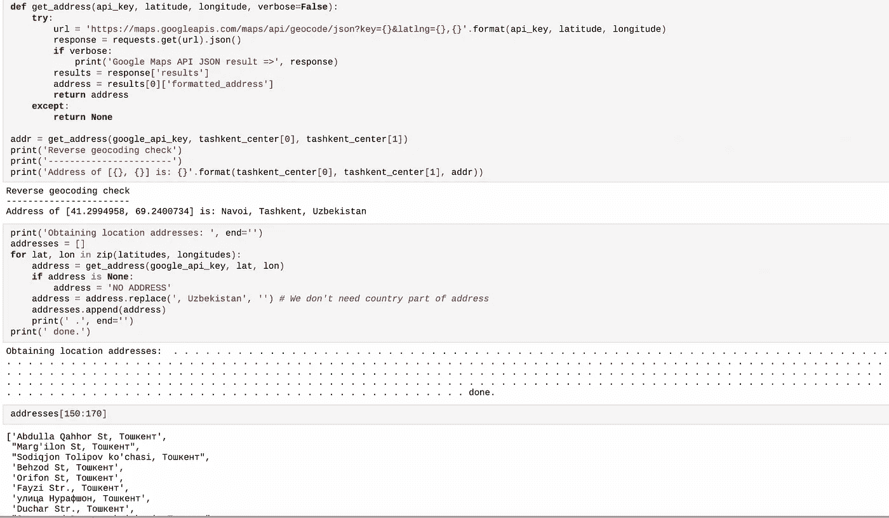

# 找一个开餐馆的地点

> 原文：<https://medium.com/analytics-vidhya/find-a-location-for-opening-a-restaurant-fc7790e30d1?source=collection_archive---------8----------------------->

用机器学习的 K-mean 算法对位置进行聚类。


由 [Iconfinder](https://cdn4.iconfinder.com/data/icons/food-3-7/65/136-512.png) 拍摄

## 简介:业务问题

在这个项目中，我们将试图找到一个餐馆的最佳位置。具体来说，本报告将针对有意在乌兹别克斯坦塔什干****开设**土耳其餐厅(**因为我是土耳其料理的超级粉丝)的利益相关方。****

**由于塔什干有许多餐馆，我们将尝试检测尚未挤满餐馆的**位置(尤其是城市的南部)**。我们还对附近没有土耳其餐馆的地区特别感兴趣。假设前两个条件都满足，我们也希望位置**尽可能靠近市中心**。**

**我们将利用我们的数据科学力量，根据这一标准生成几个最有前途的社区。每个区域的优势将被清楚地表达出来，以便利益相关者可以选择最佳的最终位置。**

## **关于数据**

**根据我们问题的定义，影响我们决策的因素有:**

*   **附近现有餐馆的数量(任何类型的餐馆)**
*   **附近土耳其餐馆的数量和距离(如果有)**
*   **社区离市中心的距离**

**我们决定使用以市中心为中心的规则空间网格来定义我们的社区。**

**提取/生成所需信息需要以下数据源:**

*   **候选区域的中心将通过算法生成，这些区域中心的大致地址将使用**谷歌地图 API 反向地理编码**获得**
*   **使用 **Foursquare API** 将获得每个街区的餐馆数量及其类型和位置**
*   **塔什干中心的坐标将使用众所周知的塔什干位置的**谷歌地图 API 地理编码**获得**

## **邻居候选人**

**让我们为候选邻域的质心创建纬度和经度坐标。我们将创建一个覆盖我们感兴趣的区域的网格。以塔什干市中心为中心的 12x12 公里。**

**让我们首先找到塔什干中心的纬度和经度，使用特定的、众所周知的地址和谷歌地图地理编码 API:**

```
import requestsdef get_coordinates(api_key, address, verbose=False):
    try:
        url = '[https://maps.googleapis.com/maps/api/geocode/json?key={}&address={}'.format(api_key,](https://maps.googleapis.com/maps/api/geocode/json?key={}&address={}'.format(api_key,) address)
        response = requests.get(url).json()
        if verbose:
            print('Google Maps API JSON result =>', response)
        results = response['results']
        geographical_data = results[0]['geometry']['location'] # get geographical coordinates
        lat = geographical_data['lat']
        lon = geographical_data['lng']
        return [lat, lon]
    except:
        return [None, None]

address = 'Tashkent, Uzbekistan'
tashkent_center = get_coordinates(google_api_key, address)
print('Coordinate of {}: {}'.format(address, tashkent_center))
```

**现在，让我们创建一个候选区域网格，以市中心为中心，距离塔什干约 6 公里。我们的邻居将被定义为半径为 300 米的圆形区域，因此我们的邻居中心将相距 600 米。**

**为了精确计算距离，我们需要在笛卡尔 2D 坐标系中创建我们的位置网格，这允许我们以米(而不是纬度/经度)来计算距离。然后，我们将这些坐标投射回经纬度，以显示在 follow 地图上。因此，让我们创建在 WGS84 球面坐标系(纬度/经度)和 UTM 笛卡尔坐标系(以米为单位的 X/Y 坐标)之间进行转换的函数。**

```
!pip install shapely
import shapely.geometry!pip install pyproj
import pyprojimport mathdef lonlat_to_xy(lon, lat):
    proj_latlon = pyproj.Proj(proj='latlong',datum='WGS84')
    proj_xy = pyproj.Proj(proj="utm", zone=33, datum='WGS84')
    xy = pyproj.transform(proj_latlon, proj_xy, lon, lat)
    return xy[0], xy[1]def xy_to_lonlat(x, y):
    proj_latlon = pyproj.Proj(proj='latlong',datum='WGS84')
    proj_xy = pyproj.Proj(proj="utm", zone=33, datum='WGS84')
    lonlat = pyproj.transform(proj_xy, proj_latlon, x, y)
    return lonlat[0], lonlat[1]def calc_xy_distance(x1, y1, x2, y2):
    dx = x2 - x1
    dy = y2 - y1
    return math.sqrt(dx*dx + dy*dy)print('Coordinate transformation check')
print('-------------------------------')
print('Tashkent center longitude={}, latitude={}'.format(tashkent_center[1], tashkent_center[0]))
x, y = lonlat_to_xy(tashkent_center[1], tashkent_center[0])
print('Tashkent center UTM X={}, Y={}'.format(x, y))
lo, la = xy_to_lonlat(x, y)
print('Tashkent center longitude={}, latitude={}'.format(lo, la))
```

**让我们创建一个单元格的**六边形网格:我们每隔一行偏移，并调整垂直行间距，以便**每个单元格中心到所有邻居**的距离相等。****

```
tashkent_center_x, tashkent_center_y = lonlat_to_xy(tashkent_center[1], tashkent_center[0]) # City center in Cartesian coordinatesk = math.sqrt(3) / 2 # Vertical offset for hexagonal grid cells
x_min = tashkent_center_x - 6000
x_step = 600
y_min = tashkent_center_y - 6000 - (int(21/k)*k*600 - 12000)/2
y_step = 600 * klatitudes = []
longitudes = []
distances_from_center = []
xs = []
ys = []
for i in range(0, int(21/k)):
    y = y_min + i * y_step
    x_offset = 300 if i%2==0 else 0
    for j in range(0, 21):
        x = x_min + j * x_step + x_offset
        distance_from_center = calc_xy_distance(tashkent_center_x, tashkent_center_y, x, y)
        if (distance_from_center <= 6001):
            lon, lat = xy_to_lonlat(x, y)
            latitudes.append(lat)
            longitudes.append(lon)
            distances_from_center.append(distance_from_center)
            xs.append(x)
            ys.append(y)print(len(latitudes), 'candidate neighborhood centers generated.')
```

**让我们将目前的数据可视化:市中心位置和候选社区中心:**

****

**好了，我们现在有了待评估的邻域/区域中心的坐标，这些坐标等距分布(每个点到其相邻点的距离完全相同),距离塔什干中心约 6 公里。**

**现在让我们使用 Google Maps API 来获取这些位置的大概地址:**

****

**现在让我们把所有这些放到一个熊猫数据框架中:**

****

## **坚定的**

**现在我们有了候选位置，让我们使用 Foursquare API 来获取每个街区的餐馆信息。**

**我们对“食物”类的场所感兴趣，但只对那些真正的餐馆感兴趣——咖啡店、比萨饼店、面包店等。不是直接竞争对手，所以我们不关心这些。因此，我们将在我们的列表中只包括类别名称中有“餐厅”的场所，我们将确保检测并包括特定“土耳其餐厅”类别的所有子类别，因为我们需要附近土耳其餐厅的信息。**

```
# Category IDs corresponding to Turkish restaurants were taken from Foursquare web site ([https://developer.foursquare.com/docs/resources/categories](https://developer.foursquare.com/docs/resources/categories)):food_category = '4d4b7105d754a06374d81259' # 'Root' category for all food-related venuesturkish_restaurant_categories = ['4f04af1f2fb6e1c99f3db0bb','530faca9bcbc57f1066bc2f3','530faca9bcbc57f1066bc2f4',
                                 '5283c7b4e4b094cb91ec88d8','5283c7b4e4b094cb91ec88d9','5283c7b4e4b094cb91ec88db',
                                 '5283c7b4e4b094cb91ec88d6','56aa371be4b08b9a8d573535','56aa371be4b08b9a8d5734bd',
                                 '5283c7b4e4b094cb91ec88d5','5283c7b4e4b094cb91ec88da','530faca9bcbc57f1066bc2f2',
                                 '58daa1558bbb0b01f18ec1df','58daa1558bbb0b01f18ec1dc','56aa371be4b08b9a8d5734bf',
                                 '56aa371be4b08b9a8d5734c1','5283c7b4e4b094cb91ec88d4','58daa1558bbb0b01f18ec1e2']def is_restaurant(categories, specific_filter=None):
    restaurant_words = ['restaurant', 'diner', 'doner', 'steakhouse']
    restaurant = False
    specific = False
    for c in categories:
        category_name = c[0].lower()
        category_id = c[1]
        for r in restaurant_words:
            if r in category_name:
                restaurant = True
        if 'fast food' in category_name:
            restaurant = False
        if not(specific_filter is None) and (category_id in specific_filter):
            specific = True
            restaurant = True
    return restaurant, specificdef get_categories(categories):
    return [(cat['name'], cat['id']) for cat in categories]def format_address(location):
    address = ', '.join(location['formattedAddress'])
    address = address.replace(', Uzbekistan', '')
    address = address.replace(', Uzbekistan', '')
    return addressdef get_venues_near_location(lat, lon, category, client_id, client_secret, radius=500, limit=100):
    version = '20180605'
    url = '[https://api.foursquare.com/v2/venues/explore?client_id={}&client_secret={}&v={}&ll={},{}&categoryId={}&radius={}&limit={}'.format(](https://api.foursquare.com/v2/venues/explore?client_id={}&client_secret={}&v={}&ll={},{}&categoryId={}&radius={}&limit={}'.format()
        client_id, client_secret, version, lat, lon, category, radius, limit)
    try:
        results = requests.get(url).json()['response']['groups'][0]['items']
        venues = [(item['venue']['id'],
                   item['venue']['name'],
                   get_categories(item['venue']['categories']),
                   (item['venue']['location']['lat'], item['venue']['location']['lng']),
                   format_address(item['venue']['location']),
                   item['venue']['location']['distance']) for item in results]        
    except:
        venues = []
    return venues# Let's now go over our neighborhood locations and get nearby restaurants; we'll also maintain a dictionary of all found restaurants and all found turkish restaurantsimport pickledef get_restaurants(lats, lons):
    restaurants = {}
    turkish_restaurants = {}
    location_restaurants = []print('Obtaining venues around candidate locations:', end='')
    for lat, lon in zip(lats, lons):
        # Using radius=350 to meke sure we have overlaps/full coverage so we don't miss any restaurant (we're using dictionaries to remove any duplicates resulting from area overlaps)
        venues = get_venues_near_location(lat, lon, food_category, client_id, client_secret, radius=350, limit=100)
        area_restaurants = []
        for venue in venues:
            venue_id = venue[0]
            venue_name = venue[1]
            venue_categories = venue[2]
            venue_latlon = venue[3]
            venue_address = venue[4]
            venue_distance = venue[5]
            is_res, is_turkish = is_restaurant(venue_categories, specific_filter=turkish_restaurant_categories)
            if is_res:
                x, y = lonlat_to_xy(venue_latlon[1], venue_latlon[0])
                restaurant = (venue_id, venue_name, venue_latlon[0], venue_latlon[1], venue_address, venue_distance, is_turkish, x, y)
                if venue_distance<=300:
                    area_restaurants.append(restaurant)
                restaurants[venue_id] = restaurant
                if is_turkish:
                    turkish_restaurants[venue_id] = restaurant
        location_restaurants.append(area_restaurants)
        print(' .', end='')
    print(' done.')
    return restaurants, turkish_restaurants, location_restaurants
```

****

**现在，让我们在地图上查看我们感兴趣区域内收集的所有餐馆，并以不同颜色显示土耳其餐馆:**

****

**土耳其餐馆标为红色，其他餐馆标为蓝色**

**看起来不错。所以现在我们有了塔什干中心几公里范围内的所有餐馆，我们知道哪些是土耳其餐馆！我们还知道哪些餐馆正好在每个邻近候选中心的附近。**

**数据收集阶段到此结束——我们现在准备使用这些数据进行分析，以生成关于新土耳其餐厅最佳位置的报告！**

## **方法学**

**在这个项目中，我们将致力于检测塔什干的餐馆密度低的区域，特别是那些土耳其餐馆数量少的区域。我们将分析限制在市中心周围约 6 公里的区域。**

**在第一步中，我们已经收集了所需的**数据:距离塔什干市中心**6 公里以内的每家餐厅的位置和类型(类别)。我们还**确定了土耳其餐馆**(根据 Foursquare 的分类)。**

**我们分析的第二步将是计算和探索塔什干不同区域的'**餐厅密度**——我们将使用**热图**来确定一些靠近市中心的有希望的区域，这些区域一般餐厅数量较少(*和*附近没有土耳其餐厅)，并将我们的注意力集中在这些区域。**

**第三步也是最后一步，我们将关注最有前景的区域，并在这些区域内创建符合与利益相关方讨论确定的一些基本要求的**地点群:我们将考虑半径为 250 米**的**不超过两家餐馆的地点，我们希望半径为 400 米**的地点**没有土耳其餐馆。我们将展示所有此类位置的地图，但也会创建这些位置的聚类(使用 **k-means 聚类**)以确定一般区域/街区/地址，这些区域/街区/地址应该是利益相关方最终“街道级别”探索和搜索最佳场馆位置的起点。****

## **分析**

**让我们执行一些基本的解释性数据分析，并从原始数据中获得一些额外的信息。首先让我们来数一数每个候选区域的**餐馆数量**:**

****

**好的，现在计算从每个候选区域中心到最近的土耳其餐馆的**距离**(不仅仅是 300 米内的那些，我们想要到最近的一个的距离，不管它有多远)。**

****

**所以平均来说，每个候选区域中心 2 公里内都可以找到土耳其餐馆。这相当接近，所以我们需要仔细过滤我们的区域！**

**让我们创建一个显示**热图/餐馆密度**的地图，并尝试从中提取一些有意义的信息:**

****

**让我们创建另一个热图，仅显示**土耳其餐馆的热图/密度**。**

****

**这张地图不是很“热门”(土耳其餐馆代表塔什干所有餐馆的约 4%的子集)，但它也显示了塔什干市中心以西和东南的现有土耳其餐馆的一些密度，最近的**低土耳其餐馆密度口袋位于市中心的东南和以南**。**

**基于此，我们现在将分析重点放在塔什干中心以南、东南和以西的区域*—我们将移动感兴趣区域的中心，并将其缩小到半径为**2.5 公里**。这使得我们的选址主要集中在市中心东南面餐厅密度较低的行政区，但是利益相关者对这个行政区不太感兴趣，因为它主要是住宅区，不太受游客欢迎。***

**定义新的、更窄的感兴趣区域，该区域将包括离塔什干中心最近的餐馆数量较少的部分:**

****

**还要创建新的、更密集的位置候选网格，将其限制在我们新的感兴趣区域内(让我们将候选位置相隔 100 米)。**

****

**生成了 2261 个候选邻域中心**

**好的。现在让我们为每个候选位置计算两个最重要的事情:**附近的餐馆数量**(我们将使用 **250 米**的半径)和**到最近的土耳其餐馆的距离:****

```
def count_restaurants_nearby(x, y, restaurants, radius=250):    
    count = 0
    for res in restaurants.values():
        res_x = res[7]; res_y = res[8]
        d = calc_xy_distance(x, y, res_x, res_y)
        if d<=radius:
            count += 1
    return countdef find_nearest_restaurant(x, y, restaurants):
    d_min = 100000
    for res in restaurants.values():
        res_x = res[7]; res_y = res[8]
        d = calc_xy_distance(x, y, res_x, res_y)
        if d<=d_min:
            d_min = d
    return d_minroi_restaurant_counts = []
roi_turkish_distances = []print('Generating data on location candidates... ', end='')
for x, y in zip(roi_xs, roi_ys):
    count = count_restaurants_nearby(x, y, restaurants, radius=250)
    roi_restaurant_counts.append(count)
    distance = find_nearest_restaurant(x, y, turkish_restaurants)
    roi_turkish_distances.append(distance)
print('done.')
```

**让我们把它放进数据框:**

****

**现在让我们**过滤**这些位置:我们只对半径 250 米内不超过两家餐馆的**位置**感兴趣，对半径 400 米内没有土耳其餐馆的**位置感兴趣:****

****

**让我们看看它在地图上的样子:**

****

**看起来不错。我们现在有一些离塔什干中心相当近的地点，我们知道这些地点的每一个在大约 2 公里的半径内都不超过两家餐馆，并且在小于 2 公里的范围内也没有土耳其餐馆。这些地方都是新土耳其餐厅的潜在候选地，至少从附近的竞争来看是这样。**

**现在让我们**聚集**这些位置，以创建包含好位置的区域的**中心。这些区域、它们的中心和地址将是我们分析的最终结果。****

```
from sklearn.cluster import KMeansnumber_of_clusters = 15good_xys = df_good_locations[['X', 'Y']].values
kmeans = KMeans(n_clusters=number_of_clusters, random_state=0).fit(good_xys)cluster_centers = [xy_to_lonlat(cc[0], cc[1]) for cc in kmeans.cluster_centers_]map_tashkent = folium.Map(location=roi_center, zoom_start=14)
folium.TileLayer('cartodbpositron').add_to(map_tashkent)
HeatMap(restaurant_latlons).add_to(map_tashkent)
folium.Circle(roi_center, radius=2500, color='white', fill=True, fill_opacity=0.4).add_to(map_tashkent)
folium.Marker(tashkent_center).add_to(map_tashkent)
for lon, lat in cluster_centers:
    folium.Circle([lat, lon], radius=500, color='green', fill=True, fill_opacity=0.25).add_to(map_tashkent) 
for lat, lon in zip(good_latitudes, good_longitudes):
    folium.CircleMarker([lat, lon], radius=2, color='blue', fill=True, fill_color='blue', fill_opacity=1).add_to(map_tashkent)
map_tashkent
```

****

**聚类代表大多数候选位置的分组，聚类中心恰好位于候选位置“丰富”的区域的中间。**

**最后，让我们**对这些候选区域中心进行反向地理编码，以获得可以呈现给利益相关者的地址**:**

****

**我们的分析到此结束。我们创建了 15 个代表区域中心的地址，这些区域包含餐馆数量较少且附近没有土耳其餐馆的位置，所有区域都离市中心相当近(所有区域距离塔什干中心不到 4 公里，其中大约一半距离塔什干中心不到 2 公里)。虽然地图上显示的区域半径约为 500 米(绿色圆圈)，但它们的形状实际上非常不规则，它们的中心/地址仅应被视为搜索潜在餐厅位置时探索邻近区域的起点。**

****

## **结果和讨论**

**我们的分析表明，尽管塔什干有大量餐馆(在塔什干中心周围 12x12km 的初始感兴趣区域中有大约 200 家)，但在靠近市中心的地方仍有一些餐馆密度较低的区域。塔什干市中心的北部和西部是餐馆最集中的地方，因此我们将注意力集中在南部、东南部和东部地区，与行政区相对应。**

**在将我们的注意力引向这一更为狭窄的兴趣领域(涵盖大约。距塔什干中心东南 5x5km)我们首先创建了候选位置的密集网格(间距 290m 然后对这些位置进行过滤，这样那些在 600 米半径范围内有两家以上餐馆的位置和那些在 820 米范围内有一家土耳其餐馆的位置就被删除了。**

**这些候选位置然后被聚类以创建包含最大数量的候选位置的感兴趣区域。还使用反向地理编码生成了这些区域的中心地址，以用作基于其他因素的更详细的本地分析的标记/起点。**

**所有这一切的结果是，根据现有场地的数量和距离，15 个区域包含了最多的潜在新餐厅位置，包括一般餐厅和土耳其餐厅。当然，这并不意味着这些区域就是新餐馆的最佳位置！本分析的目的是仅提供塔什干市中心附近但现有餐馆(尤其是土耳其餐馆)不多的区域的信息—完全有可能在这些区域中的任何一个区域有少量餐馆，这些原因会使它们不适合新餐馆，尽管该区域缺乏竞争。因此，建议的区域应仅被视为更详细分析的起点，该分析最终会得出不仅没有邻近竞争，而且考虑了其他因素并满足所有其他相关条件的位置。**

## **结论**

**该项目的目的是确定塔什干市中心附近餐馆(尤其是土耳其餐馆)数量较少的区域，以帮助利益相关方缩小寻找新土耳其餐馆最佳位置的范围。通过从 Foursquare 数据中计算餐厅密度分布，我们首先确定了证明进一步分析合理的一般行政区，然后生成了满足一些关于现有附近餐厅的基本要求的大量位置集合。然后对这些位置进行聚类，以创建主要的感兴趣区域(包含最大数量的潜在位置),并创建这些区域中心的地址，作为利益相关方最终勘探的起点。**

**最佳餐厅位置的最终决定将由利益相关方根据每个推荐区域的社区和位置的具体特征做出，同时考虑其他因素，如每个位置的吸引力(靠近公园或水域)、噪音水平/靠近主要道路、房地产可用性、价格、每个社区的社会和经济动态等。**

## **参考**

1.  **Foursquare API**
2.  **[谷歌地图 API](https://developers.google.com/maps)**