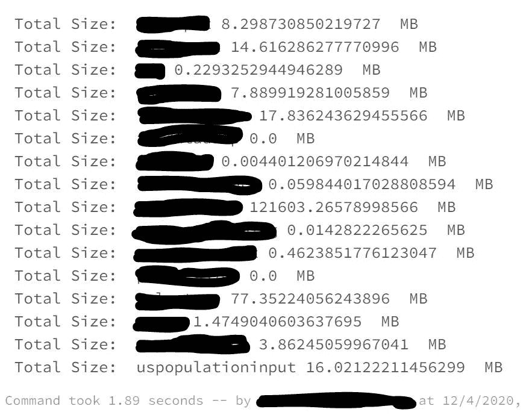

# 使用 Azure 数据块查找多租户应用程序的容器大小

> 原文：<https://medium.com/analytics-vidhya/find-container-size-for-multi-tenant-application-using-azure-data-bricks-bc58a14b146?source=collection_archive---------18----------------------->

# 用例

*   数据被加载到 Azure 数据湖
*   在多租户模型中，我们可以将每个应用租户存储到相应的容器中
*   现在，当这个 ADLS gen2 被共享时，我们需要一个机制来计算容器的大小
*   这可用于内部计费，甚至用于了解使用了多少数据

# 使用 python 记事本读取容器尺寸的步骤

# 先决条件

*   Azure 帐户
*   创造蔚蓝 ADLS 第二代
*   创建 Azure 数据块
*   将 azure-storage-blob 安装为 pypi 包
*   创建 Azure 密钥库
*   为运行时创建具有最新版本的集群
*   将 Azure 数据块连接到范围的密钥库
*   现在是创建笔记本的时候了
*   让我们从 Azure Key vault 中获取存储秘密
*   从密钥库中获取连接字符串

```
conn_str = dbutils.secrets.get(scope = "allsecrects", key = "bstoreconnstr")from azure.storage.blob import BlobServiceClient

conn_str = dbutils.secrets.get(scope = "allsecrects", key = "bstoreconnstr")
blob_service_client = BlobServiceClient.from_connection_string(conn_str=conn_str)# List all containers
   all_containers = blob_service_client.list_containers(include_metadata=True)
   for container in all_containers:
       #print(container['name'], container['metadata'])
       containername = container['name']
       #print("Container Name: " , container['name'])
       container_client = blob_service_client.get_container_client(container['name'])
       properties = container_client.get_container_properties()
       #print(properties)
       try:
            bsize = 0
            for blob in container_client.list_blobs():
                #print("Found blob: ", blob.name , " - " , blob.size)
                bsize += blob.size

            print(" Total Size: ",containername , (bsize/1024/1024), " MB")
       except ResourceNotFoundError:
            print("Container not found.")
```



*最初发表于*[*【https://github.com】*](https://github.com/balakreshnan/Accenture/blob/master/cap/ADLScontainerSize.md)*。*