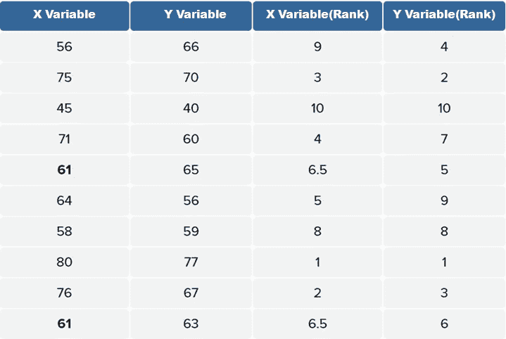
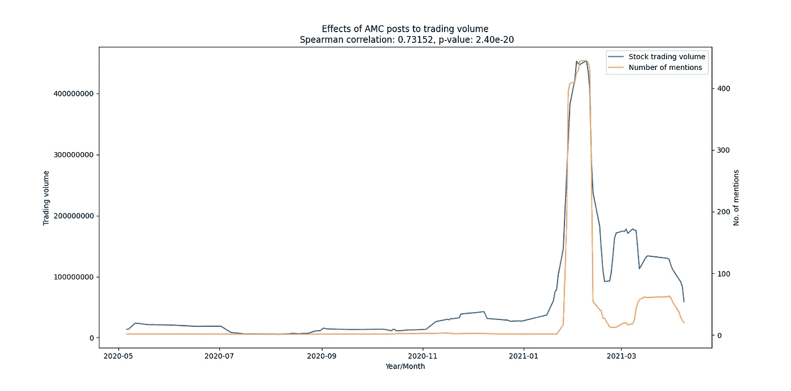

# 使用统计学发现 Reddit 和股票市场之间的相关性

> 原文：<https://medium.com/analytics-vidhya/finding-correlations-between-reddit-and-the-stock-market-using-statistics-4926a25a386e?source=collection_archive---------4----------------------->


作者图片

## 使用 VADER(化合价感知词典和情感推理机)、Pushshift API、Spacy 的命名实体识别和 Spearman 等级-顺序相关性测试。

## 介绍

2021 年初，Reddit r/wallstreetbets 一直处于金融市场最大运动之一的中心，并展示了社交媒体的力量。虽然这似乎是一个不太可能的运动来源，但事后看来，这并不令人惊讶，因为罗宾汉让散户投资者可以轻松进入股票市场，而无需支付佣金。考虑到这一点，我开始思考是否可以确定以下两者之间的相关性:

*   股票交易量中特定股票的被提及次数
*   发布特定股票的情绪和股价

在这篇文章中，我将使用 Pushshift API 从 r/wallstreetbets 中抓取数据，并使用这些数据来测试上面提到的假设。

## Pushshift API 的工作原理

[Pushshift API](https://github.com/pushshift/api) 是抓取大量 Reddit 数据的绝佳资源。使用 API 的一种方式是通过 https://api.pushshift.io/的[端点。访问 Reddit 的 pushshift URL 的基础是 https://api.pushshift.io/reddit/search/的](https://api.pushshift.io/)。

通过参数，我们将访问 Unix 时间戳格式的 2 个日期之间的 r/wallstreetbets subreddit(2020 年 4 月和 2021 年 4 月):[https://api.pushshift.io/reddit/search/submission/?**subreddit =**wallstreetbets&**after =**1585670400&**before =**1618110903&**size =**100](https://api.pushshift.io/reddit/search/submission/?subreddit=wallstreetbets&after=1585670400&before=1618110903&size=100)

*   大小—将返回条目的限制增加到 100
*   之后—开始搜索的日期
*   之前—结束搜索的日期
*   子编辑—将其缩小到特定的子编辑

上面的 URL 将返回结果的 JSON 响应。为了便于解释，我将大小减少到 1，以便更好地可视化 JSON 响应。它看起来会像这样:

```
{"data": [{"all_awardings": [],"allow_live_comments": false,"author": "br0kencircuit","author_flair_css_class": null,"author_flair_richtext": [],"author_flair_text": null,"author_flair_type": "text","author_fullname": "t2_20jrdmhz","author_patreon_flair": false,"author_premium": false,"awarders": [],"can_mod_post": false,"contest_mode": false,**"created_utc": 1585670411,**"domain":"self.wallstreetbets","full_link": "https://www.reddit.com/r/wallstreetbets/comments/fsfhli/the_four_most_expensive_words_in_the_english/","gildings": {},"id":"fsfhli","is_crosspostable": false,"is_meta": false,"is_original_content": false,"is_reddit_media_domain": false,"is_robot_indexable": false,"is_self": true,"is_video": false,"link_flair_background_color": "#7b2e00","link_flair_css_class": "shitpost","link_flair_richtext": [{"e": "text","t": "Shitpost"}
],"link_flair_template_id": "50c5e166-b861-11e5-bc53-0e60c810ce03",
"link_flair_text":"Shitpost","link_flair_text_color":"light","link_flair_type": "richtext","locked": false,"media_only": false,"no_follow": true,"num_comments": 0,"num_crossposts": 0,"over_18": false,"parent_whitelist_status": "no_ads","permalink": "/r/wallstreetbets/comments/fsfhli/the_four_most_expensive_words_in_the_english/","pinned": false,"pwls": 0,"removed_by_category": "moderator","retrieved_on": 1585675830,"score": 1,**"selftext": "[removed]"**,"send_replies": true,"spoiler": false,"stickied": false,"subreddit": "wallstreetbets","subreddit_id": "t5_2th52","subreddit_subscribers": 1065713,"subreddit_type": "public","suggested_sort": "confidence","thumbnail": "self",
**"title": "The four most expensive words in the English language are \"this time it\u2019s different.\" - Sir John Templeton",**
"total_awards_received":0,"url":"https://www.reddit.com/r/wallstreetbets/comments/fsfhli/the_four_most_expensive_words_in_the_english/",
"whitelist_status": "no_ads","wls": 0}]}
```

在 Python 中，JSON 对象可以被翻译成字典类型，在这种情况下，JSON 对象将被保存在字典键“data”下，后面是一个嵌套字典列表，包含您在上面看到的内容。我需要的关键点是粗体的，访问它们应该是这样的:

```
Title: ["data"][0]["title"]
Post text: ["data"][0]["selftext"]
Post created: ["data"][0]["created_utc"]
```

关于 API 如何工作的更详细的解释可以在[https://github.com/pushshift/api](https://github.com/pushshift/api)找到

# 构建抓取 Reddit 数据的函数

我需要首先创建一个向 Reddit 的服务器发送 HTTP 请求的函数，并返回请求内容的 JSON 响应，允许 5 次失败的 HTTP 请求尝试。

这样，我创建了另一个函数来提取 HTTP 请求并将关键数据点添加到一个列表中。与之一起的是另一个函数，它在 while 循环迭代中与前面提到的函数一起工作，从列表中取出最后一个 created_utc，并将其带回到循环中，以连续添加提交，直到满足参数 before_date。我还为 last created_utc 添加了 tqdm 模块和打印功能，以检查提取数据的进度。

我执行了带有所需参数的函数，并进行了简单的文本预处理，以消除任何被管理员删除或移除的帖子。

## 结果

整个过程耗时 13 个小时，总共删除了 1104216 个帖子，经过预处理后有 143510 个帖子。我的笔记本电脑的英特尔酷睿 i7–6700 HQ 确实受到了打击。


输出。作者图片


对收集的数据集的一瞥。作者图片

# 探索性数据分析

在我开始根据市场数据分析帖子情绪之前，我对数据进行了探索性数据分析，以更好地理解我刚刚收集的数据。

> 探索性数据分析是一种分析数据集以总结其主要特征的方法，通常使用统计图形和其他数据可视化方法。它有助于确定如何最好地操纵数据源以获得您需要的答案，使数据科学家更容易发现模式、发现异常、测试假设或检查假设。

## 1.各月的帖子数量

我做的第一件事是描绘收集的帖子的分布。很快，我就能看到帖子数量和 2021 年 1 月帖子突然增加所表明的炒作激增之间的相关性。


描述各月帖子数量的图表。作者图片

## 2.情感极性得分分布

我做的下一件事是使用 VADER( [Valence Aware 字典情感推理器](https://github.com/cjhutto/vaderSentiment#:~:text=Notifications-,VADER%20Sentiment%20Analysis.,on%20texts%20from%20other%20domains.))可视化帖子的情感。为了更准确地确定帖子的情绪，我更新了 VADER 的词典，增加了积极和消极情绪相关的词汇和子编辑中用户常用的术语，如*、【HODL】、*等

```
from vaderSentiment.vaderSentiment import SentimentIntensityAnalyzer
analyser = SentimentIntensityAnalyzer()def sentiment_analyzer(text):
    score = analyser.polarity_scores(text)
    return scoresentence = "In the case of Apple, I am extremely bullish on its price. So far it has been an upward trend"
print(sentiment_analyzer(sentence))
**OUTPUT**: 
**{'neg': 0.0, 'neu': 1.0, 'pos': 0.0, 'compound': 0.0} # Neutral***# Update lexicon for better accuracy*
positive_words = 'buy bull long support undervalued underpriced cheap upward rising trend moon rocket hold hodl breakout call beat support buying holding high profit stonks yolo'negative_words = 'sell bear bubble bearish short overvalued overbought overpriced expensive downward falling sold sell low put miss resistance squeeze cover seller loss 'pos = {i: 5 for i in positive_words.split(" ")}
neg = {i: -5 for i in negative_words.split(" ")}
stock_lexicons = {**pos, **neg}
analyser.lexicon.update(stock_lexicons)print(sentiment_analyzer(sentence))
**OUTPUT**:
**{'neg': 0.0, 'neu': 0.6, 'pos': 0.4, 'compound': 0.9325} # Positive**
```


描述帖子情感极性分布的图表。作者图片

## 3.帖子字数分布

然后我用散点图来显示每篇文章的字数。大多数帖子都在 1000 字以下，少数超过 5000 字，反映了一些用户广泛的尽职调查，他们深入分析一支股票并分享他们的发现。


描述文章字数分布的散点图。作者图片

# 寻找经常讨论的股票

在进行下一步(根据股价和市场交易量分析帖子情绪)之前，我需要首先使用以下方法确定我要关注的股票:

## 4a。基于潜在狄利克雷分配的主题建模


描述由 LDA 确定的各种主题的图表。作者图片

## 4b。Spacy 的命名实体识别(NER)

我缩小了搜索范围，将 Spacy 的 NER 集中在被归类为组织(ORG)的实体和黑名单上的普通股经纪公司和媒体公司，如美国消费者新闻与商业频道的 Robinhood。


使用潜在狄利克雷分配的主题建模产生了一些合适的主题，如 Gamestop、Blackberry 和 AMC，但与 Spacy 的 NER 相比，它在确定通常提到的股票报价机方面没有那么有效。我决定选择排名前三的股票，对 Gamestop、AMC 和特斯拉进行分析。

# 了解相关系数

相关性衡量两个变量之间的单调关联程度。两个变量之间的单调关系是:

1.  一个变量的值增加，另一个变量的值也增加
2.  随着一个变量的值增加，另一个变量减少

> 一、**重要提示:**当一个变量的变化伴随着另一个变量的相应变化时，两个变量之间的单调关系才是**线性的**。如下图 A & B 所示。


资料来源:[统计局](http://statkat.com/monotonic-relationships.php)

什么是相关系数？在最广泛的意义上，它们被用来衡量两个变量之间的关联程度。对系数值进行缩放，使其范围从-1 到 1，其中-1 表示完全负相关，1 表示完全正相关，0 表示两个变量之间没有线性或单调关系。两个最流行的系数是 P *earson 积矩相关*和 *Spearman 秩序相关*。

可以对数据进行假设检验，以确定结果的统计意义以及两个变量之间关系的强度和方向

## 皮尔逊积矩相关

也称皮尔逊 r，衡量两个变量之间 ***线性*** 相关性的强弱和方向。下面是确定皮尔逊 r 值的公式:


皮尔逊 r 公式，作者图片


作者图片

下图展示了从具有不同皮尔逊相关系数(r)的模拟二元正态分布中采样的数据散点图。


来源:[维基百科](https://en.wikipedia.org/wiki/Pearson_correlation_coefficient)

以左上图为例，我们称之为 f。它的 r 值为 0.7，这表明当 r 值> 0 时，采样数据具有正相关性，并且它在两个变量之间具有强相关性。

> 还需要注意的是，皮尔逊相关性检验还有另外两个输出: ***R*** 和 **p 值**。

*R* 为决定系数，为 0-1 之间的绝对值。对于图 F 的数据，它的 *R* 为 0.49，通过将该值乘以 100 等于 49.0%。这表示两个变量共享的差异量。由此可以解释，X 变量中 49.0%的可变性是由 Y 变量中的可变性所解释的，反之亦然。这也解释了其他 51.0%的方差是由相关性测试中未测量的未知因素造成的

p 值是指对显著性阈值为 0.05 的零假设和备择假设执行双尾分析时给出的输出。如果 p 值> 0.05，将接受零假设，或者如果两个排序变量 之间的 p 值< 0.05.

> Important note: If hypotheses further state the direction of correlation, a one-tail analysis will be performed instead.

That being said, calculation of Pearson’s r value requires certain assumptions to be fulfilled for accurate inference on the strength of association between the two variables:

*   The sample should be truly random and representative of one population of interest
*   Both variables should be measured on a continuous scale and not on an ordinal scale
*   Data must come with both an X and Y variable
*   Variables should exhibit an approximate normal(Gaussian) distribution
*   Variables must exhibit linear correlation

## Spearman’s rank-order correlation

Also known as Spearman’s ρ, it measures the strength and direction of *单调关联，将接受替代假设。注意定义上的不同。*

*与 Pearson 的 r 相似，两个相关系数之间的根本区别在于，Pearson 系数仅适用于具有线性关系的数据，而 Spearman 系数适用于单调关系。*

*还需要注意的是，Spearman 相关性不仅适用于连续数据，也适用于顺序数据，因为它是基于排序数据而不是原始数据，如下所示:*

**

*Spearman 相关检验的排序数据示例。作者图片*

*Spearman 相关系数值的解释方式与 Pearson 相关系数的解释方式相同。*

*Spearman 相关性的假设与 Pearson 相关性非常相似，但有几处不同:*

*   *变量必须表现出单调的关联性*
*   *这两个变量都应在连续尺度上测量**或在顺序尺度上测量***
*   *数据不必从正态分布中取样*

# *帖子数量与股票交易量*

*我决定使用 Spearman 相关性检验，因为它不假设数据是正态分布的。我要测试的第一个假设是，与特定股票相关的帖子数量是否与其交易量有任何形式的相关性。*

*   *零假设:帖子数量和股票交易量之间没有相关性*
*   *替代假设:帖子数量和股票交易量之间存在相关性*

*我首先对数据进行预处理。*

## *预处理*

*   *将整个语料库拆分成每个单独的股票数据帧，以便进一步预处理*

*   *收集每天交易量和股价的股票数据*

## *形象化*

*我决定绘制帖子数量和股票交易量，以更好地形象化这两个变量之间的关系。我使用滚动运算符来获得 10 天窗口的平均值，以便更清楚地了解整体趋势。*

*结果如下:*

**

*作者图片*

**

*作者图片*

**

*作者图片*

## *估价*

*所有 3 只股票的 p 值都远低于 0.05 的显著性阈值，证明无效假设并接受替代假设。基于它们的相关系数，它表明 GME 和 AMC 在提及次数与各自股票的交易量之间具有中等相关性，而 Tesla 具有低相关性。*

# *帖子情绪与股票价格*

*我要测试的下一个假设是，对某只股票的帖子的情绪是否会对该股票的价格产生影响。*

*   *零假设:帖子情绪与股票价格之间没有相关性*
*   *替代假设:帖子情绪与股票价格之间存在相关性*

## *形象化*

*我创建了一个函数，使用刚才处理的数据集，根据 VADER 提供的值计算正面和负面帖子的数量，并将所有内容绘制在 2 个不同的支线剧情上。*

*结果如下:*

**

*作者图片*

**

*作者图片*

**

*作者图片*

## *估价*

*TSLA 和 GME 的 p 值都远低于 0.05 的显著性阈值，推翻了零假设并接受了替代假设，表明股票的帖子情绪与每只股票的价值之间的相关性很低。当 AMC p 值大于显著性阈值时，接受两个变量之间没有相关性的零假设。*

## *结尾注释*

*在结束之前，我想补充一条免责声明:*

*如果可能的话，从我的项目中获得的结果应该被轻视。我不是金融顾问，本文中使用的分析并不是用来推测市场的*

*有很多事情可以做得更好*

*虽然我使用了 Spearman 相关性检验，因为它不假设数据是正态分布的，但数据的特征并不满足 Spearman 相关性检验的所有假设。在检查数据的散点图时，它显示数据的某些部分没有表现出单调关系。我本可以探索更多不同的统计测试，如 Wilcoxon Mann-Whitney 测试和 Kendall 的 tau。*

*虽然 Spacy 的命名实体识别(NER)确实捕获了大量的股票代码。一项更深入的分析表明，NER 未能对大部分数据进行分类，导致数据集变小。我可以通过使用正则表达式操作符来精确地确定收集到的每个帖子的股票代码，从而在速度上做出妥协。*

*此外，我的分析仅基于 3 只精选股票，因为它们在 r/wallstreetbets subreddit 中很受欢迎。它不代表整个股票市场。我本可以专注于其他流行的与股票相关的子分类，以获得更多种类的股票。*

*所有代码都可以在我的 Github 上找到:*

*[](https://github.com/S3annnyyy/wallstreetbetsstockanalysis) [## S3 annnyyy/wallstreetbetstockanalysis

### 一个个人项目，我对 subreddit r/wallstreetbets 中讨论的热门股票进行统计分析…

github.com](https://github.com/S3annnyyy/wallstreetbetsstockanalysis) 

LinkedIn 简介:[肖恩·雅普](https://www.linkedin.com/in/seanyckang/)

干杯！

## 参考

[1]绍贝尔，帕特里克医学博士，博士，MMedStat 波尔，克里斯塔博士，理学硕士；施瓦特，洛萨 a .医学博士，工商管理硕士，[相关系数:恰当使用与解释](https://journals.lww.com/anesthesia-analgesia/fulltext/2018/05000/correlation_coefficients__appropriate_use_and.50.aspx) (2018)，麻醉&镇痛

[2]史蒂文·布拉德伯恩博士，[皮尔逊相关解释](https://www.youtube.com/watch?v=e4ApDqG6MGE&ab_channel=TopTipBio)，[斯皮尔曼相关解释](https://www.youtube.com/watch?v=JwNwbu-g2m0&ab_channel=TopTipBioTopTipBio) (2020)，TipTopBio.com*