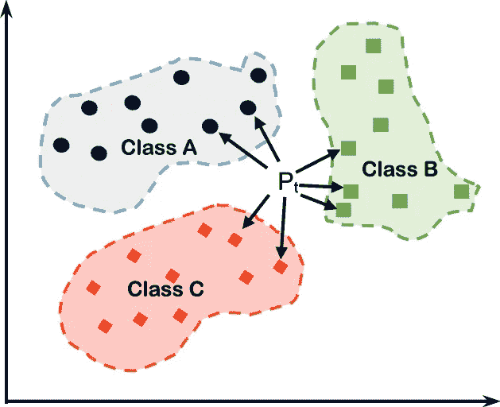
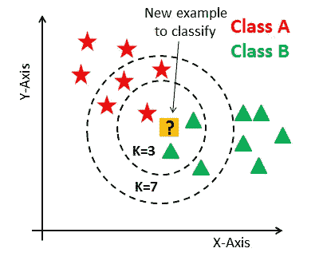
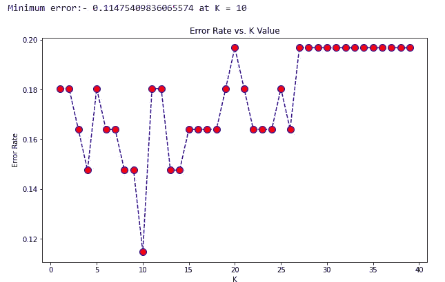
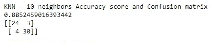
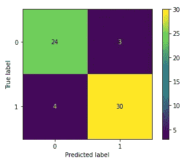

# 用 Python 语言在 KNN 分类中寻找最佳邻域数

> 原文：<https://medium.com/analytics-vidhya/finding-out-optimum-neighbours-n-number-in-the-knn-classification-using-python-9bdcfefff58c?source=collection_archive---------1----------------------->



来源:研究之门

**机器学习中的分类算法:**有几种情况我们需要利用机器学习来识别未知的物体或数据属于哪一类。这叫做分类，在这个问题中可能涉及到“m”个类别。Python 中有各种类型的分类模型可用，如 GuassianNB、DecisionTree、RandomForest、KNN n 邻域、LogisticRegression 和 SVM 分类器。现在，我们将讨论 KNN 是如何工作的，以及如何确定最佳的“n”个邻居以获得最大的精确度。

**KNN 分类器:** KNN 分类器属于监督分类算法，与其他分类模型相比，监督分类算法产生更好的结果。KNN 既可用于分类问题，也可用于回归问题。在训练时，它试图从同一个类的例子中识别模式，并识别每个类与其他类的不同之处。然后，它将这些示例和类映射到一个图中，在类的边缘有边框。当给定一个新的对象或示例来预测它应该属于哪一类时，KNN 将找到与给定示例相关联的属性，并将它们与训练中给定的各种类进行比较。如果类的属性与示例的属性匹配，则该示例属于该类。

例如，我们把 KNN 分为会飞和不会飞两类。现在我们需要确定鸡属于哪一类。乍一看，其他分类器会把鸡归类为飞行动物是由于它们的翅膀。但是 KNN 将鸡肉的所有特性与给定的类别进行比较。在这种情况下，鸡将被放置在飞行和非飞行动物的边缘，因为它有翅膀，但不能用翅膀飞行。现在，计算图中鸡肉和其他相邻样本之间的高斯距离。如果鸡与一个类的更多邻居匹配，意味着鸡属于那个类。



来源:kdnuggets

**如何找出最佳的“n”个邻居:**基于 KNN 分类器中使用的“n”个邻居，相同的例子可能属于不同的类别。那么，如何计算出最佳的“n”数以获得更高的精度和更低的错误率呢？为了回答这个问题，我们需要画一个错误率和 K 值的关系图。让我们看看如何使用 Python 绘制这个图形。

导入 StandardScaler 和 KNeighborsClassifier，并转换训练和测试数据集。我们还需要 Matplotlib 来绘制图形。您可以使用 **pip** 来安装这些软件包。(别忘了导入 matplotlib。我已经在前面的步骤中将其导入为 **plt**

```
*#feature Scaling* 
**from** **sklearn.preprocessing** **import** StandardScaler
**from** **sklearn.neighbors** **import** KNeighborsClassifier

st_x= StandardScaler()    
x_train= st_x.fit_transform(X_train)    
x_test= st_x.transform(X_test)
```

现在找出不同“n”个邻居的不同错误率。为此，您可以使用 range 函数。我已经找到了错误率，并将它们存储在 1 到 40 个邻居的数组中。

```
error_rate = []
**for** i **in** range(1,40):
 knn = KNeighborsClassifier(n_neighbors=i)
 knn.fit(x_train,y_train)
 pred_i = knn.predict(x_test)
 error_rate.append(np.mean(pred_i != y_test))
```

现在，我们需要将这些错误率与邻居值进行对比，以查看哪“n”个邻居的错误率较低。为此，我们可以使用 matplotlib 包。为了快速得到结果，我还在图上打印了最低的错误率和相应的“n”邻居值。

```
plt.figure(figsize=(10,6))
plt.plot(range(1,40),error_rate,color='blue', linestyle='dashed',marker='o',markerfacecolor='red', markersize=10)
plt.title('Error Rate vs. K Value')
plt.xlabel('K')
plt.ylabel('Error Rate')
req_k_value = error_rate.index(min(error_rate))+1
print("Minimum error:-",min(error_rate),"at K =",req_k_value)
```

该图类似于下图。因此，为了获得最佳精度，我们需要对 KNN 分类器使用“n=10”。



我将使用 n=10 个邻居的数据集来训练 KNN 分类器，看看我获得了多少准确度。我已经将模型保存到 **y_pred** 中

```
*#Fitting K-NN classifier to the training set* 
**from** **sklearn.neighbors** **import** KNeighborsClassifier  
classifier= KNeighborsClassifier(n_neighbors=req_k_value, metric='minkowski', p=2 )  
classifier.fit(x_train, y_train) 
y_pred= classifier.predict(x_test)
```

现在，我将预测测试数据集的值，同时我还将计算我们训练的分类器的准确度和混淆矩阵。

```
*#Creating the Confusion matrix* 
**from** **sklearn.metrics** **import** confusion_matrix  
print("KNN - 10 neighbors Accuracy score and Confusion matrix")
print(accuracy_score(y_pred,y_test))
print(confusion_matrix(y_test, y_pred))
print("-------------------------")
```



n=10 个邻居的精度为 88.52

让我们使用 matplotlib 来美化混淆矩阵。

```
plot_confusion_matrix(classifier, x_test, y_test)
plt.show()
```



具有 n=10(最佳)邻居的 KNN 的混淆矩阵

**结论:**通过使用上述步骤，我们将能够使用最优的‘n’个邻居来以低错误率获得训练数据集的最大准确度。然而，在某些情况下，由于训练数据可能非常小，因此由于过拟合和欠拟合，精度可能很高。因此，为了安全起见，请计算召回率、精确度、F 值、特异性、灵敏度、ROC 分数，并绘制 ROC 曲线。我将在接下来的文章中讨论如何计算这些。

**敬请关注😉**

**注意:**如果这对你学习有所帮助，请点击 claps。请在评论中告诉我你对这篇文章的看法。