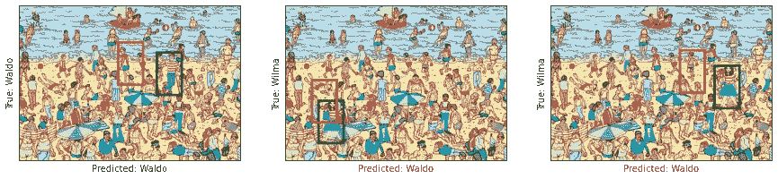
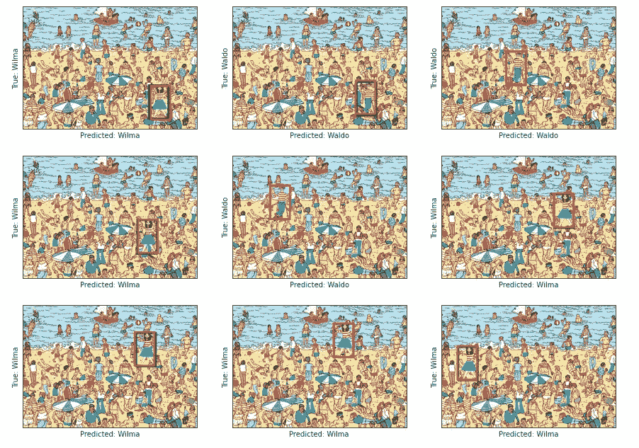

# 使用简单的卷积神经网络寻找“瓦尔多”

> 原文：<https://medium.com/analytics-vidhya/finding-waldo-using-a-simple-convolutional-neural-network-1604cb4d2e55?source=collection_archive---------2----------------------->


我已经拥有了几十个“沃尔多在哪里？”我年轻时读过书，我相信你也读过。如果你不知道是什么，“沃尔多在哪里？”*(有时被称为“沃利在哪里？”是一系列由详细的双页卡通插图组成的书，展示了数百人在给定的地点做各种有趣的事情。我们面临的挑战是找到一个名为“瓦尔多”*(或沃利)*的虚构人物，他隐藏在插图中的其他人中间。众所周知，瓦尔多穿着红白条纹衬衫，戴着圆顶礼帽和眼镜，很难找到。*


最近，在学习了一些新的对象定位和分类技术后，我想到了回归基础，使用 *Tensorflow* functional API 从头构建一个对象定位和分类教程。首先，我创建了一些样本图像，然后实现了一个卷积神经网络，最后训练了这个模型，看看它可以预测 Waldo 在图像中的位置有多好。我还引入了另一个角色“Wilma”，看看模型是否可以在这两个角色之间进行分类，同时找到他们在图像中的位置。在这篇博客中，我描述了从数据合成到模型训练的过程。因此，如果你是对象本地化的初学者，这将是一个简单而有趣的教程。如果你想去查看 *Jupyter 笔记本，*点击[这里。](https://github.com/kaneelgit/ML-DL-Algorithms/blob/main/Object%20Detection%20and%20Localization%20using%20Tensorflow.ipynb)

**合成数据**

首先我们需要综合一些数据，以便神经网络能够学习。为此，我们将使用一个示例背景图像，并在图像中随机放置“Waldo”或“Wilma”。


**用于合成数据的背景图像**


**用于合成样本图像的 Waldo(左)和 Wilma(右)的图像**

为了创建一个样本图像，我们将使用以下函数。该功能导入背景图像，Waldo & Wilma 的图像，然后将 Waldo 或 Wilma 放置在背景图像的某个随机位置*(注意图像的左上角将与该随机位置重合)。*该函数随后输出合成图像、我们放置人的随机位置 *(x，y 坐标为元组)和我们放置的**(如果是瓦尔多或威尔玛)*。

```
*#create a function to generate images*
**def** generate_sample_image():

    *#background image*
    background_im = Image.open(background_dir)
    background_im = background_im.resize((500, 350))
    *#background_im = Image.new("RGB", (500, 350), (255, 255, 255))*

    *#waldo*
    waldo_im = Image.open(waldo_dir)
    waldo_im = waldo_im.resize((60, 100))

    *#wilma*
    wilma_im = Image.open(wilma_dir)
    wilma_im = wilma_im.resize((60, 100))

    *#select x and y coordinates randomly we'll select between (0, 430) and (0, 250)*
    col = np.random.randint(0, 410)
    row = np.random.randint(0, 230)

    *#pic randomly between waldo and wilma. If 1 we will select waldo. if 0 we wills elect wilma*
    rand_person = np.random.choice([0, 1], p = [0.5, 0.5])

    **if** rand_person == 1:

        background_im.paste(waldo_im, (col, row), mask = waldo_im)
        cat = 'Waldo'

    **else**:

        background_im.paste(wilma_im, (col, row), mask = wilma_im)
        cat = 'Wilma'

    **return** np.array(background_im).astype('uint8'), (col, row), rand_person, cat
```

下面我们有一个由我们的函数创建的样本图像。如果你能在这张图片中找到沃尔多或威尔玛，你自己检查一下吧！


**我们的函数**生成的样本图像

如果你没有在这张照片中找到沃尔多或威尔玛，不要担心！，我们的算法会帮助我们找到它们。*(在这个例子中，瓦尔多在两把伞之间)*

**创建边界框**

边界框是显示对象在图像中位置的常用方式。通常，我们将向模型提供边界框的坐标，并训练它来预测边界框的坐标。理想情况下，完全训练的模型将预测与实际边界框重叠的边界框。

接下来，我们将创建一个边界框来可视化瓦尔多和威尔玛的位置。正如我以前说过的，瓦尔多或威尔玛的每个图像的左上角，将与随机位置重合。所以边界框的左上角将是这个由 *generate_sample_image* 函数生成的随机位置。

```
**def** plot_bounding_box(image, gt_coords, pred_coords = **None**):

    *#convert image to array*
    image = Image.fromarray(image)    
    draw = ImageDraw.Draw(image)
    draw.rectangle((gt_coords[0], gt_coords[1], gt_coords[0] + 60,    gt_coords[1] + 100), outline = 'green', width = 5)

    **if** pred_coords:

        draw.rectangle((pred_coords[0], pred_coords[1], pred_coords[0] + 60, pred_coords[1] + 100), outline = 'red', width = 5)

    **return** image
```

该功能输入图像、真实坐标和预测坐标*(仅在给定的情况下)*，然后在给定位置输出带有边界框的图像。下面是我们给出图像中出现的人的实际位置和预测位置时，这个函数生成的图像。注意，真实图像将由绿色矩形表示，而预测图像将由红色矩形表示。


**由函数**生成的实际和预测边界框

**数据发生器**

接下来，我们将为我们的模型创建一个数据生成器。这个数据生成器函数用于不断地向我们的模型提供图像。我们将生成训练图像、类*(如果是包含 Waldo 或 Wilma 的图像)*和边界框的位置*(该位置的 x 和 y 坐标)。*因为，我们的边界框是同样大小的矩形，我们只需要将边界框的左上角坐标输入到模型中。我们的数据生成器函数将批量输入图像，这里我们使用了默认值 16 作为批量大小。

```
*#data generator function* 
**def** generate_data(batch_size = 16):

    **while** **True**:

        *#create empty arrays for the generated data*
        x_batch = np.zeros((batch_size, 350, 500, 3))
        y_batch = np.zeros((batch_size, 1))
        boundary_box = np.zeros((batch_size, 2))

        **for** i **in** range(batch_size):

            *#generate an example image*
            sample_im, pos, person, _ = generate_sample_image()

            *#put the images to the arrays*
            x_batch[i] = sample_im/255 *#normalize*
            y_batch[i] = person
            boundary_box[i, 0] = pos[0]
            boundary_box[i, 1] = pos[1]

        **yield** {'image': x_batch} , {'class': y_batch, 'box':      boundary_box}
```

**使用 Tensorflow 实现模型**

我们的模型有三个主要部分。我们将使用 Tensorflow functional API 为每个部分定义一个函数。第一部分提取特征，第二部分创建回归输出，最后部分创建分类输出。下面是我们模型的概述。


**我们模型的概述**

如前所述，在模型的第一部分，我们必须检测训练图像的特征。为了做到这一点，我们将使用多个卷积层，每个卷积层后面都有批处理规范化和最大池。下面是执行这部分模型的函数。

```
#create the model
def convolutional_block(inputs):

    x = tf.keras.layers.Conv2D(16, 3, padding = 'same', activation = 'relu')(inputs)
    x = tf.keras.layers.BatchNormalization()(x)
    x = tf.keras.layers.MaxPool2D(2)(x)

    x = tf.keras.layers.Conv2D(32, 3, padding = 'same', activation = 'relu')(x)
    x = tf.keras.layers.BatchNormalization()(x)
    x = tf.keras.layers.MaxPool2D(2)(x)

    x = tf.keras.layers.Conv2D(64, 6, padding = 'valid', activation = 'relu')(x)
    x = tf.keras.layers.BatchNormalization()(x)
    x = tf.keras.layers.MaxPool2D(2)(x)

    x = tf.keras.layers.Conv2D(64, 6, padding = 'valid', activation = 'relu')(x)
    x = tf.keras.layers.BatchNormalization()(x)
    x = tf.keras.layers.MaxPool2D(2)(x)

    return x
```

接下来我们将定义回归块。回归块包含盒子位置的输出。我们将首先展平从卷积模块获得的输出，然后使用几个密集层，最后是没有激活的密集层。

```
def regression_block(x):

    x = tf.keras.layers.Flatten()(x)
    x = tf.keras.layers.Dense(1024, activation = 'relu')(x)
    x = tf.keras.layers.Dense(512, activation = 'relu')(x)
    x = tf.keras.layers.Dense(2, name = 'box')(x)

    return x
```

最后，我们将定义分类块。这也将具有平坦层，接着是几个致密层，以及具有单个神经元和 s 形激活的最终致密层。我们使用 sigmoid 激活，因为我们正在执行二元分类。

```
def classification_block(x):

    x = tf.keras.layers.Flatten()(x)
    x = tf.keras.layers.Dense(1024, activation = 'relu')(x)
    x = tf.keras.layers.Dense(512, activation = 'relu')(x)
    x = tf.keras.layers.Dense(1, activation = 'sigmoid', name = 'class')(x)

    return x
```

最后，我们将定义输入和输出，并启动模型。

```
#create the model instance
inputs = tf.keras.Input((350, 500, 3))#conv block
x = convolutional_block(inputs)#outputs
box_output = regression_block(x)
class_output = classification_block(x)#model instance
model = tf.keras.Model(inputs = inputs, outputs = [class_output, box_output])
```

这是模型的概要图。*(注意，前几个卷积层未示出)*


**模型的剧情**

**编译并训练我们的模型**

现在让我们编译和训练我们的模型。在此之前，我们将创建一些定制的回调函数来可视化我们在训练期间的输出。我们将创建一个函数来进行预测，并在训练时每两个时期绘制一次。这将让我们看到模型如何通过更多的训练来改进它的预测。

下面的函数 *test_model* 创建三个示例图像，然后使用当前模型来预测类别和边界框位置。该功能将用“绿色”绘制真实边界框，用“红色”绘制预测边界框。该函数还将在图像的 x 标签中打印预测的类。

```
#custom function to visualize the predictions after epochs
def test_model():

    fig, ax = plt.subplots(1, 3, figsize = (15, 5))    

    for i in range(3):

        #get sample image
        sample_im, pos, _, cat = generate_sample_image()
        sample_image_normalized = sample_im.reshape(1, 350, 500, 3)/255
        predicted_class, predicted_box = model.predict(sample_image_normalized)

        if predicted_class > 0.5:
            predicted_class = 'Waldo'
        else:
            predicted_class = 'Wilma'

        #assign color
        col = 'green' if (predicted_class == cat) else 'red'

        #get bounding boxes
        im = plot_bounding_box(sample_im, pos, (predicted_box[0][0], predicted_box[0][1]))

        #plot image
        ax[i].imshow(im)
        ax[i].set_xticks([])
        ax[i].set_yticks([])
        ax[i].set_ylabel('True: ' + cat, color = 'green')
        ax[i].set_xlabel('Predicted: ' + predicted_class, color = col)

    plt.show()

class VisCallback(tf.keras.callbacks.Callback):

    def on_epoch_end(self, epoch, logs = None):

        if epoch % 2 == 0:

            test_model()
```

我们还将创建一个函数来降低学习率。这样，我们将能够避免达到次优权重，并更快地训练模型。

```
#learning rate scheduler
def lr_schedule(epoch, lr):

    if (epoch + 1) % 5 == 0:

        lr *= 0.2

    return max(lr, 3e-7)
```

现在让我们最后编译模型和训练。我们将使用 Adam 优化器，将“二元交叉熵”作为分类损失*(因为我们正在进行二元分类)*，将“均方误差”作为回归损失。

```
#compile 
model.compile(optimizer = tf.keras.optimizers.Adam(), loss = {'class': 'binary_crossentropy', 'box': 'mse'}, \
              metrics = {'class': 'accuracy', 'box': 'mse'})#fit the model
model.fit(generate_data(), epochs = 10, steps_per_epoch = 100, callbacks = [VisCallback(),                                                                         tf.keras.callbacks.LearningRateScheduler(lr_schedule)])
```

以下是训练中的一些类预测和边界框预测。


**在时段 1 的末尾:** x 标签表示模型预测，y 标签表示实际类别。红框是预测边界框，绿框是真实边界框。



**在时段 5 的末尾:** x 标签表示模型预测，y 标签表示实际类别。红框是预测边界框，绿框是真实边界框。


**在时段 9 的末尾:** x 标签表示模型预测，y 标签表示实际类别。红框是预测边界框，绿框是真实边界框。

这里我们可以清楚地看到，当纪元增加时，模型正在学习。在第一个纪元之后，我们只看到一个正确的分类。如果我们专注于边界盒，预测的边界盒是非常不准确的。我们可以看到在纪元 5 有轻微的增加。在纪元 9 之后，我们看到模型能够正确地分类所有三个测试用例，并且容易地定位边界框。下面是模型完全训练后的一些测试示例 *(10 个时期)*。



**完全训练好的模型的预测**

**结论**

在这里，我重现了经典游戏“沃尔多在哪里？”为了展示我们如何使用深度学习进行对象定位和分类。我们合成了数据，创建了边界框，创建了数据生成器，最后实现了一个卷积神经网络来分类和定位我们的虚构角色 Waldo & Wilma。我们还可以通过使用“瓦尔多在哪里？”的真实图像来测试我们的模型的可推广性。然而，由于我们对所有图像使用相同的背景，我们的模型可能会偏向于我们当前的图像，因此为了进一步改进我们的模型并使其更具普遍性，我们可以使用其他背景来多样化我们的训练数据集。

希望你喜欢这篇文章。感谢您的阅读！