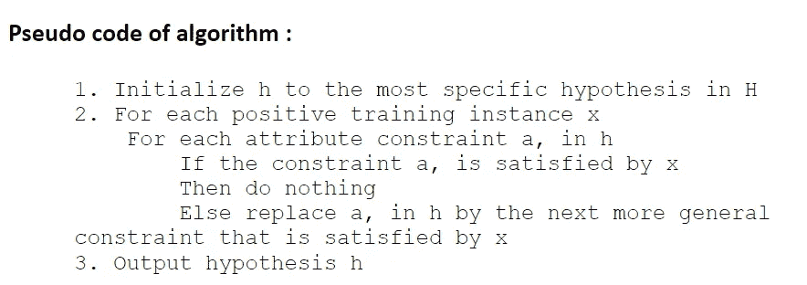
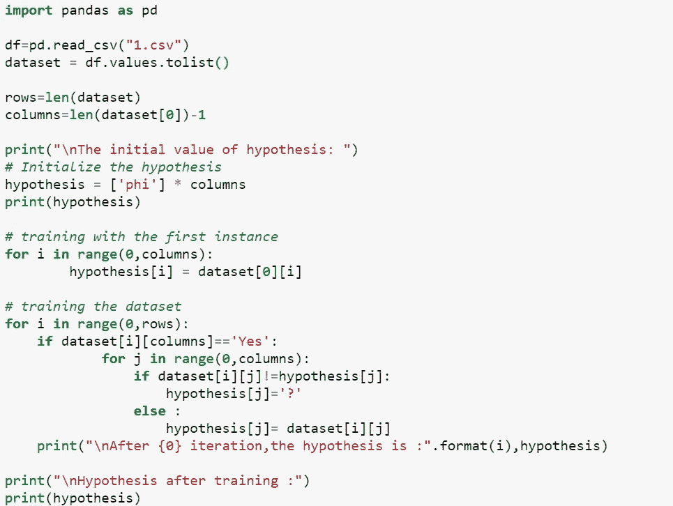

# 在机器学习中寻找算法

> 原文：<https://medium.com/analytics-vidhya/finds-algorithm-in-machine-learning-dab80824cdbe?source=collection_archive---------9----------------------->

大家好，在本文中，我将实现并演示 FIND-S 算法，该算法基于一组给定的训练数据样本来查找最具体的假设。

在 finds 算法中，我们将假设初始化为 phi 数组，在第一步中，我们用数据集的第一个正行替换它，这是最具体的假设。

在下一步中，我们将遍历数据集并检查数据集的目标值是否为正值，我们将只考虑正值。如果值为正，我们将从头到尾遍历该行，并检查是否有任何元素与我们各自的假设相匹配。如果元素与假设不匹配，我们将推广假设，并用数据集元素替换假设中的元素。

# **算法讨论:**

1.  FIND-S 算法从最具体的假设出发，通过只考虑正例来进行推广。
2.  FIND-S 算法忽略反例。–只要假设空间包含描述真实目标概念的假设，并且训练数据不包含错误，忽略负面示例不会导致任何问题。
3.  FIND-S 算法在 H 内找到与正训练样本一致的最具体的假设。–如果正确的目标概念在 H 中，并且训练示例是正确的，则最终假设也将与负面示例一致。

# **算法的伪代码:**

*下面是我们将如何实现查找算法的代码，*

*从上面我们可以得出结论，*

1.  我们发现没有办法确定是唯一的最终假设与数据一致还是有更多的假设与数据一致。
2.  由于忽略了负样本，不一致的数据集会产生错误的假设。

为了克服由于只使用正例而面临的问题，我们使用候选排除算法，其中我们也考虑负例。

谢谢大家！