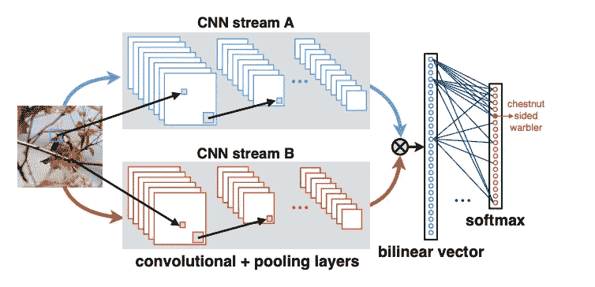
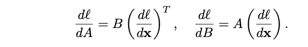
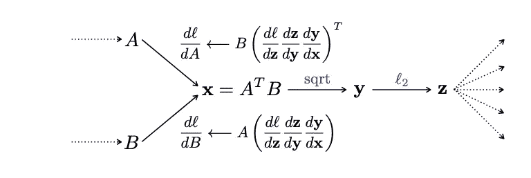
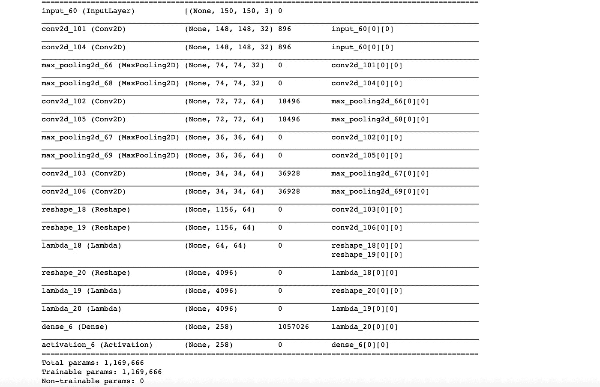

# 使用双线性卷积神经网络-张量流 V2 的细粒度图像分类

> 原文：<https://medium.com/analytics-vidhya/fine-grained-image-classification-using-bilinear-convolutional-neural-networks-tensorflow-v2-4baf875d45e1?source=collection_archive---------7----------------------->

这篇文章是发表在[https://arxiv.org/abs/1504.07889](https://arxiv.org/abs/1504.07889)的双线性 CNN 的 TF 实现。请务必阅读这篇论文，以便更好地理解。

先决条件:- Python，CNN 的，Keras，TF

**代码托管在**[**https://github . com/tommarvoloriddle/双线性-CNN-tensor flow 2.4-实现**](https://github.com/tommarvoloriddle/Bilinear-CNN-Tensorflow2.4-implementation)

# 想法

诸如 VGG、RNN 的 CNN 已经被发现对于细粒度图像识别执行得不太好，如果被训练的图像数据集不包含与 Imagenet 相似的图像，则性能会更差。因此，这个想法是创造一个新的架构，而不失去以前的线性 SOTA 的功能

# 直觉

双线性 CNN 背后的直觉可以理解为简单的并行 CNN，每个 CNN 试图识别同一图像的不同特征。粗略地说，在识别特定的鸟类物种时，可以使用两个平行的 CNN，一个识别喙，另一个识别尾巴。这个例子只是提供一种直觉，实际上多个 CNN 识别不同的特征，但是这些特征可以是非常小的边缘，不像尾巴和喙那样明显。对输入进行热图分析将有助于更好地理解 B-CNN。

# 使用

B-CNN 克服了线性 CNN 的一些问题，例如改进了精细分类，例如将鸟类分类为 200 种([http://www.vision.caltech.edu/visipedia/CUB-200.html](http://www.vision.caltech.edu/visipedia/CUB-200.html))，对零售店产品进行分类。

# 双线性卷积神经网络

双线性 CNN 是使用矩阵外积([https://en.wikipedia.org/wiki/Outer_product](https://en.wikipedia.org/wiki/Outer_product))组合的简单并行 CNN。CNN 的输出在 FC 层之前获取。



图 1 : B-CNN 架构。

由于整体架构是有向非循环图，因此可以通过反向传播分类损失的梯度(例如，交叉熵)来训练参数。双线性形式简化了梯度计算。如果两个网络的输出分别是大小为 L × M 和 L × N 的矩阵 A 和 B，则双线性特征为 x = A(T)B(A * B 的转置),大小为 M × N。设 dl/dx 为损失函数 L 相对于 x 的梯度，则根据梯度链规则，我们得到



图 2:梯度的链式法则。

## 反向传播中的梯度流。



图 3:梯度流。

# 履行

我们必须定义我们的外积、l2 归一化和平方根函数，以实现如图 3 所示的流程。

点积函数假设输入张量的大小相同，但也可以是不同的大小，如图 3 所示，点积需要一些变化。

```
*"""*
*Calculates dot product of x[0] and x[1] for mini_batch* 

*Assuming both have same size and shape*

*@param*
*x -> [ (size_minibatch, total_pixels, size_filter), (size_minibatch, total_pixels, size_filter) ]*

*"""*
**def** dot_product(x):

    **return** keras.backend.batch_dot(x[0], x[1], axes=[1,1]) / x[0].get_shape().as_list()[1] 

*"""*
*Calculate signed square root*

*@param*
*x -> a tensor*

*"""*

**def** signed_sqrt(x):

    **return** keras.backend.sign(x) * keras.backend.sqrt(keras.backend.abs(x) + 1e-9)

*"""*
*Calculate L2-norm*

*@param*
*x -> a tensor*

*"""*

**def** L2_norm(x, axis=-1):

    **return** keras.backend.l2_normalize(x, axis=axis)
```

## 建筑模型

构建模型函数将返回给我们双线性模型。在这种情况下，我们从最后一层获取 2 个 VGG16 网络的输出。要自定义 CNN，请检查 repo 中的代码([https://github . com/tommarvoloriddle/Bilinear-CNN-tensor flow 2.4-implementation/blob/main/Bilinear-custom . ipynb](https://github.com/tommarvoloriddle/Bilinear-CNN-Tensorflow2.4-implementation/blob/main/BILINEAR-Custom.ipynb))。

输出被重新整形以匹配张量形状，这在构建定制 CNN 时很有用。

外积、L2 范数、sqrt 作为 Lamda 层被添加到模型中，也将不具有任何可训练的权重。

```
*'''*

 *Take outputs of last layer of VGG and load it into Lambda layer which calculates outer product.*

 *Here both bi-linear branches have same shape.*

 *z -> output shape tuple*
 *x -> outpur og VGG tensor*
 *y -> copy of x as we modify x, we use x, y for outer product.*

*'''*

**def** build_model():
    tensor_input = keras.layers.Input(shape=[150,150,3])

*#   load pre-trained model*
    tensor_input = keras.layers.Input(shape=[150,150,3])

    model_detector = keras.applications.vgg16.VGG16(
                            input_tensor=tensor_input, 
                            include_top=**False**,
                            weights='imagenet')

    model_detector2 = keras.applications.vgg16.VGG16(
                            input_tensor=tensor_input, 
                            include_top=**False**,
                            weights='imagenet')

    model_detector2 = keras.models.Sequential(layers=model_detector2.layers)

    **for** i, layer **in** enumerate(model_detector2.layers):
        layer._name = layer.name  +"_second"

    model2 = keras.models.Model(inputs=[tensor_input], outputs = [model_detector2.layers[-1].output])

    x = model_detector.layers[17].output
    z = model_detector.layers[17].output_shape
    y = model2.layers[17].output

    print(model_detector.summary())

    print(model2.summary())
*#   rehape to (batch_size, total_pixels, filter_size)*
    x = keras.layers.Reshape([z[1] * z[2] , z[-1]])(x)

    y = keras.layers.Reshape([z[1] * z[2] , z[-1]])(y)

*#   outer products of x, y*
    x = keras.layers.Lambda(dot_product)([x, y])

*#   rehape to (batch_size, filter_size_vgg_last_layer*filter_vgg_last_layer)*
    x = keras.layers.Reshape([z[-1]*z[-1]])(x)

*#   signed_sqrt*
    x = keras.layers.Lambda(signed_sqrt)(x)

*#   L2_norm*
    x = keras.layers.Lambda(L2_norm)(x)

*#   FC-Layer*

    initializer = tf.keras.initializers.GlorotNormal()

    x = keras.layers.Dense(units=258, 
                           kernel_regularizer=keras.regularizers.l2(0.0),
                           kernel_initializer=initializer)(x)

    tensor_prediction = keras.layers.Activation("softmax")(x)

    model_bilinear = keras.models.Model(inputs=[tensor_input],
                                        outputs=[tensor_prediction])

*#   Freeze VGG layers*
    **for** layer **in** model_detector.layers:
        layer.trainable = **False**

    sgd = keras.optimizers.SGD(lr=1.0, 
                               decay=0.0,
                               momentum=0.9)

    model_bilinear.compile(loss="categorical_crossentropy", 
                           optimizer=sgd,
                           metrics=["categorical_accuracy"])

    model_bilinear.summary()

    **return** model_bilinear
```

## 模型摘要

自定义 B-CNN 的摘要，因为带有 2 个 VGG16 的会占用很多页面，会令人困惑。

在此总结中，我们可以看到，101 和 104 的输入是相同的，这是我们的起点。我们将 103 和 106 的输出送到 lambda 18(外积)。



图 4:定制 B-CNN 的模型总结

其他通用方法如模型拟合和预测在本文中被跳过，因为它已经很长了，但是可以在[**https://github . com/tommarvoloriddle/Bilinear-CNN-tensor flow 2.4-implementation**](https://github.com/tommarvoloriddle/Bilinear-CNN-Tensorflow2.4-implementation)**上找到。**

[1]聪-林玉等人的用于细粒度视觉识别的双线性 CNN([https://arxiv.org/pdf/1504.07889.pdf](https://arxiv.org/pdf/1504.07889.pdf))

[2] [瑞恩](https://github.com/ryanfwy)-([https://github.com/ryanfwy/BCNN-keras-clean](https://github.com/ryanfwy/BCNN-keras-clean))