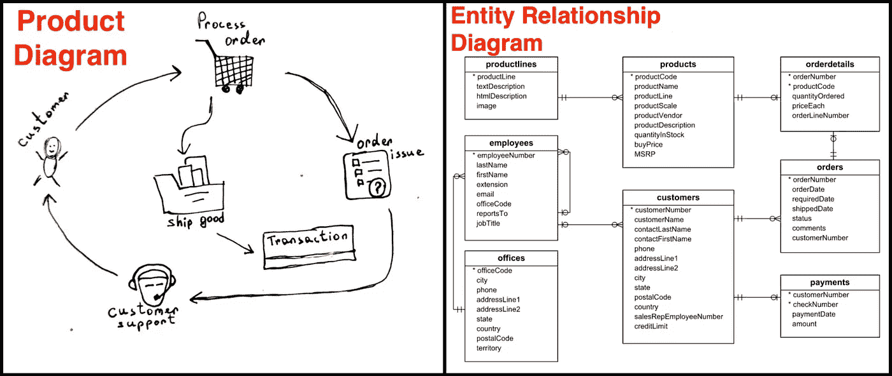
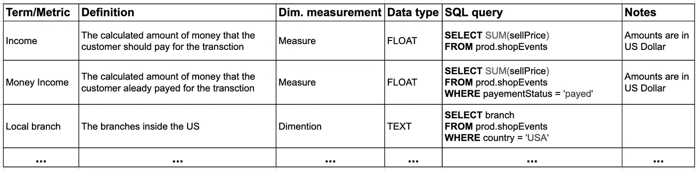
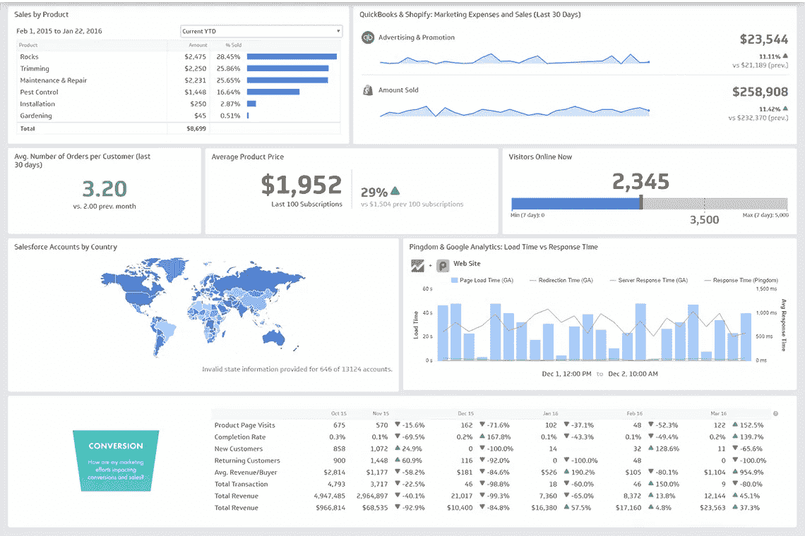
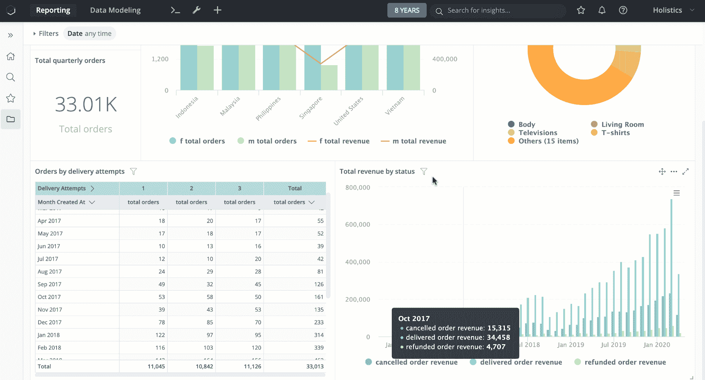

# 作为数据分析师进入公司的前 5 步

> 原文：<https://medium.com/analytics-vidhya/first-5-steps-to-take-in-the-company-as-a-data-analyst-3db057d51cf6?source=collection_archive---------22----------------------->

有许多文章、视频和图表解释了数据分析师的角色和职责。当然，它们中的大多数是非常有用的，可以帮助你在职业选择的十字路口定位，或者可以帮助 HR 撰写职位描述，但这些对于已经在该领域工作的专家来说是没有用的。

当你刚开始作为一名数据分析师工作并进入组织时，你可能会对从哪里开始和走哪条路感到困惑。这种情况在刚刚开始定量分析，还没有来自数据团队的产品 MVP 的公司中很常见，这是一种非常常见的情况，因为成为数据驱动的公司是一种趋势

在本文中，我将尝试帮助那些困惑的数据分析师，并描述他们需要采取的步骤，以结构化工作流程并应对上述情况。我经常把这叫做工作中的“造势”。当然，这些步骤及其顺序主要是特定于产品的，可能与您的情况不匹配，因此，这些是我认为在大多数情况下必需的步骤。

# **1。深入了解产品和数据。**

首选的数据分析师不是等待分配任务，然后开始学习完成任务所需的工具集的人，而是能够对任务组合过程、决策制定和 KPI 设置产生重大影响的人，这需要对产品有透彻的理解。为了对产品有一个彻底的了解，你可能需要接近产品经理并要求一个单独的会议，在会议期间他或她将描述整个业务流程结构。将你对该产品的所有了解以图表或图像的形式写在纸上是一个好主意。

之后，您需要熟悉该产品生成的数据。如果他们有，您可以请求 erd(实体关系图)、文档和数据词汇表。您将需要处理数据，构建一些困难的查询、连接和聚合，并在获得对这些数据库和表的访问权限后，了解这个“庞然大物”是如何工作的。

# 2.创建数据字典。

作为数据分析师，业务和数据的“翻译”是您工作的一部分。如果您直接从数据库进行这些“翻译”，语言主要是 SQL，如果您希望为构建指标进行一些艰难的数学计算，语言主要是 Python/R。但是，您应该意识到，当上下文不同时，术语在相同含义的翻译中偶尔会有不同的使用。数据分析也是如此。例如，当某个电子商务网站的业务人员或管理层向你询问上个月的总活跃用户数时，你应该做的第一件事是请他描述一下他认为谁是“活跃”用户，即曾经浏览过某个产品的用户？还是每天都出现在行为数据中？还是发出各种事件？

业务和技术团队之间的这种术语误解是常见的，但是有一个奇妙的解决方案:数据字典，这是一个详细解释所有术语、度量和 KPI 的文档。

它可能看起来像这样:

阅读这个例子的内容，以便清楚地理解这个概念。

为了更深入地观察数据字典，我建议阅读这篇文章。

# 3.关键绩效指标(KPI)仪表板。

我知道创建 KPI 主要是产品经理的职责，但是数据分析师也应该参与 KPI 的创建过程，因为他将提供视觉效果来衡量项目的产品/成功。

因此，在配置 KPI 之后，数据分析师知道从哪里获取数据(使用数据字典)，一旦他知道了，他就可以将数据链接到他的可视化工具(Tableau、Power BI、QuickSight 等)。)并生成可视化。创建这样的仪表板时，UI(用户界面)的可读性是最重要的。它可以显示在安装在办公室墙上的电视屏幕上，用户(管理层、利益相关者或员工)不应该要求使用鼠标来获取附加信息。以仪表板的形式计划每日报告并通过电子邮件分发给感兴趣的人也是一个好主意。

# 4.报告生成器仪表板。

您可能已经熟悉了一个或多个可视化工具(Tableau、Power BI、QuickSight 等等)和创建有趣的可视化的技术。然而，为经理和业务分析师提供一个工具来生成包含用户选择的指标和过滤器的报告也是至关重要的。

在这种情况下，最重要的因素是 UX 和灵活性。这种仪表板的主要目标不是让业务人员欣赏它的设计或每天观看它，而是在不使用 SQL 的情况下生成任何报告和检索任何统计数字。这还可以减少特别请求的数量，因为请求者可以从这个工具仪表板中获得汇总的数字。为了让它变得多才多艺，你需要使用很多过滤器和参数。

例如，如果财务部门的某人想要将特定类型产品的当月总收入与去年同月进行比较，他可以通过使用日期和产品类型过滤器以及收入指标从仪表板中获取数字，而不是在看板中创建常规数据请求并使数据团队过载。

# 5.健康监控(数据验证)和警报系统。

数据分析师的另一项优先任务是持续监控数据状态，以确保基于数据的报告正常运行和执行。当然，如果不保证数据正确，数据库运行流畅，你会去衡量什么？

这也可以由仪表板或任何其他类型的报告来表示，但它主要是为技术用户(如您)提供的，用于定义健康指标。健康监控的主要目标是通过修补数据库来发现数据库中的不一致。例如，您可以比较公司的所有付款和损益表。搜索每个表中的重复值或空值也是一个好主意。

当数据库出现问题时，警报系统会发出通知或电子邮件。DAU(或任何其他)趋势线急剧下降、任何列的空值数量或数据库作业失败都是例子。