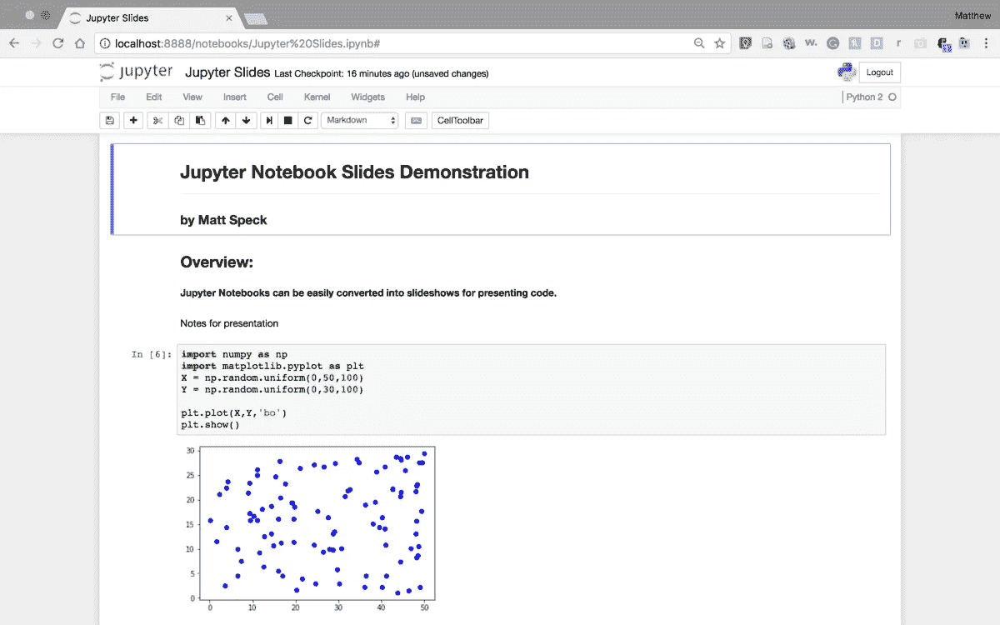
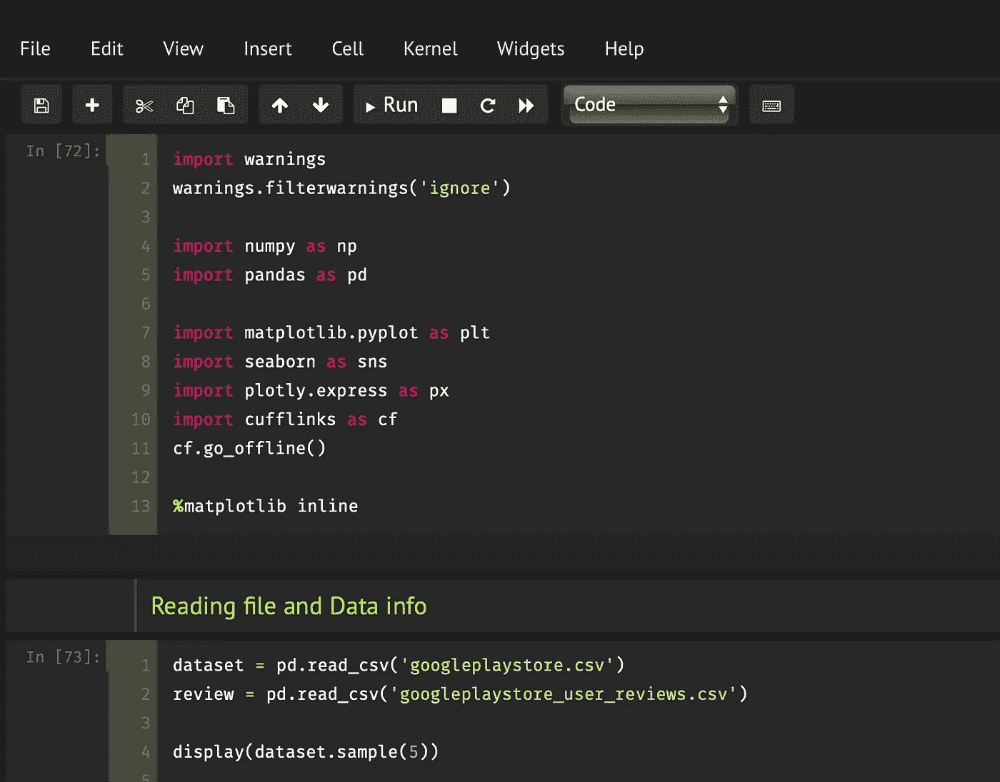

# 安装 Jupyter 笔记本后的第一件事

> 原文：<https://medium.com/analytics-vidhya/first-thing-after-installing-jupyter-notebook-f01391808ef0?source=collection_archive---------25----------------------->

## 改变它的主题…

终于，你下定决心在你的系统上安装 Jupyter 笔记本，开始了处理数据的旅程。

看看最近有多流行**黑暗模式**，我研究的每一个应用程序都试图建立这种模式，你可以通过拨动开关从无聊的*【全白】*主题切换到 ***黑暗主题(晚上效果最佳)*** 。

如果你像我一样是一个喜欢在晚上为一些个人项目工作的程序员，我必须告诉你，通过阅读这篇文章，你已经找到了一个 ***金块*** 。

下图是 jupyter 笔记本默认给我们的不那么酷的默认主题。我在一张图中知道了太多的白色。

想改变吗？当然可以。



带有无聊白色主题的 Jupyter 笔记本(默认)

如果我告诉你这只是暂时的。使用“pip install jupyter”安装完 jupyter 后，请按照以下步骤操作:

```
# install jupyterthemes 
pip install jupyterthemes

# upgrade to it's latest version
pip install --upgrade jupyterthemes
```

如果你在安装时遇到一些问题，请在评论中联系我。

安装后，使用下面的命令列出所有可用的主题。

```
# list themes
jt -l
```

我们终于到了最后一步，可以尝试不同的主题并应用最适合我们的主题

```
# apply theme ex. monokai
jt -t monkai
```

这是您在终端上点击几个命令后得到的结果。

***很神奇是不是？***



应用黑暗模式后的 Jupyter 笔记本

如果你仍然觉得有任何困难，你可以参考这个 GitHub 文档。

[](https://github.com/dunovank/jupyter-themes) [## duno vank/jupyter-主题

### 作者版本状态演示 Kyle Dunovan 前面提到的在 Jupyter 实验室开发定制主题的 CLI 的计划是…

github.com](https://github.com/dunovank/jupyter-themes) 

尝试所有的可能性，并找到最佳的主题，使处理数据成为一件有趣的事情！