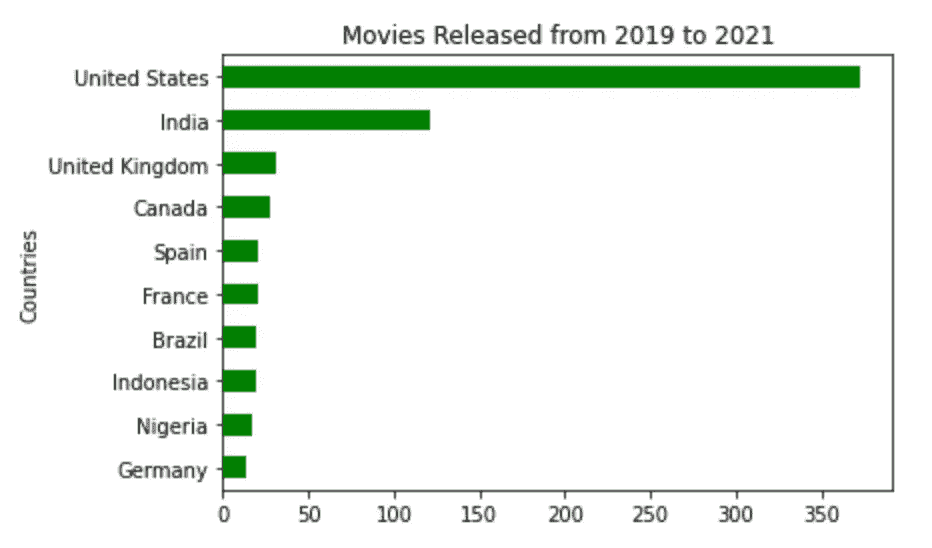

# 五个有用的熊猫方法

> 原文：<https://medium.com/analytics-vidhya/five-useful-pandas-methods-b17ddffbc47f?source=collection_archive---------11----------------------->

如何轻松地开始使用五个有价值的熊猫方法，可以帮助您的下一个数据分析项目。


由 catalyststuff 创建的图书矢量—[www.freepik.com](https://www.freepik.com/vectors)

如果你来这里不知道标题的确切含义，我不是在谈论上面图片中的酷动物。我说的熊猫也很酷，它是一个用于数据操作和分析的开源库，建立在 Python 编程语言之上。

我在这篇文章中的目的是向你展示熊猫图书馆的一些有用的资源，你可以很容易地在你的数据分析项目中使用它们。我将介绍我在项目中使用的五种有用的方法。我不会在本文中涵盖该库的所有方法，但是如果您有兴趣了解更多，我推荐您看一下[文档](https://pandas.pydata.org/docs/)。

在我们开始使用 Pandas 库之前，理解什么是 DataFrame 对象是很重要的。这是一个包含列和行的二维表格。

再者，如果你不知道什么是方法，它类似于函数，但与特定对象相关。在本文的上下文中，您可以将这些方法看作是对您正在处理的 Pandas 数据框架可用的函数。

# 入门指南

开始使用 Pandas 的第一步是导入库。您可以通过运行以下代码来实现。

```
import pandas as pd
```

现在，我们可以加载数据集了。对于本文中的所有示例，我们将使用 [Kaggle](https://www.kaggle.com/shivamb/netflix-shows) *上的“网飞电影和电视节目”数据集。*这是一个 CSV 文件，我们可以使用下面的函数将数据读入数据帧。

```
df = pd.read_csv("./netflix_titles.csv")
```

在读取数据集之后，我们可以使用 *head()* 函数来显示 DataFrame 的前五行。

```
df.head()
```


原创熊猫数据帧网飞电影和电视节目。

以下是 Kaggle 上为数据集中的 12 列提供的信息汇总:

> ***show_id:*** *每个电影/电视节目的唯一 ID* ***type:****Identifier—电影或电视节目* ***Title:****电影/电视节目的名称* ***导演:*** *电影导演* ***放映* ***国家:*** *电影/节目制作的国家* ***日期 _ 添加:*** *日期添加于网飞* ***上映 _ 年份:*** *实际上映年份/放映* ***评分:*****

# ***1 -过滤特定数据***

*假设我们需要基于特定的值来过滤我们的数据帧。在这种情况下，我们可以使用 *loc* 方法并提供我们需要的过滤器。当调用这个方法时，它不会用过滤后的数据帧订阅我们的原始数据帧。因此，如果您需要一个过滤的数据帧，您需要将它赋给一个新的变量。*

*使用我们的数据框架，例如网飞的电影和电视节目，我们可以定义一个新的数据框架，包含 2018 年以后上映的所有电影。然后我们可以调用方法 *loc* 并提供我们需要过滤的参考值。*

```
*new_movies = df.loc[(df.type=="Movie") & (df.release_year>2018)]*
```

*当调用“new_movies”时，可以看到行被过滤了。我们只有类型为“电影”且发行年份大于 2018 年的值。*

**

*过滤了行的数据帧“新电影”。*

*方法 *loc* 通过*【行，列】*工作。在前面的例子中，我们只指定了要过滤的行，所以它保留了原始数据帧中的所有列。我们还可以使用 column 参数来定义要保存在“new_movies”数据帧中的特定列。*

```
*columns = ["type","title","country","date_added","release_year","rating","listed_in"]new_movies = df.loc[(df.type=="Movie") & (df.release_year>2018), columns]*
```

*现在，当调用 *new_movies* 时，可以看到行和列被过滤了。*

**

*过滤了行和列的数据帧“新电影”。*

# ***2 -获取唯一值***

*现在，假设我们需要知道“新电影”数据库中的所有评级类型。我们不需要查看整个数据库(超过 1000 行)并检查列中显示的值。对于这个任务，我们可以简单地使用方法*独特的*。*

```
*new_movies.rating.unique()*
```

*当我们运行这段代码时，我们从我们的列中获得一个包含所有 singles 值的数组。*

```
*array(['TV-MA', 'TV-14', 'R', 'TV-G', 'TV-PG', 'PG-13', 'PG', 'TV-Y', 'G', 'TV-Y7'], dtype=object)*
```

*我们还可以检查每种评级类型有多少条目(或行)。为此，我们需要调用 *value_counts* 方法。*

```
*new_movies.rating.value_counts()*
```

*运行这段代码，我们将得到如下结果:*

```
*TV-MA    448 
TV-14    208 
TV-PG     96 
R         75 
TV-Y      56 
TV-G      35 
PG-13     34 
PG        26 
TV-Y7     25 
G          2 
Name: rating, dtype: int64*
```

# *3 -使用自定义函数创建新列*

*除了我们可用于数据框架的方法之外，Pandas 还允许我们创建自定义函数。创建它们的一种方法是使用*应用*的方法。*

*假设我们想要创建一个新的列，其中包含电影是纪录片的信息。该信息在列“listing_in”中，具有与电影或电视节目相关的所有类型。我们可以定义一个简单的函数，并将其应用于“listing_in”列来创建我们的新列。如果电影是纪录片，则返回 True，否则返回 False。*

```
*def genre_doc(gen):
   return ("Documentaries" in gen)*
```

*然后，我们可以应用我们的函数来创建新的列“流派 _ 纪录片”*

```
*new_movies["genre_documentaries"] = 
new_movies["listed_in"].apply(genre_doc)*
```

*现在，当调用 *new_movies* 时，可以看到我们的新列的值为 True 或 False。*

**

*带有“类型 _ 纪录片”栏的数据框“新 _ 电影”。*

*由于我们正在定义一个简单的自定义函数，我们可以应用 lambda 函数来代替。lambda 是一个匿名函数，我们不需要声明它。使用下面的代码，我们在创建列“genre_documentaries”时会得到相同的结果*

```
*new_movies["genere_documentaries"] = new_movies["listed_in"].apply(lambda gen: "Documentaries" in gen)*
```

# ***4 -导出您的数据***

*至此，我们已经讨论了在 Python 环境中操作数据集的一些方法。但是，假设我们想要导出我们处理过的数据帧，并与我们的同行共享。这对熊猫有可能吗？答案是肯定的。这不仅是可能的，因为它也非常简单。我们只用一行代码就可以做到，如下所示。*

```
*new_movies.to_excel('new_movies.xlsx')*
```

*这将在我们的当前目录中创建一个 XLSX 文件。*

**

*生成的 XLSX 文件用 Numbers 打开。*

# *5 -绘制图表*

*现在，让我们转到最后一个方法，看看如何用一行代码绘制一个图表。我们只需要通知我们想要可视化的数据，调用方法 *plot* 并将图表类型作为参数传递。在下面的例子中，我们可以从我们的 *new_movies* 数据框架中看到一个条形图，显示了每个类别的评分数量。*

```
*new_movies.rating.value_counts().plot(kind='bar');*
```

**

*显示每个分级中电影数量的条形图。*

*熊猫也允许你定制你的图表。我们来画一个横条图，2019-2021 年上映电影数量前 10 的国家。对于这个图，我们将在 y 轴上添加一个标题和一个标签，并将颜色改为绿色。我们可以通过在函数中传递新参数来完成所有这些定制。*

```
*new_movies.country.value_counts()[:10].sort_values().plot (kind='barh', title="Movies Released from 2019 to 2021", ylabel="Countries", color="g");*
```

**

*显示从 2019 年到 2021 年在每个国家发行的电影数量的水平条形图。*

*我在这里展示了一些绘制图表和进行定制的简单方法。然而，你可以做得更多。如果你有兴趣，推荐你看一下熊猫剧情方法[文档](https://pandas.pydata.org/pandas-docs/stable/reference/api/pandas.DataFrame.plot.html)。*

*此外，如果你对可视化感兴趣，我推荐你看看 Python 的其他三个开源可视化库: [Matplotlib](https://matplotlib.org) 、 [Seaborn](https://seaborn.pydata.org) 和 [Plotly](https://plotly.com/graphing-libraries/) 。我相信它们会帮助你在未来的项目中创造精彩的情节。*

# *结论*

*感谢您花时间阅读本文。我希望你喜欢学习如何轻松地在熊猫身上使用这五种方法。如果您对此有任何问题或反馈，请随时通过 LinkedIn[联系我。](https://www.linkedin.com/in/hugoplm/)*

*如果您有兴趣查看一些使用熊猫的实际项目，我建议您看看我以前的文章:*

*[使用 Python 从证券交易记录中提取数据](/analytics-vidhya/extracting-data-from-brokerage-notes-using-python-dc30b561299)*

*[用 Python 绘制比特币烛台](/analytics-vidhya/plotting-bitcoin-candlestick-using-python-5a307e02d30)*

***参考文献:***

*[1]:班萨尔，希瓦姆。(最后更新 2021 年 1 月 18 日)。网飞电影和电视节目。从 https://www.kaggle.com/shivamb/netflix-shows/metadata[取回](https://www.kaggle.com/shivamb/netflix-shows/metadata)*