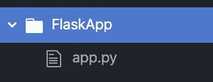

# Flask Web 开发第 1 部分:Hello World 应用程序

> 原文：<https://medium.com/analytics-vidhya/flask-development-part-1-hello-world-app-69cbf9e83abc?source=collection_archive---------26----------------------->

这是一系列文章的第 1 部分，通过开发和托管一个简单的 CRUD 应用程序，带您了解 Flask Web 开发的基础知识。


# 该系列分为 6 个部分:

1.  [**一个简单的 Hello World app**](https://medium.com/p/69cbf9e83abc/edit)
2.  [渲染 HTML 模板。](https://medium.com/p/d10442121fdd/edit)
3.  [构建可扩展的文件结构。](https://medium.com/p/68e3bf2f6642/edit)
4.  [配置数据库。](https://medium.com/p/648b11f708a5/edit)
5.  [处理用户登录和注册。](https://medium.com/p/a79042c9368c/edit)
6.  [增加 CRUD(创建、读取、更新、删除)功能。](https://medium.com/p/d3413cd94363/edit)

# 本系列假设您:

1.  有一个自己喜欢的开发 IDE。

*   (如果你不看看这个:[https://medium . com/@ shawnhymers/getting-started-with-the-atom-ide-MAC OS-7279 b8 c 119 f 2](/@shawnhymers/getting-started-with-the-atom-ide-macos-7279b8c119f2))

2.了解如何下载和导入 Python 包。

*   (如果不看这个:[https://medium . com/@ shawnhymers/download-and-import-packages-in-python-MAC OS-5b 9 db 60 e 9d 13](/@shawnhymers/download-and-import-packages-in-python-macos-5b9db60e9d13))

3.了解基本的 HTML。

*   (如果你不看看这个:[https://www.w3schools.com/html/html_basic.asp](https://www.w3schools.com/html/html_basic.asp))

4.了解基本 Python。

*   (如果你不看看这个:[https://www.python.org/about/gettingstarted/](https://www.python.org/about/gettingstarted/))

# 这个系列有一个附带的 Git

高手支招来了:[https://github.com/shawnhymers/FlaskApp/tree/master](https://github.com/shawnhymers/FlaskApp/tree/master)

这个系列的每个阶段都有一个分支。每一个分支都有你在那一部分结束时编写的代码。总分行有成品的代码。

# 第 1 部分:Hello World 应用程序

对于这一部分，我们将从一个文件夹和一个。py 文件。这将随着我们的应用变得更加复杂。



首先，我们将在我们的环境中安装 flask 包。您可以通过在终端中运行以下命令来做到这一点。

```
pip install flask
```

如果您没有安装 pip，请查看这里的文档:[https://pip.pypa.io/en/stable/installing/](https://pip.pypa.io/en/stable/installing/)。

然后在 app.py 文件中添加以下代码。

```
from flask import Flask
app = Flask(__name__)[@app](http://twitter.com/app).route('/')
[@app](http://twitter.com/app).route('/index')
def hello_world():
    return 'Hello, World!'if __name__ == '__main__': app.run(host="localhost", port=8000)
```

上面的代码是你开始的全部需要。在您最喜欢的 IDE 中运行这个文件，然后打开浏览器到 [http://localhost:8000/](http://localhost:8000/) ，您应该会看到以下消息。


浏览器中显示的页面

# 那么在我们的 app.py 文件中实际发生了什么呢？

1.  首先，我们导入 Flask 类。

```
from flask import Flask
```

2.接下来，我们创建 Flask 类的一个实例。__name__ 参数是应用程序包的名称。如果你对我们为什么使用 __name__ 感兴趣，请查看这里的文档:【https://flask.palletsprojects.com/en/1.1.x/api/#flask.Flask

```
app = Flask(__name__)
```

3.接下来，我们使用路由装饰来指示哪个 url 将使用该函数。我们使用'/'和'/index '，这样当你去 [http://localhost:8000/](http://localhost:8000/) 或[http://localhost:8000/index](http://localhost:8000/index)时，hello world 函数就会运行

```
[@app](http://twitter.com/app).route('/')
[@app](http://twitter.com/app).route('/index')
```

4.接下来，我们创建一个函数，当路线被使用时，我们希望运行这个函数。现在我们将只使用一个简单的 hello world 函数，它只返回一个字符串。

```
def hello_world():
    return 'Hello, World!'
```

5.最后，我们运行我们的应用程序。

```
if __name__ == '__main__': app.run(host="localhost", port=8000)
```

这部分的源代码可以在我的 GitHub [这里找到](https://github.com/shawnhymers/FlaskApp/tree/Part-1):

在本系列的第 2 部分中，我将带您了解如何呈现 HTML 模板，而不是简单的“Hello，world！”。