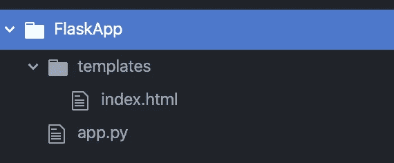

# Flask 开发第 2 部分:渲染模板

> 原文：<https://medium.com/analytics-vidhya/flask-development-part-2-rendering-templates-d10442121fdd?source=collection_archive---------28----------------------->

这是一系列文章的第 2 部分，通过开发和托管一个简单的 CRUD 应用程序，带您了解 Flask Web 开发的基础知识。


# 该系列分为 6 个部分:

1.  [一个简单的 Hello World 应用](https://medium.com/p/69cbf9e83abc/edit)
2.  [**渲染 HTML 模板。**](https://medium.com/p/d10442121fdd/edit)
3.  [构建可扩展的文件结构。](https://medium.com/p/68e3bf2f6642/edit)
4.  [配置数据库。](https://medium.com/p/648b11f708a5/edit)
5.  [处理用户登录和注册。](https://medium.com/p/a79042c9368c/edit)
6.  [增加 CRUD(创建、读取、更新、删除)功能。](https://medium.com/p/d3413cd94363/edit)

# 第 2 部分:呈现 HTML 模板

在上一篇文章中，我们学习了如何运行 Flask 应用程序，并用它来显示“你好，世界！”在我们的浏览器中使用这段代码。

```
from flask import Flask
app = Flask(__name__)[@app](http://twitter.com/app).route('/')
[@app](http://twitter.com/app).route('/index')
def hello_world():
    return 'Hello, World!'if __name__ == '__main__': app.run(host="localhost", port=8000)
```

在这篇文章中，我们将使用 Flask 函数 render_template 在浏览器中加载一个 HTML 文件，而不是简单的消息。

首先，我们将更新导入以包含 render_template:

```
from flask import Flask, **render_template**
app = Flask(__name__)[@app](http://twitter.com/app).route('/')
[@app](http://twitter.com/app).route('/index')
def hello_world():
    return 'Hello, World!'if __name__ == '__main__': app.run(host="localhost", port=8000)
```

其次，我们将更新我们的路由功能:

```
from flask import Flask**,** render_template
app = Flask(__name__)[@app](http://twitter.com/app).route('/')
[@app](http://twitter.com/app).route('/index')
def hello_world():
    return **render_template('index.html')  ** if __name__ == '__main__': app.run(host="localhost", port=8000)
```

现在，我们的路由将在您的“templates”文件夹中加载一个名为“index”的 HTML 文件。更多的参数可以传递给 render_template()函数，我们将在本系列中根据需要添加更多的参数。更多信息请查看:[https://www.tutorialspoint.com/flask/flask_templates.htm](https://www.tutorialspoint.com/flask/flask_templates.htm)

现在我们需要多个文件，我们需要更新我们的文件结构。

首先，添加一个名为“模板”的文件夹。这是一个由 Flask 识别的目录名，因此准确使用这个名称非常重要。

接下来，在这个文件夹中添加一个名为 index.html 的文件。您可以将它命名为任何名称，但是如果您坚持使用我的命名约定，将会更容易理解本系列。



在我们的 index.html 文件中，我们将开始构建想要在浏览器中显示的 HTML。现在，让我们坚持一个基本的 hello world 消息。

```
<!DOCTYPE html>
<html lang="en" dir="ltr">
  <head>
    <meta charset="utf-8">
    <title></title>
  </head>
  <body>
    <p>Hello, World (But with HTML)!</p>
  </body>
</html>
```

现在运行你的 app.py 文件，回到你的浏览器，进入 [http://localhost:8000/](http://localhost:8000/) 。

现在，您应该会在浏览器中看到一条略有不同的消息。


这部分的源代码可以在我的 GitHub [这里](https://github.com/shawnhymers/FlaskApp/tree/Part-2)找到:

在我的下一篇文章中，我们将暂停编码，看看如何创建一个可伸缩的文件结构。