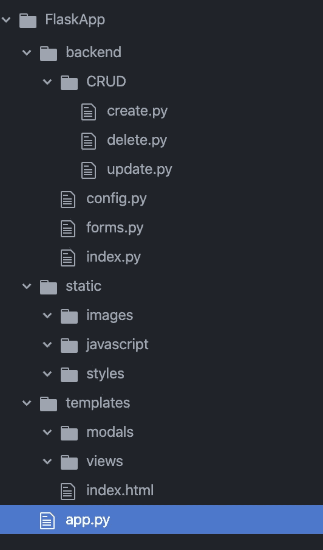

# Flask 开发第 3 部分:文件结构

> 原文：<https://medium.com/analytics-vidhya/flask-development-part-3-file-structure-68e3bf2f6642?source=collection_archive---------10----------------------->

这是一系列文章的第 3 部分，通过开发和托管一个简单的 CRUD 应用程序，带您了解 Flask Web 开发的基础知识。


# 该系列分为 6 个部分:

1.  [一个简单的 Hello World 应用](https://medium.com/p/69cbf9e83abc/edit)
2.  [渲染 HTML 模板。](https://medium.com/p/d10442121fdd/edit)
3.  [**构建可扩展的文件结构。**](https://medium.com/p/68e3bf2f6642/edit)
4.  [配置数据库。](https://medium.com/p/648b11f708a5/edit)
5.  [处理用户登录和注册。](https://medium.com/p/a79042c9368c/edit)
6.  [增加 CRUD(创建、读取、更新、删除)功能。](https://medium.com/p/d3413cd94363/edit)

# 第 3 部分:构建可伸缩的文件结构。

到目前为止，我们只有一个后端 python 代码文件和一个前端 html 代码文件。随着我们的应用程序变得越来越复杂，我们添加了更多的代码，我们希望将这些代码拆分成多个文件。我们还希望能够添加图像、javascript 文件、用户上传等等。

让我们继续建立一个更健壮的文件结构。



# 这个结构为我们提供了 3 个主要目录:

1.  后端:存放所有处理路由、CRUD 操作和表单验证的 Python 文件。
2.  静态:存放我们所有的图像、JS 和 CSS 文件。这些将存储在客户端的浏览器缓存中。
3.  模板:存放我们所有的 HTML 文件。

# 在后端目录中有 3 个。py 文件和一个子目录，也用 3。py 文件。

1.  config.py:这将设置我们的应用程序和数据库。
2.  py:这将创建所有的烧瓶表单。
3.  这将处理所有的请求和路由。
4.  CRUD/create.py:这将包含我们创建数据库对象的所有函数。
5.  CRUD/update.py:这将包含所有更新数据库对象的函数。
6.  CRUD/delete.py:这将包含我们删除数据库对象的所有函数。

# 现在，让我们将应用程序配置代码移动到 config.py 文件中，并将路由移动到 index.py 文件中。

首先，我们将把这段代码移到 config.py 文件中。

```
from flask import Flask
app = Flask(__name__)
```

接下来，我们将在创建 Flask 类实例的行中添加一个参数。

```
from flask import Flask
app = Flask(__name__, **template_folder='../templates'**)
```

因为我们将把我们的路由放在“后端”目录下的 index.py 文件中，这将告诉 flask 在新文件结构中的何处查找我们的 HTML 模板。

然后我们将把这段代码移到 index.py 文件中。

```
from config import app
from flask import Flask, render_template[@app](http://twitter.com/app).route('/')
[@app](http://twitter.com/app).route('/index')
def hello_world():
    return render_template('index.html')
```

现在我们的 app.py 文件只是:

```
if __name__ == '__main__': app.run(host="localhost", port=8000)
```

最后，我们将更新 app.py 文件中的导入，以访问我们创建的新文件。

```
**import sys
sys.path.append('backend')
import index
from config import app**if __name__ == '__main__': app.run(host="localhost", port=8000)
```

先不要担心其余文件的细节。我们将在本系列的剩余部分中添加这些内容。

这部分的源代码可以在我的 GitHub [这里](https://github.com/shawnhymers/FlaskApp/tree/Part-3)找到:

在下一篇文章中，我们将使用这个新的文件结构来为我们的应用程序配置一个数据库。