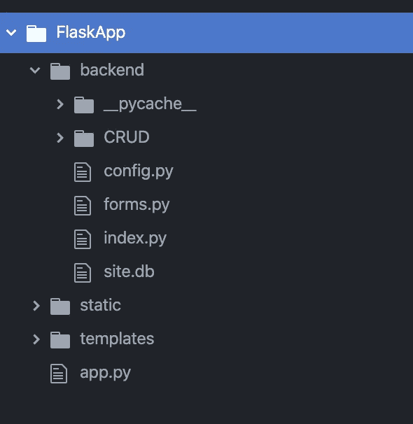

# Flask 开发第 4 部分:数据库配置

> 原文：<https://medium.com/analytics-vidhya/flask-development-part-4-database-configuration-648b11f708a5?source=collection_archive---------19----------------------->

创建一个简单的 SQL 炼金术数据库。

这是一系列文章的第 4 部分，通过开发和托管一个简单的 CRUD 应用程序，带您了解 Flask Web 开发的基础知识。


# 该系列分为 6 个部分:

1.  [一个简单的 Hello World 应用](https://medium.com/p/69cbf9e83abc/edit)
2.  [渲染 HTML 模板。](https://medium.com/p/d10442121fdd/edit)
3.  [构建可扩展的文件结构。](https://medium.com/p/68e3bf2f6642/edit)
4.  [**配置数据库。**](https://medium.com/p/648b11f708a5/edit)
5.  [处理用户登录和注册。](https://medium.com/p/a79042c9368c/edit)
6.  [增加 CRUD(创建、读取、更新、删除)功能。](https://medium.com/p/d3413cd94363/edit)

# 第 4 部分:数据库配置

在教程的这一部分，我们将建立一个 SQL 数据库并创建一个用户对象，该对象将在下一部分中用于处理登录和注册。

## 第一步。更新 config.py 文件来配置数据库。

在第 3 部分的最后，我们的 config.py 文件如下所示:

```
from flask import Flaskapp = Flask(__name__, template_folder='../templates')
```

首先，我们需要再安装 2 个烧瓶包。您可以通过在终端中运行以下两个命令来做到这一点。

```
pip install flask_login
pip install flask_sqlalchemy
```

现在，我们将向导入添加两行，以包含我们刚刚安装的包的一部分。

```
from flask import Flask
**from flask_login import UserMixin
from flask_sqlalchemy import SQLAlchemy**app = Flask(__name__, template_folder='../templates')
```

接下来，我们将添加两行来设置数据库。

```
from flask import Flask
from flask_login import UserMixin
from flask_sqlalchemy import SQLAlchemyapp = Flask(__name__, template_folder='../templates')**app.config['SQLALCHEMY_DATABASE_URI'] = 'sqlite:///site.db'
db = SQLAlchemy(app)**
```

您可以很容易地完成这个系列，而不必太担心这两行代码实际上在做什么，但是如果您好奇，您可以在文档[这里](https://flask-sqlalchemy.palletsprojects.com/en/2.x/config/)找到更多细节。

最后，我们将添加它来定义我们的用户对象。

```
from flask import Flask
from flask_login import UserMixin
from flask_sqlalchemy import SQLAlchemyapp = Flask(__name__, template_folder='../templates')app.config['SQLALCHEMY_DATABASE_URI'] = 'sqlite:///site.db'
db = SQLAlchemy(app)**class User(db.Model, UserMixin):** **id = db.Column(db.Integer, 
                   primary_key = True)

    username = db.Column(db.String(20),
                         unique = True, 
                         nullable = False)** **email = db.Column(db.String(120), 
                      unique = True, 
                      nullable = False)** **password = db.Column(db.String(60),
                         nullable = False)**
```

这个类定义了我们的数据库对象。我们有 4 个与该对象相关的字段。

1.  id-这是一个自动递增的 id 号。
2.  用户名-这将存储我们的用户的用户名。
3.  电子邮件-这将存储我们的用户的电子邮件地址。
4.  密码-这将存储我们的用户的密码。

这些字段也有一些限制。

1.  使用数据库。String()我们将该字段定义为一个字符串字段，并赋予它最大的字符数。因此，我们的用户名可以长达 20 个字符，我们的电子邮件地址可以长达 120 个字符，我们的密码可以长达 60 个字符。
2.  使用 unique = True，我们可以确保没有重复。因此，我们的电子邮件和用户名字段必须不存在于数据库中，以便创建。我们的密码字段没有这种限制，所以两个用户可以有相同的密码。
3.  使用 nullable = False，我们可以确保没有该字段就无法创建实例或我们的类。我们的用户名、电子邮件和密码字段都是必填的。

有关定义模型的更多信息，请查看这里的文档。

## 第二步。更新我们的 index.py 文件以导入数据库

为此，我们只需将已经创建的导入从配置文件添加到索引文件中。

```
from config import app**, db**
from flask import Flask, render_template[@app](http://twitter.com/app).route('/')
[@app](http://twitter.com/app).route('/index')
def hello_world():

    return render_template('index.html')
```

## 第三步。使用终端创建数据库

首先，我们将把终端中的目录设置为后端文件夹的位置。对我来说，我将项目文件夹保存到桌面上，所以第一行是:

```
cd Desktop/FlaskApp/backend
```

对你来说，这是 cd +应用程序中后端文件夹的路径。

接下来运行这行代码来启动 python:

```
python
```

现在我们将使用 python 导入来获取 db 对象。

```
from config import db
```

现在我们将创建所有的数据库对象。

```
db.create_all()
```

现在检查一下您的文件结构，您应该会看到一个名为 site.db 的新文件已经在后端文件夹中创建了。



这部分的源代码可以在我的 GitHub [这里找到](https://github.com/shawnhymers/FlaskApp/tree/Part-4):

在下一篇文章中，我们将使用这个新数据库来创建用户并处理注册和登录请求。