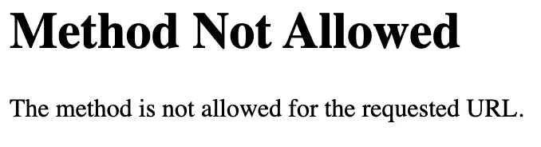

# Flask 开发第 5 部分:注册和登录用户

> 原文：<https://medium.com/analytics-vidhya/flask-development-part-5-register-and-login-users-a79042c9368c?source=collection_archive---------6----------------------->

这是一系列文章的第 5 部分，通过开发和托管一个简单的 CRUD 应用程序，带您了解 Flask Web 开发的基础知识。


# 该系列分为 6 个部分:

1.  [一个简单的 Hello World 应用](https://medium.com/p/69cbf9e83abc/edit)
2.  [渲染 HTML 模板。](https://medium.com/p/d10442121fdd/edit)
3.  [构建可扩展的文件结构。](https://medium.com/p/68e3bf2f6642/edit)
4.  [配置数据库。](https://medium.com/p/648b11f708a5/edit)
5.  [**处理用户登录和注册。**](https://medium.com/p/a79042c9368c/edit)
6.  [增加 CRUD(创建、读取、更新、删除)功能。](https://medium.com/p/d3413cd94363/edit)

# 第 5 部分:处理用户登录和注册

在这一部分中，我们将使用在第 4 部分中在数据库中创建的用户对象来创建新用户，并允许他们登录和退出我们的应用程序。

## 第一步。添加跨站点伪造保护和 Bcrypt

首先，我们将通过在我们的终端中运行这两行来安装另外 3 个 flask 扩展:

```
pip install flask_wtf
pip install email_validator
pip install flask_bcrypt
```

现在让我们将新的扩展导入到 config.py 文件中。我们还将添加操作系统，这将有助于我们稍后生成密钥。

```
from flask import Flask
from flask_sqlalchemy import SQLAlchemy **from flask_wtf.csrf import CSRFProtect
from flask_bcrypt import Bcrypt
import os**app = Flask(__name__,  template_folder='../templates')app.config['SQLALCHEMY_DATABASE_URI'] = 'sqlite:///site.db'
db = SQLAlchemy(app)class User(db.Model, UserMixin):id = db.Column(db.Integer, 
               primary_key = True)
    username = db.Column(db.String(20),
                         unique = True, 
                         nullable = False)
    email = db.Column(db.String(120), 
                      unique = True, 
                      nullable = False)
    password = db.Column(db.String(60), 
                         nullable = False)
```

然后，我们将添加几行来配置我们的 CSRF 令牌。

```
from flask import Flask
from flask_sqlalchemy import SQLAlchemy
import os
from flask_wtf.csrf import CSRFProtectapp = Flask(__name__,  template_folder='../templates')app.config['SQLALCHEMY_DATABASE_URI'] = 'sqlite:///site.db'
db = SQLAlchemy(app) **SECRET_KEY = os.urandom(32)
app.config['SECRET_KEY'] = SECRET_KEY
csrf = CSRFProtect(app)** class User(db.Model, UserMixin):id = db.Column(db.Integer, 
               primary_key = True)
    username = db.Column(db.String(20),
                         unique = True, 
                         nullable = False)
    email = db.Column(db.String(120), 
                      unique = True, 
                      nullable = False)
    password = db.Column(db.String(60), 
                         nullable = False)
```

然后，我们将这一行添加到我们的配置文件中，以便在我们的应用程序中启用 bcrypt 散列实用程序。

```
app = Flask(__name__,  template_folder='../templates')**bcrypt = Bcrypt(app)**SECRET_KEY = os.urandom(32)
app.config['SECRET_KEY'] = SECRET_KEY
csrf = CSRFProtect(app)app.config['SQLALCHEMY_DATABASE_URI'] = 'sqlite:///site.db'
db = SQLAlchemy(app)class User(db.Model, UserMixin):id = db.Column(db.Integer, 
               primary_key = True)
    username = db.Column(db.String(20), 
                         unique = True, 
                         nullable = False)
    email = db.Column(db.String(120), 
                      unique = True, 
                      nullable = False)
    password = db.Column(db.String(60), 
                         nullable = False)
```

有关烧瓶 csrf 保护的更多信息，请查看文档[这里](https://flask-wtf.readthedocs.io/en/stable/csrf.html)。

有关 flask 的 Bcrypt 包的更多信息，请查看这里的文档[。](https://flask-bcrypt.readthedocs.io/en/latest/)

## 第二步。设置登录管理器

首先，我们将安装另一个 flask 包。这将帮助我们完成登录任务。在您的终端中使用以下命令安装 flask_login。

```
pip install flask_login
```

接下来，我们需要在 index.py 文件中添加一些导入来访问我们安装的新包。

```
from config import app, db
from flask import Flask, render_template
**from flask_login import login_user, current_user, logout_user, login_required**[@app](http://twitter.com/app).route('/')
[@app](http://twitter.com/app).route('/index')
def hello_world(): return render_template('index.html')
```

然后，我们需要在 config.py 文件中添加一些代码来处理用户身份验证。

```
from flask import Flask
from flask_login import UserMixin, current_user, login_manager
from flask_login import LoginManager
from flask_sqlalchemy import SQLAlchemy
import os
from flask_wtf.csrf import CSRFProtectapp = Flask(__name__,  template_folder='../templates')CSRFProtect(app)
SECRET_KEY = os.urandom(32)
app.config['SECRET_KEY'] = SECRET_KEY
csrf = CSRFProtect(app)
csrf.init_app(app)**login_manager = LoginManager(app)
login_manager.login_view = 'login'
login_manager.login_message_category = 'info'** [**@login_manager**](http://twitter.com/login_manager)**.user_loader
def load_user(user_id):
    return User.query.get(int(user_id))**app.config['SQLALCHEMY_DATABASE_URI'] = 'sqlite:///site.db'
db = SQLAlchemy(app)class User(db.Model, UserMixin): id = db.Column(db.Integer, 
                   primary_key = True)
    username = db.Column(db.String(20),
                         unique = True, 
                         nullable = False)
    email = db.Column(db.String(120), 
                      unique = True, 
                      nullable = False)
    password = db.Column(db.String(60), 
                         nullable = False)
```

你不需要知道这到底是怎么回事。基本上，这只是设置了登录管理器，并让我们使用一些简洁的东西。例如了解当前用户及其状态的方法。完整的文档在这里。

## 步骤 3:创建经过身份验证和未经身份验证的视图

现在，我们可以使用登录管理器为登录的用户构建一个单独的视图。

现在我们的 index.html 文件对每个人都是一样的:

```
<!DOCTYPE html>
<html lang="en" dir="ltr">
  <head>
    <meta charset="utf-8">
    <title></title>
  </head>
  <body>
    <p>Hello, World (But with HTML)!</p>
  </body>
</html>
```

我们将通过使用 current_user 创建一个经过身份验证和未经身份验证的视图来修改这个简单的消息。(这是我提到的登录管理器允许您做的一件好事。)

```
<!DOCTYPE html>
<html lang="en" dir="ltr">
  <head>
    <meta charset="utf-8">
    <title></title>
  </head>
  <body>
      **
        <p>Hello, authenticated user!</p>
      
        <p>Hello, unauthenticated user!</p>
      **
  </body>
</html>
```

现在，如果用户已登录，第一条消息将显示在浏览器中，如果用户未登录，第二条消息将显示。(我们将在后面介绍如何让用户登录。)

让我们继续工作，为这两个视图创建新文件，并将它们导入到 index.html 文件中。随着它们变得越来越复杂，这将使它们更容易管理。

首先，我们将在模板>视图中创建两个新文件。


authenticated.html 内部传出这样的消息:

```
<p>Hello, authenticated user!</p>
```

unauthenticated.html 内部传出这样的消息:

```
<p>Hello, unauthenticated user!</p>
```

然后，我们将改变 index.html 进口这两个完整的观点。

```
<!DOCTYPE html>
<html lang="en" dir="ltr">
  <head>
    <meta charset="utf-8">
    <title></title>
  </head>
  <body>
      
        ****
      
        ****
      
  </body>
</html>
```

显然，这并没有真正简化我们的项目。但是当我们的 html 文件开始增长时，这种用一行代码包含整个 HTML 文件的方法变得更加简洁。

## 步骤 4:用 Flask WTF 创建登录和注册表单

首先，我们将安装另一个 flask 包:“wtforms”。通过在终端中运行以下 pip 命令来实现这一点。

```
pip install wtforms
```

现在我们可以继续构建我们的登录和注册表单。要创建这些表单，我们首先要编辑 forms.py 文件。

我们将进口方盒。

```
from flask_wtf import FlaskForm
```

接下来，我们将从刚刚安装的新包中导入一些字段类型和验证器。

```
from wtforms import (StringField, PasswordField, SubmitField,              
                     BooleanField)
from wtforms.validators import DataRequired, Length, Email, EqualTo
```

然后我们将创建两个类:一个用于登录表单，一个用于注册表单。

```
from flask_wtf import FlaskForm
from wtforms import (StringField, PasswordField, SubmitField,              
                     BooleanField)
from wtforms.validators import DataRequired, Length, Email, EqualTo**class RegistrationForm(FlaskForm):** **username = StringField('Username',
                           validators=[DataRequired(), 
                           Length(min=2, max=20)])** **email = StringField('Email',
                        validators=[DataRequired(), 
                        Email()])** **password = PasswordField('Password',
                             validators=[DataRequired()])** **confirm_password = PasswordField('Confirm Password',
                                     validators=[DataRequired(),
                                     EqualTo('password')])
    submit = SubmitField('Sign Up')****class LoginForm(FlaskForm):** **email = StringField('Email',
                        validators = [DataRequired(),
                        Email()])** **password = PasswordField('Password',
                             validators = [DataRequired()])** **remember = BooleanField('Remember Me')** **submit = SubmitField('Login')**
```

请注意我们刚刚创建的 RegistrationForm 类和我们在第 4 部分中创建的用户模型类之间的相似性。还要注意，没有 id 字段，因为它是自动生成的。

我们的 RegistrationForm 类有 5 个字段:两个字符串字段、两个密码字段和一个提交字段。每个字段中的第一个参数是字段名。下一个参数是验证器列表。还记得数据库中的一些字段是如何被强制唯一的吗，比如用户名和电子邮件？或者我们如何设置字符串字段的最大和最小长度？出于这个原因，我们不希望表单能够提交任何无法保存到我们的数据库中的内容。

1.  DataRequired() —如果此字段为空，则表单不会提交
2.  长度(最小值=2，最大值=20) —如果字段少于 2 个字符或多于 20 个字符，则表单不会提交。
3.  Email() —如果输入不是电子邮件，表单不会提交(例如，something@something.something)
4.  EqualTo('name') —表单不会提交，除非此字段中的输入与【T0 ]' name '字段中的输入相同。

登录表单有 4 个字段:字符串、密码、布尔值和提交。它们使用与注册表单相同的验证器来构造。

关于长颈瓶形式的更多信息可以在文档[这里](https://flask-wtf.readthedocs.io/en/stable/quickstart.html#creating-forms)找到。

现在我们需要转到 index.py 文件来导入这些新表单。

```
from config import app, db
from flask import Flask, render_template
from flask_login import login_user, current_user, logout_user, login_required
**import forms**[@app](http://twitter.com/app).route('/')
[@app](http://twitter.com/app).route('/index')
def hello_world(): return render_template('index.html')
```

此外，我们需要通过 render_template 函数将新表单作为参数传递，以便在前端访问它们。

```
from config import app, db
from flask import Flask, render_template
from flask_login import login_user, current_user, logout_user, login_required
import forms[@app](http://twitter.com/app).route('/')
[@app](http://twitter.com/app).route('/index')
def hello_world(): return render_template('index.html',
                           **login_form = forms.LoginForm(),
                           register_form = forms.RegistrationForm()**)
```

## 第五步。将我们的表单添加到前端

我们创建了 flask form 类，将它们传递给我们的索引文件，然后在 render_template 函数中将它们作为参数传递。现在我们将着眼于前端来使用这些新的表单。

让我们从在未经身份验证的视图中构建一个前端注册表单开始。我们将通过在模板>视图中向我们的 unauthenticated.html 文件添加以下代码来实现这一点。

```
<form method="POST" action="">
  {{ register_form.hidden_tag() }}
    {{ register_form.username( placeholder = "Username") }}
    {{ register_form.email( placeholder = "Email") }}
    {{ register_form.password( placeholder = "Password") }}
    {{ register_form.confirm_password( placeholder = "Confirm Password") }}
    {{ register_form.submit() }}
</form>
```

这段 html 代码是一个表单标签。点击了解更多关于表单标签[的信息。](https://www.w3schools.com/html/html_forms.asp)

form 标记内部是我们在上一步中创建的 RegistrationForm 类的每个元素。

register_form 对象在 render_template 函数中定义为:

```
register_form = forms.RegistrationForm()
```

这意味着我们可以在前端以 register_form 的形式引用 forms.py 文件中的表单。因此 register_form.username()生成了表单文件中定义的用户名字段。

您可以从我的代码中看到，我也给了这些字段一个占位符。这是在有任何输入之前将在输入字段中显示的内容。同样，您可以向这些输入添加样式和类，但这将在后面介绍。

还要注意，这个表单中的第一行是 CSRF 令牌。因为我们保护了我们的应用程序，所以每个表单都需要它。

现在，如果我们运行我们的 app.py 文件，并在浏览器中转至 [http://localhost:5000/](http://localhost:5000/) ，我们将看到以下内容:

如果我们现在提交这个表单，我们会得到下面的错误。



这是因为我们还没有配置后端来处理我们的 post 请求。点击了解更多关于各种 HTTP 请求[的信息。](https://www.w3schools.com/tags/ref_httpmethods.asp)

## 第六步。在后端处理表单提交 post 请求

首先，我们将更改允许的方法来处理来自表单的 post 请求。

现在我们的 index.py 文件应该是这样的:

```
from config import app, db
from flask import Flask, render_template
from flask_login import login_user, current_user, logout_user, login_required
import forms[@app](http://twitter.com/app).route('/')
[@app](http://twitter.com/app).route('/index')
def hello_world():return render_template('index.html',
                           login_form = forms.LoginForm(),
                           register_form = forms.RegistrationForm())
```

首先，我们将为 app.route 装饰器添加一个“方法”参数。

```
from config import app, db
from flask import Flask, render_template
from flask_login import login_user, current_user, logout_user, login_required
import forms[@app](http://twitter.com/app).route('/'**, methods = ['GET','POST']**)
[@app](http://twitter.com/app).route('/index'**, methods = ['GET','POST']**)
def hello_world(): return render_template('index.html',
                           login_form = forms.LoginForm(),
                           register_form = forms.RegistrationForm())
```

现在我们的路由可以处理 post 和 get 请求。

接下来，我们将更新导入，以包含 redirect 和 url_for flask 方法。

```
from config import app, db
from flask import Flask, render_template**, redirect, url_for**
from flask_login import login_user, current_user, logout_user, login_required
import forms[@app](http://twitter.com/app).route('/', methods = ['GET','POST'])
[@app](http://twitter.com/app).route('/index', methods = ['GET','POST'])
def hello_world(): return render_template('index.html',
                           login_form = forms.LoginForm(),
                           register_form = forms.RegistrationForm())
```

接下来，我们将添加一个“if”条件，如果注册表单被提交，并且我们在 forms.py 文件中的注册表单对象上设置的所有验证器都被验证，那么将输入该条件。

```
from config import app, db
from flask import Flask, render_template, redirect, url_for
from flask_login import login_user, current_user, logout_user, login_required
import forms[@app](http://twitter.com/app).route('/', methods = ['GET','POST'])
[@app](http://twitter.com/app).route('/index', methods = ['GET','POST'])
def hello_world():

   ** if forms.RegistrationForm().validate_on_submit():** **return redirect(url_for(**'hello_world'**))** return render_template('index.html',
                           login_form = forms.LoginForm(),
                           register_form = forms.RegistrationForm())
```

接下来，我们将更新 index.py 文件中的导入，以引入 bcrypt 对象。我们还将导入我们的用户对象，因此我们可以在这个文件中创建它的一个新实例。最后，我们还将从 flask 导入请求方法(我们将使用它从表单中获取信息)。

```
from config import app, db**, bcrypt, User**
from flask import Flask, render_template, redirect, url_for, **request**
from flask_login import login_user, current_user, logout_user, login_required
import forms[@app](http://twitter.com/app).route('/', methods = ['GET','POST'])
[@app](http://twitter.com/app).route('/index', methods = ['GET','POST'])
def hello_world():

    if forms.RegistrationForm().validate_on_submit(): return redirect(url_for('hello_world'))return render_template('index.html',
                           login_form = forms.LoginForm(),
                           register_form = forms.RegistrationForm())
```

现在，在 if 语句中，我们将添加一些代码来在数据库中创建新用户。

```
from config import app, db, User
from flask import Flask, render_template, redirect, url_for, request
from flask_login import login_user, current_user, logout_user, login_required
import forms[@app](http://twitter.com/app).route('/', methods = ['GET','POST'])
[@app](http://twitter.com/app).route('/index', methods = ['GET','POST'])
def hello_world():

    if forms.RegistrationForm().validate_on_submit():
               **register_form = forms.RegistrationForm()   **    
        **hashed_password =   bcrypt.generate_password_hash(register_form.password.data).decode('utf-8')
        user = User(username = register_form.username.data,
                    email = register_form.email.data,
                    password = hashed_password)** **db.session.add(user)
        db.session.commit()** return redirect(url_for('hello_world')))return render_template('index.html',
                           login_form = forms.LoginForm(),
                           register_form = forms.RegistrationForm())
```

最后，在数据库中创建新用户后，我们将添加几行代码来登录新用户。

```
from config import app, db, User
from flask import Flask, render_template, redirect, url_for, request
from flask_login import login_user, current_user, logout_user, login_required
import forms[@app](http://twitter.com/app).route('/', methods = ['GET','POST'])
[@app](http://twitter.com/app).route('/index', methods = ['GET','POST'])
def hello_world():

    if forms.RegistrationForm().validate_on_submit(): register_form = forms.RegistrationForm()          
        hashed_password =    bcrypt.generate_password_hash(register_form.password.data).decode('utf-8')
        user = User(username = register_form.username.data,
                    email = register_form.email.data,
                    password = hashed_password) db.session.add(user)
        db.session.commit() **user = User.query.filter_by(
               email = forms.RegistrationForm().email.data).first()

        if user and bcrypt.check_password_hash(
        user.password, forms.RegistrationForm().password.data):

           login_user(user)** return redirect(url_for('hello_world'))) return render_template('index.html',
                           login_form = forms.LoginForm(),
                           register_form = forms.RegistrationForm())
```

现在，当我们提交注册表单时，我们被重新路由到 authenticated 视图。


我将逐行解释这一点。如果你不在乎，现在跳到第 7 步。

```
register_form = forms.RegistrationForm()
```

这一行只是将表单文件中的表单类定义为 register_form，这样我们就可以在解析表单数据时引用它。你也可以称之为形式。如果您愿意，可以一直使用注册表()。

```
hashed_password =    bcrypt.generate_password_hash(register_form.password.data).decode('utf-8')
```

这是使用我们在本部分开始时安装的 bcrypt 扩展从密码字段创建散列密码。具体细节在这里。

```
user = User(username = register_form.username.data,
            email = register_form.email.data,
            password = hashed_password)
```

这一行创建了我们的用户类的一个实例。它使用用户提交的 register_form 中的数据来填充每个字段。

```
db.session.add(user) 
```

这一行将用户类的新实例添加到数据库中。

```
db.session.commit()
```

这一行提交了更改。对数据库的每个更改都必须跟在 commit()之后。

```
user = User.query.filter_by( email =     
                forms.RegistrationForm().email.data).first()
```

这一行在数据库中查询我们刚刚创建的用户。我们使用 filter_by()和 first()方法来获取第一个电子邮件与注册表单中的数据相匹配的用户。由于我们的电子邮件都必须是唯一的，第一个用户将是我们当前的用户。

```
if user and bcrypt.check_password_hash(user.password, 
                            forms.RegistrationForm().password.data):

  login_user(user)
```

这个块检查用户是否存在，以及我们从数据库中提取的用户密码是否与注册表单中的密码匹配。这当然每次都会匹配，因为我们刚刚创建了这个新用户。然后使用 login_user()方法对用户进行身份验证。

## 第七步。启用注销

现在，一旦我们对用户进行了身份验证，我们就无法撤销身份验证并使用不同的帐户登录。

为了解决这个问题，让我们在已验证的视图中添加一个注销按钮。

```
<form method="post">
  <input type="hidden" name="csrf_token" value="{{csrf_token()}}"/>
  <input type="hidden" name="post_header" value="log out">
  <input type="submit"  value="Logout">
</form>
```

上面的代码是我们的注销按钮。这是一个有 3 个输入的表单标签。

1.  隐藏输入与我们的 CSRF 令牌。我们需要构造不同于前两种形式的令牌，因为我们没有为这种形式创建 Flask Form 类。不需要 form 类，因为我们不需要任何验证器。
2.  带有文章标题的隐藏输入。这些将在我们的应用程序中使用。这种隐藏输入 post 标题的风格让我们可以很容易地决定表单提交时在后端做什么。
3.  这是我们的可点击按钮，将提交表单。

接下来，我们需要在 index.py 文件中添加一些代码来处理来自这个按钮的 post 请求。因为我们没有这个的 flask 表单，所以我们不能使用 validate_on_submit 方法。我们将从隐藏的输入中读取我们的 post 头。

```
if (request.method == "POST") & 
   (request.form.get('post_header') == 'log out'): return redirect(url_for('hello_world'))
```

最后，我们将在 if 条件中添加一些代码，以便在表单提交时注销用户。我们只需要从 flask_login 导入 logout_user()方法。

```
if (request.method == "POST") & 
   (request.form.get('post_header') == 'log out'):

   **logout_user()** return redirect(url_for('hello_world'))
```

## **第八步。启用登录**

你会注意到，如果你再次尝试用相同的用户名或密码注册，将会出错。这是因为我们在创建用户数据库对象时创建了这些唯一的值。

所以我们还需要一个表单来登录现有用户。让我们将它添加到我们的模板>视图>未认证的. html 文件中。

```
<form method="POST" action="">
  {{ register_form.hidden_tag() }}
    {{ register_form.username( placeholder = "Username") }}
    {{ register_form.email( placeholder = "Email") }}
    {{ register_form.password( placeholder = "Password") }}
    {{ register_form.confirm_password( placeholder = "Confirm Password") }}
    {{ register_form.submit() }}
</form>**<form method="POST" action="">
  {{ login_form.hidden_tag() }}
    {{ login_form.email(placeholder = "Email") }}
    {{ login_form.password(placeholder = "Password") }}
    {{ login_form.submit() }}
</form>**
```

这个表单标签的构建方式与我们的注册表单相同，只是使用了 login_form 类。

现在，当我们未登录时，我们的网页将如下所示:


现在点击登录没有任何作用。这是因为当我们的登录表单类验证时，我们还没有配置我们的后端来做任何事情。因此，我们需要向 index.py 文件添加一些代码，类似于我们对注册表单所做的那样。

```
[@app](http://twitter.com/app).route('/', methods = ['GET','POST'])
[@app](http://twitter.com/app).route('/index', methods = ['GET','POST'])
def hello_world(): if forms.RegistrationForm().validate_on_submit():

        register_form = forms.RegistrationForm()
        hashed_password = bcrypt.generate_password_hash(register_form.password.data).decode('utf-8')
        user = User(username = register_form.username.data,
                    email = register_form.email.data,
                    password = hashed_password)
        db.session.add(user)
        db.session.commit()

        user = User.query.filter_by(email =  
               forms.RegistrationForm().email.data).first() if user and bcrypt.check_password_hash(user.password,        
           forms.RegistrationForm().password.data): login_user(user) return redirect(url_for('hello_world')) **if forms.LoginForm().validate_on_submit():

        login_form = forms.LoginForm()
        user = User.query.filter_by(email =  
               login_form.email.data).first()

        if user and bcrypt.check_password_hash(user.password, 
           login_form.password.data):

            login_user(user, remember = login_form.remember.data)

        return redirect(url_for('hello_world'))** return render_template('index.html',
                           login_form = forms.LoginForm(),
                           register_form = forms.RegistrationForm())
```

现在，使用与您创建的帐户相匹配的电子邮件和密码登录，您将进入已验证视图。

如果您不关心或者已经知道当登录表单提交时我们的 python 代码在做什么，那么您就完成了第 5 部分！如果你感兴趣，我会在下面一行一行地把它分解。

```
if forms.LoginForm().validate_on_submit():
```

这是我们使用之前见过的 validate_on_sbmit()方法来检查登录表单是否正在提交，以及在 post 请求期间是否有效。

```
login_form = forms.LoginForm()
```

这只是从我们导入的表单文件中获取我们的登录表单。我们也可以继续把它称为表单。LoginForm，但是我发现那看起来很乱。

```
user = User.query.filter_by(email = login_form.email.data).first()
```

这是查询我们的数据库，并从数据库中获取与登录表单中提交的电子邮件相匹配的用户对象。

```
if user and bcrypt.check_password_hash(user.password,   
                                       login_form.password.data):
```

这是使用我们的 bcrpyt 包来检查存储在我们的用户对象上的密码是否与登录表单上提供的密码匹配。

```
login_user(user, remember = login_form.remember.data)
```

这是使用我们的 login_user 方法在我们的登录管理器中更改我们的用户状态。这里的第二个参数是可选的。这将使浏览器记住用于登录的用户名和密码。要避免这种行为，您可以使用:

```
login_user(user)
```

最后，

```
return redirect(url_for('hello_world'))
```

将我们带到我们的主要“hello_world”路线。

第五部到此结束！这部分的源代码可以在我的 GitHub [这里找到:](https://github.com/shawnhymers/FlaskApp/tree/Part-5)

在下一部分中，我们将创建一个新的数据库对象，并升级我们的应用程序，使其具有完整的 CRUD(创建、读取、更新、删除)功能。