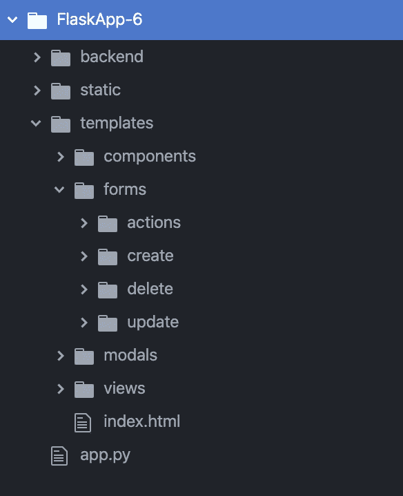

# Flask Web 开发第 6 部分:CRUD 应用程序

> 原文：<https://medium.com/analytics-vidhya/flask-development-part-6-crud-app-d3413cd94363?source=collection_archive---------16----------------------->

让您的应用程序能够创建、读取、更新和删除数据库对象。

这是一系列文章的第 6 部分，通过开发和托管一个简单的 CRUD 应用程序，带你了解 Flask Web 开发的基础。


# 该系列分为 6 个部分:

1.  [一个简单的 Hello World 应用](https://medium.com/p/69cbf9e83abc/edit)
2.  [渲染 HTML 模板。](https://medium.com/p/d10442121fdd/edit)
3.  [构建可扩展的文件结构。](https://medium.com/p/68e3bf2f6642/edit)
4.  [配置数据库。](https://medium.com/p/648b11f708a5/edit)
5.  [处理用户登录和注册。](https://medium.com/p/a79042c9368c/edit)
6.  [**增加 CRUD(创建、读取、更新、删除)功能。**](https://medium.com/p/d3413cd94363/edit)

从技术上讲，通过在数据库中创建用户，我们已经克服了创建和读取部分。但是我们将更进一步，创建一个新的数据库对象，允许用户创建、读取、更新和删除该对象的实例。此外，我们将使每个用户在登录时只能看到自己的对象。

## 步骤 1:创建新的数据库对象

为了简单起见，我们把它记下来。为此，我们将在 config.py 文件中添加以下代码。

```
class Note(db.Model): id = db.Column(db.Integer, primary_key = True)
    note = db.Column(db.String(800), nullable = False)
```

我们还可以添加一些其他字段类型进行练习。

```
class Note(db.Model): id = db.Column(db.Integer, primary_key = True)
    username = db.Column(db.String(20), nullable = False)
    note = db.Column(db.String(800), nullable = False)
    **boolean = db.Column(db.Boolean, default = False)
    float = db.Column(db.Float, nullable = False)
    date = db.Column(db.Date, nullable = False)**
```

您可以看到，我们的字符串字段的创建方式与我们在用户对象中创建它们的方式相同。我们的 3 个新字段是不同的类型:布尔型、浮点型和日期型。有关 SQL alchemy 可用的所有字段类型的更多信息，请查看这里的文档[。](https://docs.sqlalchemy.org/en/13/core/type_basics.html)

现在，我们的 config.py 文件中有了一个新的数据库对象。但是还记得我们在第 4 部分中如何用终端命令构建数据库吗？因为我们是在创建这个对象之前做的，所以它不在我们的 site.db 文件中。

有一种快速而简单的方法来更新我们的数据库以包含这个文件。

首先，我们将打开终端，以与第 4 部分相同的方式访问 config.py 文件。

```
cd Desktop/FlaskApp/backendpythonfrom config import db
```

现在，在使用 create_all()之前，我们将清空整个数据库。

```
db.drop_all()
```

现在我们可以继续重建它。

```
db.create_all()
```

我们现在用一个新的数据库从头开始。我们之前创建的任何用户现在都不存在了，但是注释对象现在存在了。

## 步骤 2:为创建新对象创建一个烧瓶形状

首先，我们将在 forms.py 文件中导入一些新的字段类型。

```
from flask_wtf import FlaskForm
from wtforms import StringField, PasswordField, SubmitField, BooleanField**, TextAreaField, FloatField, DateField**
from wtforms.validators import DataRequired, Length, Email, EqualTo
```

如果您没有安装 datetime，可以通过在终端中运行以下命令来安装它。

```
pip install datetime
```

现在我们将从 datetime 导入 date 方法。我们将使用它来设置日期字段的默认值。

```
from flask_wtf import FlaskForm
from wtforms import StringField, PasswordField, SubmitField, BooleanField, TextAreaField, FloatField, DateField
from wtforms.validators import DataRequired, Length, Email, EqualTo
**from datetime import date**
```

然后我们将创建一个新的烧瓶窗体类。

```
class NoteForm(FlaskForm):
    note = TextAreaField('Note', 
                         validators = [DataRequired(),         
                         Length(min=1, max=800)])
    boolean = BooleanField('Boolean Field',
                           default="checked")
    float = FloatField('Float', 
                       validators = [DataRequired()])
    date = DateField('Date',
                      default=date.today, 
                      validators = [DataRequired()])
    submit = SubmitField('Submit')
```

这个表单是使用我们在第 5 部分中创建登录和注册表单时使用的语法创建的。这里需要注意的唯一重要的事情是，对于布尔型和日期型字段，我们还设置了默认值。布尔字段被设置为“checked ”,这意味着复选框将自动呈现为 True 值，并且该框在视觉上被选中。我们的 date 字段默认设置为 date.today，它使用从 datetime 导入的 date 方法来获取当天的日期。

最后，我们将把新表单传递给 index.py 文件中的 render_template 函数。

```
return render_template('index.html',
                       notes = notes,
                       login_form = forms.LoginForm(),
                       register_form = forms.RegistrationForm(),
                       **note_form = forms.NoteForm()**)
```

这与我们的其他表格一样。我们现在可以在 HTML 文件中引用这个表单作为 note_form。

## 步骤 3:将我们的新表单添加到前端

我们将把这个新的表单放到我们的模板>视图> authenticated.html 文件中。

```
<form method="POST" action="">
  {{ note_form.hidden_tag() }}
    {{ note_form.note(placeholder = "Note") }}
    {{ note_form.boolean() }}
    {{ note_form.float(placeholder = "Float") }}
    {{ note_form.date() }}
    {{ note_form.submit() }}
</form>
```

就像我们制作的其他表单一样，我们使用在 flask form 类中定义的每个字段。还要注意，我们使用占位符参数来定义在注释和浮动字段的输入字段中显示什么。我们不需要为布尔和日期字段这样做，因为我们已经在表单类中定义了默认值。

现在，我们经过验证的视图应该如下所示:


## 步骤 4:配置我们的后端来处理新表单的提交和验证

首先，我们将创建另一个“if”语句，就像我们对登录和注册表单所做的那样。

```
if forms.NoteForm().validate_on_submit(): return redirect(url_for('hello_world'))
```

就像我们的其他表单提交一样，if 语句检查 post 请求是否是正在提交的 note 表单，并且还根据表单类中的验证器检查表单中的数据是否有效。

然后，我们将添加一些代码，从表单中获取信息，并用它创建一个 note 类的实例。

```
if forms.NoteForm().validate_on_submit(): **note_form = forms.NoteForm()
    note = Note(username = current_user.username,
                note = note_form.note.data,
                boolean = note_form.boolean.data,
                float = note_form.float.data,
                date = note_form.date.data)
    db.session.add(note)
    db.session.commit()**return redirect(url_for('hello_world'))
```

这里的四行是:

1.  从我们的表单文件中获取注释表单。
2.  使用提交的表单中的数据创建我们的 note 对象的实例。(请注意，用户名是使用 current_user.username 添加的，它是我们之前配置的登录管理器的一部分)
3.  将注释添加到数据库
4.  提交数据库更改。

现在，当我们添加新的笔记时，它们将出现在我们的认证视图中。

## 第五步:读取并显示当前用户的笔记。

现在我们可以使用我们的表单来创建新的笔记。但是我们看不见它们。让我们添加一些阅读功能，并向用户显示他们自己的笔记。

首先，我们需要将新的数据库类导入到 index.py 文件中，就像我们导入 User 类一样。

```
from config import app, db, bcrypt, User**, Note**
from flask import Flask, render_template, request, redirect, url_for
from flask_login import login_user, current_user, logout_user, login_required
import forms
```

然后，我们将查询数据库以获取属于当前用户的所有实例。为此，我们将在 index.py 文件中添加以下代码。

```
if current_user.is_authenticated:
    notes = Note.query.filter_by(user = current_user.username).all()
else:
    notes = []
```

这段代码获取用户名与当前用户的用户名匹配的所有笔记。包含 if 逻辑是因为未经身份验证的用户没有用户名。

然后，我们需要将结果传递给 render_template 函数。

```
return render_template('index.html',
                        **notes = notes,**
                        login_form = forms.LoginForm(),
                        register_form = forms.RegistrationForm(),
                        csrf_form = forms.csrf_form())
```

现在，在我们的认证视图中，我们将循环浏览这些笔记，并在浏览器中显示它们。我们将通过在模板>视图> authenticated.html 中添加以下代码来实现

```
<div>
  
    {{note.note}}
    {{note.boolean}}
    {{note.float}}
    {{note.date}}
  
</div>
```

现在，当我们使用表单添加注释时，它们会像这样显示在我们的页面上:


## 第六步。添加表单以更新现有注释

首先，我们将在模板>视图> authenticated.html 文件的 notes 循环中添加一个表单。

```
<div>
  
    {{note.note}}
    {{note.boolean}}
    {{note.float}}
    {{note.date}}

   ** <form method="POST" action="">
      {{ note_form.hidden_tag() }}
        {{ note_form.note(placeholder = "Note") }}
        {{ note_form.boolean() }}
        {{ note_form.float(placeholder = "Float") }}
        {{ note_form.date()}}
        <input type="hidden" name="post_header" value="update note">**      
       ** <input type="hidden" name="note_to_update" value=" 
         {{note.id}}"> 
       {{ note_form.submit() }}
    </form>** 
</div>
```

这里我们重用了我们的注释表单，因为我们希望在更新注释时进行与创建注释时相同的验证。不同之处在于，我们还包括了两个隐藏字段。

1.  我们的帖子标题。这和注销按钮上的文章标题是一样的。这将通知我们的后端，这个 post 请求想要更新一个注释。
2.  便笺 id。这将是不同的每一个笔记，并会传达给后端哪个笔记更新。

## 步骤 7:配置后端来处理我们的新 post 请求

现在，我们将更改 index.py 文件中 if 语句内的代码，该代码检查提交时是否验证了 note 表单。

现在它只是使用表单创建一个新对象:

```
if forms.NoteForm().validate_on_submit():
   note_form = forms.NoteForm()
   note = Note(username = current_user.username,
               note = note_form.note.data,
               boolean = note_form.boolean.data,
               float = note_form.float.data,
               date = note_form.date.data)
   db.session.add(note)
   db.session.commit() return redirect(url_for('hello_world'))
```

我们将添加一个额外的逻辑层来决定是添加还是更新一个注释。

```
if forms.NoteForm().validate_on_submit():
    **if request.form.get('post_header') == 'update note':

    else:**
        note_form = forms.NoteForm()
        note = Note(username = current_user.username,
                    note = note_form.note.data,
                    boolean = note_form.boolean.data,
                    float = note_form.float.data,
                    date = note_form.date.data)
        db.session.add(note)
        db.session.commit()return redirect(url_for('hello_world'))
```

这个 if 语句在我们的 note 表单验证中。这意味着，如果验证了笔记表单，并且 post_header 隐藏输入是“更新笔记”,我们将做一些事情，否则我们将像以前一样创建一个新的笔记。

最后，如果文章标题是“更新注释”，我们将添加一些代码来更新注释。

```
if forms.NoteForm().validate_on_submit():
    if request.form.get('post_header') == 'update note':
        **note_form = forms.NoteForm()**
        **Note.query.filter_by(id =      
        request.form.get('note_to_update')).update({
                         'note' : note_form.note.data,
                         'boolean' : note_form.boolean.data,
                         'float' : note_form.float.data,
                         'date' : note_form.date.data})
        db.session.commit()**
    else:
        note_form = forms.NoteForm()
        note = Note(username = current_user.username,
                    note = note_form.note.data,
                    boolean = note_form.boolean.data,
                    float = note_form.float.data,
                    date = note_form.date.data)
        db.session.add(note)
        db.session.commit()return redirect(url_for('hello_world'))
```

与我们创建新对象的方式类似，我们首先从表单文件中获取表单。然后，我们查询对象，获取 id 与表单中第二个隐藏字段的 id 相匹配的注释。那我们就用。update()对我们的字段进行更改，并将它们设置为提交的表单中的值。当然，最后，我们将更改提交给数据库。有关更新数据库对象的更多信息，请查看这里的文档[。](https://docs.sqlalchemy.org/en/13/core/dml.html)

## 第八步。添加删除笔记的按钮

首先，让我们在 notes 循环中添加一个按钮。为此，我们将向模板>视图> authenticated.html 添加以下代码

```
<div>
  
    {{note.note}}
    {{note.boolean}}
    {{note.float}}
    {{note.date}} **<form method="post">
     <input type="hidden" name="csrf_token"value="{{csrf_token()}}">  
     <input type="hidden" name="post_header" value="delete note"> 
     <input type="hidden" name="note_to_delete" value="{{not.id}}">        
     <input type="submit"  value="Delete">
    </form>** <form method="POST" action="">
      {{ note_form.hidden_tag() }}
        {{ note_form.note(placeholder = "Note") }}
        {{ note_form.boolean() }}
        {{ note_form.float(placeholder = "Float") }}
        {{ note_form.date()}}
        <input type="hidden" name="post_header" value="update note">      
        <input type="hidden" name="note_to_update" value=" 
         {{note.id}}"> 
       {{ note_form.submit() }}
    </form>  
</div>
```

类似于我们的注销按钮，我们不需要任何验证，因此不需要为此创建一个表单类。我们将使用 3 个隐藏输入:

1.  我们的 CSRF 代币
2.  一个 post 头告诉我们的后端，这个 post 请求想要删除一个注释。
3.  我们要删除的便笺的 ID 号。

当然还有我们的提交按钮。

现在，在我们每个笔记的下面，我们会看到一个表单和一个删除按钮。


## 第九步。配置我们的后端来处理删除帖子请求

首先，让我们更新 index.py 文件来处理这个 post 请求。我们将从另一个 if 语句开始，类似于我们用来处理注销的语句。

```
if (request.method == "POST") & (request.form.get('post_header') == 'delete note'): return redirect(url_for('hello_world'))
```

如果有 post 请求且 post_header 等于“删除注释”,将进入 if 循环。因此，当我们的删除按钮被点击，我们将进入这个循环。

然后，我们将添加一些代码来删除您点击的笔记。

```
if (request.method == "POST") & (request.form.get('post_header') == 'delete note'):

    **note_id = request.form.get('note_to_delete')
    Note.query.filter_by(id = note_id ).delete()
    db.session.commit()**

        return redirect(url_for('hello_world'))
```

这三行:

1.  获取要从表单中删除的注释的 id。
2.  从数据库中删除具有该 id 的便笺。
3.  将我们的更改提交到数据库。

有关删除的更多信息，请查看此处的文档[。](https://docs.sqlalchemy.org/en/13/core/dml.html)

## 第十步。重组我们的档案

您可能已经注意到，我们还没有使用完整的文件结构。现在我们的一些文件变得很长。让我们花一点时间将它们重组为一种更可持续的形式。

首先，我们将通过拆分组件来整理我们的 HTML 模板。

在 templates 文件夹中添加两个名为“forms”和“components”的新文件夹，并在“forms”文件夹中再创建 4 个文件夹:“actions”、“create”、“delete”和“update”



现在我们将开始把代码从我们的 authenticated.html 文件转移到这些新的文件夹中。

在“表单”文件夹的“创建、更新和删除”文件夹中，创建一个 note.html 文件。


将以下代码从 authenticated.html 移动到 create>note.html

```
<form method="POST" action="">
  {{ note_form.hidden_tag() }}
    {{ note_form.note(placeholder = "Note") }}
    {{ note_form.boolean() }}
    {{ note_form.float(placeholder = "Float") }}
    {{ note_form.date()}}
    {{ note_form.submit() }}
</form>
```

将以下代码从 authenticated.html 移动到 updated>note.html

```
<form method="POST" action="">
  {{ note_form.hidden_tag() }}
    {{ note_form.note(placeholder = "Note") }}
    {{ note_form.boolean() }}
    {{ note_form.float(placeholder = "Float") }}
    {{ note_form.date()}}
    <input type="hidden" name="post_header" value="update note">
    <input type="hidden" name="note_to_update" value="{{note.id}}">
    {{ note_form.submit() }}
</form>
```

将以下代码从 authenticated.html 移动到 delete>note.html

```
<form method="post">
  <input type="hidden" name="csrf_token" value="{{ csrf_token() }}">
  <input type="hidden" name="post_header" value="delete note">
  <input type="hidden" name="note_to_delete" value="{{note.id}}">
  <input type="submit"  value="Delete">
</form>
```

然后在表单>动作中创建一个名为 logout.html 的文件。


将下面的代码从 authenticated.html 移到 logout.html。

```
<form method="post">
  <input type="hidden" name="csrf_token" value="{{ csrf_token() }}">
  <input type="hidden" name="post_header" value="log out">
  <input type="submit"  value="Logout">
</form>
```

接下来，我们将更新我们的 authenticated.html 文件，以包含我们刚刚创建的所有这些文件。

```
<p>Hello, authenticated user!</p>**
** <div>
  
    {{note.note}}
    {{note.boolean}}
    {{note.float}}
    {{note.date}}
    **
**    **** 
  
</div>
```

然后，我们将在 templates>components 中创建一个名为 note_list.html 的文件。然后，我们将循环遍历我们的注释的整个 div 从我们的 authenticated.html 移动到我们的新文件中。

```
<div>
  
    {{note.note}}
    {{note.boolean}}
    {{note.float}}
    {{note.date}} 
    

  
</div>
```

最后，我们将更新我们的 authenticated.html 文件以包含这个新组件。

```
<p>Hello, authenticated user!</p>

****
```

接下来，我们将整理 index.py 文件。

首先，让我们在 backend>CRUD> create.py 中创建一个新函数

```
def user(register_form):

    return()
```

然后，让我们将创建新用户的代码从 index.py 移到这个新函数中。

```
def user(register_form): **hashed_password =  
bcrypt.generate_password_hash(register_form.password.data).decode('utf-8')
    user = User(username = register_form.username.data,
                email = register_form.email.data,
                password = hashed_password)** **db.session.add(user)
    db.session.commit()**

    return()
```

为了让这个函数工作，我们还需要添加以下导入。

```
**from config import  bcrypt, User, db**def user(register_form): hashed_password =  
bcrypt.generate_password_hash(register_form.password.data).decode('utf-8')
    user = User(username = register_form.username.data,
                email = register_form.email.data,
                password = hashed_password) db.session.add(user)
    db.session.commit()

    return()
```

然后我们可以简化 index.py 文件来使用这个函数:

```
create.user(forms.RegistrationForm())
```

要使用它，我们需要在 index.py 文件中更新我们的导入。

```
from config import app, db, bcrypt, User, Note
from flask import Flask, render_template, request, redirect, url_for
from flask_login import login_user, current_user, logout_user, login_required
import forms
**import sys
sys.path.append('backend/CRUD')
import create
import update
import delete
import actions**
```

接下来，我们将向 CRUD>create.py 添加另一个函数

```
def note(note_form): note = Note(username = current_user.username,
                note = note_form.note.data,
                boolean = note_form.boolean.data,
                float = note_form.float.data,
                date = note_form.date.data)
    db.session.add(note)
    db.session.commit()return()
```

我们也将把我们的 Note 类添加到导入中。

```
from config import  bcrypt, User, db**, Note**
```

现在让我们在 CRUD> update.py 文件中为我们的 note 类创建一个更新函数。

```
from config import  db, Note
from flask import requestdef note(note_form): Note.query.filter_by(id =   
    request.form.get('note_to_update')).update({
                  'note' : note_form.note.data,
                  'boolean' : note_form.boolean.data,
                  'float' : note_form.float.data,
                  'date' : note_form.date.data})
    db.session.commit()

    return()
```

然后我们可以简化在 index.py 中处理我们的 note 表单的 post 请求的 if 语句。

```
if forms.NoteForm().validate_on_submit():
    if request.form.get('post_header') == 'update note':
        update.note(forms.NoteForm())
    else:
        create.note(forms.NoteForm())
    return redirect(url_for('hello_world'))
```

接下来，让我们在 CRUD>delete.py 文件中添加一个函数。

```
from config import  db, Notedef note(note_id): Note.query.filter_by(id = note_id ).delete()
    db.session.commit()return()
```

然后我们可以更新我们的 index.py 文件。

```
if (request.method == "POST") & 
   (request.form.get('post_header') == 'delete note'):

    delete.note(request.form.get('note_to_delete'))

    return redirect(url_for('hello_world'))
```

然后，我们将在 CRUD>actions.py 文件中创建一个函数来处理登录。

```
from flask_login import login_user, current_user
from config import bcrypt, User
from flask import requestdef login(email, password): user = User.query.filter_by(email = email).first()
    if user and bcrypt.check_password_hash(user.password, password):
        login_user(user)return()
```

然后我们可以简化处理登录和注册的 if 语句。

```
if forms.RegistrationForm().validate_on_submit():
        create.user(forms.RegistrationForm())
        actions.login(forms.RegistrationForm().email.data,                                  
                      forms.RegistrationForm().password.data)
        return redirect(url_for('hello_world'))if forms.LoginForm().validate_on_submit():

        actions.login(forms.RegistrationForm().email.data,                               
                      forms.RegistrationForm().password.data)
        return redirect(url_for('hello_world'))
```

这是第六部分的结尾！这部分的源代码可以在我的 GitHub [这里找到:](https://github.com/shawnhymers/FlaskApp/tree/Part-6)