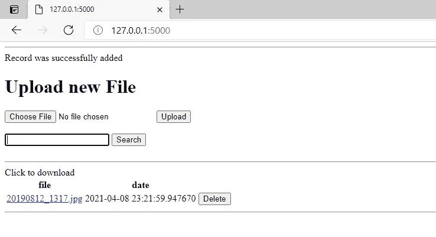

# 数据科学家的烧瓶:构建可搜索的文件目录

> 原文：<https://medium.com/analytics-vidhya/flask-for-data-scientists-building-a-searchable-file-directory-25b286332e80?source=collection_archive---------9----------------------->

你不必是一个专业的 python web 开发人员，但是使用 flask 和用它构建简单而强大的 web 应用程序的能力，是我们工具箱中的一个很好的工具。

一旦完成简单的 web 应用程序的视觉。

在本文中，我将向您展示如何使用 flask 构建一个简单的 web 应用程序。该应用程序将用于上传文件到远程路径，然后使用此 web 应用程序搜索和下载它们。

要直接跳到代码，请访问下面的 github 链接:

> [https://github . com/shabeelkandi/flask-file-upload-search-app](https://github.com/shabeelkandi/flask-file-upload-search-app)

在接下来的几行中，我将带您了解 web 应用程序的一些关键方面，而不是对代码的广泛回顾。

重要的事情先来。**我们的用例是什么？**

*答:*用户上传文件。看到的是一个所有文件的表，并能够通过文件名搜索和删除或下载文件。

# 代码分解

## 定义文件模型。

在上面的脚本中，我们定义了文件的含义:它应该有 id、名称、url(路径)和创建日期。

## Web App 首页:上传要素和表格

“/”路径指向 web app 的主页，我们正在为其构建函数 *upload_file()。*

在主页上，如果我们得到一个点击上传按钮的‘POST ’(参见 github 链接上 templates 文件夹下的 upload.html 文件),我们做一些基本的检查，看看传递了什么，然后我们做一个 db.session 命令，将文件路径添加到数据库，然后提交到数据库。

每次一个文件被上传到数据库，文件类被初始化(db 的子。模型)，所以我们把创建日期，id 都分配了。

## 搜索和删除要素

现在简单的事情是为我们的应用程序构建一个搜索和删除特性，这非常简单，因为数据已经在数据库中了。

搜索只是 sqlite 数据库的一个 sql 查询，而删除是基于 db.delete 命令的。

将它与 html 文件结合起来，可以更好地了解 web 应用程序的显示方式。

我们最后要做的就是运行 main.py 来启动 web 应用程序

*如果有什么不工作，请在下面评论，我会回来找你；)*