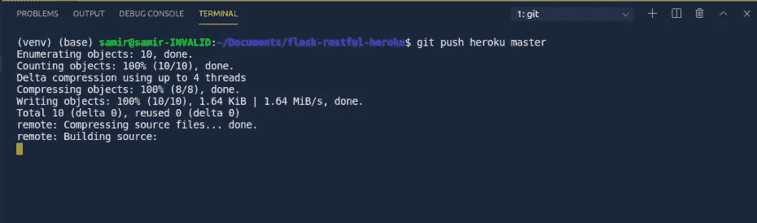

# 开始使用 Flask-RESTful API 并部署到 Heroku

> 原文：<https://medium.com/analytics-vidhya/flask-restful-api-with-heroku-da1ecf3e04b?source=collection_archive---------1----------------------->

# 介绍

在进入编码和部署部分之前，让我们从一些我们应该知道的基本主题开始。

**什么是烧瓶？**

Flask 是一个简单而强大的微型 web 框架。它主要用于在 Python 中创建 API。Flask 依赖于 [**Jinja**](https://palletsprojects.com/p/jinja/) 模板引擎和 [**Werkzeug**](https://palletsprojects.com/p/werkzeug/) WSGI 工具包。微 web 框架中的“微”意味着 Flask 旨在保持核心简单但可扩展。

Flask 不包括数据库抽象层、表单验证或其他任何已经存在的不同库可以处理的东西。相反，Flask 支持扩展，将这种功能添加到您的应用程序中，就好像它是在 Flask 本身中实现的一样。许多扩展提供了数据库集成、表单验证、上传处理、各种开放认证技术等等。Flask 可能是“微型”的，但是它已经准备好用于各种需求的生产。你可以在这里 查看官方烧瓶文档 [**。**](https://flask.palletsprojects.com/en/1.1.x/#)

**什么是 API？**

API 代表应用程序编程接口。它提供了一个软件接口或者作为一个媒介，允许两个应用程序互相对话。例如:当我们登录到脸书，脸书应用程序调用用户认证 API，验证我们的脸书帐户是否有效，并给我们访问各自的用户帐户。对于 Flask-API，我们可以从其官方文档中给出的 [**这里**](https://flask.palletsprojects.com/en/1.1.x/#api-reference) 开始。

> 什么是长颈瓶 RESTful？
> 
> Flask-RESTful 是对 Flask 的扩展，用于构建 REST APIs。你可以在这里 查看它的官方文档 [**。**](https://flask-restful.readthedocs.io/en/latest/)


来源:官方文件

什么是 REST API？

REST 代表“代表性状态转移”。它是开发人员在创建 API 时遵循的一组规则(或设计模式)。

> RESTful API 使用命令来获取资源。这些资源可以是文本文件、Html 页面、图像、视频或动态业务数据。REST 服务器只提供对资源的访问，REST 客户机访问和修改资源。
> 
> 资源在任何给定时间戳的状态称为资源表示，API 调用是无状态的。

RESTful API 使用现有的 HTTP 操作方法，例如:

*   获取以检索资源；
*   放置以改变资源的状态或更新资源，该资源可以是对象、文件或块；
*   发布以创建资源；和
*   删除以移除它。

# 例子

现在，在基本介绍之后，让我们从编码部分开始。

让我们创建一个名为***flask-restful-heroku****的目录。然后，在这个目录下，创建一个名为 ***venv*** 的虚拟环境。*

```
*$ virtualenv venv*
```

*激活创建的虚拟环境。*

```
*$ source ./venv/bin/activate*
```

*现在，安装 Flask 和 Flask-RESTful。*

```
*$ pip install Flask
$ pip install flask-restful*
```

*我们将使用 gunicorn 作为服务器。*

```
*$ pip install gunicorn*
```

*在项目目录下创建一个名为 ***main.py*** 的文件。该目录将如下所示:*

**

*将下面的代码复制到 ***main.py*** 。这是一个最小的 Flask-RESTful API。*

*保存文件 ***main.py*** 并使用 python 解释器运行它。*

```
*$ python main.py*
```

*它将看起来如下。*

**

*要使用 WSGI 服务器运行文件，首先通过按下 *CTRL+C.* 来停止 flask 应用程序*

*然后，在项目目录中创建一个名为 wsgi.py 的文件。该目录将如下所示:*

**

*现在，将下面的代码复制到 wsgi.py。我们正在准备运行 WSGI 服务器的文件。*

*然后，使用 WSGI 服务器运行该文件。*

```
*$ flask run*
```

*然后，通过按下 *CTRL 键并点击 url 上的*来跟踪该 URL。您将被重定向到默认浏览器中指向该 url 的新选项卡。您将在浏览器中获得以下输出。*

**

*在这里，如果 flask 运行在调试模式下，对我们来说就很容易了。因此，更改会自动实现。因此，使用 *CTRL+C* 停止生产服务器，并使用 python 解释器再次运行 main.py 文件。通过按下 *CTRL 键并点击 url 上的*来跟踪 URL。您将被重定向到默认浏览器中指向该 url 的新选项卡。您将获得与上面相同的输出。*

```
*from flask import Flask, jsonify
from flask_restful import Resource, Api*
```

*这里，我们已经导入了所需的库 Flask、jsonify、Resource 和 Api。“jsonify”用于将 Python 字典结构转换为 json 格式。*

```
*app = Flask(__name__)
api = Api(app)*
```

*首先，我们已经初始化了 flask app。然后，我们将 flask 应用程序指定为 api。*

```
*class HelloWorld(Resource):    
     def get(self):        
         return {'hello': 'world'}*
```

*HelloWorld 是一个充当 api 资源的类。函数 *get* 充当 get 请求。如果我们必须处理 *post* 请求，我们可以创建一个名为 post 的函数，并在该函数中执行 post 请求。由于 HelloWorld 是一个 api 资源，它的函数充当不同类型的 api 请求。*

```
*api.add_resource(HelloWorld, '/')*
```

*这一行将 HelloWorld 添加为 api 的一个 url 为“/”的资源。*

```
*if __name__ == '__main__':
    app.run(debug=True)*
```

*每个 Python 模块都定义了它的 __name__，如果这是“__main__”，则意味着用户正在独立运行该模块，我们可以执行相应的适当操作。这也意味着，如果当前文件名等于主文件名，然后运行应用程序。*

*语法 debug=True 在调试模式下运行文件，在这种模式下，对代码的更改会自动更改到服务器。*

*让我们修改 main.py。首先删除 HelloWorld 类，并创建一个类名为**状态为**的类，该类返回 api 状态的响应，如下所示:*

```
*class status(Resource):    
     def get(self):
         try:
            return {'data': 'Api running'}
         except(error): 
            return {'data': error}*
```

*它只是提供 api 的状态信息。*

*然后创建另一个类名为 S **um，**的类，它通过 get 请求返回所提供的两个数之和，如下所示:*

```
*class Sum(Resource):
    def get(self, a, b):
        return jsonify({'data': a+b})*
```

*现在，让我们将它们添加为分配了 URL 的资源。*

```
*api.add_resource(status,'/')api.add_resource(Sum,'/add/<int:a>,<int:b>')*
```

*我们将删除 main.py 中的 debug=true，因为我们现在要在 Heroku 中进行生产和部署。*

*在原料药的情况下，有一个跨来源的概念。这意味着即使我们用 python 开发了我们的 API，其他来源(如 Javascript、React 等语言)也可以访问我们的 API。因此，我们还将导入 CORS，并将我们的应用程序指定为 CORS 应用程序。*

*安装烧瓶-cors 组件:*

```
*$ pip install Flask-Cors*
```

*最后，我们的 main.py 将如下所示:*

*我们有自己的 wsgi.py。*

# *去 Heroku*

*在去 Heroku 之前，我们需要一些额外的文件。*

*添加一个名为 *Procfile* 的文件，其内容为:*

```
*web: gunicorn  main:app*
```

*这意味着该应用程序是一个网络应用程序，运行在 gunicorn 服务器和主要是我们的应用程序。*

*用内部内容创建另一个名为 *runtime.txt* 的文件:*

```
*python-3.7.3*
```

*这是我目前使用的 python 版本。*

*现在，在终端上键入:*

```
*pip freeze > requirements.txt*
```

*它将创建一个 requirements.txt 文件，其中包含此应用程序所需的要求。打开 requirements.txt 文件，您可以看到如下图所示的指定需求。*

**

*我们最终的文件目录将如下所示:*

**

*安装 Heroku CLI 并逐步执行命令。*

```
*$ heroku login*
```

*遵循程序并登录。*

*现在，让我们创建一个名为 flask-heroku1 的新 heroku 应用程序。给你唯一的应用程序名称。*

```
*heroku create flask-heroku1 --buildpack heroku/python*
```

*你可以检查你的 heroku 仪表盘，看看上面的代码是否有效。*

*这里，我们将 buildpack 指定为 python，因为我们的应用程序是用 Python 编写的。在部署过程中，heroku 根据 Python buildpack 构建我们的应用程序。*

```
*$ git init*
```

*如果你没有安装 git，那么首先安装 git 并继续。*

```
*$ git add .*
```

*该命令将所有已更改的文件视为更改。现在，我们提交到我们刚刚初始化的本地 git 存储库。*

```
*$ git commit -m "Flask-Restful-Heroku api"*
```

*有时，我们的 heroku create-app 不设置远程原点。所以，我们必须将远程原点添加为:*

```
*$ heroku git:remote -a flask-heroku1p*
```

*最后，将 heroku 部署为:*

```
*$ git push heroku master*
```

*然后，您可以看到部署过程如下:*

******

*正在使用 pip 安装 requirements.txt 上的要求*

**

*部署完成。我的 api 托管在:*

*[https://flask-heroku1p.herokuapp.com/](https://flask-heroku1p.herokuapp.com/)*

*它给出了:*

**

*获取 api 的根 url 的请求输出*

*我将通过输入以下 url 获得两个数字的和:*

*[https://flask-heroku1p.herokuapp.com/add/3,5](https://flask-heroku1p.herokuapp.com/add/3,5)*

*它给出了:*

**

*获得 3 和 5 之和的请求输出*

# *参考资料:*

1.  *[](https://flask-restful.readthedocs.io/en/latest/)*
2.  ***[**烧瓶用户指南**](https://flask.palletsprojects.com/en/1.1.x/)***