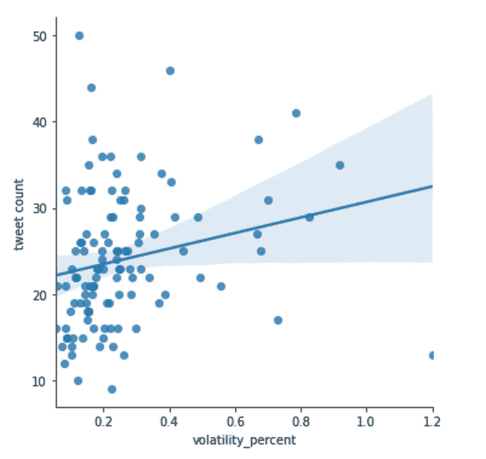
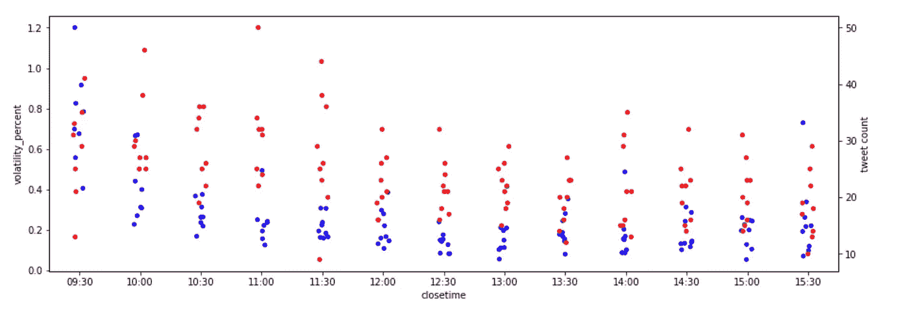

# 初出茅庐的数据工程项目第二部分:分析

> 原文：<https://medium.com/analytics-vidhya/fledgling-data-engineering-project-part-ii-analysis-45d099f2e589?source=collection_archive---------21----------------------->

跟随 jupyter 笔记本[这里](https://github.com/mingybopeep/fledglingetlanalysis)

我最近记录了我如何使用 twitter、python 和 AWS 创建了一个简单的数据工程 ETL 项目。简而言之，该项目从 yahoo finance 和 twitter 中提取数据，对其进行清理，并将其转储到运行 postgres 的 Amazon RDS 实例中。该脚本部署在 EC2 实例上，使用 cron 每 30 分钟运行一次。

点击[这里](https://dummydata.medium.com/fledgling-etl-data-engineering-project-43f7937d5c35)阅读更多关于简单初学者项目(包括回购)。

经过大约两周的运行，这个项目是成功的，我设法建立了大量的数据。我还接近了 AWS 的自由层限制，因此我并不缺少停止虚拟机的动力。

# 抓取我的数据

我有一个 RDS 实例，其中有两个 SQL 表，装满了可供我使用的数据。计划是在笔记本中分析熊猫的数据，所以我首先将数据放入一些 csv 文件并保存在本地。只需要一个简单的 python 脚本。回购协议中的代码在一个名为 pull.py 的文件中。

# 下一站，朱庇特

现在我已经将所有的数据加载到一些易于使用的 csv 文件中，我拿起 jupyter 笔记本开始进行一些分析。我首先必须将数据读入一些数据帧，然后才可以开始有趣的事情。

我为自己提出的示例场景如下:
*“ML 的学生想要发现推文对给定股票的价格行为是否有任何预测能力。”*

这是一个相当宽泛的场景，所以有很多方法可以解决这个问题。首先,“价格行为”这个术语非常模糊，可以有多种定义。我们能看到的最简单的指标是回报率和波动性。类似地，询问推文是否有预测能力给了我们几条途径，简单快捷的方法是收集推文并按时间分类，然后调查推文在给定时间段内的频率是否会带来任何洞察力。

# 一些分析

我首先必须确保我的数据都被正确连接，因为我有 2 个表，它们变成了 2 个 CSV，变成了 2 个数据帧，最终需要合并成一个数据帧。谢天谢地，我知道我需要从一开始就连接我的表，所以我在 ETL 阶段设计了我的数据收集，以使连接成为可能。两者都有一个通用格式的时间字段。

我按照时间戳对我的推文进行分组，为每个时间戳生成一个推文频率，然后将该数据加入我的股票数据。

最后，数据准备好了。第一次分析运行是一个配对图，用于将数据框架中的所有连续变量相互比较，这提供了关系的高层次视图，并允许识别清晰的模式。

回报率和波动性的分布非常有趣。粗略的配对图显示推文和波动性之间没有关系，推文和定向回报之间也没有关系。

为了证实这一点，对推文数量与波动性进行了线性回归，同样没有发现关系。

摘自朱庇特笔记本

鉴于 tweet count vs(volatility/returns)之间没有明显的关系，我们制作了一个带状图来显示与不同变量(一天中的时间)之间的关系。

时间戳列从<date time="">转换为，这意味着时间现在可以被视为一个分类变量。</date>

数据被绘制出来，除了市场开盘时波动性(蓝色)可能会有所增加(这是我们已经预料到的),由于这段时间市场的流动性不足，没有发现太多的关系。

摘自朱庇特笔记本

总体而言，从分析中得出的结论是，基于分析的数据集，推文数量和价格行为之间不存在明确的关系。

# 摘要

再次访问这个数据集可能会很有趣，下次对推文本身进行一些情绪分析，然后将其与价格行为进行比较，因为这在直觉上是有意义的。
总而言之，这是一个有趣的项目，获得我自己收集、整理和分析的真实数据非常有益，并提供了一个很好的学习方式。