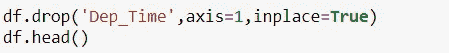
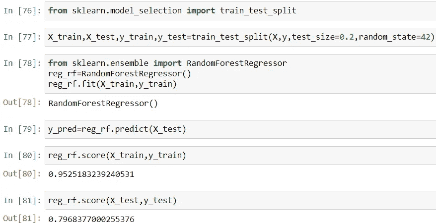

# 部署情况下的航班价格预测

> 原文：<https://medium.com/analytics-vidhya/flight-price-prediction-with-deployment-7d2f2b151fcc?source=collection_archive---------6----------------------->

# 介绍

机器学习黑客马拉松是增强您的机器学习知识的最佳方式之一，因为它有助于我们理解尝试问题陈述的不同方法。

**Machine Hack** 最近举办了一场关于**航班票价预测**的黑客马拉松，我们必须根据一些独立的特征来预测航班的票价。这对我来说是一次独特的经历，因为这是我第一次参加黑客马拉松。有 3000 多名参赛者，我在比赛中获得了 363 名。我学到了解决问题陈述的各种方法和技术，在提交我的结果后，我甚至在 Heroku 上部署了这个模型。

在本文中，我将一步一步地详细解释这个项目。所以，系好安全带，我们开始吧！！

# 项目中的步骤

1.  导入库和数据集
2.  探索性数据分析
3.  特征工程
4.  特征选择
5.  超参数调谐
6.  模型结构
7.  部署

# A]导入库和数据集

上图显示了使用的库和数据集。我们的目标变量是航班的价格/票价，其余的特征是独立变量。

# B]特征工程和 EDA

因为我们有了数据集，所以将自变量预处理成更简单的变量是很重要的。让我们逐一处理所有的数字变量和分类变量。首先，让我们处理数字数据。

## B.1]旅行日期

我们的工作是从 Date_of_journey 特征/列中提取旅程日期和旅程月份。

提取日期和月份的代码

下面是创建两个新列(即，Journey_Day 和 Journey_month)后数据集的图像。

现在删除旅行日期列。

## B.2]出发时间

现在让我们来处理**的 Dep_Time** 特性。从要素 Dep_Time 中提取小时和分钟。

下图是添加两个新列后修改后的数据集。

## B.3]到达时间

现在让我们处理到达时间特性。从特征到达时间中提取**到达时间**和**到达时间**。

下面是添加两个新列后的图像。

## B.4]期限

现在让我们来处理持续时间特性。从特征中提取持续时间 _ 小时和持续时间 _ 分钟。

下面是添加两个新列后数据集的图像。

现在让我们来处理分类数据。

**航空公司**、**来源、目的地和总停靠站**是分类变量。ML 模型不理解分类数据。因此，我们需要将它们转换成数字数据。

有两种类型的分类变量:

1.  名义变量:不遵循任何顺序或级别的变量。例如，航空公司、出发地和目的地。
2.  有序变量:有层次或遵循顺序的变量。eg)停止。

我们对**标称**变量执行**一次热编码**，对**序数**变量执行**标签编码**。

## B.5]航空公司

## B.6]来源

## B.7]目标

让我们也从数据集中删除路径和附加信息要素，因为它们贡献不大。

## B.8]总停留次数

现在将所有这些要素与原始数据集连接起来。

数据集的最终图像:

现在对测试数据集重复整个过程，并获得测试的最终数据。

# C]功能选择

功能选择通过两种方式进行:-

1.  相关热图
2.  额外树回归量

首先让我们创建自变量和因变量。

下面是关联热图的图像。

2)使用额外的树回归器

# E]模型建立和超参数调整

首先让我们使用随机森林建立模型。

现在让我们使用随机搜索 CV 来提高准确性。

最终得到了 81%的测试准确率。

现在还不是在 heroku cloud 上部署我们的模型的时候。

# F]部署步骤

1.  创建您的 model.py 文件(在上面)并下载 pkl 文件
2.  使用 flask 创建 app.py
3.  创建模板文件夹
4.  创建静态文件夹
5.  创建 requirements.txt 文件
6.  创建您的 Procfile
7.  在 Heroku 上创建帐户，并将其与 Github 连接。

## PKL 文件

## App 截图

这都是关于这个项目的飞行价格预测。我将在下面附上我的 LinkedIn 和 Github 链接。可以联系我看更多精彩项目。快乐学习！！

 [## GitHub-same ERK 15/we B- app-航班-价格

### 通过在 GitHub 上创建帐户，为 sameerk15/Web-app-flight-price 开发做出贡献。

github.com](https://github.com/sameerk15/Web-app-flight-price) 

[https://www.linkedin.com/in/sameer-kumar-20988b1a6/](https://www.linkedin.com/in/sameer-kumar-20988b1a6/)