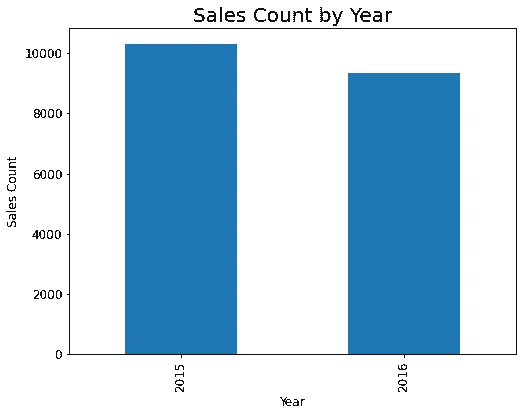
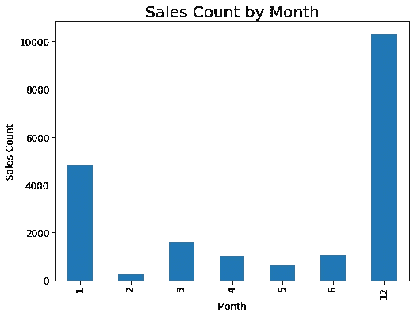
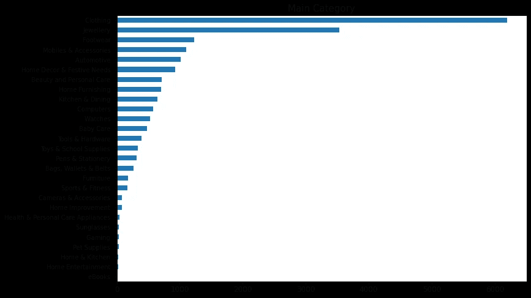
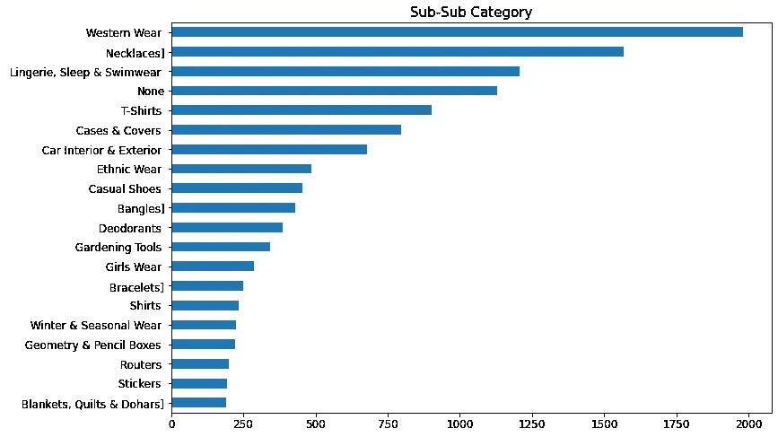
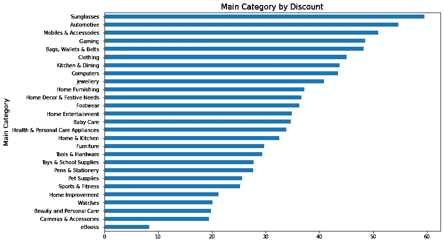

# Flipkart 数据分析和 NLP ML 模型

> 原文：<https://medium.com/analytics-vidhya/flipkart-data-analysis-and-nlp-ml-model-88f63ea39900?source=collection_archive---------1----------------------->


这里我们将讨论 Flipkart 数据集上的一个**端到端机器学习案例研究**。描述性分析和 NLP 模型，通过产品的描述来预测类别。

你可以从 [**下载数据从**](https://www.kaggle.com/vaishnavsrivastava/flipkart-category-prediction-and-eda/data) 下载笔记本从 [**这里**](https://www.kaggle.com/vaishnavsrivastava/flipkart-category-prediction-and-eda/notebook) 。

## 关于数据

*   这是一个预先抓取的数据集，作为一个更大的数据集(超过 580 万件产品)的子集，该数据集是通过从印度领先的电子商务商店[Flipkart.com](http://flipkart.com/)提取数据而创建的。

## 使用的工具

*   Python 3.6
*   Numpy
*   熊猫
*   Matplotlib
*   海生的
*   数据科学
*   机器学习
*   Sklearn

## 有数据的目标

*   电子设计自动化(Electronic Design Automation)
*   使用 NLP 制作一个 ML 模型来预测带有产品描述的产品类别

## 数据有问题

清理这些数据，在产品类别树中分离所有类别，找出主要类别，然后使用模型对此进行预测。

# 电子设计自动化(Electronic Design Automation)

目的:
从 Flipkart 数据中检索以下隐藏的见解。

1.哪一年的销售额最高？



2.一年中哪个月的销售额最高？



3.哪个类别的销售额最高？



4.女性在 Flipkart 上购买什么？



5.哪个类别有最大折扣？



M使用 NLP 的机器学习模型

首先通过使用值计数来移除不需要的类别，由于数据非常不合适，该值计数小于 10，在类别名称中包含产品名称。

```
value_count=df['main_category'].value_counts()
to_remove=value_count[value_count<=10].index
df=df[df.main_category.isin(to_remove)==False]
df.main_category.value_counts()
```

然后通过创建一个函数从产品描述中删除符号、停用词来清理文本。
通过转换为字符串将函数应用于描述列。

```
REPLACE_BY_SPACE_RE = re.compile('[/()**{}**\[\]\|@,;]')
BAD_SYMBOLS_RE = re.compile('[^0-9a-z #+_]')
STOPWORDS = set(stopwords.words('english'))

def clean_text(text):
    *"""*
 *text: a string*

 *return: modified initial string*
 *"""*
    text = text.lower() *# lowercase text*
    text = REPLACE_BY_SPACE_RE.sub(' ', text) *# replace REPLACE_BY_SPACE_RE symbols by space in text*
    text = BAD_SYMBOLS_RE.sub('', text) *# delete symbols which are in BAD_SYMBOLS_RE from text*
    text = ' '.join(word for word **in** text.split() if word **not** **in** STOPWORDS) *# delete stopwors from text*
    return text

*#applying function to description column by converting to string*
df['description'] = df['description'].astype(str)
df['description'] = df['description'].apply(clean_text)
```

> 模特培训

创建 X(预测值)、y(目标值)变量并设置训练、测试分割。
我们正在创建两个管道
第一个——使用**计数矢量器:**将文本文档的集合转换为令牌计数的矩阵，以及**多项式分类器:**用于多项式模型的朴素贝叶斯分类器。

第二，使用**TF IDF 矢量器:**将原始文档集合转换为 TF-IDF 特征矩阵和**多项式。**

调整超参数以获得更好的精度，然后设置两个管道。

```
*Hyperparameter Tuning*
tuned_parameters = {
    'vect__ngram_range': [(1, 1), (1, 2), (2, 2)],
    'clf__alpha': [1, 1e-1, 1e-2]}

tf_params = {
 'tvec__ngram_range': [(1, 1), (1, 2), (2, 2)],
 'tvec__stop_words': [None, 'english'],
 'clf1__alpha': [1, 1e-1, 1e-2]

}*# Setting up GridSearch for CountVectorizer*
clf = GridSearchCV(text_clf, tuned_parameters, cv=5, verbose =1, n_jobs = -1)
clf.fit(X_train, y_train)
*# Setting up GridSearch for TfidVectorizer*
clf2 = GridSearchCV(tvc_pipe, tf_params, cv=5, verbose =1, n_jobs = -1)
clf2.fit(X_train, y_train)

*# In[34]:*

print(clf.score(X_test, y_test))*# Scoring Training data on CountVectorizer*
print(clf.score(X_train, y_train))*# Scoring Testing data on CountVectorizer*
print(clf2.score(X_test, y_test))*# Scoring Training data on TFIDFVectorizer*
print(clf2.score(X_train, y_train))*# Scoring Testing data on TFIDFVectorizer*

*# In[35]:*

*#Classification report of CountVEctorizer*
predicted_clf=clf.predict(X_test)
print(classification_report(y_test,predicted_clf))

*# In[36]:*

*#Classification report of TfidVectorizer*
predicted_clf2=clf2.predict(X_test)
print(classification_report(y_test,predicted_clf2))
```

模型训练后，我们得到预测

```
0.9627594627594628
0.9949114593934459
0.9717134717134717
0.9979645837573784
                                    precision    recall  f1-score   support

                       Automotive        0.96      0.97      0.97       240
                        Baby Care        0.85      0.81      0.83       128
            Bags, Wallets & Belts        0.92      0.85      0.88        78
         Beauty and Personal Care        0.91      0.97      0.94       159
            Cameras & Accessories        0.83      1.00      0.90        19
                         Clothing        0.99      0.98      0.99      1510
                        Computers        0.96      0.89      0.92       151
                         Footwear        0.97      1.00      0.98       322
                        Furniture        1.00      0.96      0.98        55
                           Gaming        0.70      0.88      0.78         8
Health & Personal Care Appliances        1.00      0.80      0.89        10
                   Home & Kitchen        0.67      0.86      0.75         7
       Home Decor & Festive Needs        0.97      1.00      0.99       234
               Home Entertainment        0.20      0.50      0.29         2
                  Home Furnishing        0.95      0.99      0.97       158
                 Home Improvement        0.90      0.96      0.93        27
                        Jewellery        1.00      1.00      1.00       846
                 Kitchen & Dining        0.96      0.90      0.93       166
            Mobiles & Accessories        0.99      0.93      0.96       283
                Pens & Stationery        0.90      0.73      0.81        78
                     Pet Supplies        0.75      1.00      0.86         6
                 Sports & Fitness        0.83      0.93      0.88        43
                       Sunglasses        1.00      1.00      1.00        10
                 Tools & Hardware        0.89      0.96      0.92       114
           Toys & School Supplies        0.78      0.94      0.85       107
                          Watches        0.99      0.97      0.98       149
                           eBooks        0.50      0.50      0.50         4

                          accuracy                           0.96      4914
                         macro avg       0.87      0.90      0.88      4914
                      weighted avg       0.96      0.96      0.96      4914

                                    precision    recall  f1-score   support

                       Automotive        0.96      0.98      0.97       240
                        Baby Care        0.93      0.78      0.85       128
            Bags, Wallets & Belts        0.91      0.92      0.92        78
         Beauty and Personal Care        0.98      0.97      0.97       159
            Cameras & Accessories        1.00      0.89      0.94        19
                         Clothing        0.99      0.99      0.99      1510
                        Computers        0.94      0.96      0.95       151
                         Footwear        0.98      1.00      0.99       322
                        Furniture        1.00      0.98      0.99        55
                           Gaming        1.00      0.75      0.86         8
Health & Personal Care Appliances        1.00      0.80      0.89        10
                   Home & Kitchen        1.00      0.86      0.92         7
       Home Decor & Festive Needs        0.94      1.00      0.97       234
               Home Entertainment        0.50      0.50      0.50         2
                  Home Furnishing        0.95      0.99      0.97       158
                 Home Improvement        1.00      0.93      0.96        27
                        Jewellery        0.99      1.00      1.00       846
                 Kitchen & Dining        0.94      0.94      0.94       166
            Mobiles & Accessories        0.99      0.98      0.98       283
                Pens & Stationery        0.88      0.76      0.81        78
                     Pet Supplies        1.00      0.83      0.91         6
                 Sports & Fitness        0.94      0.79      0.86        43
                       Sunglasses        1.00      1.00      1.00        10
                 Tools & Hardware        0.96      0.96      0.96       114
           Toys & School Supplies        0.82      0.88      0.85       107
                          Watches        1.00      0.99      0.99       149
                           eBooks        1.00      0.25      0.40         4

                          accuracy                           0.97      4914
                         macro avg       0.95      0.88      0.90      4914
                      weighted avg       0.97      0.97      0.97      4914
```

# 总结:

我们从 csv 文件中收集数据，并清理不使用的数据删除列。主要问题是如何使用简单的字符串替换方法将不同列中的列树列分开，并使用函数成功地将产品类别分开，并通过 EDA 了解 2015 年和 2016 年 flipkart 数据的许多见解。你可以查看我的 [LinkedIn](http://www.linkedin.com/in/vaishnav-srivastava-88a030119) 账户。

带着快乐的字条谢谢。