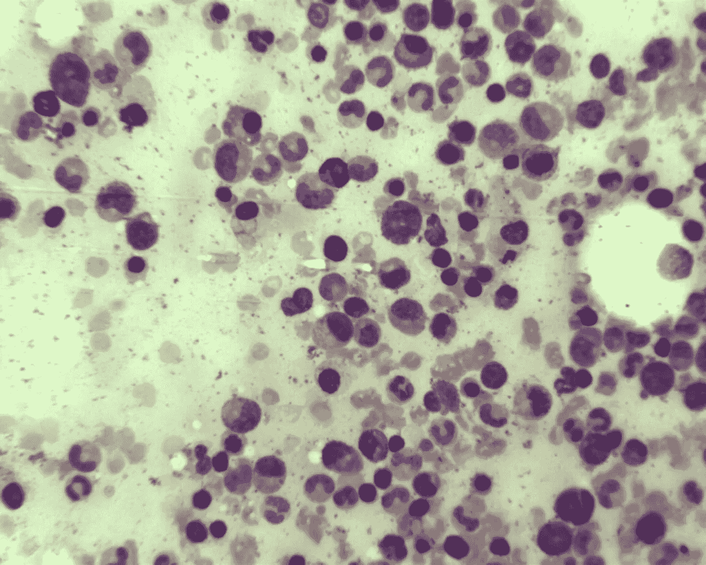
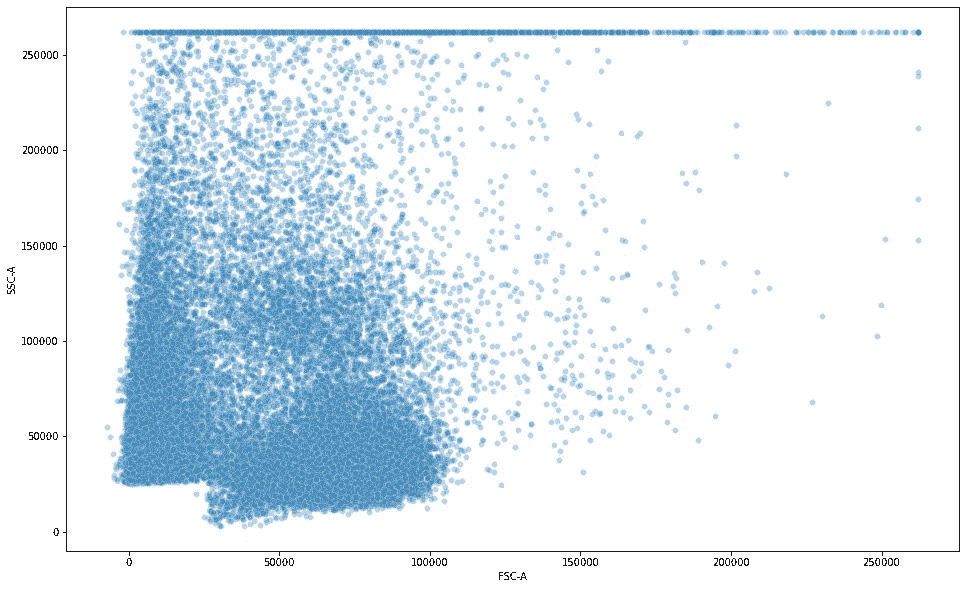

# 用 t-SNE 进行流式细胞门控

> 原文：<https://medium.com/analytics-vidhya/flow-cytometric-gating-with-t-sne-d8dcfe6b0534?source=collection_archive---------5----------------------->

一个是在显微镜下面对令人困惑的细胞多样性；即使在简单的显微镜下，最普通的组织——血液——也显示出过多不同种类的细胞。观察骨髓，也就是血液产生的地方，是一种完全令人眩晕的体验。



正常骨髓；前体细胞的混合群体——那些继续制造红细胞、白细胞和血小板的细胞

只要有一点耐心(和几杯咖啡)，就可以数出骨髓中不同种类细胞的比例；因为，细胞的多样性也体现在它们的形态上——它们在显微镜下的“样子”。

然而，每隔一段时间，人们就会发现这样的污点，那里一切看起来都是一样的


是的，有“红”血细胞(数量更多，是铜色的)和“白”(实际上，由于利什曼染色是紫色的)血细胞；但这是你能得到的最大限度了

在上个世纪中叶，病理学家意识到在看似一致的细胞中存在差异，即上图中的“淋巴细胞”不是同质群体。它们的区别在于“抗原”的表达，即它们制造并在其表面展示哪种蛋白质。因此，那些表达“CD3”(分化群#3，说来话长)的是“T”(胸腺来源)淋巴细胞，而那些表达“CD19”、“B”(骨髓来源)淋巴细胞。细胞表面两种特定蛋白质的表达与其来源相关，这一事实标志着细胞研究方式的重大变化。一件事导致了另一件事，到 2000 年，你已经有数百个这样的“标记”来代表不同种类的细胞亚群。例如，CD4、CD25(实际上是一种细胞因子受体)和 FoxP3(一种核转录因子)的结合标志着调节性 T 细胞(Tregs)，这是 T 淋巴细胞内的一个子集。

从八十年代中期开始，一种基于单细胞“询问”(实际上是在激光下检查每个细胞)的新技术——称为“流式细胞术”——开始蓬勃发展。流式细胞仪提供了一种机制来检查每个细胞上这种标记的存在，*单独*，前提是你有一种针对该蛋白质的单克隆抗体(它将与该标记结合，并因此粘在细胞上)，并有一种标记在该抗体上的“荧光染料”(本质上是一种发射与其吸收不同波长的光的分子)。然后，可以用激光检测荧光，从而作为细胞上特定抗原存在的替代标记。

现代流式细胞仪可以定量每个细胞上的“多种”此类标记，并产生一系列标记(单个细胞),如下图所示。(来自对白细胞进行的流式细胞术的数据)。


50000 个细胞(“事件”)的列表，包括它们的大小(FSC —“前向散射”)、粒度(SSC —“侧向散射”)和几种荧光染料(FITC、BV421、APC)的强度，这些荧光染料被标记到针对大量细胞标记物的单克隆抗体上

你如何解释这样的表格取决于上下文。“大小”(FSC)和“粒度”(SSC)是不言自明的。然而,“FITC-A”的值没有任何意义，除非你知道 FITC-A 绑定到什么“标记”,即它的目标。在本实验中，FITC-A 被标记到抗 IgG 的单克隆抗体上(即在细胞表面上看到结合的免疫球蛋白 G)，抗 CD3 的 PE 和抗 CD19 的 PE-Cy5 上。

很明显，绘制这些数据的一种方法是一次取两列，然后做一个散点图。标准流式细胞仪将此表导出为 FCS 文件，可由 python 工具读取，如 [flowkit](https://github.com/whitews/FlowKit/) 。

```
import pandas as pd, numpy as np
import matplotlib.pyplot as pltimport seaborn as sns
import flowkit as fk# The file is available in my Github repo
file = 'fcxm_example.fcs'
fcs = fk.Sample(file)
xform = fk.transforms.LogicleTransform('linear', param_t=262144, param_w=0.5, param_m=4.5, param_a=0)
fcs.apply_compensation(fcs.metadata['spill'])
fcs.apply_transform(xform)
df = fcs.as_dataframe()# Plot two parameters of the dataframe, 'FSC-A' (size) and 'SSC-A' (granularity)
plt.figure(figsize=(16,10))
sns.scatterplot(x='FSC-A',y='SSC-A',data=df,alpha=0.3)
```



尽管这提供了很少的信息；对于多维数据集(如 FCS 文件),只能逐段查看数据。在通常的情况下，单元格是基于这个初始图进行“门控”(选择)的。对这个“门控”群体作了进一步的散点图。


选择“感兴趣的群体”(门控)，在这种情况下，是“淋巴细胞”群(希望如此)

可以通过图形方式(使用 FCS 分析器)或少量代码进行选择(下面的代码示例不是图片中椭圆选择器的精确匹配，而是一个足够接近的矩形)

```
lym = df[(df['FSC-A'] > 50000) & (df['FSC-A'] < 100000) & (df['SSC-A'] > 10000) & (df['SSC-A'] < 80000)]
```

这种过滤器产生具有大约 27000 行的新数据帧‘lym’。如果我们对“lym”人群进行分散，例如 PE (CD3)和 PE-Cy5 (CD19)，我们得到:

```
plt.figure(figsize=(16,10))
sns.scatterplot(x='PE-A',y='PE-Cy5-A',data=lym,alpha=0.3)
```


右边具有高 PE-A (CD3)的大簇是“T”细胞，而顶部具有高 PE-Cy5 (CD19)的较小簇是 B 细胞；注意大量的双阴性和无双阳性(一个细胞不能同时是 T 和 B)

如果我们有几个这样的标记，被多种荧光染料靶向，我们必须单独绘制每个组合。例如，绘制 PE (CD3)对 FITC (CD56)的曲线

```
plt.figure(figsize=(16,10))
sns.scatterplot(x='PE-A',y='FITC-A',data=lym,alpha=0.3)
```


这一点比较难解读；是否存在一定的高 PE 和 FITC 结合的人群？更令人困惑的是，有大量的人口有低 PE 和高 FITC。如果我们为其他变量绘图(如 APC vs BV421)，这些单元在哪里？

显然，当使用多色流式细胞术时，这种零碎的散点图分析是有局限性的:如果我们能以某种方式将“所有”参数绘制成图，然后分析高 FITC 表达的簇，那就好了。这种探索性分析将指向一个新的、未发现的细胞群体，如果发现一个集群的话。听起来像是 t 分布随机邻居嵌入(t-SNE)的典型用例。

首先，我们选择整个数据集，并应用来自 sklearn 的 t-SNE 算法，使用典型参数。

```
from sklearn.manifold import TSNE
N = 50000
dff = df.loc[0:N]
data = dff.values
tsne = TSNE(n_components=2, verbose=1, perplexity=40, n_iter=300)
tsne_results = tsne.fit_transform(data)
```

这需要一段时间，但是你会在 tsne_results 中得到一个(降维的)特性列表:让我们取前两个，做一个散点图。

```
dff['tsone'] = tsne_results[:,0]
dff['tstwo'] = tsne_results[:,1]
plt.figure(figsize=(16,10))
sns.scatterplot(
    x="tsone", y="tstwo",
    data=dff,
    legend="full",
    alpha=0.3
)
```


好的，数据中有一些集群，我们现在必须用单独的标记来探测它

让我们用高 FITC 表达(即 FITC-A > 0.8)的标签绘制同样的图。回忆一下，FITC 靶向细胞表面结合的 IgG。

```
dff['tsone'] = tsne_results[:,0]
dff['tstwo'] = tsne_results[:,1]
dff['positive'] = dff['FITC-A'] > 0.8
plt.figure(figsize=(16,10))
sns.scatterplot(
    x="tsone", y="tstwo",
    hue="positive",
    data=dff,
    legend="full",
    alpha=0.3
)
```


具有结合 IgG 的细胞群，用 t-SNE 清楚地描绘

我们在这里“发现”了一个新群体，如果你考虑到这些细胞“隐藏”在 FCS 数据帧的 n 维空间中，并且 t-SNE 已经将它们展平到二维空间中，这就更有意义了。把事情放在上下文中，如果你只有少数几个标记，传统的散点图和门控就足够了。但是一旦你开始一次寻找 10 个标记，像 t-SNE 这样的降维技术是描绘细胞群体的必要手段。

本例中的 FCS 文件可在[https://github.com/vaishleshik/flow_cytometry](https://github.com/vaishleshik/flow_cytometry)获得。