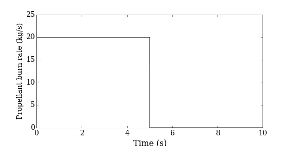
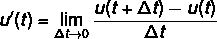

# 从数字上看，驾驶火箭。

> 原文：<https://medium.com/analytics-vidhya/flying-a-rocket-numerically-404ed271ee23?source=collection_archive---------10----------------------->

## 简要介绍模拟和将离散化的常微分方程转换为 python 代码以模拟物理现象。

照片由[菲尔在](https://unsplash.com/@philhearing?utm_source=medium&utm_medium=referral) [Unsplash](https://unsplash.com?utm_source=medium&utm_medium=referral) 上听

T 宇宙是连续的还是离散的正在争论中(希腊哲学家芝诺对两个巨人的一瞥:广义相对论&量子论)。然而，一种物理现象，如无粘性流体的流动，即使从远处看似乎是连续的，我们仍然需要将它们离散化，以便定量地“测量”它的任何性质。当我们人类(在本文中我们将保持一个地球人的视角)测量一些东西时，我们总是在这个过程中失去一些准确性。是不是很意外？我们稍后将回到这一点。

借助传统的物理实验来研究一个物理现象可能极其困难(高能等离子体和放电)，有时也不可能(黑洞)。模拟使我们能够建立一个系统的模型，并允许我们做虚拟实验。

那么，这个**离散化**、的过程到底是什么意思呢？有人可能会问。在我们进一步讨论之前，我们需要用更专业的语言来描述整个故事，以便更好地理解其基本原理。我们前面已经看到，连续流是由连续函数描述的，比如说，质点的速度被转换成离散形式，可以在计算机的有限内存中表示出来。

下一个也是最重要的问题是我们如何做到这一点？这就是数值方法发挥作用的地方。当然，还有其他方法(谱元素法、格子玻尔兹曼法)，但为了简洁起见，我们将坚持用最简单的数值方法来求解常微分方程(ODEs)。那么，让我们开始这个美丽的模拟世界的旅程，在这里我们将了解一些关于数值积分方法和离散化的过程。然后，我们将用几行 python 代码模拟一次火箭飞行，绘制其纯垂直轨迹，以观察模拟的威力。

# **火箭科学**

火箭在纯垂直飞行中的运动由一组一阶微分方程控制，如下所示。

其中 v 是火箭的速度，h 是火箭的高度。

剩余推进剂的质量由下式给出:

该图描述了火箭燃料消耗随时间的变化

有人可能已经注意到，由于我们的第三个方程也是依赖于时间的，我们现在实际上有三个方程要解。我们需要求解三个变量，即推进剂的速度(v)、高度(h)和质量(Mp)。

请注意，这些变量也出现在其他方程中。这被称为方程耦合，因为变量在每个时间步也依赖于其他变量。

# **时间积分**

我们想找出火箭的轨迹。这可以通过对微分方程进行时间积分来实现。这些微分方程的时间解可以分两步获得:

1.  找出所有变量在某一时刻的导数。
2.  将这些解决方案与时间结合起来。

注意，这些微分方程组有一个解析解。然而，由于我们没有验证我们的数值解的准确性，我们将只关注方程的数值分析方面。

让我们用质数重写时间导数。

看待这些一阶微分方程的另一种方式是使用向量符号。我们可以用这三个变量做一个向量。

那么微分系统可以写成

如果右手边被称为 **f(u)** ，我们可以将全向量系写成**u′(t)= f(u)**。注意，为了清楚起见，我们去掉了矢量符号。从今以后，我们将经常使用这种符号来描述完整的向量方程组。

我们可以在 python 中定义一个函数来写右边这个。

# **初值问题**

因为我们在时间维度上移动，所以我们需要一个在 **u(t=0)=u_0** 的起点。我们需要方程中所有变量的初始值。这叫初值问题。

# **离散化**

我们使用了含有时间导数的微分方程。但是到底什么是衍生品呢？对于 **u = u(t)** 的曲线，导数代表该曲线上一点处切线的斜率。导数 u’的定义如下

如果步长δt 非常小，我们可以通过降低极限来逼近导数，

这个近似值意味着什么？这意味着在确定实际值时，我们损失了一定的精度。有印象吗？我在一开始就谈到了失去准确性！这是其中一个例子，我们会因为导数的阶次而失去精度。这里，我们使用一阶导数。

上面的等式到底是什么意思？我们可以通过使用一个我们已经知道的在时间 **t** 和**u′**的初始值**u(t+δt)**并步进**δt**来找到新的值。同样，我们可以找到**u(t+2δt)**等等。这实际上是第二步，即解决方案与时间的整合。

我们实际上已经将时域离散为小的时间步长**δt**。我们找到一系列时间值的变量的数值解，每个时间值由**δt**分隔。这些时间值构成了我们的时间网格。这个时间网格的第一个点是初始时间 **t=0** 。

# **欧拉方法**

基于确定上述**u(t+δt)**的近似方程，该方程的数值解包括使用以下方程计算一系列近似解:

# **数值解**

现在我们已经有了我们需要的所有理论，我们可以使用 python 和它的高效库来解决这些微分方程。

首先，我们将导入一些重要的库。

我们定义一个任意的时间间隔。我们创建一个数组`u`来保存所有变量的向量。对于初始步骤，我们用上面定义的所有变量的初始值填充`u`。

接下来，我们画出火箭的轨迹，它是作为 T3 的函数的 T2。

正如我们所观察到的，火箭上升到大约 1300 米的最高高度需要 15.7 秒。这时，火箭内部的燃料已经空了，火箭开始下降。

# **结论**

这是对使用 python 模拟物理现象的简单介绍，可以在笔记本电脑上完成。模拟的美妙之处在于我们可以用近似的方法来研究许多复杂的现象。然而，正如我们在上面看到的，当我们对导数进行近似时，我们会损失一些精度。

我们可以进一步计算火箭的速度，以及火箭耗尽燃料后到达地面所需的时间。最后，我们可以比较结果与解析解，以检查我们的数值解的准确性。完整的代码可以在这里的[链接中找到。](https://github.com/sidhantjain90/Numerical-Methods/blob/master/Module%201%20Rocket%20Flight%20(Assignment).ipynb)