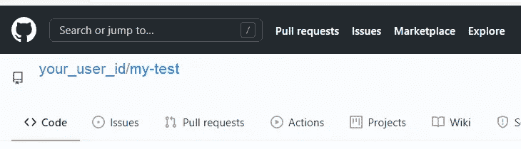
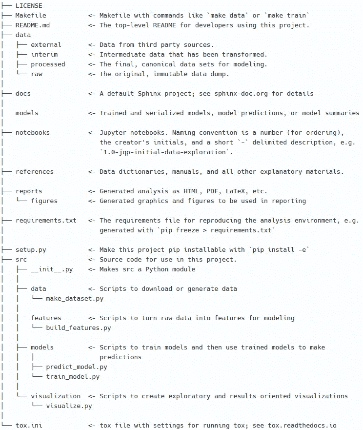

# 机器学习项目的文件夹结构

> 原文：<https://medium.com/analytics-vidhya/folder-structure-for-machine-learning-projects-a7e451a8caaa?source=collection_archive---------0----------------------->

## 创建自动化文件夹结构的简单步骤！


凯文·Ku 在 [Unsplash](https://unsplash.com?utm_source=medium&utm_medium=referral) 上的照片

拥有一个组织良好的通用机器学习项目结构，便于理解和进行更改。此外，这种结构对于多个项目可以是相同的，这避免了混淆。在这篇文章中，我们将使用 Cookiecutter 包来创建一个机器学习项目结构。

第一步:确保你的环境中安装了最新的 [python](https://www.python.org/downloads/) 和 [pip](https://pip.pypa.io/en/stable/installing/) 。

步骤 2:安装 cookiecutter

```
pip install cookiecutter
```

步骤 3:在 github.com 上创建一个样本存储库(例如，my-test)



**注意:**创建存储库时，不要选中“初始化此存储库”下的任何选项。

步骤 4:创建项目结构

在本地系统中，转到要在其中设置项目的文件夹，并运行以下命令:

```
cookiecutter -c v1 https://github.com/drivendata/cookiecutter-data-science
```

如果您多次运行以上命令(作为练习的一部分)，它会询问您以下问题:

```
You've downloaded \.cookiecutters\cookiecutter-data-science before. Is it okay to delete and re-download it? [yes]:**yes**
```

它将询问以下选项:

```
project_name [project_name]: **my-test**repo_name [my-test]: **my-test**author_name [Your name (or your organization/company/team)]: **Your name**description [A short description of the project.]: **This is a test proj**Select open_source_license:
1 - MIT
2 - BSD-3-Clause
3 - No license file
Choose from 1, 2, 3 [1]: **1**s3_bucket [[OPTIONAL] your-bucket-for-syncing-data (do not include 's3://')]:aws_profile [default]:Select python_interpreter:
1 - python3
2 - python
Choose from 1, 2 [1]: **1**
```

**注意:**您可以忽略‘S3 _ bucket’和‘AWS _ profile’选项。

步骤 5:将项目添加到 git 存储库中

```
cd **my-test**// Initialize the git
git init// Add all the files and folder
git add .// Commit the files
git commit -m "Initialized the repo with cookiecutter data science structure"// Set the remote repo URL
git remote add origin https://github.com/**your_user_id**/my-test.git
git remote -v// Push to changes from local repo to github
git push origin master
```

最终结构如下:



**注意:****数据**文件夹不会出现在 github 中。它将位于您的本地文件夹中。这不会被推送到 githhub，因为它会在忽略列表中(。gitignore 文件)。如果你也想签入，只需在。gitignore 文件并将**数据**文件夹添加到 github。

```
# /data/
```

**感谢**阅读！请👏如果你喜欢这篇文章，请跟我来，因为它鼓励我**写更多！**