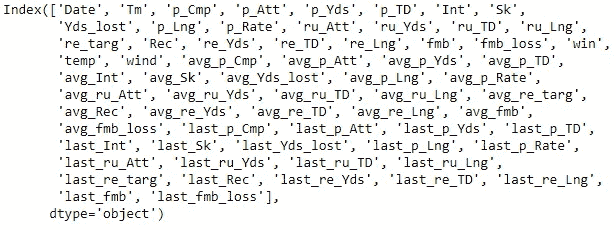
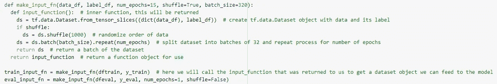
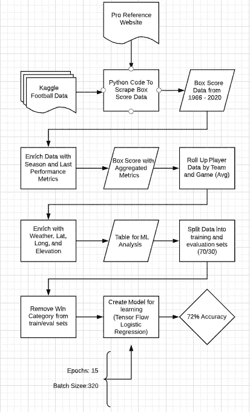

# 足球预测

> 原文：<https://medium.com/analytics-vidhya/football-prediction-e98e7dff122d?source=collection_archive---------18----------------------->

## 通过机器学习进行高级足球分析的内容和地点

[https://www . the ringer . com/NFL/2018/12/19/18148153/NFL-analytics-revolution](https://www.theringer.com/nfl/2018/12/19/18148153/nfl-analytics-revolution)

# 开始

今年七月，我发誓要赢得我的梦幻足球联赛。我想创建一个算法，让我了解每个球员每周的表现。过去，我曾被 ESPN 和雅虎的预测搞得焦头烂额，所以我开始创建自己的预测。第一步，我只是想创建一个算法，可以相当准确地预测哪支 NFL 球队会赢得那周的比赛。

# 数据

对于这个话题，我需要大量的数据。看了[一些](https://www.theringer.com/nfl/2018/12/19/18148153/nfl-analytics-revolution) [关于](https://www.advancedfootballanalytics.com/index.php/home/research/general/199-ranking-teams-with-optimization)预测足球分析的文章 [后发现有很多东西很容易得到:比赛比分，球员表现，比赛地点。然而，有很多很难找到好的历史数据的指标，例如:受伤史、完整的天气数据和比赛出勤率。因此，我需要研究哪些数据是免费的，可以在可接受的时间内收集到。](https://fivethirtyeight.com/methodology/how-our-nfl-predictions-work/)

在我寻找数据的旅途中，我首先去了 [Kaggle](https://www.kaggle.com/) 。Kaggle 在数据科学社区中被认为是数百到数千个主题的存储数据集的中心。幸运的是，我找到了一个[数据集](https://www.kaggle.com/tobycrabtree/nfl-scores-and-betting-data)，它包含了从 1966 年到本赛季初的每场 NFL 比赛的比分、地点和日期。

虽然分数很好，但我们需要更多的分数来创建一个好的预测模型。由于得分受到场上球员的影响，我想把这一点也纳入分析中。为了做到这一点，我不得不刮[职业足球参考](https://www.pro-football-reference.com/)来获得每一场比赛的[进攻框分数](https://github.com/dendi19/FootballAnalytics/blob/main/BoxScores.ipynb)。

# 衡量标准

现在我有了 1966 年以来每个进攻球员的得分数据，我需要创造一种方法让这些分析在预测表现时有用。为了做到这一点，[我让](https://github.com/dendi19/FootballAnalytics/blob/main/PerfEnrich.ipynb)将每个进攻指标汇总为一个赛季的平均水平以及上周的表现指标。

现在，我有 68 个指标要进行分析，但仍有一些关键因素需要包含在这些数据中。我需要天气数据，一支球队是赢是输，以及这支球队整体表现如何，而不仅仅是球员。为此，我汇总了所有这些绩效指标，并用这些团队和位置指标丰富了数据。

最后，我有了这些指标:

现在来分析和预测这个过程的实际症结。对于这项工作的分析，我想看看它在 ArcGIS Insights 中的样子。然而，查看 54 年来进攻球员的所有事件(234，720)和所有指标(68)，比在线或桌面上的见解可以有效处理的要多一点，机器学习过程要以我想要的规模运行需要更多的跑腿工作。

再一次，未来 ML 过程的目标是基于团队表现预测一个获胜者，所以我不需要所有球员的数据集。为了做到这一点，我运行了一个聚合，找到了每个球员的平均表现，并显示为团队的表现。因此，如果有三名跑卫，他们分别有 5 次、6 次和 12 次持球，球队在积分榜上的平均表现将是 7.6 次持球。

出于分析的目的，我将这个最终表格与团队绩效以及赢/输数据放在一个表格中。在第二个表中，我添加了纬度、经度、风、温度和海拔。我想看看地理信息系统如何参与学习这些团队的表现。

# 机器学习

出于我的目的，我必须权衡我将如何做我的分析:[回归](https://en.wikipedia.org/wiki/Logistic_regression#:~:text=Logistic%20regression%20is%20a%20statistical,a%20form%20of%20binary%20regression).)，[神经网络](https://en.wikipedia.org/wiki/Neural_network)，[K-最近的](https://en.wikipedia.org/wiki/K-nearest_neighbors_algorithm)？出于我的目的，由于时间和个人的数学限制，我选择了逻辑回归过程。这是为这个特定的目的而选择的，因为我预测的是赢/输或 1/0。在逻辑回归中，模型找出事件存在或不存在的可能性。在神经网络和 K-最近分析中，答案有更多的细微差别，它们需要像 [sigmoid 函数](https://en.wikipedia.org/wiki/Sigmoid_function)和重数学这样的东西，我没有时间或能力以一种“学术上适当的”方式定量给出。

当制作用于分析的表格时，我必须创建用于分析的培训和评估表格。在这个具体案例中，我选择将数据分为 70%的训练和 30%的评估。这意味着[张量流](https://www.infoworld.com/article/3278008/what-is-tensorflow-the-machine-learning-library-explained.html)中的逻辑回归函数将着眼于 70%,试图预测 30%中发生了什么。大多数情况下，10000 个预测事件中至少有 10000 个发生，但是为了演示起见，我决定进行 70/30 分割，以查看更多的一般数字，因为每年只有几个新记录。

一旦进行了这种分割，我就将团队名称的字符串值转换成数值，以便有效地进行分析。这是因为张量流中的[非 NLP](https://en.wikipedia.org/wiki/Natural_language_processing) 模块无法正确读取字符串值。

既然数据清理已经完成，我需要将训练和评估数据集转换成矩阵。由于大多数机器学习是高级统计和复杂计算的混合，数据不能是简单的表格形式。幸运的是，张量流有一些相当简单的函数可以将表格转换成矩阵。

完成后，我构建了实际的机器学习代码:

这看起来可能会令人困惑，但基本上这是在做我们之前做的所有数据工程工作，并迭代数据以找到趋势。这里有几个重要的部分展示了 num_epochs 和 batch_size 的功能。在这种情况下，时期指的是与训练数据相比，您查看评估数据的次数。因此，在这种情况下，它会查看评估数据 15 次，以确保我们已经查看了足够多的次数。批次大小指的是每次运行函数时分析中有多少项目。在本例中，一个批次包含 320 个要查看的事件。将批分成 320 批，每批查看 15 次。

# ML 输出

现在是你们期待已久的时刻了！当我们对非地理丰富的数据进行分析时，该模型的准确率为 64%。这意味着这个模型有 64%的时间可以预测足球队是否会赢得比赛。现在，对于这样一项复杂的有很多指标的运动来说，这是一件大事！然而，我们是一家地理信息系统公司，我们想知道在哪里的影响。现在，我运行了我在没有 GIS 数据的情况下使用的相同的 ML 模型，我得到了一个相当惊人的 72%的准确性输出！

因此，长话短说，即使是一个机器学习的非 GIS 思维模型也显示了预测体育结果(或任何真正的事情)时地点的重要性。

# 潜在未来分析

现在，知道了地理信息系统在这种类型的工作中的影响以及玩家的表现，有很多其他的方法来测试这个模型并使它更强大。

*   发现团队改变位置的影响
*   开发一个[蒙特卡洛模拟](https://en.wikipedia.org/wiki/Monte_Carlo_method)来更好地了解每个指标的重要性
*   每位球员的总体职业表现
*   玩家年龄数据
*   附加赛的加权成绩
*   超级杯赛中的加权成绩
*   伤害数据
*   防御数据
*   大学表演
*   还有更多…